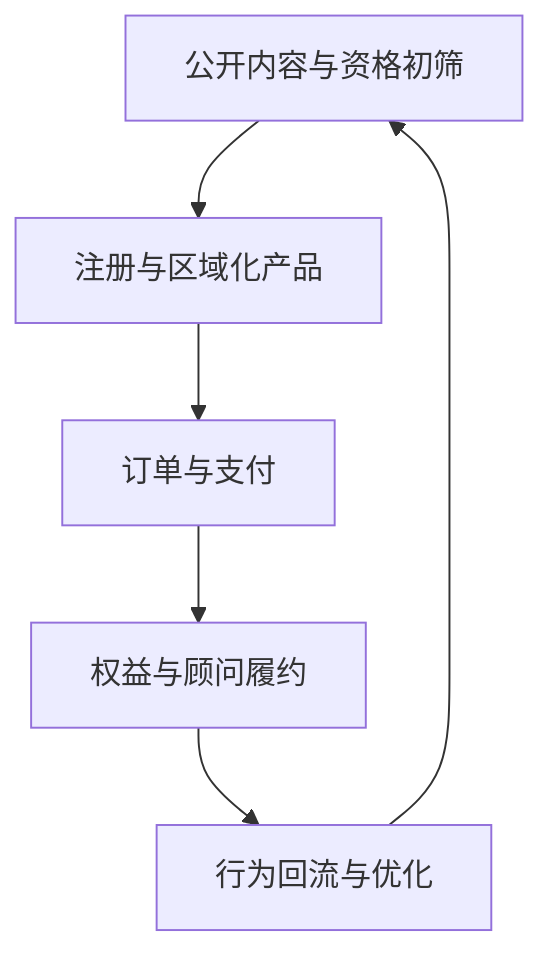
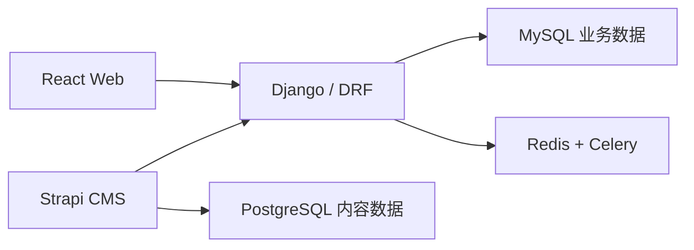
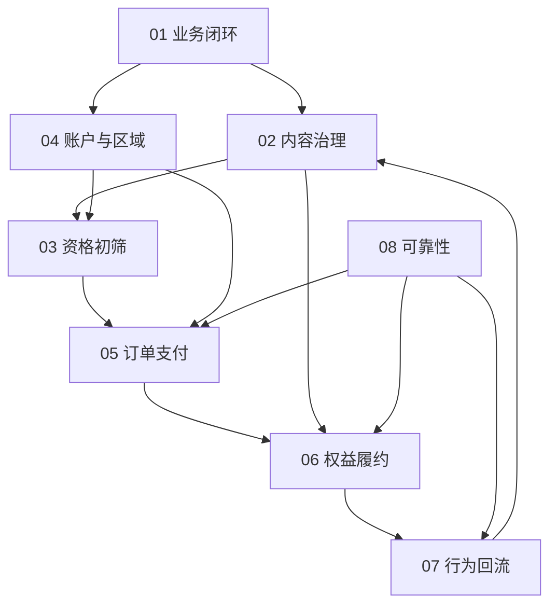

# Ovanta 项目学习与面试手册总索引

> 目标：先快速建立项目全貌和面试表达能力，再通过模拟面试暴露断点并定向复训。本文是地图，不替代各模块正文。

## 1. 项目一句话

Ovanta 是面向中国大陆及国际个人用户的跨区域签证与移民结构化自助申请平台，把分散、易变化的公开政策转化为可评估、可购买、可履约的指南、会员和顾问服务。

## 2. 核心业务主线

> 用户提出海外身份或银行开户需求 → 查看公开政策内容 → 完成资格初筛 → 获得结构化办理路径 → 注册并选择会员或顾问服务 → 创建订单并支付 → 系统根据可信支付状态发放内容、咨询或全流程服务权益 → 顾问完成咨询与履约 → 行为与业务数据异步回流，推动内容和产品优化。

## 3. 四个权威业务对象

| 对象 | 权威事实 | 不能被什么替代 |
|---|---|---|
| 内容 | 已审核、已发布且适用于当前区域和时间的内容版本 | AI 生成文本、前端缓存 |
| 用户 | 已验证的账户、登录绑定和区域上下文 | 单次请求参数 |
| 支付 | 本地订单状态与经过验签、校验的支付事件 | 前端“支付成功”页面 |
| 权益 | 独立的权益账和核销记录 | 订单备注、支付状态字段 |

行为事件是分析事实，不是交易权威状态。漏斗显示“已支付”不能替代订单表，埋点显示“已咨询”不能替代核销记录。

## 4. 技术全貌

当前技术口径：React、Django/DRF、MySQL、Strapi/PostgreSQL、Redis/Celery。不要把 Kafka、Outbox、微服务或多智能体说成现有实现。

## 5. 黄金业务案例

大陆用户 A 在 `ovanta.cn` 搜索香港永居信息，匿名查看公开内容并完成资格初筛；注册后购买“香港永居全解锁”会员。系统创建人民币订单，接收支付渠道回调，在验签、金额校验和条件状态更新后发放指南访问权与 3 次 1v1 咨询权益。用户查看结构化指南并预约咨询，系统原子核销 1 次额度。浏览、评估、支付和咨询事件异步进入运营漏斗。

全手册统一复用四个故障分支：

1. 支付渠道重复发送成功回调；
2. 用户并发发起两次咨询核销；
3. 香港政策更新，但旧指南仍处于已发布状态；
4. 海外用户错误进入国内区域，出现登录、币种或法律协议不匹配。

## 6. 模块地图与学习顺序

| 顺序 | 模块 | 通过标准 |
|---:|---|---|
| 1 | [业务定位与商业闭环](01-Ovanta-业务定位与商业闭环.md) | 能用 90 秒讲清用户、产品、商业闭环与系统边界 |
| 2 | [结构化内容与政策治理](02-Ovanta-结构化内容与政策治理.md) | 能解释为什么政策不能只是富文本文章 |
| 3 | [账户身份与多区域适配](04-Ovanta-账户身份与多区域适配.md) | 能解释统一模型与区域差异如何共存 |
| 4 | [套餐订单与支付状态机](05-Ovanta-套餐订单与支付状态机.md) | 能处理重复、乱序、超时和退款 |
| 5 | [权益发放咨询核销与履约](06-Ovanta-权益发放咨询核销与履约.md) | 能解释支付与权益为何必须分账 |
| 6 | [行为事件异步处理与运营回流](07-Ovanta-行为事件异步处理与运营回流.md) | 能解释同步边界、异步失败与数据回流 |
| 7 | [资格初筛与服务路径](03-Ovanta-资格初筛与服务路径.md) | 能守住“初筛不是法律结论”的边界 |
| 8 | [可靠性安全与可观测性](08-Ovanta-可靠性安全与可观测性.md) | 能按发现—止血—定位—修复—验证—预防回答事故题 |
| 9 | [项目证据量化口径与边界](09-Ovanta-项目证据量化口径与边界.md) | 每个数字都能解释证据、分母和适用范围 |
| 10 | [项目表达与专项模拟面试](10-Ovanta-项目表达与专项模拟面试.md) | 能完成 20 秒、90 秒、5 分钟表达及三层追问 |

## 7. 模块依赖

09 汇总所有模块的证据，10 调用全部模块完成面试表达。

## 8. 优先级

P0 是业务闭环、结构化内容、区域化、订单支付、权益核销、Redis/Celery 异步链路和数字证据。这些内容直接证明真实产品后端能力。

P1 是资格初筛、内容版本治理、退款补偿、权限审计和运营漏斗。需要讲清主线与关键边界，不必钻入全部实现细节。

P2 是 Kafka、Outbox、微服务、多活、多智能体、向量检索和自动政策决策。它们只作为规模扩大后的候选方案，不作为当前项目能力。

## 9. 证据分级

| 等级 | 含义 | 面试措辞 |
|---|---|---|
| E1 | 真实实现、联调、交付或业务事实 | “项目中实现/联调了……” |
| E2 | 固定回放、并发测试、离线评测或日志抽样 | “在回放/测试中验证了……” |
| E3 | 完整设计或下一步演进 | “如果规模继续增长，我会……” |
| 待验证 | 缺少可复现证据 | 不说具体收益数字 |

已知口径：2,000 次支付回调是回放证据，500 次并发核销是并发测试证据，均属于 E2，不等同于生产流量或线上用户量。

## 10. 快速学习方法

第一遍按顺序快速通读，只恢复主线和每个模块的一句话；第二遍闭卷讲 20 秒、90 秒和 5 分钟版本；随后直接使用第 10 模块模拟面试。每轮最多记录三个断点，回到对应模块专项补习，并在第 1、3、7 天复训。

模块达到以下状态才算 `integrated`：

- 闭卷说出 3～7 个关键词；
- 能按业务目标→流程→风险→机制→取舍→验证回答；
- 能承受至少两层追问；
- 能迁移到退款、重复回调或并发核销等陌生变体；
- 不把 E2/E3 说成线上 E1。

## 11. 外部案例的使用边界

GOV.UK 的用户任务和逐步导航、Strapi 的结构化内容模型与发布生命周期、Stripe 的 Webhook 重复投递与幂等建议只作为设计参照。外部产品的功能和数据不能说成 Ovanta 已实现或取得的结果。

