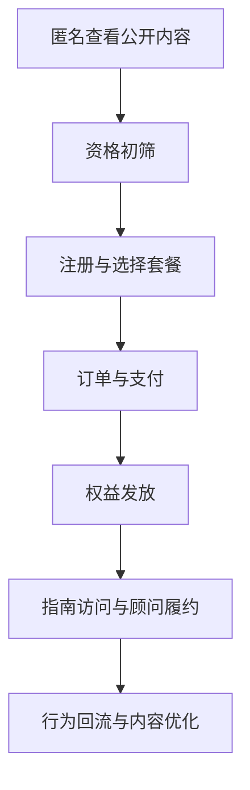

# 01｜Ovanta 业务定位与商业闭环

## 1. 模块定位

本模块是整个项目的入口。先说明用户为什么需要 Ovanta、平台交付什么结果、如何形成收入，再进入内容、支付和异步任务等技术细节。

黄金案例位置：用户 A 从香港永居需求出发，经历内容、评估、购买、权益和顾问履约的完整过程。

## 2. 一句话结论

Ovanta 把分散、易变化且依赖人工解释的海外身份政策，转化为结构化自助指南、会员权益和顾问服务，并通过订单、支付与权益系统完成可追踪的商业闭环。

关键词：**政策结构化、资格初筛、会员订阅、顾问履约、数据回流**。

## 3. 第一性原理

用户真正需要的不是“看过一篇政策文章”，而是知道自己是否可能符合条件、下一步做什么、需要准备什么，以及遇到复杂情况时谁能继续服务。

如果没有 AI，正确链路仍然必须成立：运营人员整理权威公开来源，编辑审核并发布指南；规则完成有限初筛；用户购买会员或顾问服务；支付系统确认结果；权益系统交付访问权与服务额度；顾问完成人工履约。AI 只能提高整理和运营效率，不能成为支付、权益或政策结论的权威事实。

## 4. 核心业务对象

| 对象 | 输入 | 输出 | 权威事实 |
|---|---|---|---|
| 内容产品 | 政策来源、编辑内容 | 指南、步骤、材料清单 | 已审核发布的内容版本 |
| 用户 | 登录凭证、区域、用户资料 | 账户与身份绑定 | 用户表和身份绑定记录 |
| 评估 | 问卷答案、政策版本 | 结果与服务路径 | 规则执行结果及版本 |
| 订单支付 | 套餐、金额、支付事件 | 已支付/退款等状态 | 本地状态机与验签事件 |
| 权益履约 | 支付结果、套餐规则 | 内容权、咨询次数、服务记录 | 权益账与核销记录 |

产品阶梯从公开内容开始，向会员解锁、包含 3 次 1v1 咨询的权益以及全流程顾问服务延伸。项目材料中的全流程顾问服务口径为 ¥6,000；若套餐后来调整，面试应以当时订单快照和最新简历口径为准。

## 5. 正常业务与技术流程

React 承担用户交互；Django/DRF 聚合账户、内容权限、订单、支付和权益；Strapi 管理结构化内容；MySQL 保存核心业务状态；Redis/Celery 处理非实时事件与聚合任务。

## 6. 关键问题和故障场景

业务最危险的错误不是页面打不开，而是用户在关键决策上得到错误结果：看到过期政策、付了钱没有权益、没有付钱却获得服务、咨询额度被多扣，或者海外用户进入错误区域。

此外，即使支付接口返回 200，也可能只是回调已接收，不代表金额正确、状态成功更新或权益已经发放；即使漏斗显示已购买，也不能证明订单权威状态为已支付。

## 7. 解决方案、优化与长期预防

首先将内容、支付、权益和行为分析拆成不同事实域。支付只确认交易，权益只记录可用服务，行为数据只支持分析。其次为关键对象建立状态、版本和审计记录，使政策更新、支付回调、人工补偿都有来源。最后用黄金链路回归正常路径，用故障分支验证重复、乱序、越权和恢复。

长期优化优先提高核心闭环质量：内容正确率、支付权益一致性、核销安全和可观测性，之后再增加更多国家、产品或 AI 功能。

## 8. 钢人比较

| 替代方案 | 最强优势 | 局限 | Ovanta 更合适的条件 |
|---|---|---|---|
| 政府官网/搜索 | 来源直接、成本低 | 信息分散，缺少个性化路径 | 用户需要跨来源整理和步骤化执行 |
| 纯人工顾问 | 判断灵活、信任感强 | 成本高、难规模化、重复解释多 | 高频问题可产品化，复杂问题再人工接管 |
| 普通内容网站 | 上线简单、获客快 | 内容与购买履约脱节 | 需要把内容、付费和服务连成闭环 |
| 现成 SaaS | 建设快、成熟稳定 | 区域、内容与权益模型可能不匹配 | 产品规则有明显定制需求且需要长期迭代 |

## 9. 逆向检查

最快让系统失败的方法是：不维护来源和版本、相信前端支付结果、直接用订单字段判断所有权益、把埋点当交易事实、让国内外差异散落在代码分支中。这些做法短期省事，长期会造成错误内容、错发权益、数据不可核对和区域配置失控。

## 10. 边际决策

最低可用版本是一个地区、一个明确场景、少量结构化指南、一套登录、一个支付渠道、清晰的订单状态和一种权益。内容、交易、权益正确后，再扩展地区、币种、顾问套餐和运营自动化。

当前不优先建设多智能体、复杂推荐、跨区域多活和完整微服务体系，因为它们对“用户付费后能否获得正确服务”的边际收益较低。

## 11. 面试标准回答

### 20 秒

Ovanta 是跨区域签证与移民结构化自助申请平台。它把公开政策整理成资格初筛和步骤化指南，再通过会员、1v1 咨询和全流程顾问服务完成商业闭环；后端重点保证内容版本、支付状态和权益履约一致。

### 60 秒

Ovanta 面向有香港身份、新加坡身份或海外银行开户等需求的个人用户。用户过去需要在多个官网和顾问之间反复确认信息，所以产品先把公开政策结构化为条件、步骤和材料清单，用户可以匿名浏览并完成初筛。需要深度内容或人工帮助时，用户注册、购买会员或顾问套餐，系统经过订单、支付回调和权益发放后开放指南或咨询额度，顾问再完成履约。技术上 React 负责前端，Django/DRF 聚合业务，Strapi 管理内容，MySQL 保存交易与权益，Redis/Celery 做异步事件。核心取舍是让内容、支付、权益各有权威状态，AI 和埋点都不能直接决定高风险结果。

### 深度版本骨架

按“用户痛点→内容产品化→资格初筛→账户区域→订单支付→权益履约→事件回流→可靠性与证据”展开，选择重复支付回调和并发咨询核销两个事故下钻。

## 12. 高频追问

**问：这不就是一个内容网站吗？** 不是。内容只是入口，核心差异是内容被建模为可审核、可版本化的服务资产，并与资格初筛、订单支付、权益和顾问履约连接。若只有文章发布，不需要订单状态机和权益账。

**追问：为什么不用纯人工顾问？** 人工在模糊判断和高信任服务上更强，但重复解释标准政策的边际成本高。Ovanta 把确定、重复的部分产品化，复杂、高风险部分保留人工接管。

**问：AI 在哪里？** AI 可以辅助内容整理、运营分析或客服，但当前项目的可信主线不依赖 AI。政策发布、支付确认和权益变更必须由确定性规则、审核和业务状态控制。

**问：你的项目价值怎么证明？** 先用 E1 的功能联调、真实产品服务和业务闭环证明可用，再用 E2 的支付回放与并发核销测试证明边界。具体转化率和性能收益没有可复现证据时标记待验证。

## 13. 最短恢复脚本

**人群 → 政策 → 初筛 → 购买 → 支付 → 权益 → 履约 → 回流**

## 14. 闭卷自测

1. 用户真正购买的结果是什么，而不是购买了哪个页面？
2. 为什么内容、支付、权益必须分别建模？
3. 如果没有 AI，完整业务如何正确运行？
4. 与政府官网、人工顾问和普通内容站相比，Ovanta 的适用条件是什么？
5. 前端显示支付成功后，为什么还不能发放权益？
6. 最低可用版本包含哪些能力？
7. 当前最不值得优先投入的复杂技术是什么？

## 15. 与其他模块的连接

本模块定义全局对象与边界。02 解释内容如何成为产品，03 解释初筛，04 解释用户和区域，05—06 完成收入与交付，07 构成反馈回路，08 保护整条链路，09—10 把事实转成可信面试表达。

通过标准：闭卷 90 秒讲清全链路，且回答中没有先堆 Strapi、Celery、Webhook 等技术名词。
