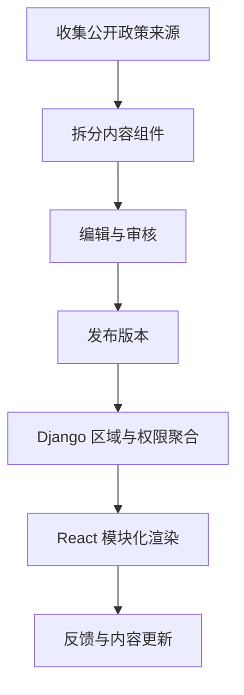

# 02｜Ovanta 结构化内容与政策治理

## 1. 模块定位

内容是 Ovanta 的供给底座。只有先把政策变成有来源、有结构、有版本的内容资产，资格初筛、会员解锁和顾问服务才有可信依据。

黄金案例位置：香港永居指南由公开来源整理为条件、步骤、材料、注意事项等模块，审核发布后供用户查看和购买。

## 2. 一句话结论

我们没有把政策当普通文章保存，而是用 Strapi 将其拆成可复用组件，经过草稿、审核、发布、版本和来源治理，再由 Django 按区域与权益聚合给 React。

关键词：**来源、结构、版本、审核、发布、权限**。

## 3. 第一性原理

用户需要的是完成任务，而不是阅读长文。政策内容会变化、不同地区适用范围不同、同一材料可能被多个指南复用。如果只保存富文本，系统难以判断哪一段过期、哪个步骤需要会员权限、某次评估依据哪个版本，也难以稳定复用到 Web、顾问后台和运营工具。

因此内容模型必须回答：内容来自哪里、适用于谁、何时生效、当前处于什么状态、由谁审核、哪些部分可以公开、哪些权益才能访问。

## 4. 核心业务对象

| 对象 | 关键字段 | 状态 | 权威事实 |
|---|---|---|---|
| Guide | 场景、区域、标题、摘要 | draft/review/published/archived | 当前已发布版本 |
| Section/Step | 类型、顺序、正文、条件 | 启用/停用 | 指南版本中的组件快照 |
| Source | 来源 URL、机构、抓取/确认时间 | valid/stale | 经编辑确认的来源记录 |
| Version | 版本号、生效时间、变更说明 | current/superseded | 发布记录与版本关联 |
| Access Policy | public/member/service | active/inactive | Django 权限判断结果 |

具体数据库枚举需要与代码核对；上表是业务概念，不应冒充精确表结构。

## 5. 正常业务与技术流程

Strapi 负责内容模型和编辑生命周期，PostgreSQL 保存 CMS 数据。Django 不只是透传：它结合用户区域、权益和业务状态决定可返回的内容，并将 CMS 模型转换为前端稳定接口。React 根据组件类型渲染步骤、条件、材料清单和提示。

## 6. 关键问题和故障场景

核心故障包括来源失效、政策已经变化但旧版本仍发布、编辑误覆盖线上内容、同一组件更新影响多个指南、未购买用户拿到会员正文、国内版本错误展示给海外用户，以及缓存继续返回旧内容。

即使 CMS 查询成功，也可能返回错误区域、错误版本或无权内容；“接口 200”不是内容正确性的证明。

## 7. 解决方案、优化与长期预防

内容层通过结构化组件降低重复编辑，通过草稿—审核—发布隔离未确认内容，通过版本与来源记录回答“当时依据什么”。Django 在服务端完成区域和权限裁剪，避免只靠前端隐藏。政策更新采用新版本发布，不直接无痕覆盖；高影响内容应有变更说明、回归检查和缓存失效。

长期可建立来源到指南的反向依赖：某个来源变更或失效时，能找出受影响的指南和评估规则。AI 可以生成候选摘要或差异，但只能进入草稿，不能绕过人工审核发布。

## 8. 钢人比较

| 方案 | 最强优势 | 代价/边界 |
|---|---|---|
| Markdown/富文本 | 简单、编辑快、上线成本低 | 难做字段级复用、权限和影响分析 |
| 自研 CMS | 完全贴合业务 | 编辑器、版本、权限等基础能力成本高 |
| Strapi Headless CMS | 内容模型和管理界面成熟，前后端解耦 | 引入第二套数据存储与同步边界 |
| 直接在 Django 建内容表 | 业务一致性强、部署简单 | 非技术编辑体验和组件能力需要自建 |

当前方案适合内容类型多、需要运营编辑、前端多形态渲染的阶段。如果内容极少且长期稳定，富文本或 Django 表更简单。

### 外部设计参照

GOV.UK 将内容从“写文章”转向“帮助用户完成任务”，并使用 step-by-step 组织复杂流程；Strapi 官方模型支持内容类型、可复用组件、草稿发布和国际化。这些原则用于优化 Ovanta 的内容设计，不代表已采用全部功能。

- https://www.gov.uk/guidance/content-design/what-is-content-design
- https://www.gov.uk/guidance/content-design/organising-and-grouping-content-on-gov-uk
- https://docs.strapi.io/cms/features/content-type-builder
- https://docs.strapi.io/cms/features/draft-and-publish

## 9. 逆向检查

最危险的成功是假内容正确：查询到了内容，但来源过期；权限判断通过，但读取的是旧权益缓存；新版已发布，但资格规则仍绑定旧政策；页面只隐藏会员正文，接口仍完整返回。逆向检查必须从用户最终看到的版本、来源、区域和权限回溯。

## 10. 边际决策

先做高频场景的核心字段、来源、版本、审核和权限，不为所有政策设计万能 DSL。先保证香港永居等黄金指南能稳定发布、更新和授权，再扩充国家与内容类型。

自动抓取、知识图谱和 AI 自动发布应暂缓。它们只有在内容规模大到人工发现变更成为瓶颈时才具有更高边际收益。

## 11. 面试标准回答

### 20 秒

政策内容容易变化，也需要按步骤、材料、地区和权益复用，所以 Ovanta 用 Strapi 做结构化内容、草稿审核和版本来源治理；Django 再结合用户区域和权益聚合，避免前端直接读取 CMS 导致越权或口径失控。

### 60 秒

如果把香港永居政策存成一篇富文本，后续很难知道哪项材料过期、评估依据哪个版本，也无法稳定控制会员章节。因此我们用 Strapi 把指南拆成条件、步骤、材料、注意事项等组件，记录来源、区域、版本和发布状态，编辑完成后经过审核发布。Django 位于 CMS 和 React 之间，根据当前站点、用户权益和内容版本返回稳定接口，React 只负责模块化渲染。政策变化时创建新版本并保留变更依据，同时失效缓存。代价是 Strapi/PostgreSQL 与 Django/MySQL 形成跨系统边界，但换来了编辑效率和内容复用。

### 深度版本骨架

从“富文本为什么不够”切入，依次讲内容模型、生命周期、Django 聚合、服务端鉴权、版本来源、缓存失效和跨系统取舍。

## 12. 高频追问

**问：为什么 React 不直接调用 Strapi？** 因为内容访问不仅取决于 CMS 状态，还取决于用户区域、会员和服务权益。若前端直连，业务权限分散且容易暴露未授权字段。Django 统一聚合和裁剪，代价是增加一层接口与故障点。

**问：Strapi 和 MySQL 数据怎么保持一致？** 不把两边设计成同一事务。内容发布与交易权益分别有独立权威状态，Django 查询时组合；对关键内容可使用版本 ID、发布事件或定期校验减少失配。若项目中没有实现 Outbox，就不能说已经用它解决。

**问：政策更新怎么办？** 先识别受影响来源、指南和规则，发布新版本而非直接覆盖；必要时暂停高风险入口，更新缓存，再用黄金用户路径回归。历史评估保留原版本引用。

**追问：AI 能自动更新吗？** 可以发现差异并生成候选草稿，但政策解释存在责任风险，必须由编辑或顾问审核后发布。

## 13. 最短恢复脚本

**来源 → 组件 → 草稿 → 审核 → 发布 → 聚合 → 权限 → 更新**

## 14. 闭卷自测

1. 为什么普通富文本不足以支撑 Ovanta？
2. Strapi、Django、React 各自负责什么？
3. 哪个版本是用户当前应该看到的权威内容？
4. 为什么权限必须在服务端判断？
5. 政策更新如何避免破坏历史评估？
6. Strapi 与 MySQL 为什么不追求分布式强事务？
7. AI 在内容治理中的安全边界是什么？

## 15. 与其他模块的连接

本模块为 03 提供规则和解释来源，为 06 提供被权益保护的内容资产，为 07 提供运营优化对象。04 决定区域版本，08 负责越权、缓存与发布事故，09 记录内容复用和质量治理证据。

通过标准：闭卷回答“为什么不用一张 article 表”，并能继续解释版本、权限和跨系统一致性。
