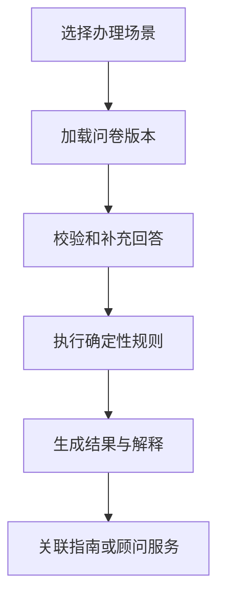

# 03｜Ovanta 资格初筛与服务路径

## 1. 模块定位

资格初筛连接公开内容和付费服务。它帮助用户降低信息检索成本，但不能越界成为签证审批预测或法律结论。

黄金案例位置：用户 A 输入与香港永居相关的基本条件，系统返回“可能适用的路径、缺失材料和下一步”，并引导到对应指南或顾问服务。

## 2. 一句话结论

资格初筛是基于明确政策版本和确定性规则的路径筛选器：它输出可解释的候选路径与缺失信息，不替用户或审批机构做最终决定。

关键词：**问卷、规则、版本、解释、澄清、人工接管**。

## 3. 第一性原理

用户的真实目标是判断“我下一步该做什么”，而不是得到一个看似精确但无法负责的成功率。政策中有明确条件，也有需要人工判断的材料质量、例外和时效。

因此必须把确定部分交给规则，把信息不足变成澄清，把模糊或高风险部分交给顾问。即使完全不使用模型，这条链路也应能正确运行。

## 4. 核心业务对象

| 对象 | 输入 | 输出/状态 | 权威事实 |
|---|---|---|---|
| Questionnaire | 场景和问题版本 | active/retired | 已发布问卷版本 |
| Answer Set | 用户回答、时间、区域 | incomplete/complete | 用户提交快照 |
| Rule Set | 条件、优先级、政策版本 | draft/published | 已审核规则版本 |
| Assessment | 答案、规则执行结果 | eligible/possible/not_matched/needs_review | 可重放的结果记录 |
| Recommendation | 指南、会员或顾问路径 | shown/accepted | 当时推荐及依据 |

上述状态是业务概念；实际项目枚举如无代码证据需标记待核对。

## 5. 正常业务与技术流程

每次评估保存问卷、答案和规则版本。结果页面不仅显示结论，还应列出命中条件、缺失信息、风险提示和下一步。需要人工判断时输出 `needs_review`，而不是用默认值强行通过。

## 6. 关键问题和故障场景

常见失败包括问题表述让用户误解、答案缺失却被当成否、政策更新但规则未更新、用户修改资料后旧结果仍有效、区域错配，以及将“可能符合”展示成“保证通过”。

即使规则成功执行也可能错：规则本身基于旧政策，字段映射错误，或者输出解释与实际命中条件不一致。

## 7. 解决方案、优化与长期预防

规则与政策版本绑定，评估保存输入快照和执行版本，以便重放与审计。输入先做类型、范围和必填校验；信息不足进入澄清，不使用危险默认值。结果采用分级表达并明确非法律结论。政策变更时标记受影响规则，更新后用黄金案例和边界案例回归。

长期可建立规则测试集：典型通过、明显不符合、缺失信息、临界日期和冲突答案。AI 可以帮助生成说明或发现问题，但最终结论由已发布规则和人工审核控制。

## 8. 钢人比较

| 方案 | 最强优势 | 局限 | 适用判断 |
|---|---|---|---|
| 完全人工咨询 | 能处理例外与模糊材料 | 成本高、响应慢、重复问题多 | 高价值或高风险用户 |
| 固定规则 | 可解释、稳定、易回归 | 维护成本随政策增加 | 明确条件的首轮筛选 |
| LLM 直接判断 | 交互自然、覆盖开放问题 | 版本、幻觉与责任风险 | 只适合辅助说明和澄清 |
| 不做初筛直接卖服务 | 链路最短 | 用户决策成本高，服务匹配差 | 产品早期验证或服务极少时 |

## 9. 逆向检查

最快让初筛失去可信度的方法是：缺失值默认填否、规则无版本、用模型常识补政策、结果只给结论不给依据、政策更新后不回放历史案例。逆向验收必须检查“输入正确、规则正确、版本正确、解释一致、边界明确”。

## 10. 边际决策

最低可用版本只覆盖少量高频、条件明确的场景，并提供人工升级入口。不要一开始追求覆盖所有国家、所有例外或预测成功率。

新增一个评估场景前，先确认它能显著降低用户理解成本，并且规则可以被稳定表达和验证；否则直接提供结构化指南或人工咨询更合理。

## 11. 面试标准回答

### 20 秒

资格初筛不是审批预测，而是基于已发布政策规则，将用户条件映射为候选路径、缺失信息和下一步。规则与政策版本绑定，信息不足就澄清，高风险情况转人工。

### 60 秒

用户面对政策时最难的是判断哪些条件与自己有关，所以 Ovanta 先加载对应场景的问卷，校验用户答案，再用确定性规则执行初筛。每次评估保存答案快照、问卷版本和政策规则版本，输出不仅有候选结论，还有命中条件、缺失信息和对应指南。对材料质量、例外条款等无法稳定规则化的情况，结果进入人工复核，而不是让模型直接下结论。这样可解释、可回放，代价是规则需要随着政策持续维护。

### 深度版本骨架

从用户任务切入，讲问卷版本、输入校验、规则执行、解释生成、人工接管、政策变更回归和 AI 边界。

## 12. 高频追问

**问：为什么不用 LLM 直接判断？** LLM 适合自然语言交互和解释，但政策版本、确定性和责任要求更高。直接判断可能引用旧知识或补全不存在的条件，所以核心结论由版本化规则产生，模型最多辅助澄清和表达。

**问：政策变了怎么办？** 先定位关联来源、规则和指南，必要时暂停对应评估；发布新规则版本并跑黄金与边界用例。历史评估保留旧版本，不无痕改写。

**问：规则越来越多会不会很难维护？** 会，因此只规则化高频、明确条件；复杂例外转人工。规模扩大后可以引入规则配置和影响分析，但不应为了统一而构建过度复杂 DSL。

**追问：怎样证明结果正确？** 用经业务确认的黄金用户、临界日期、缺失信息和冲突答案回放；同时检查结论、解释和推荐路径。没有真实准确率统计时不报数字。

## 13. 最短恢复脚本

**场景 → 问卷 → 校验 → 规则 → 版本 → 解释 → 人工**

## 14. 闭卷自测

1. 用户真正需要的为什么不是“成功率”？
2. 评估需要保存哪些版本和输入快照？
3. 缺失信息为什么不能默认补齐？
4. 哪些情况必须进入人工复核？
5. LLM 在本模块最合适和最危险的用法分别是什么？
6. 政策更新如何回归验证？
7. 固定规则相对人工顾问的真实代价是什么？

## 15. 与其他模块的连接

02 提供政策和指南版本，04 提供用户区域与身份，初筛结果将用户引向 05 的套餐订单或 06 的顾问服务。07 记录评估漏斗，08 负责版本错误和滥用防护，09 记录规则回放证据。

通过标准：能明确说出“初筛不是审批结论”，并在追问下解释版本、澄清、人工接管和回归验证。

