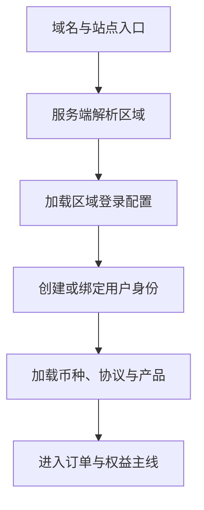

# 04｜Ovanta 账户身份与多区域适配

## 1. 模块定位

本模块回答同一产品如何服务国内与国际用户。区域不仅改变页面语言，还决定登录渠道、币种、支付方式、法律文本、产品入口和内容范围。

黄金案例位置：用户 A 从 `ovanta.cn` 进入，使用微信或邮箱注册，以国内区域配置查看香港永居套餐并使用人民币支付；国际用户则从 `ovanta.net` 使用 Google 或邮箱及对应配置。

## 2. 一句话结论

Ovanta 复用统一的用户、订单和权益模型，把登录、币种、支付、协议和产品入口收敛为受控区域配置，并在服务端校验区域上下文，避免差异散落成不可维护的条件分支。

关键词：**统一模型、区域上下文、身份绑定、配置化、服务端校验**。

## 3. 第一性原理

国内外用户购买的本质仍是内容或顾问权益，因此不应复制两套完全独立的业务系统。但不同区域的第三方登录、支付渠道、币种和法律要求无法被简单统一。

正确问题不是“要不要一套代码”，而是：哪些业务不变量应复用，哪些差异必须配置，哪些数据必须隔离。如果没有 AI，账户识别、区域判断和权限校验同样必须确定运行。

## 4. 核心业务对象

| 对象 | 关键输入 | 输出/状态 | 权威事实 |
|---|---|---|---|
| User | 邮箱、资料 | active/disabled | 用户主记录 |
| Identity Binding | provider、provider_user_id | bound/revoked | 第三方身份绑定记录 |
| Region Context | host、站点、用户选择 | CN/INTL 等 | 服务端解析后的区域 |
| Region Config | 登录、币种、支付、协议、产品 | active/versioned | 已发布配置版本 |
| Agreement Acceptance | 协议版本、时间、用户 | accepted | 接受记录而非当前协议文本 |

国内外使用同一核心业务库和模型时，所有受区域影响的查询都必须显式携带并校验区域，不能只依赖前端域名。

## 5. 正常业务与技术流程

国内可使用微信/邮箱，国际可使用 Google/邮箱。第三方回调先验证 `state`、授权码和回调地址，再以 `provider + provider_user_id` 定位身份绑定，最终关联统一用户。区域配置由服务端决定可用登录、币种、支付和产品，不让客户端任意指定。

## 6. 关键问题和故障场景

常见故障包括：同一邮箱经不同渠道创建重复用户；第三方身份误绑定；OAuth `state` 未校验导致登录劫持；海外用户看到人民币套餐；订单币种与支付渠道不匹配；用户接受的是旧协议但系统只保存布尔值；区域过滤遗漏导致内容或产品串区。

接口成功也可能越权：用户拥有合法 Token，但请求中的 `region=CN` 是伪造的；或者查询漏了区域条件，返回了不适用的产品。

## 7. 解决方案、优化与长期预防

统一用户主表与身份绑定表分离，一个用户可以绑定多个 provider。绑定操作需要登录态、一次性凭证和冲突检测，不能只凭相同邮箱自动合并。区域从可信域名、应用配置和服务端规则解析；客户端参数只能作为候选信息。

价格与币种在下单时保存快照，后续配置变化不改写历史订单。协议接受记录保存具体版本。区域差异集中在配置或策略层，并用国内、国际两套黄金路径回归，避免每个业务函数出现散落的 `if region`。

## 8. 钢人比较

| 方案 | 最强优势 | 代价 | 适用条件 |
|---|---|---|---|
| 国内外完全独立部署和数据库 | 隔离强、合规边界清晰 | 重复开发、数据与运营割裂 | 法规或数据驻留要求高 |
| 同库同模型 + 区域字段 | 复用高、迭代快 | 任一过滤遗漏都可能串区 | 早期规模和合规允许 |
| 所有差异写代码分支 | 直接、短期快 | 分支扩散、测试组合爆炸 | 差异极少且稳定 |
| 配置化 + 策略适配 | 可审计、易扩展 | 配置版本和校验成本 | 区域持续增加 |

当前项目适合统一核心模型和配置化差异；若未来出现强数据驻留要求，再评估独立存储或部署，而不是提前构建复杂多活。

## 9. 逆向检查

最快造成区域事故的方法是信任前端 `region`、按邮箱自动合并账户、只存“已同意协议”、订单只引用当前价格、区域条件靠开发者记忆。逆向测试应主动伪造域名与参数、重复绑定身份、切换区域访问订单，并检查历史快照。

## 10. 边际决策

最低可用设计是统一用户模型、明确身份绑定、两个站点配置、服务端区域判断、订单价格快照和协议版本记录。先覆盖实际存在的国内与国际差异，不设计万能多租户平台。

只有当新区域不断增加且策略组合明显重复时，才抽象插件式登录/支付适配；只有合规要求出现时，才投入跨区域数据隔离。

## 11. 面试标准回答

### 20 秒

Ovanta 国内外复用用户、订单和权益核心模型，但把登录、币种、支付、协议和产品入口做成区域配置。区域由服务端从可信入口解析，第三方身份单独绑定，避免前端伪造区域或不同登录方式创建重复账户。

### 60 秒

国内和国际用户购买的本质都是内容与顾问权益，所以我们没有复制两套业务模型，而是统一用户、订单和权益，在区域层适配差异。国内支持微信和邮箱，国际支持 Google 和邮箱；域名进入后由服务端确定区域，再加载对应币种、支付渠道、协议版本和可售产品。用户主记录与第三方身份绑定分开，不能只按邮箱自动合并。下单时保存价格、币种和区域快照，历史订单不随配置变化。这个方案复用高，但同库模式最大的风险是查询漏掉区域条件，因此要做服务端约束和双区域回归。

### 深度版本骨架

从统一业务不变量讲到身份绑定、可信区域、配置版本、订单快照、同库串区风险和未来隔离演进。

## 12. 高频追问

**问：为什么不直接按邮箱识别同一个人？** 第三方平台可能不返回邮箱、邮箱可能未验证或发生变更，自动合并会造成账户接管。应以 provider 的稳定用户 ID 建绑定，跨渠道合并需要用户验证和冲突处理。

**问：国内外同库怎么保证不串数据？** 区域进入服务端上下文，仓储查询和业务权限显式校验，关键表保存区域或所有权；再用跨区域越权测试验证。若项目没有数据库行级安全，不应说已经使用。

**追问：为什么不是微服务？** 当前规模下模块化单体更易保持交易一致性和迭代速度。登录/支付适配可以通过接口隔离，只有团队、负载或合规边界明确后才拆服务。

**问：价格改了，旧订单怎么办？** 订单保存下单时的产品、金额、币种和区域快照；产品配置只影响新订单。

## 13. 最短恢复脚本

**入口 → 区域 → 登录 → 绑定 → 配置 → 快照 → 校验**

## 14. 闭卷自测

1. 哪些业务对象国内外应该统一？
2. 为什么区域不能只相信客户端参数？
3. 用户主表和身份绑定表为什么分开？
4. 同库模式最危险的失败是什么？
5. 订单为什么保存价格与币种快照？
6. 协议为什么不能只存一个布尔值？
7. 什么条件下才值得拆分区域数据库？

## 15. 与其他模块的连接

02 根据区域返回内容，03 加载对应政策规则，05 使用区域币种和支付渠道，06 校验用户与权益所有权，07 按区域分析漏斗，08 重点验证身份安全与串区风险。

通过标准：能解释“统一什么、配置什么、隔离什么”，并处理同邮箱、多登录、伪造区域和历史订单四类追问。

