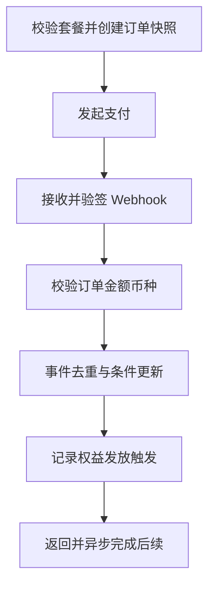

# 05｜Ovanta 套餐、订单与支付状态机

## 1. 模块定位

支付把内容流量变成收入，也是整个系统风险最高的确定性链路。它的输出不是“页面显示成功”，而是一个可验证、可审计、可恢复的本地支付状态，供权益模块消费。

黄金案例位置：用户 A 购买“香港永居全解锁”，创建人民币订单；支付渠道可能重复或乱序回调，但本地订单只能从合法状态迁移一次，并最终触发一次权益发放。

## 2. 一句话结论

支付链路通过订单快照、回调验签、金额校验、事件幂等和条件状态迁移，把不可靠的外部通知收敛为可信本地状态，再由权益系统按业务唯一键发放服务。

关键词：**快照、验签、幂等、状态机、条件更新、对账**。

## 3. 第一性原理

用户需要的是“钱付对、服务拿到、失败可追踪”。网络会超时，支付渠道会重试，回调可能重复或乱序，前端可以被伪造。因此系统不能把一次 HTTP 请求成功等同于业务成功。

外部支付渠道拥有扣款事实，本地系统拥有订单和权益事实。Webhook 是事实同步入口，不是无条件执行命令。即使没有 Celery 或 AI，验签、校验、幂等、状态迁移和人工补偿也必须成立。

## 4. 核心业务对象

| 对象 | 关键字段 | 概念状态 | 权威事实 |
|---|---|---|---|
| Product Snapshot | product、region、amount、currency、benefit_spec | immutable | 下单时套餐快照 |
| Order | order_no、user、snapshot | pending/paid/closed/refunded | 本地订单状态机 |
| Payment Attempt | channel、channel_trade_no、amount | initiated/succeeded/failed/unknown | 某次支付尝试 |
| Webhook Event | event_id、type、payload_hash | received/processed/rejected | 去重与审计记录 |
| Fulfillment Trigger | order_id、version | pending/done/failed | 支付到权益的衔接事实 |

状态名是面试用业务模型，具体代码枚举需以项目实现为准。

## 5. 正常业务与技术流程

创建订单时使用业务幂等键防止用户重复点击产生多个有效订单。回调先保存原始事件和验签结果，再核对订单、用户、金额、币种与支付对象；使用渠道事件 ID 或稳定业务键去重，并通过条件更新限制合法迁移。支付成功后记录待履约事实，权益模块据此幂等发放。

## 6. 关键问题和故障场景

重点故障：重复回调造成重复权益；回调乱序使退款后又变成已支付；前端成功页伪造；金额或币种被篡改；网络超时导致用户重复下单；数据库已更新但 Celery 任务未投递；权益已发放但回调响应超时，渠道再次重试。

即使 Webhook 返回 200，仍可能发生验签错误被忽略、订单更新失败、任务未创建或权益发放失败。系统必须区分“已接收”“已处理”“业务完成”。

## 7. 解决方案、优化与长期预防

入口层校验签名、时间窗和原始请求体；业务层校验订单、金额、币种和事件类型；持久层使用唯一约束和条件更新。重复事件返回已处理结果，不再次产生副作用。非法状态迁移拒绝并告警，不用“最后一次回调覆盖一切”。

支付状态更新与履约触发记录尽量在同一本地事务中提交，之后由 Celery 消费或扫描待处理记录。若当前项目没有完整 Outbox，只能描述为本地任务记录、补偿扫描或下一步方案，不能声称已实现事务消息。长期通过渠道账单或主动查询对账，修复“外部成功、本地未知”。

## 8. 钢人比较

| 方案 | 最强优势 | 风险/代价 |
|---|---|---|
| 只以前端跳转为准 | 实现最快 | 可伪造，网络中断丢状态 |
| Webhook 到达就直接发权益 | 链路短 | 重复、乱序和部分失败危险 |
| 同步回调内完成全部履约 | 一次调用看似完整 | 超时放大、渠道重试、副作用难恢复 |
| 状态落库 + 幂等异步履约 | 可恢复、边界清晰 | 引入最终一致性和任务监控 |

对于真实收费和可重复回调场景，状态落库与幂等履约更合适；如果只是无资金风险的内部演示，简单同步流程成本更低。

### 外部设计参照

Stripe 官方明确说明 Webhook 可能重复投递，并建议使用事件标识去重；创建或更新支付对象时使用幂等键避免重试产生重复副作用。该原则用于设计对比，不代表 Ovanta 使用 Stripe 或完全复现其机制。

- https://docs.stripe.com/webhooks
- https://docs.stripe.com/api/idempotent_requests

## 9. 逆向检查

主动用以下方式攻击链路：同一事件发送两次；两个不同事件表达同一支付对象；先退款后补发旧成功回调；回调在数据库提交前断开；提交后响应前断开；金额少一分；订单属于另一用户。只有最终状态和副作用都正确，才算通过。

## 10. 边际决策

P0 是验签、金额币种校验、事件唯一约束、合法状态迁移、权益幂等和失败可查。P1 是主动对账、自动补偿和更完整的指标。P2 才是 Kafka、分布式事务或复杂支付编排。

当前应提高黄金链路和故障回放质量，而不是先增加支付渠道数量。

## 11. 面试标准回答

### 20 秒

支付不能相信前端成功页，也不能把 Webhook 当一次性调用。我们先验签并校验订单、金额和币种，再用事件唯一键和条件状态更新处理重复、乱序，最后以订单为来源幂等发放权益。

### 60 秒

用户下单时系统保存产品、金额、币种和区域快照，并使用业务幂等键避免重复创建。支付渠道回调后，Django 验证签名和时间窗，核对渠道交易、订单和金额，再以事件 ID 保存回调并通过条件更新推动订单状态机。重复回调只返回已处理，不重复发权益；非法乱序迁移会被拒绝和记录。支付成功与权益发放分离，先落可信订单与履约触发，再由权益模块幂等处理。代价是最终一致性，因此需要待处理任务、补偿和对账。项目中的 2,000 次回调属于 E2 回放，不是线上流量。

### 深度版本骨架

按创建订单、发起支付、验签、校验、幂等、状态迁移、履约触发、对账补偿展开，再推演“数据库提交后响应前断线”。

## 12. 高频追问

**问：幂等键和 Webhook event ID 有什么区别？** 创建订单的幂等键表示“同一个业务意图”；event ID 表示“一次渠道事件”。有时不同 event 可能指向同一支付对象，所以还要结合渠道交易号、事件类型和状态机判断。

**问：为什么有唯一约束还需要状态机？** 唯一约束只能阻止相同键重复写，不能阻止退款后被旧成功事件覆盖。状态机负责限制业务允许的方向。

**问：更新订单成功，但任务没投递怎么办？** 支付成功不能依赖瞬时投递。应在本地事务记录待履约事实，由扫描或 Celery 重试处理；规模更大时可引入 Outbox。未实现 Outbox 时要如实说明。

**问：接口超时，用户又点了一次怎么办？** 使用同一业务意图幂等键查询原订单；状态未知时主动查渠道权威状态，而不是直接创建新订单。

**问：2,000 次回放证明了什么？** 证明固定重复、乱序和边界事件在测试环境中的处理行为；它不证明线上吞吐、真实并发用户量或长期稳定性。

## 13. 最短恢复脚本

**快照 → 验签 → 校验 → 去重 → 状态机 → 履约 → 对账**

## 14. 闭卷自测

1. 为什么前端成功页不是支付事实？
2. 回调需要校验哪些业务字段？
3. 事件 ID、业务幂等键和渠道交易号分别解决什么问题？
4. 唯一约束为什么不能替代状态机？
5. 数据库提交后响应前断线会怎样？
6. 支付成功但权益失败如何恢复？
7. 2,000 次回放的证据边界是什么？

## 15. 与其他模块的连接

04 提供区域币种和登录身份，06 消费可信支付结果并维护权益，07 记录分析事件但不改变订单，08 统一监控与恢复，09 管理回放证据和数字口径。

通过标准：能连续回答重复、乱序、超时、部分失败和退款五类问题，并始终指出权威状态和验证方法。
