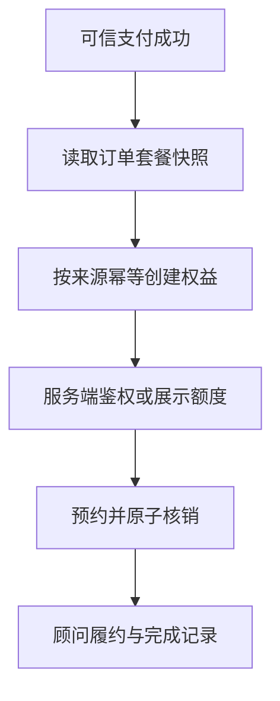

# 06｜Ovanta 权益发放、咨询核销与履约

## 1. 模块定位

支付回答“钱是否付了”，权益回答“用户现在能获得什么”，履约回答“服务是否实际完成”。三者分开，系统才能处理重试、退款、过期和人工补偿。

黄金案例位置：用户 A 支付后获得香港永居指南访问权和 3 次 1v1 咨询；每次预约只核销一次，剩余次数不能在并发请求下变成负数。

## 2. 一句话结论

Ovanta 用独立权益账把套餐规则实例化为内容、咨询和全流程服务权益，发放按订单来源幂等，核销通过数据库条件更新保证并发安全，退款和补偿保留审计记录。

关键词：**独立权益、来源唯一、原子核销、履约状态、补偿审计**。

## 3. 第一性原理

用户购买的不是 `order=paid`，而是内容访问、咨询次数或顾问服务。一个订单可能包含多种权益，同一种权益也可能来自活动、人工补偿或不同订单；退款后还要判断已使用与未使用部分。因此不能在订单表加几个布尔字段完成所有交付。

权威事实应是权益账和核销记录。订单是来源，支付是触发条件，前端展示与埋点都不是额度事实。

## 4. 核心业务对象

| 对象 | 关键字段 | 概念状态 | 权威事实 |
|---|---|---|---|
| Benefit Grant | user、type、source_order、quantity、validity | active/suspended/revoked/expired | 一次权益授予 |
| Content Access | guide/product scope | active/expired | 服务端授权记录 |
| Consultation Quota | total、used/remaining | active/exhausted | 额度行与核销流水 |
| Redemption | benefit_id、request_key、appointment | pending/confirmed/cancelled | 一次核销事实 |
| Service Case | consultant、milestones、notes | created/in_progress/completed/closed | 顾问履约记录 |

## 5. 正常业务与技术流程

权益发放以 `订单 + 权益类型 + 套餐版本` 等稳定来源建立唯一性，重复任务只返回既有结果。访问内容时 Django 查询当前有效权益。咨询预约使用业务请求键去重，并在数据库中通过条件更新扣减额度，例如只在剩余额度大于零时更新；更新行数为零则重新判断“已处理还是额度不足”。

## 6. 关键问题和故障场景

重点故障是重复支付回调导致多发、Celery 重试重复发放、两个并发请求都读到剩余 1 次、预约创建成功但额度未扣、额度已扣但预约失败、退款后仍访问内容、顾问已完成服务但状态未更新。

仅检查页面显示“剩余 0 次”不够，因为缓存、前端状态或异步事件都可能与数据库真实额度不一致。

## 7. 解决方案、优化与长期预防

发放用数据库唯一约束和幂等服务保护；核销将条件判断和扣减合并到同一原子更新或受控事务中，不采用“先查再减”的竞态写法。预约与核销如果无法在同一事务完成，应有明确的 pending 状态和补偿路径，不能悄悄吞错。

退款不是简单删除权益：未使用权益可撤销，已使用咨询要进入业务政策判断，所有人工调整记录操作者、原因和前后值。定期核对“已支付订单—应有权益—实际权益”和“核销次数—服务记录”。

## 8. 钢人比较

| 方案 | 优势 | 局限 |
|---|---|---|
| 订单状态直接鉴权 | 简单、查询少 | 无法表达次数、有效期、补偿和部分退款 |
| Redis 计数器核销 | 性能高 | 持久化、恢复和强一致性更复杂 |
| 数据库条件更新 | 简单可靠、易审计 | 极高并发下数据库压力增加 |
| 完整账本/事件溯源 | 审计与重放能力强 | 设计和运维成本高 |

当前咨询核销规模下，数据库条件更新与流水更合适；不应为了假设中的超高并发提前构建复杂账本平台。

## 9. 逆向检查

同时发送两个核销请求；请求提交后客户端重试；额度扣减后强制预约失败；退款与核销并发；管理员补偿和用户核销同时发生；缓存不失效。检查最终额度、流水、预约和审计是否一致，而不是只看 HTTP 状态。

## 10. 边际决策

P0 是支付到权益只发一次、内容服务端鉴权、核销不超扣、失败可补偿。P1 是退款策略、过期提醒、顾问 SLA 和自动对账。P2 是高吞吐独立权益服务、事件溯源和跨产品统一账本。

增加更多套餐前，应先保证已有三类权益能解释、核对和恢复。

## 11. 面试标准回答

### 20 秒

支付与权益分开建模：支付成功只是发放来源，真正的服务事实在权益账。发放用订单来源唯一键保证幂等，咨询核销用数据库条件更新避免并发超扣，退款和人工补偿都保留流水。

### 60 秒

Ovanta 的一个套餐可能同时包含指南访问和 3 次咨询，所以不能只靠订单 `paid` 字段鉴权。支付成功后，系统读取下单快照，以订单和权益类型组成稳定来源，幂等创建内容权和咨询额度。内容接口每次在服务端校验有效权益；咨询核销把“剩余大于零”和扣减放在同一数据库条件更新中，避免两个请求同时读到最后一次额度。退款、过期和人工补偿通过状态和流水处理，不物理删除历史。500 次并发核销是 E2 测试证据，不是生产并发量。

### 深度版本骨架

依次讲支付与权益分账、套餐快照、发放幂等、内容鉴权、原子核销、预约部分失败、退款撤销和对账。

## 12. 高频追问

**问：为什么不能先查剩余次数再减一？** 两个并发事务可能都读到 1，再各自扣减。应使用 `remaining > 0` 的条件更新、行锁或乐观锁，让判断和修改成为一个原子竞争点。

**问：唯一约束冲突就是失败吗？** 对幂等请求，冲突通常表示已有结果，应读取既有权益并比较关键字段；若来源相同但内容不同，则是真正的数据冲突，需要告警。

**问：额度扣了但预约失败怎么办？** 不能直接返回成功。可以在同一事务创建预约和核销，或使用 pending 核销，失败后受控返还，并保证补偿自身幂等。

**问：退款后怎么处理已用咨询？** 这是业务政策，不应由技术默认决定。系统提供已用/未用事实、可撤销状态和审计能力，由退款规则决定全退、部分退或人工处理。

**问：500 次并发测试证明什么？** 证明固定测试条件下原子核销没有超扣或负数等竞态；不证明线上峰值、数据库容量或所有故障都已覆盖。

## 13. 最短恢复脚本

**支付来源 → 权益账 → 唯一发放 → 服务端鉴权 → 原子核销 → 履约 → 补偿**

## 14. 闭卷自测

1. 支付状态为什么不能等于权益状态？
2. 权益发放的业务唯一键应表达什么？
3. “先查再减”有什么竞态？
4. 核销成功但预约失败如何处理？
5. 退款为什么不能直接删除权益？
6. 如何核对订单与权益是否一致？
7. 500 次并发测试的证据边界是什么？

## 15. 与其他模块的连接

05 提供可信支付和套餐快照，02 提供受保护内容，04 提供用户所有权，07 记录访问与履约分析事件，08 监控积压、错发和越权，09 管理并发测试证据。

通过标准：能画出支付—权益—核销三种状态，并在并发与部分失败追问中始终指出不变量。

