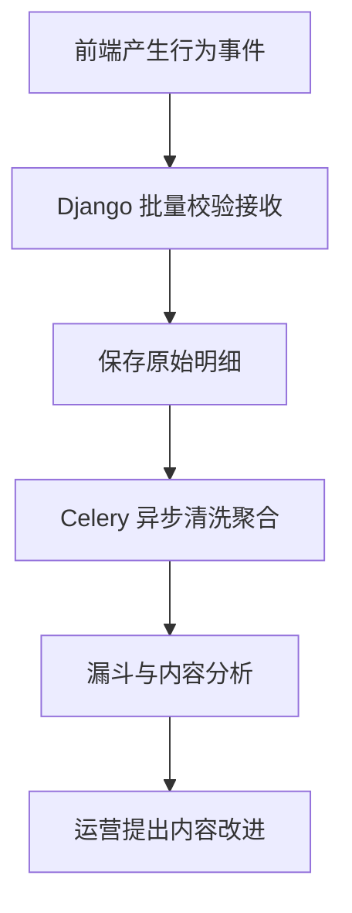

# 07｜Ovanta 行为事件异步处理与运营回流

## 1. 模块定位

本模块把浏览、评估、支付和履约连接为可分析的用户旅程。它服务运营和内容优化，但不参与决定支付和权益权威状态。

黄金案例位置：记录用户 A 的指南浏览、初筛完成、套餐查看、支付成功、指南访问和咨询完成，异步聚合为漏斗，帮助定位用户在哪一步流失。

## 2. 一句话结论

Ovanta 将行为事件批量接收后先保存明细，再通过 Redis/Celery 异步清洗和聚合，降低主请求延迟；分析链路允许可控延迟和去重，但不能反向覆盖订单、权益等交易事实。

关键词：**事件明细、批量接收、异步处理、幂等聚合、漏斗回流**。

## 3. 第一性原理

用户行为的价值是回答“哪里不理解、哪里流失、哪些内容需要改”，而不是为了收集更多数据。埋点吞吐和分析通常不需要阻塞用户请求，但一旦丢失、重复、定义变化，结论也会失真。

交易要求强确定性，分析允许最终一致性。因此两条链路应该分离：订单和权益先正确，事件异步回流；不能因为埋点失败导致支付失败，也不能因为事件显示成功就修改订单。

## 4. 核心业务对象

| 对象 | 关键字段 | 状态 | 权威事实 |
|---|---|---|---|
| Event | event_id、type、user/session、region、occurred_at、props | accepted/rejected | 原始事件明细 |
| Event Schema | type、required fields、version | active/deprecated | 事件口径版本 |
| Batch | batch_id、count、received_at | received/processed/partial | 一次接收记录 |
| Task | task_id、retry_count、error | pending/running/succeeded/failed | Celery 处理状态 |
| Aggregate | date、region、step、count | ready/rebuilding | 可重建分析结果 |

## 5. 正常业务与技术流程

接收接口校验事件类型、时间、区域、必要字段和批次大小，使用事件 ID 去重后快速返回。Celery 从待处理数据中完成清洗、用户/会话归属和日级聚合；失败任务受控重试，超过阈值进入失败队列或人工处理。聚合结果可由明细重建。

## 6. 关键问题和故障场景

常见问题包括前端重复上报、离线事件晚到、客户端时钟错误、事件定义升级但消费者未更新、Celery 任务积压、Redis 不可用、某批部分非法，以及匿名会话与登录用户合并错误。

即使任务全部成功，漏斗仍可能错：事件命名口径不一致、分母选错、支付事件来自前端而非后端、跨区域用户重复计数，或者机器人访问污染数据。

## 7. 解决方案、优化与长期预防

事件使用稳定 ID 和 schema version；原始明细不可被聚合结果替代，聚合任务按日期、区域和口径版本幂等写入。交易类里程碑优先由后端权威状态产生分析事件，前端只记录展示和交互。任务失败记录原因、重试次数和最终状态，避免异常被吞后仍显示成功。

长期建立事件字典、口径评审和数据质量检查：明细量与聚合量、支付订单与支付事件、咨询核销与完成事件定期核对。运营反馈进入内容变更流程，不允许分析系统直接修改生产配置或发布内容。

## 8. 钢人比较

| 方案 | 最强优势 | 代价/边界 |
|---|---|---|
| 请求内同步写和聚合 | 简单、结果立即可见 | 放大延迟和故障，难承受批量 |
| Redis/Celery 异步 | 与业务解耦、成本适中 | 最终一致、任务监控和重试复杂 |
| Kafka 流式平台 | 吞吐高、重放与多消费者强 | 基础设施和运维成本高 |
| 第三方分析 SaaS | 上线快、看板成熟 | 数据控制、定制和成本限制 |

当前规模下 Redis/Celery 足够。只有事件量、消费者数量或重放需求明显超过现有方案时，Kafka 才产生足够边际收益。

## 9. 逆向检查

制造重复事件、乱序晚到、无效 schema、Redis 短暂不可用、任务执行后 ACK 前崩溃、同一匿名会话登录两次。检查是否出现重复聚合、永久丢失、无限重试或错误合并。再用订单和核销权威数据反查漏斗偏差。

## 10. 边际决策

先定义少量能推动决策的关键事件：指南浏览、初筛完成、套餐查看、支付成功、权益访问和咨询完成。先保证口径正确与可重建，再增加事件数量和实时性。

实时大屏、复杂用户画像、推荐系统和流式平台暂缓；如果运营无法根据某项数据采取行动，就不应优先采集。

## 11. 面试标准回答

### 20 秒

行为事件不应拖慢交易链路，所以 Ovanta 批量接收并保存明细，再用 Redis/Celery 异步清洗聚合。事件允许延迟和幂等重算，但支付和权益必须以业务表为准，分析数据不能反向覆盖交易状态。

### 60 秒

Ovanta 需要知道用户从浏览指南到购买和咨询在哪一步流失，但如果在主请求里同步完成聚合，会增加延迟并把分析故障传导到业务。因此 Django 接收批量事件，校验事件 ID、类型、区域和版本后保存明细，再由 Celery 异步清洗和按日期、区域聚合。重复任务通过事件 ID和聚合键幂等处理，失败记录原因并受控重试。支付成功和咨询核销等关键事件从后端权威状态产生，前端埋点只记录交互。代价是最终一致性，需要监控积压、晚到和口径漂移。

### 深度版本骨架

按事件模型、批量接收、明细落库、Celery 状态、幂等聚合、晚到重算、漏斗校验和运营回流展开。

## 12. 高频追问

**问：为什么不直接同步写数据库？** 原始明细同步落库可以，但复杂清洗和聚合不应阻塞业务；批量与异步降低请求开销，并隔离分析故障。取舍是数据会延迟。

**问：Celery 任务执行两次怎么办？** 任务必须以事件 ID、日期/区域/口径版本等稳定键幂等写入；不要把 task ID 当业务幂等键，因为重试可能产生新的任务实例。

**问：Redis 挂了会不会丢数据？** 如果明细已可靠保存，可以之后扫描补处理；若系统只把事件放 Redis 而未落库，则存在丢失风险。回答时要区分当前实现与更强设计，不能虚构持久化策略。

**问：漏斗如何验证？** 用后端订单支付和权益核销作为里程碑对账，抽样重放用户旅程，检查去重、分母、区域和时间窗口。没有真实转化数字就不报提升。

## 13. 最短恢复脚本

**事件 → 校验 → 明细 → Celery → 幂等聚合 → 对账 → 运营**

## 14. 闭卷自测

1. 为什么分析链路不能阻塞支付？
2. 哪些事件必须由后端权威状态产生？
3. 任务 ID 为什么不能作为业务幂等键？
4. 原始明细为什么不能只保留聚合结果？
5. 晚到和重复事件如何处理？
6. Redis/Celery 相比 Kafka 的适用边界是什么？
7. 怎样证明漏斗口径可信？

## 15. 与其他模块的连接

02 是内容优化对象，03 提供评估事件，05—06 提供交易与履约里程碑，04 提供区域口径，08 监控积压和数据质量，09 管理指标证据。

通过标准：能解释“为什么异步、什么可丢、什么不能丢、什么是权威”，并处理任务重复与 Redis 故障追问。

