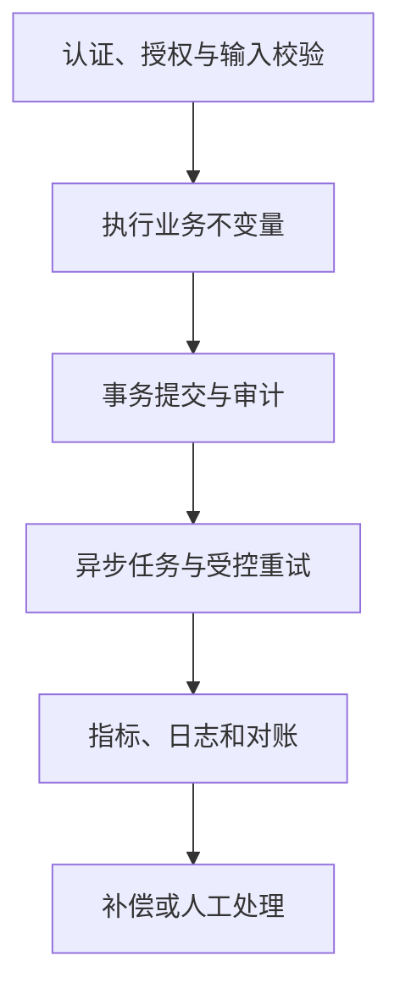

# 08｜Ovanta 可靠性、安全与可观测性

## 1. 模块定位

本模块不是新增一个独立功能，而是保护内容、账户、支付、权益和异步任务的共同底座。它将“接口是否成功”升级为“业务结果是否正确、可恢复、可证明”。

黄金案例位置：从用户 A 登录到支付、发放和咨询核销，任何节点出现错、慢、重、乱或越权时，系统能够发现、阻止影响扩大、定位事实并恢复。

## 2. 一句话结论

Ovanta 对高风险写操作采用服务端鉴权、输入校验、幂等和状态约束，对异步链路保留任务状态、重试和补偿证据，并通过结构化日志与业务对账发现“技术成功但业务错误”。

关键词：**鉴权、校验、状态、幂等、审计、对账、补偿**。

## 3. 第一性原理

可靠性目标不是永不失败，而是失败时不产生不可控副作用，并且知道真实状态、能够安全重试或人工修复。安全目标也不是“有登录接口”，而是每次访问都验证当前用户是否有权操作当前资源。

系统中确定性要求不同：支付和权益必须强约束；内容发布必须审核和版本化；分析数据可以延迟但不能静默污染；第三方登录和支付回调必须把外部输入视为不可信。

## 4. 核心业务对象

| 对象 | 作用 | 必须回答的问题 |
|---|---|---|
| Request/Trace Context | 串联一次请求与下游动作 | 谁在何时发起了什么？ |
| Idempotency Record | 识别同一业务意图 | 重试会不会重复产生副作用？ |
| Audit Log | 记录关键状态与人工操作 | 状态为何变化、由谁变化？ |
| Task Record | 表示异步任务生命周期 | 任务成功、失败还是未知？ |
| Compensation Record | 保存恢复动作 | 修复是否已经执行且只执行一次？ |
| Reconciliation Result | 比较两个事实域 | 支付、订单、权益是否一致？ |

## 5. 正常业务与技术流程

请求进入 Django 后先验证身份、区域、资源所有权和输入；写操作在业务服务中检查当前状态和不变量；数据库事务提交权威状态和必要的审计/待处理记录；Celery 执行可重试工作；日志、任务状态和周期对账发现偏差，再通过幂等补偿恢复。

## 6. 关键问题和故障场景

| 风险 | Ovanta 场景 | 技术成功但业务仍错的例子 |
|---|---|---|
| 错 | 旧政策、错误金额、错发权益 | API 200，但返回旧区域指南 |
| 慢 | CMS 查询慢、任务积压 | 用户支付完成，权益迟迟未到 |
| 重 | 回调、发放、核销重试 | 两条记录均成功，但多发了一次 |
| 乱 | 支付成功与退款乱序 | 旧成功事件覆盖退款状态 |
| 越权 | 访问他人订单或会员内容 | Token 有效，但资源不属于用户 |
| 脏 | 无效事件进入漏斗 | 聚合任务成功，但转化率口径错误 |

## 7. 解决方案、优化与长期预防

### 发现

对技术层记录错误率、延迟、Celery 积压和重试次数；对业务层记录支付—订单—权益差异、负数额度、重复来源和内容版本异常。结构化日志包含 request_id、user_id、order_no、event_id 等关联键，但不输出敏感凭证和完整支付信息。

### 止血与定位

支付、权益、发布等高风险操作遇到校验或状态不确定时失败关闭，暂停继续副作用；查询权威表、外部渠道状态、Webhook 原始记录和任务日志，先判断“成功、失败还是未知”，不能将超时直接当失败重做。

### 修复、验证与预防

通过幂等补偿重新发放缺失权益、撤销错误授权或重建聚合；修复后用订单—权益对账和黄金案例回放验证。将事故样本加入回归测试，增加唯一约束、状态条件、告警或操作审计，避免同类问题再次依赖人工记忆。

已实现、回放验证和未来方案必须分别标 E1/E2/E3。熔断、Outbox、独立任务平台等若未落地，只能作为演进方案。

## 8. 钢人比较

| 方案 | 最强优势 | 代价/适用边界 |
|---|---|---|
| 依靠异常日志人工排查 | 实现成本最低 | 只能看到技术失败，发现不了业务不一致 |
| 大量自动重试 | 提高瞬时故障恢复率 | 非幂等副作用会被放大 |
| 所有链路强一致 | 思维简单、立即一致 | 跨第三方系统不可行，耦合和延迟高 |
| 状态约束 + 最终一致 + 对账 | 可恢复、适应外部系统 | 需要任务状态、补偿和监控 |

当前更适合模块化单体、本地事务、Celery 最终一致和业务对账；规模扩大后再评估事务消息和独立服务。

## 9. 逆向检查

测试不能只证明正常路径。应在数据库提交前、提交后响应前、Celery 执行后确认前分别注入失败；伪造区域和资源 ID；重放支付回调；并发核销；让 CMS 返回旧版本；构造部分合法事件批次。验收最终业务状态、重复副作用、审计证据和恢复能力。

## 10. 边际决策

P0：服务端授权、支付验签、唯一约束、合法状态迁移、核销不变量、任务失败可见、关键业务对账。P1：自动补偿、分级告警、SLO 和故障演练。P2：微服务治理、Kafka、跨区多活、复杂链路追踪平台。

可靠性投入优先保护资金、权益和隐私，其次是内容正确和运营数据，最后才是低风险体验指标。

## 11. 面试标准回答

### 20 秒

Ovanta 的可靠性不只看接口成功，而是保护内容、支付和权益不变量：写操作做鉴权、校验、幂等和状态约束，异步任务保留状态和重试证据，再通过支付—订单—权益对账发现业务不一致。

### 60 秒

我们按风险区分处理方式。支付和权益属于高风险确定性链路，第三方回调先验签与校验，再用事件唯一键和状态机防重复乱序；咨询核销用数据库条件更新防超扣。内容发布保留版本和审核，访问在 Django 服务端鉴权。行为聚合可以最终一致，但 Celery 失败必须有状态、重试上限和补偿入口。监控除了 500 和延迟，还检查已支付无权益、重复权益、负数额度等业务指标。事故按发现、止血、定位、修复、验证、预防处理，状态不明时先查询权威事实，不能直接重做副作用。

### 深度版本骨架

选择“支付成功但权益未到”展开：告警发现→暂停重复发放→查渠道、订单、任务与权益→判断提交边界→幂等补发→对账验证→补偿扫描与回归预防。

## 12. 高频追问

**问：接口 500 怎么排查？** 先确认影响范围和最近变更，按 request_id 定位入口日志，再沿数据库、第三方调用和 Celery 任务检查。重要的是判断事务是否已提交和是否产生副作用；止血后修复，用相同请求和业务对账验证。

**问：为什么不能所有异常都自动重试？** 参数错误、权限错误和非法状态不会因重试恢复；非幂等副作用重试还会放大损失。只有临时故障且操作幂等时才受控重试，并设置退避、上限和终态。

**问：状态未知怎么办？** 不把未知当失败。先查询本地事务记录、第三方权威状态和幂等结果；确认无副作用后再决定重试。

**问：如何发现接口成功但业务错？** 用业务不变量和跨表对账，例如已支付订单必须对应套餐规定的权益、咨询已用次数必须等于有效核销流水。

## 13. 最短恢复脚本

**鉴权 → 不变量 → 事务 → 任务 → 日志 → 对账 → 补偿**

事故题恢复：**发现 → 止血 → 定位 → 修复 → 验证 → 预防**。

## 14. 闭卷自测

1. 技术成功和业务成功有什么区别？
2. 哪些错误必须失败关闭？
3. 为什么自动重试必须建立在幂等之上？
4. 状态未知时为什么不能直接重做？
5. 支付—订单—权益如何对账？
6. 日志中应包含和避免哪些字段？
7. 什么规模下才值得引入 Kafka 或 Outbox？

## 15. 与其他模块的连接

本模块横切 02—07：内容版本、身份区域、支付回调、权益核销和 Celery 任务都有各自不变量。09 决定这些能力如何被证据支持，10 将其转化为事故与系统设计回答。

通过标准：随机给出一个错、慢、重、乱或越权场景，能按六步处置并说明验证证据。

