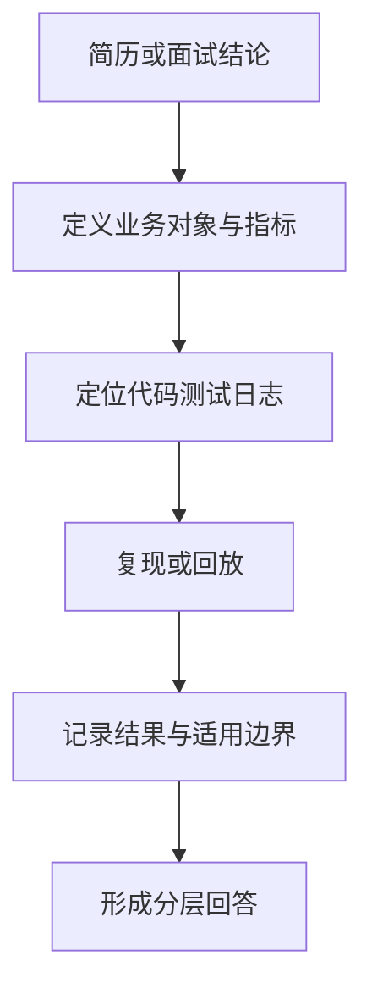

# 09｜Ovanta 项目证据、量化口径与边界

## 1. 模块定位

本模块把项目叙述与可验证事实绑定。它不负责让项目“显得更强”，而是确保简历中的功能、数字和设计在连续追问下仍然可信。

黄金案例位置：从内容发布、支付回调到咨询核销，为用户 A 的每一步列出代码、测试、日志、回放或待验证证据。

## 2. 一句话结论

Ovanta 的证据统一分为 E1 真实实现与交付、E2 回放与测试、E3 设计演进；每个数字都必须说明对象、分母、环境和证据边界，缺失项明确标为待验证。

关键词：**事实、口径、样本、环境、边界、可复现**。

## 3. 第一性原理

面试官需要判断的不是项目文案是否高级，而是候选人是否理解并真正处理过问题。一个数字只有在知道“测了什么、怎么测、与什么比较、能证明什么”时才有价值。

因此证据链应从业务结论反推：如果声称回调幂等，就应有重复事件后的最终订单和权益断言；如果声称并发安全，就应验证最终额度、成功核销数和负数记录，而不是只看请求都返回 200。

## 4. 核心证据对象

| 对象 | 最低字段 | 权威事实 |
|---|---|---|
| Feature Evidence | 功能、提交/接口/页面、验收结果 | 可复现实现或联调记录 |
| Test Evidence | 场景、输入、环境、次数、断言 | 测试报告与原始结果 |
| Metric Definition | 指标、对象、分母、窗口 | 固定计算口径 |
| Incident/Boundary Case | 故障、处置、结果 | 日志、回放或测试记录 |
| Ownership Note | 个人动作、团队依赖、时间边界 | 可解释的工作范围 |

## 5. 正常证据流程

每个结论先填写：背景、输入、改动、输出、验证、证据等级、不能证明什么。若缺少原始数据，不用猜测补数字，而是把机制与验证方法讲清，数字标记待验证。

## 6. 当前事实与证据矩阵

| 项目内容 | 当前口径 | 等级 | 面试边界 |
|---|---|---|---|
| React + Django/DRF + MySQL + Strapi/PostgreSQL + Redis/Celery | 最新项目技术栈 | E1 | 不扩写 Kafka/Outbox |
| 结构化内容、草稿/审核/发布、版本与来源 | 核心内容工程 | E1 | 具体表结构需以代码核对 |
| 国内微信/邮箱、国际 Google/邮箱及区域差异 | 多区域产品链路 | E1 | 不夸大为全球多活架构 |
| 订单、支付回调、权益和咨询核销 | 核心功能完成并联调 | E1 | 后续审查、测试、上线由团队继续 |
| 2,000 次支付回调 | 固定回放验证 | E2 | 不是生产订单量、QPS 或线上流量 |
| 500 次并发核销 | 并发测试验证 | E2 | 不是实际同时在线用户数 |
| Kafka、Outbox、独立支付/权益服务 | 架构演进 | E3 | 只能回答“规模扩大后会考虑” |
| 转化率、线上 P95、真实订单规模 | 缺少可复现口径 | 待验证 | 不提供虚构数字 |

## 7. 解决方案、优化与长期预防

为每个简历数字建立“七要素卡”：指标对象、样本数量、环境、输入分布、对照或基线、断言结果、不能证明什么。测试保留可重跑脚本和结果摘要；业务结论关联日志或数据查询；架构方案明确标注设计条件。

后续补证据的优先级：先补支付—权益一致性和并发核销的可复现结果，再补内容版本与区域回归，最后才是性能和运营转化。不能为了增加数字而引入无法解释的压测。

## 8. 钢人比较

| 表达方式 | 优势 | 风险 |
|---|---|---|
| 不写任何数字 | 安全、不会误导 | 难体现验证意识和规模 |
| 写大量测试数字 | 视觉冲击强 | 容易被误认为生产指标，追问后失真 |
| 只讲机制 | 逻辑完整 | 缺少“是否真的验证”的证据 |
| 机制 + 分级证据 + 边界 | 可信、可追问 | 表达需要更精确，数字未必夸张 |

对校招和实习项目，可信的 E2 回放比无法解释的“线上提升 80%”更有价值。

## 9. 逆向检查

对每个数字连续追问：分母是什么？测试在哪里运行？输入是否都相同？断言是什么？失败了多少？能否复现？它为什么不是线上数据？如果其中两项答不出，就降低证据等级或删除数字。

再检查是否把产品整体能力说成个人独立完成、把团队后续上线说成离开前结果、把未来设计说成当前架构。当前学习可以先掌握整体项目，但正式面试被问职责时必须如实说明。

## 10. 边际决策

证据建设优先覆盖简历上最容易被问的三条：结构化内容、多区域订阅支付、行为数据与运营闭环。每条准备一个正常案例、一个失败边界和一个验证证据即可，不追求把所有功能量化。

如果补一个指标需要大量重构但不会显著提高项目可信度，先不做；优先补面试中已经暴露的断点。

## 11. 面试标准回答

### 20 秒

我把项目证据分成 E1 实现交付、E2 回放测试和 E3 设计。比如 2,000 次回调和 500 次并发核销都是 E2，只证明固定测试条件下的幂等和并发行为，不代表生产流量。

### 60 秒

为了避免把项目包装过头，我会给每个结论绑定证据等级。结构化内容、区域化登录、订单支付和权益链路属于 E1 的实现与联调事实；2,000 次支付回调回放和 500 次并发核销属于 E2，需要说明测试环境、输入和最终断言；Kafka、Outbox 等只是 E3 演进方案。数字必须回答对象、样本、分母、环境、结果和不能证明什么。像线上转化率或 P95 没有可复现数据，我会直接说待验证，不把外部案例或测试结果包装成线上收益。

### 深度版本骨架

选择 500 次并发核销，依次解释为什么测、怎样构造同一权益竞争、校验成功数/剩余额度/负数记录、环境限制、发现的问题和后续预防。

## 12. 高频追问

**问：2,000 次回调具体证明了什么？** 证明测试输入覆盖的重复、乱序或边界回调最终被系统按预期处理。它不能证明线上 QPS、渠道全部事件类型或长期稳定性；具体通过率若没有原报告就不补数字。

**问：500 次并发核销是 500 个真实用户吗？** 不是，是并发测试请求。核心断言是成功核销不超过可用额度、额度不为负、幂等重试不重复扣减。

**问：项目上线了吗？** 核心功能在离开前完成并联调，后续审查、测试和上线由团队继续。产品面向真实会员与顾问服务，但具体线上订单和运营指标没有可靠证据时不报数字。

**问：你个人做了什么？** 当前手册先帮助掌握完整系统；正式回答应落到简历选中的模块、具体动作和可验证产出，不能用“我们”掩盖职责边界。

## 13. 最短恢复脚本

**结论 → 对象 → 样本 → 环境 → 断言 → 等级 → 边界**

## 14. 闭卷自测

1. E1、E2、E3 分别是什么？
2. 2,000 和 500 两个数字能证明和不能证明什么？
3. 一个压测数字需要哪些环境信息？
4. 为什么请求返回 200 不是并发核销通过？
5. 哪些项目指标当前必须标待验证？
6. 面试被问上线与职责时如何回答？
7. 下一步最值得补的证据是哪一项？

## 15. 与其他模块的连接

01—08 中的每个结论都要落到本模块的证据等级。10 使用这些边界组织项目介绍和追问，避免背得越熟越容易越界。

通过标准：随机抽取简历中的任意功能或数字，能在 30 秒内说明证据、适用范围和不能证明什么。

