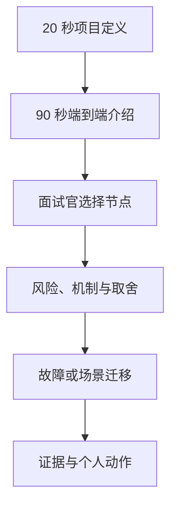

# 10｜Ovanta 项目表达与专项模拟面试

## 1. 模块定位

本模块将前九个模块压缩为可调用的面试表达，并提供项目专项模拟流程。目标不是逐字背诵，而是在未知题序下仍能沿业务对象恢复答案。

黄金案例位置：用用户 A 的香港永居会员购买和咨询履约贯穿项目介绍，再由面试官从内容、区域、支付、权益、异步和证据任一点下钻。

## 2. 一句话结论

面试时先讲用户如何从政策需求走到付费履约，再沿内容、支付、权益等业务节点回答风险、机制、取舍和证据，避免从 Strapi、Celery、幂等等孤立名词开场。

关键词：**用户、主线、事故、取舍、证据、迁移**。

## 3. 第一性原理

面试官真正判断的是：你是否理解业务目标，能否追踪数据与状态，遇到失败是否知道如何定位，以及你说的结果是否有证据。背一篇完美介绍只能覆盖已知问题，不能应对连续追问。

因此表达要有固定骨架而非固定句子：

> 业务目标 → 正常流程 → 主要风险 → 解决机制 → 设计取舍 → 验证方法

事故题使用：

> 发现 → 止血 → 定位 → 修复 → 验证 → 预防

## 4. 核心面试对象

| 对象 | 面试官会追什么 | 恢复锚点 |
|---|---|---|
| 内容版本 | 来源、过期、审核、权限 | 来源→版本→发布→鉴权 |
| 用户区域 | 登录绑定、同库串区、配置 | 入口→区域→身份→快照 |
| 订单支付 | 验签、重复、乱序、超时 | 快照→校验→状态机→对账 |
| 权益履约 | 多发、超扣、退款、补偿 | 独立权益→原子核销→流水 |
| 异步事件 | 重复、积压、口径、权威性 | 明细→Celery→聚合→对账 |
| 项目证据 | 上线、数字、职责、边界 | E1→E2→E3→待验证 |

## 5. 正常面试流程

回答每个问题先给结论，再选择最相关的一条链路展开。被打断时先确认面试官关注的对象和状态，不急着把剩余背稿全部说完。

## 6. 关键表达故障

最常见的问题是从技术栈开场、把业务流程讲成页面列表、用“幂等/缓存/异步”代替原因、一次回答塞入所有细节、被追问后切换到另一个模块、数字没有口径，以及把 E2/E3 说成线上结果。

即使回答技术上正确，也可能没有回答面试官的问题。例如问“为什么支付和权益分开”，若只讲 Celery 重试而没有说明一个订单包含多种可核销服务，业务逻辑仍不完整。

## 7. 解决方案、优化与长期预防

每个回答强制包含一个业务对象、一个主要风险、一个机制和一个验证方法。一次只回答当前问题，结尾主动给出可继续下钻的点。模拟后只记录三个最关键断点：缺业务链路、缺底层原理、缺证据或表达散乱，并回到对应模块复训。

复训不重新通读全文，而是闭卷重答同题，再换一个故障变体。第 1、3、7 天随机抽取，直到无需提示仍能恢复。

## 8. 钢人比较

| 训练方式 | 最强优势 | 局限 |
|---|---|---|
| 背标准答案 | 首次表达流畅 | 题目变化就容易断裂 |
| 逐章完全掌握后再面试 | 知识细致 | 反馈太慢，容易陷入熟悉感 |
| 只做压力模拟 | 暴露问题快 | 没有知识地图时修复零散 |
| 全貌 → 模拟 → 三断点复训 | 反馈快且有结构 | 需要接受不完美地开始 |

当前采用最后一种，符合“先建立面试能力，再定向专项学习”的目标。

## 9. 逆向检查

模拟面试故意从非主线节点开始：为什么 Strapi 不直接给前端、如果支付成功但权益没到、Redis 挂了事件怎么办、海外用户伪造国内区域、退款与核销并发。再追问替代方案和证据。如果只能回到背稿起点，说明知识尚未 integrated。

## 10. 边际决策

优先训练简历中最可能被问的三条：结构化内容、多区域订阅支付、行为数据闭环。每轮只修三个断点，不扩张到所有后端八股。底层技术只在项目追问暴露时定向补充。

达到 90 秒项目介绍稳定、P0 节点两层追问通过后就开始投递和综合模拟，不等待所有 P1/P2 内容完全掌握。

## 11. 面试标准回答

### 20 秒版本

Ovanta 是面向国内外用户的签证与移民结构化自助申请平台。我们把公开政策做成可审核、可版本化的指南和资格初筛，再通过会员、支付、权益与顾问履约形成商业闭环，后端重点解决区域差异、重复回调和并发核销。

### 90 秒版本

Ovanta 面向有香港身份、新加坡身份或海外银行开户等需求的个人用户。用户原来需要在多个官网和顾问之间反复确认信息，所以产品先用 Strapi 把公开政策拆成条件、步骤、材料和来源，经过草稿、审核、发布和版本治理，再由 Django 根据用户区域和权益聚合给 React。用户可以匿名浏览并完成基于确定性规则的资格初筛，需要深度内容或人工帮助时，再注册购买会员、1v1 咨询或全流程顾问服务。

国内和国际复用用户、订单与权益核心模型，但登录、币种、支付和协议做区域适配。支付回调不能相信前端结果，我们做验签、金额校验、事件去重和状态机，再以订单来源幂等发放内容和咨询权益；咨询核销用数据库条件更新避免并发超扣。浏览、评估、支付和履约事件由 Redis/Celery 异步聚合，用于内容和产品优化，但不会反向替代交易事实。项目中 2,000 次回调回放和 500 次并发核销属于 E2 测试证据，不等同线上流量。

### 5 分钟版本骨架

1. 30 秒：用户、痛点与商业模式；
2. 45 秒：结构化内容和资格初筛；
3. 45 秒：账户和区域化；
4. 60 秒：订单、支付状态机与重复回调；
5. 60 秒：权益发放、并发核销与顾问履约；
6. 30 秒：事件异步回流；
7. 30 秒：最难问题、取舍、证据和下一步。

## 12. 高频追问题库

### 第一层：项目真实性

1. Ovanta 与普通内容网站有什么区别？
2. 产品如何赚钱，用户最终购买什么？
3. 项目是否上线，你实际参与到哪个阶段？
4. 为什么选择 Django、Strapi 和 Celery？

### 第二层：核心链路

5. 为什么政策不能只存成一篇富文本？
6. 国内外同库如何避免串区？
7. 支付回调为什么会重复，怎样保证只发一次权益？
8. 支付成功但权益没有到账怎么办？
9. 两个请求同时使用最后一次咨询额度怎么办？
10. Redis 或 Celery 故障会不会影响支付？

### 第三层：事故与取舍

11. 退款和咨询核销同时发生，权威状态是什么？
12. 政策更新但规则和缓存未更新，如何止血和恢复？
13. 为什么不用 Kafka、Outbox 或微服务？
14. LLM 能否自动更新政策和判断资格？
15. 2,000 与 500 两个数字具体证明什么？

### 迁移题

16. 把这套订单—权益链路迁移到课程会员系统，哪些不变量保持不变？
17. 如果新增按月订阅和自动续费，状态模型要增加什么？
18. 如果顾问服务拆成多个里程碑，如何设计履约和退款？

答题时不要一次背完。先给结论，再按“目标→流程→风险→机制→取舍→验证”展开。

## 13. 最短恢复脚本

项目主线：**内容 → 初筛 → 区域 → 订单 → 支付 → 权益 → 履约 → 回流**。

技术回答：**目标 → 流程 → 风险 → 机制 → 取舍 → 验证**。

事故回答：**发现 → 止血 → 定位 → 修复 → 验证 → 预防**。

## 14. 闭卷自测与训练安排

### 基线测试

1. 不看资料完成 90 秒项目介绍；
2. 画出内容、订单、支付、权益四个权威对象；
3. 解释支付成功为什么不等于权益成功；
4. 推演重复回调和并发核销；
5. 解释两个测试数字的证据边界。

### 三轮模拟

- 引导式：允许提示恢复脚本，纠正业务主线；
- 半严格：不提示，沿一个节点追问两层；
- 严格式：未知题序，包含事故、系统设计、证据和个人职责。

每轮评分四项，每项 0～2 分：业务链路、技术原理、边界取舍、证据表达。未被问到的内容不计零分。每轮只记录得分最低的三个断点。

### 间隔复训

- D1：重答原题；
- D3：更换故障条件；
- D7：与 EnergyOps、数驭穹图或 PayTrace 混合追问。

## 15. 与其他模块的连接

本模块是前九份文档的提取层。任何回答断裂，都回到具体业务对象对应的模块，不重新从第一章通读：内容断点回 02，区域回 04，支付回 05，权益回 06，异步回 07，事故回 08，数字回 09。

最终通过标准：闭卷完成 20 秒、90 秒和 5 分钟版本；P0 问题能承受三层追问；能讲一个失败、一个取舍、一个下一步；所有数字都能解释证据边界。

