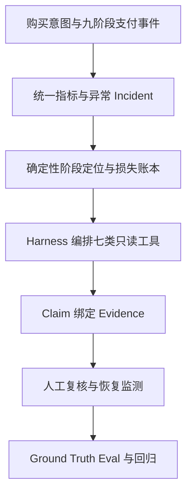

# PayTrace 项目学习与面试总索引

> 目标：先建立项目全貌和面试表达能力，再通过模拟面试暴露断点，定向回到模块复训。

## 1. 项目一句话

PayTrace 是面向支付产品、支付运营和技术支持团队的证据驱动诊断 Agent：确定性代码先定位支付转化损失，受控 Agent 再调用只读工具调查原因，最后通过证据契约、人工复核和 Ground Truth 评测保证结论可验证。

## 2. 核心业务主线

最短恢复链：

> `Intent → Event → Metric → Incident → Evidence → Diagnosis → Review → Eval`

## 3. 黄金业务案例

全部模块统一使用一个明确标记为**模拟故障注入**的 Incident：

> 某海外站在一个观察窗口内购买意图基本稳定，但最终支付完成率下降。系统需要判断损失发生在哪个阶段、影响哪些地区和支付方式、造成多少购买意图损失，以及有哪些根因。

隐藏 Ground Truth 包含两个并发问题：

1. 某地区、某支付方式的身份认证失败上升；
2. 部分渠道已处理成功，但 Webhook 延迟导致订单状态没有及时更新。

调查中还会出现优惠变化、配置变更和数据延迟等干扰线索。它们可能相关，但不能仅凭时间接近就写成因果。系统必须保留无法解释的剩余损失。

这是教学与评测场景，不代表真实商户事故、真实生产流量或真实业务收益。

## 4. 项目地图

| 文件 | 核心问题 | 优先级 |
|---|---|---|
| [01 业务背景、定位与边界](01-业务背景项目定位与系统边界.md) | 为什么需要 PayTrace，负责什么、不负责什么 | P0 |
| [02 支付九阶段链路](02-支付九阶段链路与状态事实.md) | 支付为什么不是一次同步调用 | P0 |
| [03 Purchase Intent 与数据契约](03-PurchaseIntent事件模型与数据契约.md) | 哪些数据是权威事实，漏斗分母如何确定 | P0 |
| [04 异常检测与损失账本](04-转化异常检测与确定性损失账本.md) | 哪里下降、损失多少，为什么必须由代码计算 | P0 |
| [05 Incident 与调查工具](05-Incident与七类只读调查工具.md) | Agent 能查什么、如何取得可信证据 | P0 |
| [06 Diagnostic Harness](06-单诊断Agent与Diagnostic-Harness.md) | 如何治理单 Agent 的多步调查 | P0 |
| [07 证据契约与人工复核](07-证据契约多根因诊断与人工复核.md) | 如何阻断无依据归因和重复计损 | P0 |
| [08 失败恢复与可观测性](08-失败语义异步恢复与可观测性.md) | 工具、模型或任务失败后怎样安全恢复 | P1 |
| [09 Ground Truth 与 Eval](09-故障注入Ground-Truth与自动Eval.md) | 如何证明系统真的改善 | P0 |
| [10 架构与生产化](10-系统架构安全边界与生产化演进.md) | 当前架构为何够用，如何安全演进 | P1 |
| [11 简历与模拟面试](11-简历证据边界与项目模拟面试.md) | 如何把系统讲清楚并承受连续追问 | P0 |

## 5. 学习顺序

第一遍按 `01 → 11` 快速通读，不在任何模块停下来追求完全掌握。第二遍闭卷画出主线，并分别讲 20 秒、90 秒和 5 分钟版本。随后直接进入项目专项模拟面试，每轮只记录最关键的三个断点，再回到对应模块补齐。

复训节奏：断点修复后立即重答，并在第 1、3、7 天随机复训。多个项目完成后再进行跨项目混合模拟。

## 6. 统一回答框架

常规问题：

> 业务目标 → 正常流程 → 主要风险 → 解决机制 → 设计取舍 → 验证方法

事故问题：

> 发现 → 止血 → 定位 → 修复 → 验证 → 预防

不以 RAG、MCP、Agent、幂等、缓存等名词开头。先说明业务对象和正确流程，再讲技术机制解决了哪个节点的问题。

## 7. 证据分级

| 等级 | 含义 | 面试措辞 |
|---|---|---|
| E1 | 有代码、测试命令、日志或实际产物 | “我实现并通过……验证” |
| E2 | 固定回放、模拟数据、故障注入或离线评测 | “在模拟场景/固定评测集上……” |
| E3 | 产品目标、设计方案或生产化规划 | “当前设计为……，仍需真实数据验证” |

所有无法由当前产物核验的准确率、F1、MAE、延迟、Token、恢复率和收益数字统一标记为“待验证”。模拟结果不能说成真实商户收益。

## 8. 必须掌握与暂缓内容

必须掌握：九阶段支付链路、Purchase Intent、五层领域模型、确定性损失账本、七类只读工具、Hook 链、Hypothesis Ledger、证据契约、`SUPPORTED/PARTIAL/UNKNOWN`、Ground Truth 隔离、Response/Trajectory Eval。

暂缓：多 Agent 平台、自动修改支付配置、真实收单和卡数据、退款拒付清结算、重型流处理、多租户商业 SaaS、未经证据核验的漂亮数字。

## 9. 外部对照案例

外部案例只用于优化设计，不能冒充 PayTrace 项目结果：

- [Stripe Payment Intents](https://docs.stripe.com/payments/payment-intents)：一次购买会话需要稳定业务意图和明确状态。
- [Stripe Webhooks](https://docs.stripe.com/webhooks)：支付最终状态可能异步到达，接口成功不等于业务完成。
- [Adyen Refusal Reasons](https://docs.adyen.com/development-resources/refusal-reasons)：拒付原因需要结构化分类，并区分可重试与终态。
- [Adyen Testing Result Codes](https://docs.adyen.com/development-resources/testing/result-codes)：主动触发失败场景，验证异常链路。
- [OpenAI Evals](https://developers.openai.com/api/docs/guides/evals)：用固定数据集和评分规则验证版本变化。
- [OpenTelemetry Traces](https://opentelemetry.io/docs/concepts/signals/traces/)：用同一 Trace 串联跨组件执行路径。

## 10. 项目通过标准

完成阅读不算通过。最终需要做到：

1. 闭卷画出业务与诊断主线；
2. 20 秒说明定位，90 秒介绍项目，5 分钟讲完整链路；
3. 黄金案例能承受三层连续追问；
4. 解释一个失败、一个取舍和一个下一步；
5. 每个数字都能说明分母、样本、版本和证据等级；
6. 能把同样方法迁移到退款、订单履约或能耗异常场景。

