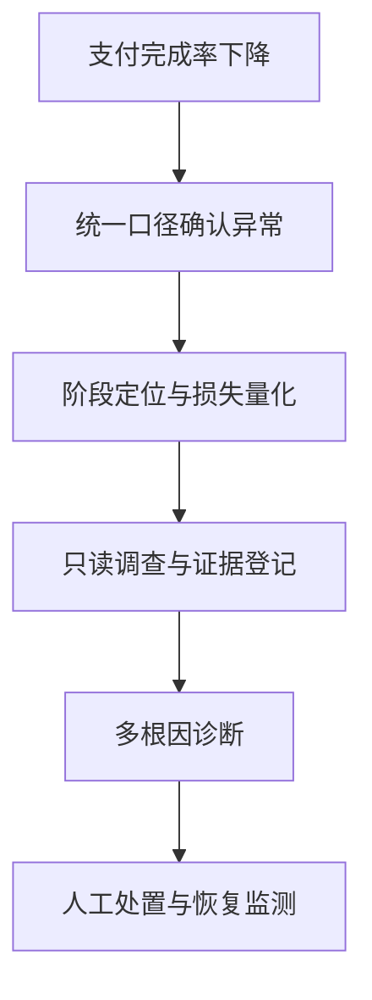

# 01 业务背景、项目定位与系统边界

> 优先级：P0｜事实边界：真实问题意识 + 开源模拟系统｜黄金案例位置：解释为什么要建立统一诊断链路。

## 1. 模块定位

本模块回答三个起点问题：PayTrace 为谁服务、为什么已有支付看板仍不够、项目为什么收敛为证据驱动的单诊断 Agent。

## 2. 一句话结论

PayTrace 连接支付指标与技术证据：先确定性计算哪里损失、损失多少，再让受控 Agent 调查为什么，并把每条结论绑定到可复核证据。

## 3. 第一性原理

用户真正需要的不是一段“可能是渠道问题”的解释，而是能采取行动的结果：损失阶段、影响范围、根因支持程度、缺失数据和下一步动作。

如果没有 AI，正确系统仍应先完成统一事件、漏斗、异常、损失和查询工具。AI 的价值是面对多根因和多条调查路径时，提出假设、选择工具、组织证据和生成可读报告；它不能替代事实计算和安全边界。

## 4. 核心业务对象

| 对象 | 输入 | 输出/状态 | 权威事实 |
|---|---|---|---|
| 支付异常 | 漏斗指标、基线、时间窗口 | Incident | 确定性指标结果 |
| 诊断调查 | Incident、七类工具 | Evidence、Trace | 工具真实返回与数据快照 |
| 诊断结论 | Evidence、Hypothesis | Claim/Diagnosis | 证据契约校验后的报告 |
| 人工处置 | Diagnosis、业务判断 | 接受、修改、拒绝、监测 | 人工最终结论与恢复结果 |

目标用户是支付产品、支付运营、技术支持和研发。项目问题意识来自 Ovanta 的订单、支付、Webhook、订单状态和权益交付链路，以及出海电商中“看见支付率下降但难定位损失环节和影响维度”的需求。

## 5. 正常业务与技术流程

PayTrace 当前不执行支付、不保存卡信息，也不自动修改渠道、路由、风控或优惠配置。它输出调查结果和建议，把高风险动作留给人工。

## 6. 关键问题和故障场景

- 看板只告诉运营“下降了”，无法连接到事件、配置和影响对象。
- 日志能解释一次请求，却不能量化多少购买意图没有完成。
- 错误码、优惠变化和配置发布可能同时出现，相关不等于因果。
- 通用 LLM 容易跳过数据核验，生成合理但不可复算的解释。
- 项目使用模拟数据，如果把离线结果包装成生产收益，会破坏可信度。

## 7. 解决方案、优化与长期预防

系统分为五层：Event 保存事实，Metric 统一口径，Incident 冻结调查范围，Evidence 保存工具证据，Diagnosis 输出受约束结论。确定性代码负责数值和门禁，Agent 负责调查组织，人工承担最终业务动作，Eval 检查版本是否退化。

长期预防不是增加更多 Agent，而是持续完善数据契约、失败语义、证据校验和回归场景。

## 8. 钢人比较

人工排查的优势是业务直觉强、能跨系统协调，且不用建设 Agent 平台；PSP 原生看板数据最完整，部署成本最低；固定 Workflow 稳定、便于测试。PayTrace 只有在异常跨越多个阶段、需要重复调查、要求统一证据与回归时才更合适。代价是必须维护领域模型、工具、证据和评测集。

## 9. 逆向检查

即使系统输出了报告，仍可能：漏斗分母错误、数据延迟被误判为业务异常、工具查询越过 Incident 范围、同一损失被多根因重复计算、Evidence 来自不同数据版本、Ground Truth 泄漏、模型把相关性写成因果。

这些问题中，口径、越权、重复计损和泄漏必须失败关闭，不能靠自然语言免责声明兜底。

## 10. 边际决策

最低可用版本只需要：统一漏斗、Purchase Intent、确定性损失、少量只读工具、结构化报告和固定故障场景。当前优先提高核心诊断质量，不扩展商户接入、退款拒付、清结算、多 Agent 和自动处置。

## 11. 面试标准回答

### 20 秒

PayTrace 解决的是支付成功率下降后难以归因的问题。系统先用确定性代码定位九阶段漏斗损失，再由单个受控 Agent 调用七类只读工具调查，结论必须绑定 Evidence，最后通过人工复核和 Ground Truth 评测验证。

### 60 秒

我在 Ovanta 支付与权益链路以及出海电商场景中发现，支付看板、日志和工单各自只能解释一部分问题。PayTrace 将订单行为、支付事件、渠道状态和配置变化统一到 Purchase Intent 与九阶段漏斗。异常发生后，代码先计算阶段与购买意图损失，Agent 再在 Harness 约束下调查多种根因，每条 Claim 必须绑定可复算 Evidence；证据不足就返回 PARTIAL、UNKNOWN 或 NEEDS_DATA。项目用模拟数据和隔离 Ground Truth 做回归，用于验证系统闭环和版本相对表现，但不能声称真实商户收益。

### 深度版本

深度回答沿“业务断层 → 五层领域模型 → 确定性与概率性分工 → Hook 与证据契约 → 人工处置 → Eval → 模拟数据边界”展开，最后说明当前不执行写操作、不接真实卡数据、不建设多 Agent 平台。

## 12. 高频追问

**问：为什么支付平台自己的 Dashboard 不够？** 其优势是数据近源和成熟稳定，但通常聚焦监控与单渠道分析。PayTrace 关注跨订单行为、支付事件、配置证据和购买意图损失的统一诊断。若原生平台已经提供完整证据闭环，就没有必要重复建设。

**追问：为什么一定要 Agent？** 不一定。固定异常可以用规则和 Workflow。只有调查路径随证据变化、多根因需要逐步验证时，Agent 的边际收益才更高。

**问：这是生产项目吗？** 当前是个人开源项目，真实问题来源于过往业务经历，系统使用模拟数据、故障注入和 Ground Truth 做可复现验证，不接真实支付渠道。

**追问：模拟数据有什么证明力？** 能证明在已知场景上的阶段定位、证据校验和版本相对表现；不能证明真实商户收益或覆盖全部真实异常。

## 13. 最短恢复脚本

> 支付断层 → 确定性损失 → 受控调查 → 证据结论 → 人工复核 → Eval

## 14. 闭卷自测

1. PayTrace 的目标用户和最核心结果是什么？
2. 看板、日志、规则告警各缺少什么？
3. 如果没有 AI，最低正确系统是什么？
4. 为什么当前选择单 Agent？
5. 项目明确不负责哪些业务？
6. 模拟数据可以和不可以证明什么？
7. 哪些错误必须失败关闭？

## 15. 与其他模块的连接

本模块定义项目边界；[02](02-支付九阶段链路与状态事实.md)说明被诊断的支付业务，[03](03-PurchaseIntent事件模型与数据契约.md)定义事实层，[04](04-转化异常检测与确定性损失账本.md)开始计算损失，[11](11-简历证据边界与项目模拟面试.md)负责把边界转换为可信面试表述。
