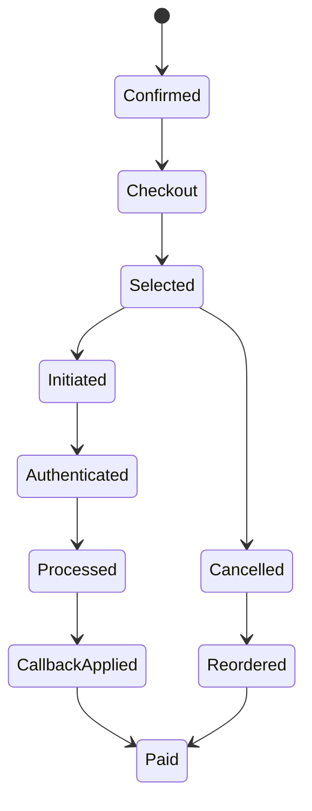

# 02 支付九阶段链路与状态事实

> 优先级：P0｜黄金案例位置：从最终完成率下降反查认证和状态回写阶段。

## 1. 模块定位

本模块建立 PayTrace 的业务底盘。只有先理解一次购买怎样跨越用户、业务系统、支付渠道和异步回调，才能正确解释“支付失败”。

## 2. 一句话结论

支付不是一次同步接口调用，而是一条跨九个阶段、存在重试和异步回写的状态链；接口成功、渠道成功、订单完成是三个不同事实。

## 3. 第一性原理

用户真正需要的是购买最终完成，而不是某个接口返回 200。权威状态必须来自服务端订单、支付尝试、渠道事件和回调处理的联合事实。模型不能根据一条前端提示或单个错误码决定最终支付结果。

## 4. 核心业务对象

九阶段链路：

1. 订单确认；
2. 进入收银台；
3. 支付选项与优惠曝光；
4. 选择支付方式；
5. 发起支付；
6. 身份认证或授权；
7. 支付渠道处理；
8. 支付结果回写；
9. 订单支付完成。

| 对象 | 关键状态 | 权威来源 |
|---|---|---|
| Order | confirmed/cancelled/paid 等 | 业务订单服务 |
| Payment Attempt | initiated/authenticated/processed/failed | 支付适配层与渠道事件 |
| Webhook Event | received/verified/applied/rejected | 回调接收与处理记录 |
| Purchase Intent | active/recovered/completed/lost | 关联规则与确定性计算 |

## 5. 正常业务与技术流程

外部优秀实践也将支付建模为带状态的业务意图，并通过 Webhook 接收异步结果。PayTrace 借鉴这一原则，但不宣称已经接入 Stripe 或 Adyen。

## 6. 关键问题和故障场景

- 用户进入收银台但未发起支付：可能是选项、价格或优惠摩擦，不是渠道失败。
- 认证失败：3DS、风控、授权或用户操作都可能导致。
- 渠道超时：请求结果未知，盲目重试可能产生重复支付。
- 渠道成功但 Webhook 延迟、丢失、签名失败或乱序：资金状态与订单状态不一致。
- 用户取消后重下单：按 order_id 统计会把同一购买意图重复计算。
- 埋点延迟或缺失：看似漏斗下降，实际是数据质量问题。

## 7. 解决方案、优化与长期预防

每个阶段都定义进入条件、成功条件、失败原因、事件时间和关联键；最终订单状态由服务端状态机推进，回调必须验签、幂等并处理乱序。统计层同时保留事件时间和处理时间，区分业务发生晚与数据到达晚。

黄金案例中，认证失败由阶段 6 的事件证据支持；Webhook 延迟由阶段 7 已成功、阶段 8/9 未完成的对象集合差异支持。两个阶段的异常可以同时存在。

## 8. 钢人比较

只看最终订单状态实现最简单，适合低复杂度产品；只看渠道成功率更接近支付处理质量；PSP 状态机字段更专业。PayTrace 的九阶段模型增加了埋点和映射成本，但能区分用户决策、认证、渠道和业务回写问题。规模小、渠道单一时，不必一次建设全部阶段。

## 9. 逆向检查

即使 SQL 和漏斗图都成功，仍可能出现：阶段事件重复、跨时区窗口错位、回调晚到、状态倒退、订单与支付尝试一对多、前端事件伪造、同一用户重试被当成新购买。

最危险的是把“渠道成功但订单未更新”误判为用户支付失败，或者把未知渠道结果直接重试造成重复支付。

## 10. 边际决策

MVP 先保证订单确认、支付发起、认证、渠道结果、回调和最终完成几个关键节点，再逐步加入优惠曝光、方式选择和取消重下单。先保证状态正确和可关联，再增加更多细粒度事件。

## 11. 面试标准回答

### 20 秒

我把支付从订单确认到最终完成拆成九个阶段，因为接口返回、渠道处理和订单完成并不是同一个状态。这样异常时能区分用户决策摩擦、认证失败、渠道故障和 Webhook 回写问题。

### 60 秒

正常链路是订单确认、进入收银台、曝光优惠、选择方式、发起支付、身份认证、渠道处理、结果回写和订单完成。每个阶段都有独立事件和状态。比如黄金案例中，一部分购买意图在认证阶段失败，另一部分渠道已经成功但回调延迟，最终都表现为完成率下降。如果只看最终状态会把两类问题混在一起；PayTrace 先用确定性漏斗定位阶段，再让 Agent 调查具体原因。

### 深度版本

继续下钻订单、Payment Attempt、Webhook Event 的一对多关系，事件时间与处理时间，终态与中间态，回调验签、幂等、乱序和结果未知后的权威查询。

## 12. 高频追问

**问：支付接口返回成功为什么不算支付成功？** 它可能只表示请求已受理，认证、渠道处理和异步回调尚未完成。最终业务事实应由服务端订单和渠道事件共同确认。

**追问：渠道超时能不能直接重试？** 不能先假设失败。应使用业务幂等键并查询渠道或本地权威状态，再决定是否重试。

**问：为什么 Webhook 会导致重复或乱序？** 外部系统通常至少一次投递，网络超时会触发重发，不同事件也可能乱序到达。因此需验签、事件唯一约束和条件状态转移。

**追问：PayTrace 会修复订单吗？** 当前不会。它只读诊断并给出建议，高风险写操作由原支付系统和人工流程完成。

## 13. 最短恢复脚本

> 九阶段 → 三种成功 → 异步回调 → 状态机 → 幂等乱序 → 最终事实

## 14. 闭卷自测

1. 九阶段分别是什么？
2. 接口、渠道和订单成功有何区别？
3. 渠道成功但订单未完成可能发生了什么？
4. 为什么不能盲目重试未知支付结果？
5. 事件时间和处理时间为什么都要保留？
6. 取消重下单如何影响漏斗？
7. 哪些事件可以由前端提供，哪些必须以服务端为准？

## 15. 与其他模块的连接

[03](03-PurchaseIntent事件模型与数据契约.md)把九阶段事件转换为统一事实，[04](04-转化异常检测与确定性损失账本.md)基于阶段计算损失，[05](05-Incident与七类只读调查工具.md)提供阶段下钻工具，[08](08-失败语义异步恢复与可观测性.md)进一步处理回调、任务和重试失败。

