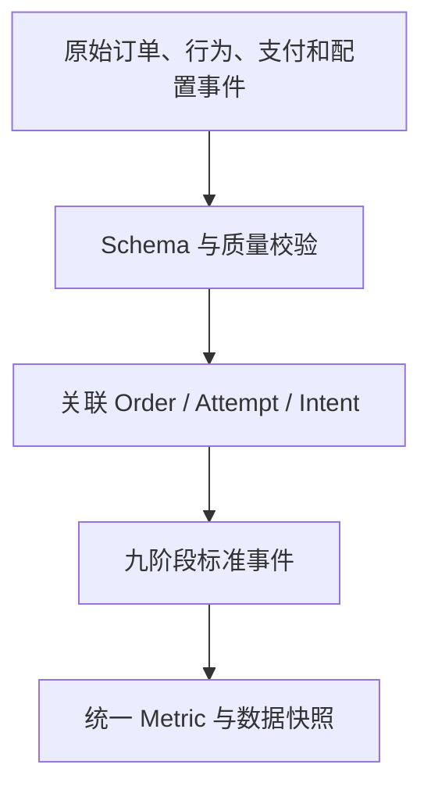

# 03 Purchase Intent、事件模型与数据契约

> 优先级：P0｜黄金案例位置：证明需求侧稳定，并把订单、支付尝试和回调关联到同一购买意图。

## 1. 模块定位

本模块把支付链路转换成可计算事实。它决定漏斗分母、事件关联、时间窗口和数据质量，是后续异常、损失、证据和 Eval 的共同底座。

## 2. 一句话结论

PayTrace 不把 order_id 当作真实购买次数，而用 Purchase Intent 聚合同一次购买中的取消、重下单、换方式和重试，再以版本化事件契约保存系统观察到的事实。

## 3. 第一性原理

业务真正关心的是“多少真实购买意图最终完成”，而不是“创建了多少订单”。同一用户可能取消订单、切换支付方式并重新下单；若逐订单计算，会同时虚增新增和流失。

权威事实是可追溯的业务事件和服务端状态，不是 Agent 总结。Agent 可以解释数据，不能修改 Purchase Intent 关联规则或自行创造缺失事件。

## 4. 核心业务对象

`purchase_intent_id` 表示一次真实购买意图。同一用户在限定时间内针对基本相同商品组合进行取消、重下单或支付方式切换，可以归并为同一 Intent。

数据契约至少需要表达：

| 字段组 | 作用 |
|---|---|
| 关联键 | event_id、purchase_intent_id、order_id、payment_attempt_id |
| 业务维度 | 商户、地区、币种、支付方式、渠道、版本 |
| 时间 | event_time、ingest_time、观察窗口、基线窗口 |
| 状态与原因 | 阶段、结果、错误/拒绝原因、数据质量 |
| 版本 | Schema、生成器、配置、数据快照版本 |

领域链保持为：`Event → Metric → Incident → Evidence → Diagnosis`。

## 5. 正常业务与技术流程

系统先接收原始事件，校验唯一键、必填字段、枚举和时间，再按确定性规则关联订单与购买意图。标准事件进入指标层，Incident 只引用固定的数据快照，避免调查期间数据变化造成结论漂移。

## 6. 关键问题和故障场景

- 关联窗口过宽：把用户第二次真实购买错误合并。
- 关联窗口过窄：取消重下单仍被当成两个 Intent。
- 相同购物车不代表相同意图，用户、商品、数量和时间都需参与判断。
- 重复事件、乱序事件和迟到事件改变阶段计数。
- event_time 与 ingest_time 混用导致观察窗口错位。
- Schema 或配置版本变化后，旧数据与新数据不可直接比较。
- 前端曝光事件缺失，会让决策摩擦诊断失去证据。

## 7. 解决方案、优化与长期预防

Purchase Intent 关联采用明确规则和可解释特征，不交给 LLM 黑盒决定。对合并、拆分和不确定关联保留原因和版本；用集合不变量验证一个订单只能属于一个 Intent、一个完成 Intent 只计一次。

事件层采用唯一约束、幂等写入、允许迟到的时间窗口、数据质量状态和版本化 Schema。重要指标同时输出覆盖率、延迟和缺失原因，数据不足时阻断根因归因。

## 8. 钢人比较

按 order_id 统计最简单、最易和交易系统对齐；Session 模型适合行为分析；模型聚类能发现复杂模式。PayTrace 选择确定性 Purchase Intent，是因为面试和支付诊断更看重可复算、可解释和防重复计损。代价是关联规则需要业务校准，不能覆盖所有真实意图。

## 9. 逆向检查

即使漏斗数字正确，还可能是错误订单被合并后“碰巧守恒”；完成订单可能关联到错误 Intent；不同币种金额直接相加；晚到事件在诊断后改变快照；模拟生成器标签泄漏到 Agent 可见字段。

因此必须检查集合映射、币种口径、版本、快照和 Ground Truth 隔离，而不是只看总数相等。

## 10. 边际决策

MVP 先用用户、购物车摘要和限定时间窗建立可解释关联，并覆盖取消重下单的黄金案例。不急于引入向量聚类或复杂身份图谱；只有误合并/漏合并成为主要误差源时再升级。

## 11. 面试标准回答

### 20 秒

我没有直接用订单数作为漏斗分母，而是设计 Purchase Intent，把同一次购买中的取消、重下单和支付方式切换关联起来，避免同一购买既被算流失又被算新增。

### 60 秒

支付异常最终要回答多少真实购买没有完成。只按 order_id 统计时，用户取消后换方式重下单会产生两个订单，但其实是一次购买意图。PayTrace 用确定性规则生成 purchase_intent_id，并把订单、支付尝试、Webhook 和九阶段事件统一关联。事件同时记录发生时间、接收时间、业务维度、质量状态和版本，Incident 冻结数据快照。这样后续损失、Evidence 和 Eval 都建立在同一事实层上。

### 深度版本

继续说明关联规则的误合并/漏合并、事件唯一约束、迟到与乱序、Schema 版本、快照冻结、数据质量阻断，以及为什么不使用 LLM 直接聚类购买意图。

## 12. 高频追问

**问：Purchase Intent 怎么关联？** MVP 使用确定性规则：同一主体、相近时间、基本相同商品组合，并结合取消、重下单和支付方式切换事件。具体阈值属于版本化业务配置，需要通过黄金样例校准。

**追问：如何验证关联正确？** 建立已知关联的场景集，分别检查误合并、漏合并和最终损失重复计数；同时验证订单到 Intent 的唯一映射和完成集合守恒。

**问：为什么不用 Session？** Session 反映一次访问，不一定等于一次购买；跨 Session 重试也可能属于同一 Intent。可以作为特征，但不能直接作为权威购买口径。

**问：数据缺失怎么办？** 返回质量状态，缩小可支持结论范围；关键分母或关联事件不足时转为数据质量 Incident，而不是继续猜根因。

## 13. 最短恢复脚本

> 真实意图 → 跨订单关联 → 标准事件 → 双时间 → 版本快照 → 质量阻断

## 14. 闭卷自测

1. order_id 为什么不能代表真实购买次数？
2. Purchase Intent 关联需要哪些信息？
3. 如何识别误合并和漏合并？
4. event_time 与 ingest_time 有什么区别？
5. 为什么 Incident 要固定数据快照？
6. 哪些缺失会阻断诊断？
7. Ground Truth 可能通过哪些字段泄漏？

## 15. 与其他模块的连接

本模块承接 [02](02-支付九阶段链路与状态事实.md) 的业务事件，为 [04](04-转化异常检测与确定性损失账本.md) 提供分母和对象集合，为 [05](05-Incident与七类只读调查工具.md) 提供查询范围，为 [09](09-故障注入Ground-Truth与自动Eval.md) 提供可复现场景版本。

