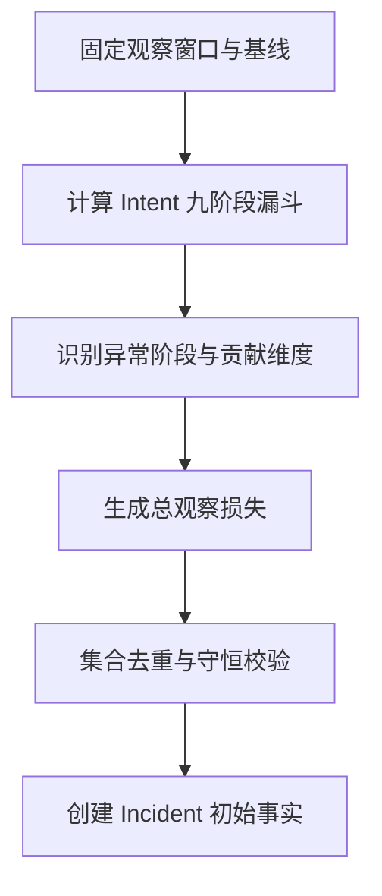

# 04 转化异常检测与确定性损失账本

> 优先级：P0｜黄金案例位置：确定“哪里下降、损失多少”，但暂不解释根因。

## 1. 模块定位

本模块是确定性事实层的核心。它把原始事件转换成异常 Incident 的初始事实，为 Agent 提供固定的问题范围和损失上限。

## 2. 一句话结论

PayTrace 用代码比较基线与观察窗口，定位九阶段漏斗变化并建立购买意图损失账本；LLM 只能调查原因，不能自行统计或分配损失。

## 3. 第一性原理

损失数值必须可复算、守恒和去重，而根因可能多解。能由 SQL、集合运算和规则确定的事实，应留在确定性系统；让模型算订单、金额或比例，会引入不可控舍入、遗漏和重复归因。

## 4. 核心业务对象

核心公式：

```text
总观察损失
= 基线预期完成的有效购买意图
− 观察窗口实际完成的有效购买意图
```

损失账本表达：

```text
总观察损失
= 有充分证据的技术失败
+ 有证据的支付决策摩擦
+ 数据质量影响
+ 暂无法解释部分
```

这里的分类不是 Agent 自由分配比例。每项必须绑定确定性对象集合或可验证集合摘要，并使用相同窗口、基线和损失单位。

## 5. 正常业务与技术流程



黄金案例中，系统先确认购买意图数量没有同比例下降，再发现认证阶段和结果回写阶段变化显著。此时只能说损失集中在哪些阶段，不能直接断言具体根因。

## 6. 关键问题和故障场景

- 基线受节假日、活动、渠道切换或流量结构变化影响。
- 分母变化导致成功率下降但绝对完成量未异常，或反之。
- 漏斗阶段自然流失相加后超过最终购买意图损失。
- 同一 Intent 先认证失败、后回调异常，被两个 Claim 重复计损。
- 不同币种金额直接汇总，金额口径不一致。
- Benefit Gap 只说明存在更优可用价格，不证明用户因此放弃。
- 数据延迟让当前窗口看似下降。

## 7. 解决方案、优化与长期预防

Incident 创建时冻结观察窗口、基线、指标定义和数据快照。系统同时输出绝对量、比率、覆盖率和贡献维度，并将阶段损失统一映射到最终 Purchase Intent 集合。

每个 Claim 保存影响对象集合或稳定摘要；跨阶段传播的同一失败只计一次；所有归因损失之和不得超过总观察损失。剩余无法拆分部分保留为 UNKNOWN。

Benefit Gap 需要和支付选项曝光、取消、重下单、方式切换及最终恢复组合，才能成为决策摩擦证据。

## 8. 钢人比较

固定阈值告警简单、稳定、解释成本低；统计检测能处理季节性；人工 SQL 对一次性问题灵活。PayTrace MVP 不追求复杂异常算法，而强调指标口径、对象集合和损失守恒。只有误报主要来自季节性或多维基线时，才值得引入更复杂模型。

## 9. 逆向检查

即使异常检测命中，仍可能是埋点延迟、分母切换、版本发布改变事件语义或基线本身异常。即使各 Claim 都有证据，集合重叠仍会让总归因超过实际损失。

最快让系统失败的方法是使用不同窗口、不同分母和不同币种计算各个根因，再把数字直接相加。

## 10. 边际决策

优先保证购买意图完成率、阶段转化、覆盖率和维度下钻可复算。复杂预测、实时流式异常和全自动基线选择暂缓。下一项投入应优先减少重复计损与数据误报，而不是增加更多异常算法。

## 11. 面试标准回答

### 20 秒

我把损失计算留在确定性代码里：固定观察窗口和基线，按 Purchase Intent 计算九阶段漏斗，用集合去重和守恒检查确定总损失。Agent 只调查原因，不自行算损失。

### 60 秒

异常发生后，系统先冻结窗口、基线、指标口径和数据快照，比较有效购买意图在九阶段的变化，并按地区、币种、支付方式、渠道和版本下钻。总观察损失以基线预期完成 Intent 减实际完成 Intent 计算。各根因只能从确定性工具取得对象集合，跨阶段传播的同一 Intent 只计一次，归因总额不能超过观察损失，剩余部分保留为未知。这解决了模型统计不稳定和多根因重复计损问题。

### 深度版本

继续说明基线选择、分母与绝对量、Benefit Gap 因果边界、集合摘要、币种口径、数据质量 Incident，以及复杂异常模型的引入门槛。

## 12. 高频追问

**问：基线怎么选？** 当前可以使用历史基线或对比窗口，但必须和 Incident 一起固定并版本化。真实生产中还需按星期、活动和流量结构校准；未验证前不能宣称基线完全可靠。

**问：为什么不用 LLM 算损失？** 数值需要确定性、可复算和守恒。LLM 适合选择调查路径和解释证据，不适合作为财务或统计计算器。

**追问：两个根因共同影响一个 Intent 怎么办？** 保存对象集合，检查交叉。能够拆分则按明确规则去重，不能拆分则降级为 PARTIAL 或保留联合影响，不能重复相加。

**问：优惠差额能证明流失原因吗？** 不能。它只说明用户实际选择和可用最低价之间存在差额，还需结合曝光、取消、切换和恢复行为。

## 13. 最短恢复脚本

> 固定窗口 → Intent 漏斗 → 阶段维度 → 对象集合 → 去重守恒 → 未知剩余

## 14. 闭卷自测

1. 总观察损失的首要单位是什么？
2. 为什么各阶段自然流失不能直接相加？
3. 如何防止两个 Claim 重复计损？
4. 基线可能受到哪些因素污染？
5. Benefit Gap 为什么不是因果证据？
6. 数据延迟应该怎样处理？
7. 什么时候值得使用复杂异常算法？

## 15. 与其他模块的连接

本模块使用 [03](03-PurchaseIntent事件模型与数据契约.md) 的事实和分母，将 Incident 交给 [05](05-Incident与七类只读调查工具.md)，由 [07](07-证据契约多根因诊断与人工复核.md)检查 Claim 损失是否守恒，并由 [09](09-故障注入Ground-Truth与自动Eval.md)评测阶段定位和 Loss Attribution MAE。

