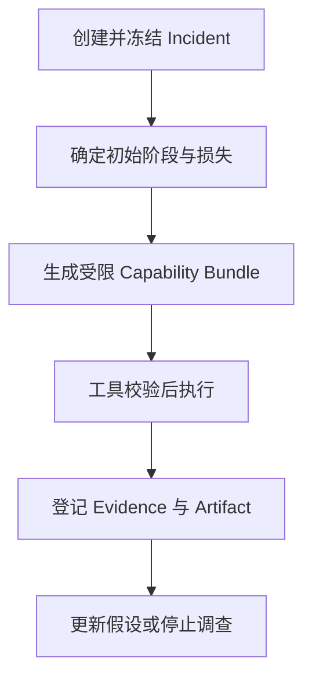

# 05 Incident 与七类只读调查工具

> 优先级：P0｜黄金案例位置：冻结问题范围，并取得认证失败与 Webhook 延迟的可引用证据。

## 1. 模块定位

本模块连接确定性分析和 Agent 调查。Incident 定义“调查什么”，工具定义“允许怎样查”，Evidence 记录“实际查到了什么”。

## 2. 一句话结论

PayTrace 不让 Agent 自由查库，而把支付诊断封装成七类只读工具；所有调用必须绑定同一 Incident 的窗口、范围、权限和预算。

## 3. 第一性原理

Agent 需要信息才能诊断，但任意 SQL、任意网络和完整明细会带来越权、口径漂移和上下文爆炸。正确边界不是在 Prompt 中说“谨慎查询”，而是用工具 Schema、Incident 范围和后端权限提供最小能力。

## 4. 核心业务对象

Incident 保存观察窗口、基线、异常指标、影响范围、数据快照、严重度、调查状态和诊断版本。主状态：

```text
DETECTED → INVESTIGATING → ACTION_REQUIRED → MONITORING → RESOLVED
```

无法完整调查时进入 `PARTIAL` 或 `FAILED`，不能伪装完成。

七类只读工具：

| 工具 | 解决的业务问题 |
|---|---|
| `get_payment_funnel` | 哪个阶段开始流失 |
| `breakdown_conversion_loss` | 相比基线少完成多少 Intent |
| `compare_dimensions` | 哪些地区、币种、方式、渠道、版本贡献最大 |
| `analyze_benefit_gap` | 是否存在支付选择与优惠摩擦 |
| `trace_cancel_and_reorder` | 取消后是否重下单、换方式并恢复 |
| `inspect_payment_events` | 认证、渠道、回调和状态事件发生了什么 |
| `get_config_changes` | 同期有哪些活动、路由、风控和版本变更 |

## 5. 正常业务与技术流程



工具返回结构化摘要、数据质量和 Evidence 引用，大结果保存为 Artifact。模型只看到必要统计和样例，不直接承载完整订单集合。

## 6. 关键问题和故障场景

- Agent 使用和 Incident 不同的时间窗口或基线。
- compare_dimensions 进行高基数下钻，造成慢查询和上下文膨胀。
- 工具执行失败但模型仍引用预期结果。
- 查询结果被截断或采样，模型却输出精确损失。
- 配置变更与异常同时发生，被误写成因果。
- 全部工具一次性交给模型，增加误调用和重复调用。
- 允许任意 SQL 后，租户权限和字段脱敏失效。

## 7. 解决方案、优化与长期预防

Before Tool 校验参数 Schema、Incident 范围、Capability Bundle、数据权限、预算和超时；失败直接阻断。After Tool 记录 call_id、query fingerprint、result hash、快照和质量状态，再生成 Evidence。

Harness 根据初始信号只开放必要能力。例如认证异常优先开放事件、地区和版本下钻；Webhook 异常优先检查回调、签名、乱序和状态回写。数据完整性不足时停止根因调查，转为数据质量 Incident。

## 8. 钢人比较

直接 SQL 对资深工程师最灵活，BI 对运营最易用，固定 Workflow 最可预测。七类工具牺牲部分自由度，换取统一口径、权限、可测试性和证据登记。若工具覆盖率不足，应补充领域工具，而不是立即开放任意 SQL。

## 9. 逆向检查

即使工具全部返回 200，仍可能查错快照、返回空结果、发生截断、数据质量不足或权限过滤后样本偏差。即使模型选择了正确工具，也可能重复调用、忽略反证或在证据已经充分后继续消耗预算。

## 10. 边际决策

先保证七类核心工具的契约、错误语义和结果可复算，再优化自然语言描述和工具选择。新增工具必须能改变诊断决策或补足关键证据；仅返回更多信息但不能验证假设的工具暂缓。

## 11. 面试标准回答

### 20 秒

我把诊断数据封装为七类只读业务工具，不允许 Agent 任意查库。工具调用绑定 Incident 范围和权限，成功结果登记为 Evidence，大结果外置为 Artifact。

### 60 秒

异常生成 Incident 后，系统冻结窗口、基线、数据快照和影响范围，再根据初始信号开放受限 Capability Bundle。七类工具分别负责漏斗、损失、维度、优惠、取消重下单、支付事件和配置变更。Before Tool 校验参数、范围和权限，After Tool 登记 Evidence、Hash 和质量状态。这样 Agent 可以灵活调查，但不能越权、改变口径或把失败调用写成证据。

### 深度版本

继续说明工具 Schema、幂等只读重试、Artifact、查询预算、截断语义、租户/字段权限、Early-Exit，以及为何业务工具优于任意 SQL。

## 12. 高频追问

**问：为什么不是 MCP 或 Text-to-SQL？** MCP 是能力暴露协议，不能自动解决业务口径和权限。PayTrace 关注的是受控业务工具契约；是否通过 MCP 暴露属于实现选择。

**问：七类工具不够怎么办？** 先用 Bad Case 证明缺失证据，再增加最小领域工具和评测。不能为了覆盖未知问题直接开放全库。

**追问：工具失败后 Agent 怎么办？** 明确返回失败类型。可重试的只读错误有限重试；仍失败则保留 missing_data，将 Claim 降级或转人工，不允许伪造结果。

**问：配置变更为什么不能直接当根因？** 时间相关只能支持假设，还要检查受影响范围、事件变化、对照组和替代解释。

## 13. 最短恢复脚本

> Incident 冻结 → 能力路由 → Before 校验 → 只读工具 → Evidence → Artifact

## 14. 闭卷自测

1. Incident 必须冻结哪些信息？
2. 七类工具分别解决什么问题？
3. 为什么不开放任意 SQL？
4. Before Tool 和 After Tool 各做什么？
5. 截断结果为什么不能支持精确损失？
6. 数据质量异常时应继续调查吗？
7. 新增工具的判断标准是什么？

## 15. 与其他模块的连接

本模块接收 [04](04-转化异常检测与确定性损失账本.md) 的 Incident 初始事实，由 [06](06-单诊断Agent与Diagnostic-Harness.md)编排调用，生成的 Evidence 交给 [07](07-证据契约多根因诊断与人工复核.md)，失败与恢复由 [08](08-失败语义异步恢复与可观测性.md)负责。

