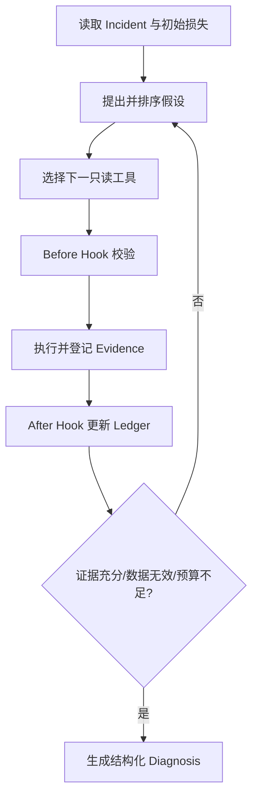

# 06 单诊断 Agent 与 Diagnostic Harness

> 优先级：P0｜黄金案例位置：在认证、Webhook 和干扰线索之间逐步验证多个假设。

## 1. 模块定位

本模块解释 PayTrace 为什么使用单个受控诊断 Agent，以及 Harness 如何把开放式模型调用变成有状态、有预算、可回放的调查过程。

## 2. 一句话结论

Diagnostic Harness 通过 Before/After Tool Hook、Hypothesis Ledger、Capability Routing 和 Early-Exit 管理单 Agent；Prompt 表达调查意图，代码决定权限、状态和停止边界。

## 3. 第一性原理

根因调查存在不确定性：下一步查什么取决于上一份证据。但支付数据的权限、数值和证据资格必须确定。固定 Workflow 难覆盖所有分支，完全自主 Agent 又容易越权、失忆和循环，因此需要“有限自主”：模型选择调查路径，Harness 管理执行边界。

## 4. 核心业务对象

Agent State 至少保存：

```text
incident_scope
observed_loss
localized_stages
hypotheses
validated_evidence
rejected_hypotheses
alternative_explanations
missing_data
remaining_budget
```

Hypothesis Ledger 节点包含根因类型、影响范围、支持与冲突证据、替代解释、下一工具、状态和损失范围。

状态流：

```text
PROPOSED → INVESTIGATING → SUPPORTED / PARTIAL / REJECTED / NEEDS_DATA
```

## 5. 正常业务与技术流程



每次工具调用必须服务于待验证假设、替代解释或数据质量问题。已被否定的假设没有新证据时不得重复调查。

## 6. 关键问题和故障场景

- 模型最早看到认证错误后过早锁定单根因。
- 完整明细进入上下文，挤掉已验证假设和关键约束。
- 多轮调查后忘记反证，重复调用相同工具。
- 把全部七类工具同时暴露，增加错误选择和成本。
- 达到足够证据后仍继续调用，增加延迟和新噪声。
- 最终答案碰巧正确，但跳过必要状态核验，形成危险假阳性。
- 模型调用超时，工具可能已经执行，恢复时再次调用。

## 7. 解决方案、优化与长期预防

Before Hook 校验工具、参数、范围、权限和预算；After Hook 登记 Evidence、外置 Artifact、更新 Hypothesis Ledger，并检查 Early-Exit。Harness 保存模型、Prompt、工具、数据和 Trace 版本。

Capability Routing 根据初始阶段和质量信号，只开放能改变当前判断的工具。Early-Exit 在三种情况下结束：证据足以支持结论；数据已证明不可信；剩余预算无法改变结论。结束不等于强行给根因，允许返回 NEEDS_DATA 或 UNKNOWN。

## 8. 钢人比较

固定 Workflow 的稳定性和测试性最强，适合已知故障树；One-shot 最便宜；多 Agent 可分离专业角色并行处理。PayTrace 选择单 Agent，是因为当前主线集中、共享 Incident 和证据较多，多 Agent 会增加协调、重复查询和评测难度。只有任务可独立并行、单上下文明显拥挤且分别可评测时，才考虑拆分。

## 9. 逆向检查

即使 Agent 最终答对，也要检查：是否读到 Ground Truth，是否跳过关键工具，是否引用失败调用，是否存在循环，是否把已否定假设重新写入报告，是否超预算，是否在不同快照之间混用证据。

最终答案正确但轨迹危险，仍应判失败。

## 10. 边际决策

先做好单 Agent、少量工具、有状态调查和确定性门禁。优化顺序是：减少无效调用 → 改善工具信息量 → 调整上下文 → 调整 Prompt/模型。没有评测证据前，不增加 Case Memory、多 Agent 或自动 Prompt 优化。

## 11. 面试标准回答

### 20 秒

PayTrace 使用单诊断 Agent，但不让它自由探索。Harness 用 Hook 校验工具调用，用 Hypothesis Ledger 管理假设，用能力路由和 Early-Exit 控制范围与成本。

### 60 秒

支付异常可能有多根因，固定 Workflow 很难覆盖所有证据分支，但完全自主 Agent 又容易越权、失忆和循环。我做了 Diagnostic Harness：Agent 根据当前 Incident 提出假设并选择七类只读工具；Before Hook 检查 Schema、权限、范围和预算，After Hook 登记 Evidence、外置大结果并更新 Hypothesis Ledger。已否定假设不会无依据重查，证据充分、数据无效或预算不足时提前结束，证据不足就返回 NEEDS_DATA/UNKNOWN。

### 深度版本

继续讲 Agent State、假设 DAG、Capability Bundle、信息增益、Trace 版本、工具失败恢复、结果正确但轨迹危险，以及单 Agent 和多 Agent 的演进门槛。

## 12. 高频追问

**问：这和普通 Tool Calling 有什么区别？** 普通 Tool Calling 只解决模型能调用工具；Harness 还管理权限、范围、证据登记、调查状态、预算、恢复和报告校验。

**问：如何选择下一工具？** 目标是最大化对当前假设的区分能力，同时考虑成本和依赖。当前实现/设计通过 Hypothesis Ledger 和 Capability Routing限制候选，具体信息增益效果需用轨迹评测验证。

**追问：如何防循环？** 保存标准化调用指纹、已验证/已否定假设和剩余预算；相同范围重复调用需有新理由，否则阻断或提前结束。

**问：为什么不是多 Agent？** 当前任务共享同一 Incident、工具和证据，单 Agent 更易保证口径和 Eval。多 Agent 的协作成本目前高于专业分工收益。

## 13. 最短恢复脚本

> 单 Agent → Hook 边界 → 假设账本 → 能力路由 → Evidence → Early-Exit

## 14. 闭卷自测

1. 固定 Workflow 与自主 Agent 各有什么优势？
2. Harness 比 Tool Calling 多了哪些职责？
3. Hypothesis Ledger 保存什么？
4. 什么情况下可以 Early-Exit？
5. 如何防止模型重复调查？
6. 为什么答案正确仍可能判失败？
7. 何时才值得引入多 Agent？

## 15. 与其他模块的连接

Harness 编排 [05](05-Incident与七类只读调查工具.md) 的能力，将结果交给 [07](07-证据契约多根因诊断与人工复核.md)校验；任务中断由 [08](08-失败语义异步恢复与可观测性.md)恢复，路径质量由 [09](09-故障注入Ground-Truth与自动Eval.md)的 Trajectory Evaluation 评测。

