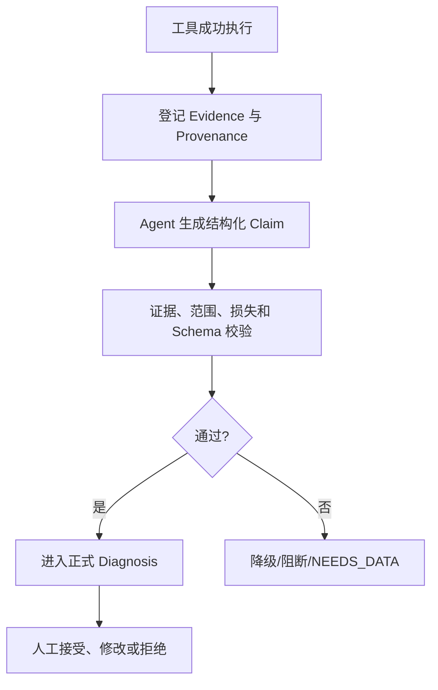

# 07 证据契约、多根因诊断与人工复核

> 优先级：P0｜黄金案例位置：分别证明认证失败和 Webhook 延迟，并阻止干扰线索成为无依据根因。

## 1. 模块定位

本模块是 PayTrace 的核心差异化。它把自然语言报告转换为可校验的 Claim、Evidence 和 Artifact，并明确结论强度、未知部分与人工责任。

## 2. 一句话结论

模型说“根据数据显示”不算证据；只有成功工具调用生成、可复算且属于当前 Incident 的 Evidence，才能支持正式 Claim。

## 3. 第一性原理

支付诊断的危险不是模型完全答不出来，而是输出一个足够合理、却无法验证的因果解释。Prompt 只能劝模型谨慎，不能证明引用存在、窗口一致或损失没有重复。证据要求必须由代码执行。

## 4. 核心业务对象

```text
Claim
├── root_cause_type
├── affected_scope
├── window_and_baseline
├── loss_estimate_and_unit
├── evidence_ids
├── alternative_explanations
├── missing_data
└── SUPPORTED / PARTIAL / UNKNOWN
```

Evidence 绑定 Incident、工具调用、标准化参数、查询指纹、结果 Hash、数据快照、工具版本、对象集合摘要、完整性和 Artifact。Artifact 保存大规模明细；它不是 Claim，只有经过工具和数据校验登记后才具有证据资格。

## 5. 正常业务与技术流程



黄金案例生成两个 Claim：认证失败与 Webhook 延迟。每个 Claim 绑定不同对象集合；交叉部分必须去重。优惠或配置变化若只有时间相关性，只能保留为替代解释。

## 6. 关键问题和故障场景

- Evidence ID 不存在、属于其他 Incident 或工具实际失败。
- Claim 和 Evidence 的窗口、基线、币种或维度不同。
- 结果被截断，却输出精确影响集合。
- 两个根因覆盖同一 Purchase Intent，损失重复相加。
- 模型用错误率上升、Benefit Gap 或配置变更直接证明因果。
- 证据互相冲突，报告却只选择支持自己假设的部分。
- 数据不足时仍输出确定性结论。

## 7. 解决方案、优化与长期预防

正式报告至少通过以下门禁：Evidence 存在且属于当前 Incident；工具执行和质量检查成功；窗口、范围、口径和数据快照兼容；损失能复算；Claim 集合不重复；总归因不超观察损失；Ground Truth 未泄漏；冲突与缺失被暴露；输出符合 Schema；没有证据的因果结论被阻断。

支持状态：`SUPPORTED` 表示多项一致证据；`PARTIAL` 表示仍有替代解释或数据缺口；`UNKNOWN` 表示当前无法判断。`NEEDS_DATA` 是调查动作状态，说明还缺哪些数据以及怎样取得。

人工可以接受、修改或拒绝 Claim，补充证据和处置动作。AI 提供决策材料，不替代最终支付配置变更责任。

## 8. 钢人比较

自然语言报告更灵活、开发快；引用日志链接已经能满足很多人工排查；严格契约增加 Schema、存储和校验成本。PayTrace 只有在结论要复核、比较版本、量化损失或服务高风险业务时才值得承担该成本。非关键建议可以使用较轻引用机制。

## 9. 逆向检查

即使所有 Claim 都绑定 Evidence，仍可能出现“证据真实但推理无效”：样本范围不代表总体、配置变更只是共时、结果已经过期、关键反证未查询、同一对象在集合摘要碰撞、人工修改后未保留版本。

因此证据契约保证的是可追溯和基本一致性，不自动等于因果证明。

## 10. 边际决策

首先对根因、影响范围和损失数字设置硬门禁；对建议文本和表达质量使用较软 Rubric。不要试图一次建立通用知识图谱。新增门禁应来自真实 Bad Case，并进入 Regression Set。

## 11. 面试标准回答

### 20 秒

PayTrace 用证据契约约束报告：每个根因 Claim 必须绑定当前 Incident 的 Evidence，并通过窗口、范围、复算、去重和 Schema 校验；证据不足就输出 PARTIAL 或 UNKNOWN。

### 60 秒

Agent 很容易写出合理解释，但 Prompt 无法保证证据真实。我的做法是让每次成功工具调用登记 Evidence，保存参数指纹、结果 Hash、数据快照、对象集合和 Artifact。Agent 输出结构化 Claim 后，代码检查 Evidence 归属、窗口口径、损失复算、Claim 交叉和总损失守恒。认证失败和 Webhook 延迟可以同时成为根因，但重复影响的 Intent 只能算一次；只有相关性的数据保留为替代解释。最后由人工接受、修改或拒绝。

### 深度版本

继续说明十道门禁、Provenance、集合摘要、Schema、支持状态、因果边界、人工版本和“正确答案但危险过程”。

## 12. 高频追问

**问：Evidence 和普通日志有什么区别？** 日志是原始记录；Evidence 是针对特定 Incident、窗口和口径，由成功工具调用生成并登记来源的可引用事实。

**问：为什么要保存 result hash？** 用于确认报告引用的结果没有被静默修改，并支持复现和版本比较；它不能替代原始 Artifact 和数据快照。

**追问：Evidence 真实就代表根因正确吗？** 不代表。证据可能只支持相关性，所以 Claim 还需说明替代解释、缺失数据和支持状态。

**问：UNKNOWN 会不会降低产品价值？** 相反，它防止系统在高风险业务中制造虚假确定性，同时告诉用户下一步需要什么数据。

## 13. 最短恢复脚本

> Claim → Evidence → Provenance → 复算去重 → 支持状态 → 人工复核

## 14. 闭卷自测

1. Evidence 与日志、Artifact 有何区别？
2. 正式 Claim 至少包含哪些字段？
3. 哪些校验必须由代码完成？
4. SUPPORTED、PARTIAL、UNKNOWN 如何区分？
5. NEEDS_DATA 表达什么？
6. 为什么相关性不等于因果？
7. 人工修改报告后需要保留什么？

## 15. 与其他模块的连接

Evidence 来自 [05](05-Incident与七类只读调查工具.md)，Claim 由 [06](06-单诊断Agent与Diagnostic-Harness.md)组织；[04](04-转化异常检测与确定性损失账本.md)提供损失上限，[08](08-失败语义异步恢复与可观测性.md)保证证据创建可恢复，[09](09-故障注入Ground-Truth与自动Eval.md)评测证据准确性与无依据结论率。

