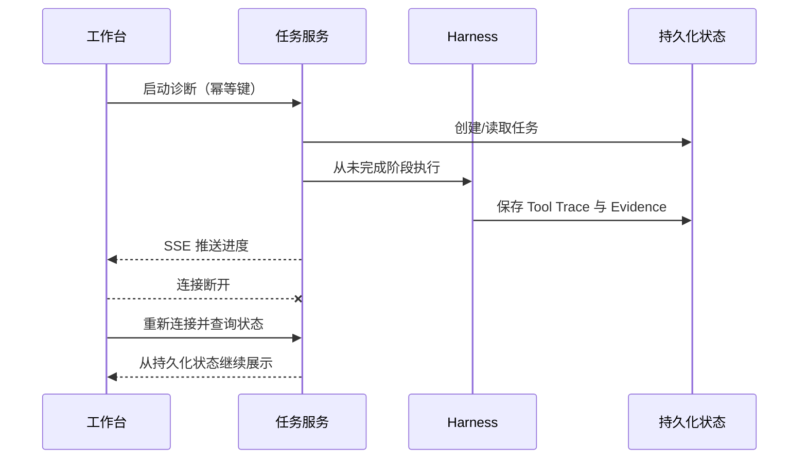

# 08 失败语义、异步恢复与可观测性

> 优先级：P1｜黄金案例位置：处理查询超时、模型中断、Webhook 延迟和前端断线，而不重复证据或隐藏失败。

## 1. 模块定位

本模块保证诊断过程可识别失败、隔离影响、恢复状态和完整审计。它同时覆盖支付业务的异步性与 Agent 长任务的异步性。

## 2. 一句话结论

PayTrace 不追求“永不失败”，而是让工具、模型、数据和任务失败都有明确语义；恢复依据持久化业务状态和 Trace，而不是依据前端连接或模型记忆。

## 3. 第一性原理

前端断开不等于任务停止，模型超时不等于工具未执行，HTTP 200 也不等于业务完成。恢复必须查询权威状态；只读操作可有限重试，创建 Incident、Evidence 和报告等写入必须幂等。

## 4. 核心业务对象

| 状态/记录 | 作用 | 权威来源 |
|---|---|---|
| Incident 状态 | 业务调查生命周期 | PostgreSQL 中的业务记录 |
| 任务阶段 | 当前执行到哪一步 | 持久化任务状态 |
| Tool Trace | 调用了什么、结果如何 | Harness 运行记录 |
| Evidence | 哪些工具结果已正式登记 | Evidence 表与唯一键 |
| SSE 事件 | 向前端展示进度 | 非权威传输通道 |

每次运行同时记录场景、数据、模型、Prompt、工具、代码和诊断版本。

## 5. 正常业务与技术流程

## 6. 关键问题和故障场景

- 工具超时但底层查询已经完成，重试生成重复 Evidence。
- LLM 超时发生在工具完成后、状态保存前，恢复位置不明确。
- 单个维度查询失败，整个诊断被错误标记成功或全部丢弃。
- Artifact 落盘失败导致完整结果不可审计。
- SSE 断线后前端认为任务失败并重复提交。
- Evidence 校验失败却被业务层吞掉。
- Ground Truth 隔离异常仍继续计算评测分数。

## 7. 解决方案、优化与长期预防

只读查询只对明确的瞬时错误有限重试，并使用标准化调用指纹去重。写入以业务幂等键、唯一约束和条件状态更新保证“多次请求、一次效果”。恢复前先查询 Incident、任务、Trace 和 Evidence 权威状态。

部分失败矩阵：单维度超时可使用已有证据并标记未验证；明细截断只能支持趋势；数据质量不足停止根因归因；LLM 超时从持久化阶段恢复；Evidence 校验失败阻断对应 Claim；Ground Truth 隔离失败使整次 Eval 作废。

读侧 Artifact 外置失败时可在容量允许时透传原文并标记降级；参数、权限、证据和写侧失败必须阻断。

## 8. 钢人比较

同步请求实现最简单，短诊断无需任务系统；整单重跑代码少、容易理解；消息队列适合大规模异步。PayTrace 当前用任务状态机和 SSE 即可覆盖长任务与断线恢复。只有任务量、削峰、跨服务消费和可靠投递需求明确后，才值得引入更重基础设施。

## 9. 逆向检查

即使恢复后报告一致，也要检查工具是否被重复执行、证据是否重复登记、任务版本是否变化、前一次模型输出是否部分写入、SSE 是否乱序、失败原因是否被后续成功覆盖。

最危险的情况不是任务失败，而是失败被标记成成功，使下游把不完整报告当作正式事实。

## 10. 边际决策

先保证状态持久化、唯一键、显式错误、断线重连和关键 Trace。暂不为了“生产级”引入复杂工作流引擎。观测指标先覆盖工具成功率、失败类型、重复调用、P95、Token 和恢复位置。

## 11. 面试标准回答

### 20 秒

诊断是长任务，前端连接和模型上下文都不是权威状态。我持久化任务阶段、工具结果、Evidence 和失败原因，SSE 只推送进度；恢复前先查状态，避免重复执行。

### 60 秒

PayTrace 同时面对支付异步回调和 Agent 长任务。模型超时不代表工具没执行，前端断线也不应终止任务。因此系统持久化 Incident、任务阶段、Tool Trace 和 Evidence，创建记录使用幂等键和唯一约束，恢复时从权威状态判断下一步。只读瞬时错误有限重试，参数、权限和证据错误直接阻断；部分工具失败则降级 Claim 强度而不是伪装完整成功。SSE 只负责展示，不承担状态保存。

### 深度版本

继续说明业务幂等键与 ToolCallID 区别、checkpoint 与权威查询、条件更新、调用指纹、部分失败矩阵、Trace 版本和消息队列引入门槛。

## 12. 高频追问

**问：ToolCallID 能当业务幂等键吗？** 不能。它只标识一次模型工具调用；业务幂等键应来自稳定的任务、工具、标准化参数和版本语义。

**问：Checkpoint 后为什么还要查业务状态？** Checkpoint 只能说明编排记录到哪里，不能证明外部或数据库副作用是否完成。恢复前要查询 Evidence 和业务记录。

**追问：SSE 断线怎么办？** 任务继续运行，前端重连后先查询持久化状态，再订阅后续事件；不能因为丢失进度消息重复启动任务。

**问：什么时候返回 PARTIAL？** 已有合法证据能支持部分结论，但某些维度或工具失败，且剩余结果不会被误解为完整诊断时。

## 13. 最短恢复脚本

> 状态权威 → 只读重试 → 写入幂等 → 部分失败 → Trace → SSE 非权威

## 14. 闭卷自测

1. 为什么模型超时不等于工具没执行？
2. 恢复前需要查询哪些权威状态？
3. ToolCallID 与业务幂等键有何区别？
4. SSE 为什么不能保存任务状态？
5. 哪些错误可以降级，哪些必须阻断？
6. 如何防止重复 Evidence？
7. 什么时候才需要消息队列或工作流引擎？

## 15. 与其他模块的连接

本模块保障 [06](06-单诊断Agent与Diagnostic-Harness.md)和 [07](07-证据契约多根因诊断与人工复核.md)的运行可靠性；支付回调语义来自 [02](02-支付九阶段链路与状态事实.md)，Trace 和失败数据进入 [09](09-故障注入Ground-Truth与自动Eval.md)，工程实现落到 [10](10-系统架构安全边界与生产化演进.md)。

