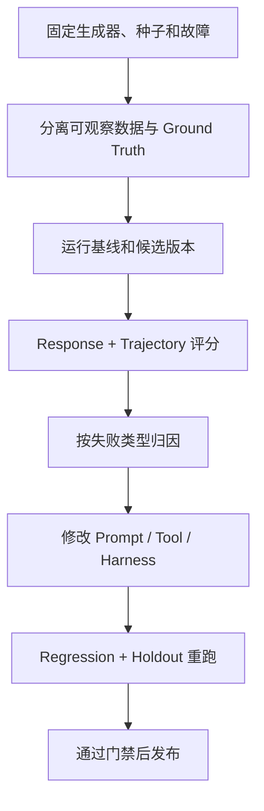

# 09 故障注入、Ground Truth 与自动 Eval

> 优先级：P0｜黄金案例位置：隐藏认证和 Webhook 根因，分别评测最终结论与调查轨迹。

## 1. 模块定位

本模块回答“如何证明 PayTrace 有效”。它将模拟数据、故障注入、隔离 Ground Truth、版本对照和发布门禁连接成持续回归闭环。

## 2. 一句话结论

没有 Ground Truth 的漂亮报告无法证明诊断正确；PayTrace 用固定种子生成可回放场景，隔离真实注入标签，同时评测 Response 和 Trajectory。

## 3. 第一性原理

Agent 输出具有随机性，仅看一次 Demo 容易挑中幸运样本。真实支付数据又敏感、根因标签稀缺。因此当前最诚实的验证方式是构造已知故障、隐藏答案、重复运行并比较版本，同时明确离线模拟不能替代生产验证。

## 4. 核心业务对象

场景由随机种子、数据生成器版本和故障配置共同确定。Ground Truth 保存真实故障、影响对象和预期损失，只向评测器开放。

数据集分层：

| 集合 | 用途 |
|---|---|
| Development | 日常开发和 Prompt 调试 |
| Regression | 每次变更后的固定回归 |
| Holdout | 不参与调试的新组合 |
| Adversarial | 冲突证据、数据缺失、干扰线索、越权场景 |

版本对照：规则模板 → One-shot → Tool Calling → Harness；Case Memory 只有离线 A/B 证明有效后才进入主链路。

## 5. 正常业务与技术流程

黄金案例中，Agent 只能看到九阶段事件、指标、配置和工具证据，不能读取“认证失败”和“Webhook 延迟”标签及受影响对象。

## 6. 关键问题和故障场景

- Ground Truth 通过字段名、文件路径、工具返回或 Prompt 泄漏。
- 只在 Development Set 调参，形成样例过拟合。
- 只评最终答案，忽略越权、循环和危险捷径。
- 使用 LLM Judge，但没有人工校准，评分本身漂移。
- 只看平均分，P0 回归被其他简单样例掩盖。
- 只记录 pass@k，掩盖同一场景多次运行不稳定。
- 模拟分布过于整齐，不能代表真实噪声。

## 7. 解决方案、优化与长期预防

核心指标包括 Stage Localization Accuracy、Root Cause Multi-label F1、Loss Attribution MAE、Evidence Precision/Recall、Unsupported Claim Rate、Unknown Calibration、工具成功率/效率、P95 和 Token。它们分别回答定位、根因、损失、证据、未知、可靠性和成本问题。

同时评测：

- Response：阶段、根因、损失、范围、支持状态、替代解释和建议；
- Trajectory：工具选择、前置条件、重复/循环、失败降级、Evidence 使用和停止条件。

评分器组合确定性规则、Rubric Judge 与人工校准。P0 门禁包括 Ground Truth 泄漏、无证据根因、重复计损、数据不足却强结论、越权读取/写入和关键回归退化。

## 8. 钢人比较

人工专家评审更接近真实价值，生产 A/B 能直接验证业务收益，静态单测最快最稳定。故障注入的优势是可控、可重复、有精确标签；缺点是模拟偏差。正确路径不是用模拟取代生产，而是开发期先用模拟防回归，试点后再把脱敏真实 Bad Case 回流。

## 9. 逆向检查

即使分数提高，也可能来自标签泄漏、Judge 偏好长答案、Prompt 记住固定场景、候选版本增加大量工具调用换准确率，或只在平均值上改善但尾部场景退化。

虚假高分比低分危险，因此泄漏、权限和 P0 回归必须硬失败。

## 10. 边际决策

先建立少量高价值场景，覆盖单根因、多根因、无异常、数据质量和对抗，再增加数量。下一步优先修复出现频率高、业务风险大的失败类型，而不是追求更多指标。在线 Eval、真实数据回流和 Case Memory 等待企业试点与隐私条件成熟。

## 11. 面试标准回答

### 20 秒

我用固定种子和故障注入生成带隐藏 Ground Truth 的支付场景，同时评测最终报告和工具轨迹；版本必须通过 Regression、Holdout 和 P0 门禁，不能靠一次 Demo 证明有效。

### 60 秒

支付根因标签难获得，项目又不能公开真实卡和商户数据，所以我把模拟生成器作为评测基础设施。每个场景由种子、生成器版本和故障配置确定，Ground Truth 只给评测器，Agent 只能看正常业务可观察数据。我把数据分成 Development、Regression、Holdout 和 Adversarial，比较规则、One-shot、Tool Calling 和 Harness。除了阶段、根因和损失，还评 Evidence、UNKNOWN、工具轨迹、稳定性、延迟和成本。泄漏、无证据结论和重复计损属于硬门禁。

### 深度版本

继续说明 pass@k 与 pass^k、Judge 人工校准、场景过拟合、Response/Trajectory 区别、失败分类和从生产 Trace 回流真实 Bad Case 的未来路径。

## 12. 高频追问

**问：模拟数据有什么意义？** 它可以验证已知场景上的正确性、门禁和版本相对表现，并稳定复现边界；不能证明真实商户收益或完全覆盖真实分布。

**问：pass@k 和 pass^k 有什么区别？** pass@k 是 k 次至少一次成功，偏能力上限；pass^k 是 k 次全部成功，偏连续可靠性。支付诊断更看重后者。

**追问：为什么不能只用 LLM-as-Judge？** Judge 适合语义质量，但会受模型偏好影响。阶段、损失、Evidence、权限和泄漏应优先用确定性评分，Judge 需要人工校准。

**问：指标提高就能发布吗？** 不能。若无依据结论、延迟、成本或 P0 场景退化，平均分提高也可能不值得发布。

## 13. 最短恢复脚本

> 固定场景 → 隔离 GT → 版本对照 → 双重 Eval → pass^k → P0 门禁

## 14. 闭卷自测

1. 为什么需要故障注入？
2. Ground Truth 如何隔离？
3. 四类数据集分别做什么？
4. Response 与 Trajectory 各评什么？
5. pass@k 与 pass^k 有何区别？
6. 哪些指标适合确定性评分？
7. 模拟评测不能证明什么？

## 15. 与其他模块的连接

场景复用 [02](02-支付九阶段链路与状态事实.md)和 [03](03-PurchaseIntent事件模型与数据契约.md)的数据契约，评分 [04](04-转化异常检测与确定性损失账本.md)的损失、[06](06-单诊断Agent与Diagnostic-Harness.md)的轨迹和 [07](07-证据契约多根因诊断与人工复核.md)的 Claim。最终结果为 [11](11-简历证据边界与项目模拟面试.md)提供 E2 证据。

