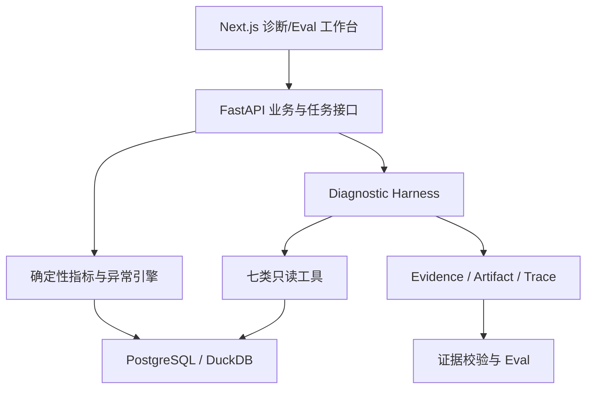

# 10 系统架构、安全边界与生产化演进

> 优先级：P1｜黄金案例位置：让模拟事件、确定性分析、Agent、证据、工作台和 Eval 形成可交付系统。

## 1. 模块定位

本模块解释代码和基础设施如何承载前九个业务模块，并回答当前 MVP 为什么不需要重型架构、未来真实企业接入需要补哪些边界。

## 2. 一句话结论

PayTrace 用 PostgreSQL 管业务状态与审计、DuckDB 做事件分析、FastAPI 承载业务和任务接口、单 Harness 管 Agent、Next.js 工作台展示诊断与 Eval；架构按证据闭环分层，不按流行框架堆砌。

## 3. 第一性原理

系统首先要保证：事实能复算、任务可恢复、证据可审计、模型可替换、敏感数据不进入上下文。技术选型只服务这些目标。当前是模拟数据开源项目，不应提前为未知流量建设 Kafka、Flink、微服务和复杂多租户平台。

## 4. 核心业务对象

| 层次 | 技术与职责 |
|---|---|
| 工作台 | Next.js、React、TypeScript、Shadcn UI、ECharts；展示 Incident、Evidence、Trace、Eval |
| API/业务 | Python、FastAPI、Pydantic、SQLAlchemy；契约、状态、任务和校验 |
| 业务数据 | PostgreSQL；场景、Incident、Evidence、报告、反馈、Eval 记录 |
| 分析执行 | DuckDB；事件明细聚合、维度下钻和离线评测 |
| Agent | tRPC-Agent-Python + 框架无关 Harness |
| 长任务 | 状态机 + SSE 进度 |
| 验证交付 | pytest、Docker Compose、GitHub Actions |

## 5. 正常业务与技术流程

PostgreSQL 保存可事务化业务状态和审计记录；DuckDB 处理模拟事件明细的分析查询，使事务状态与离线分析解耦。SSE 只推送进度，持久化状态负责恢复。

## 6. 关键问题和故障场景

- PostgreSQL 和 DuckDB 使用不同快照，Evidence 无法复现。
- 分析查询拖慢业务状态接口。
- 凭据、真实字段或原始明细进入 Prompt。
- 前端拿到 Artifact 后绕过字段权限。
- 模型适配器更换后，输出 Schema 和行为发生变化。
- 为“生产级”提前拆微服务，增加一致性和运维成本。
- 模拟数据层与 Ground Truth 未隔离，导致评测泄漏。

## 7. 解决方案、优化与长期预防

架构以领域接口隔离 repository、analytics、tools、workflow、evidence/trace 和 model adapter。所有诊断绑定数据快照和版本；大结果外置，模型只接收摘要与 Evidence 引用。工具默认只读，凭据只由后端适配器持有，不进入模型、Prompt 或工具参数。

企业接入需要增加最小字段、脱敏、租户/角色隔离、查询范围与 Incident 绑定、数据访问审计，以及事实数据、案例数据和评测 Ground Truth 的逻辑或物理隔离。

## 8. 钢人比较

单 PostgreSQL 最简单，完全可以承载较小 MVP；成熟支付平台的数仓和 APM 数据更完整；托管 Agent/Eval 平台能减少基础设施工作。当前组合的优势是开源可复现、分析隔离和组件可替换，代价是需要自行维护任务、证据和评测。只有数据规模或团队边界证明必要时再拆服务。

## 9. 逆向检查

即使所有服务正常，仍可能出现数据版本不一致、审计字段缺失、模型读取敏感信息、Artifact URL 越权、测试环境 Ground Truth 混入运行环境、SSE 展示成功但任务持久化失败。

安全审查不能只看网络鉴权，还要检查数据最小化、调用范围和证据来源。

## 10. 边际决策

当前优先级：明确领域接口、快照、任务状态、证据审计、测试和一键复现。暂缓 Kafka/Flink、Kubernetes、微服务、多租户计费、自动写操作和真实卡数据。引入复杂架构的门槛是现有方案在吞吐、隔离或团队协作上出现可测瓶颈。

## 11. 面试标准回答

### 20 秒

系统上我用 FastAPI 和 PostgreSQL 管业务状态、DuckDB 做事件分析、单 Harness 编排 Agent、Next.js 展示诊断和 Eval，SSE 推送长任务进度。架构核心是快照、证据、状态和安全边界。

### 60 秒

PayTrace 把在线业务状态和分析执行分开：PostgreSQL 保存场景、Incident、Evidence、Trace、报告和反馈，DuckDB 针对事件明细做聚合和离线评测；FastAPI 提供契约、任务和校验，Diagnostic Harness 调用七类只读工具，Next.js 工作台展示诊断链和 Eval Lab。每次运行绑定数据、模型、Prompt 和工具版本，SSE 只传进度。当前规模不引入重型流处理和微服务，企业试点时再补脱敏、租户隔离和只读适配器。

### 深度版本

继续说明 PostgreSQL/DuckDB 职责、快照一致性、模型适配器、Artifact 权限、SSE 恢复、测试层次、容器化和复杂基础设施门槛。

## 12. 高频追问

**问：为什么同时用 PostgreSQL 和 DuckDB？** PostgreSQL 适合事务状态和审计，DuckDB 适合本地/离线列式分析。小规模可以只用 PostgreSQL，只有分析查询成为瓶颈时再分离。

**问：为什么不用 Kafka/Flink？** 当前是固定场景和离线诊断，没有足够实时吞吐需求。提前引入会增加一致性和运维成本。

**追问：真实接入怎么保护凭据？** 凭据由后端按企业和数据源持有，Agent 只提交受控业务参数；最小字段、脱敏、权限、审计和网络边界共同约束。

**问：如何替换模型？** 通过模型适配层保持结构化输入输出和工具协议稳定，更换模型后必须重跑 Regression/Holdout，而不是只改配置。

## 13. 最短恢复脚本

> 业务状态 PG → 分析 DuckDB → FastAPI → Harness → Evidence/Trace → Next.js/SSE

## 14. 闭卷自测

1. PostgreSQL 和 DuckDB 各负责什么？
2. 为什么 SSE 不是权威状态？
3. 模型适配层解决什么问题？
4. Artifact 如何避免敏感信息泄漏？
5. 企业接入需补哪些边界？
6. 什么时候才需要 Kafka/Flink 或微服务？
7. 为什么更换模型必须重跑 Eval？

## 15. 与其他模块的连接

本模块承载 [03](03-PurchaseIntent事件模型与数据契约.md) 的数据、[04](04-转化异常检测与确定性损失账本.md)的分析、[06](06-单诊断Agent与Diagnostic-Harness.md)的运行、[08](08-失败语义异步恢复与可观测性.md)的状态和 [09](09-故障注入Ground-Truth与自动Eval.md)的实验。面试表述在 [11](11-简历证据边界与项目模拟面试.md)收敛。

