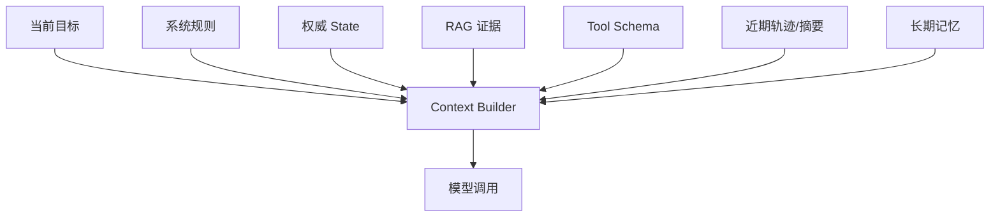
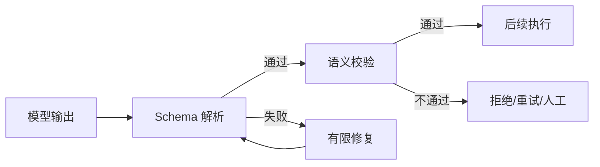

# 02｜LLM 与 Context Engineering

> 核心问题：**模型为什么会不稳定？怎样把有限上下文变成完成任务所需的最小、正确信息集？**

---

## 0. 分层记忆

**关键词**：Token、概率生成、上下文窗口、注意力预算、Instruction、Tool、State、Retrieval、History、Compaction、Structured Output。

**一句话**：模型不是数据库或状态机；Context Engineering 是在有限注意力预算内，为当前决策动态装配最相关、可信、无冲突的信息。

**60 秒面试回答**：

> LLM 根据上下文预测后续 Token，因此输出天然具有概率性，长上下文也不等于模型能稳定关注所有信息。我会把上下文分成系统规则、当前目标、权威状态、检索证据、工具定义、近期轨迹和长期记忆，并按可信度与相关性选择，而不是把全部历史都塞进去。对长会话采用摘要、滑动窗口、外部状态和分支；对输出采用 JSON Schema 校验和有限修复。上下文变化要记录版本并进入 Eval，因为很多所谓模型问题其实是缺信息、噪声、冲突或过度脚手架。

---

## 1. 最小模型：概率转导器，不是事实仓库

给定 Token 序列 \(x_{1:t}\)，模型估计：

自回归语言模型：
$$P(x_{t+1}\mid x_{1:t})$$
在已知前 $t$ 个 token 的序列 $x_{1:t}$ 的条件下，模型对下一个 token $x_{t+1}$ 的条件概率分布。

这带来四个工程事实：

1. 同一输入可能产生不同输出；
2. 模型能生成看似合理但无证据的内容；
3. 任务信息必须在当前上下文或工具可达范围内；
4. 更长上下文会增加成本和噪声，不保证更好。

### 常见参数只记决策意义

| 概念                | 工程意义             | 常见误区                    |
| ----------------- | ---------------- | ----------------------- |
| Token             | 计费、时延、上下文容量的基本单位 | 字符数不等于 Token 数          |
| Temperature       | 调整分布随机性          | 设为 0 也不承诺全链路确定性         |
| Top-p             | 截断候选概率质量         | 不应与高 Temperature 盲目叠加调参 |
| Context window    | 单次可见的最大 Token 范围 | 不是长期记忆，也不是有效注意力保证       |
| Stop / max output | 控制终止和预算          | 过短会截断 JSON 或推理结果        |

---

## 2. Context、State、Memory 必须分开

| 名称                | 定义                | 权威性    | 生命周期          | 例子               |
| ----------------- | ----------------- | ------ | ------------- | ---------------- |
| Context           | 本次模型调用实际可见的 Token | 临时视图   | 一次调用          | Prompt、证据、工具结果   |
| Agent State       | 运行过程的结构化状态        | 运行权威   | 一次 Run/Thread | 当前节点、计划、预算、产物 ID |
| Business State    | 业务系统真实状态          | 最高权威   | 长期            | 订单、权限、审批、账单      |
| Short-term Memory | 当前会话需延续的信息        | 派生     | Thread        | 用户偏好、已完成步骤       |
| Long-term Memory  | 跨会话可复用且获准保存的信息    | 派生/需治理 | 用户或组织级        | 稳定偏好、已验证事实       |

关键规则：

- 不把对话文本当作权威业务状态；
- 不把模型自己总结的“已执行”当作工具执行成功；
- 恢复时从数据库和 checkpoint 重建 Context；
- 记忆写入要有来源、范围、TTL、删除和用户控制。

---

## 3. 上下文装配模型



### 3.1 选择上下文的五个维度

可以给候选片段定义一个近似评分：

$$Score = w_r R + w_a A + w_f F + w_s S - w_c C$$

- \(R\)：与当前问题的相关性；
- \(A\)：权威性；
- \(F\)：新鲜度；
- \(S\)：对当前步骤的必要性；
- \(C\)：Token 成本与冲突风险。

不是一定实现这个公式，而是用它避免“越多越好”的思维。

### 3.2 信息优先级

1. 不可违反的系统/安全策略；
2. 当前用户目标和批准范围；
3. 权威业务状态；
4. 当前步骤所需证据；
5. 工具契约和返回；
6. 近期轨迹摘要；
7. 长期偏好和背景。

不可信网页、文档和 Tool Result 都是数据，不是指令。

---

## 4. 长上下文的四种控制方式

### 4.1 Selection：只选需要的

- 检索当前步骤相关文档；
- 只暴露当前角色允许的工具；
- 只读取相关文件或数据范围；
- 分阶段加载，而不是一次性注入。

### 4.2 Compression：压缩但保留可恢复指针

摘要至少保留：

- 用户目标与约束；
- 已确认的事实及来源 ID；
- 已完成/未完成步骤；
- 关键决策与原因；
- 副作用执行记录；
- 未解决问题和下一步。

摘要不是审计记录。原始消息、Tool Result 和 Artifact 应外部持久化并可追溯。

### 4.3 Isolation：隔离无关上下文

- 子任务用独立 Context，只返回结构化结果；
- 多 Agent 按权限域或专长隔离；
- 大产物写入对象存储，只在 Context 中保留摘要和引用；
- 分支探索各自保存 branch ID，最终显式合并。

### 4.4 Caching：复用稳定前缀

系统说明、稳定 Tool Schema 和大型静态背景可利用模型提供方的 Prompt Caching；动态状态放在后面。缓存只优化成本/延迟，不解决信息正确性。

---

## 5. Prompt 与结构化输出

### 5.1 一个可维护 Prompt 的组成

```text
Role / Objective
Hard constraints and authority boundary # 硬性约束与权威边界
Available data and tools
Decision process or acceptance criteria # 决策过程或接受标准
Output schema
Examples only for difficult boundary cases
```

原则：

- 说明目标和成功标准，不堆叠同义警告；
- 规则相互冲突时显式优先级；
- 对易错边界给少量高信息示例；
- 模型升级后重新评估，删除过时的“拐杖”。

### 5.2 结构化输出的可靠链路



JSON 合法不等于业务合法。还要校验：枚举、范围、权限、引用存在性、状态前置条件和资源预算。

### 5.3 修复策略

- 解析错误：把精简错误反馈给模型，最多 1–2 次；
- 业务错误：由程序拒绝，不让模型绕过约束；
- 连续失败：换模型/简化任务/转人工；
- 每次失败进入 Trace，不静默吞掉。

---

## 6. Context 分支、压缩与恢复

推荐状态结构：

```json
{
  "thread_id": "t_123",
  "run_id": "r_456",
  "branch_id": "b_main",
  "goal": "...",
  "approved_scope": ["read_rules"],
  "state_version": 7,
  "summary_version": 3,
  "artifact_refs": ["artifact://..."],
  "completed_side_effects": ["biz_key_..."],
  "remaining_budget": {"steps": 8, "tokens": 12000}
}
```

恢复步骤：

1. 读取 checkpoint 和版本；
2. 查询权威业务状态，不能仅信旧摘要；
3. 对比已完成副作用和当前状态；
4. 重建最小 Context；
5. 从安全节点继续，而不是盲目重放模型调用。

---

## 7. 分层面试题与回答

### Q1：Context Engineering 和 Prompt Engineering 有什么区别？

Prompt Engineering 关注一条指令如何表达；Context Engineering 关注整个运行时在每一步给模型哪些指令、状态、证据、工具和历史，以及如何选择、压缩、隔离和更新。前者是局部文本设计，后者是系统级信息架构。

### Q2：上下文窗口越大，RAG 是否越没必要？

不一定。小而稳定的知识库可直接放长上下文，简单且可能更好；但数据大、频繁更新、需要权限过滤和引用时，RAG 仍负责候选选择、时效与治理。决策应由质量、成本、延迟和权限 Eval 驱动。

### Q3：为什么 Context 会“腐烂”？

随着历史增长，过时信息、冲突证据、冗余 Tool Result 和早期错误会占用注意力；模型对关键信息的利用率可能下降。解决方式是分步检索、结构化状态、摘要、隔离和定期重建，而不是只换更长窗口。

### Q4：怎么做会话摘要？

摘要应面向后续任务，不是文学概括；保留目标、约束、权威事实引用、已完成动作、未决项和预算。摘要要版本化，并让关键事实仍可回到原始记录。对高风险状态，重新查询业务系统。

### Q5：Memory 应该存什么？

只存跨任务稳定、对未来有用、经过授权且能治理的信息。临时推理、模型猜测和敏感数据不应自动写长期记忆。每条记忆有来源、主体、作用域、置信度、更新时间、TTL 和删除机制。

### Q6：怎样防止检索文档中的 Prompt Injection？

把外部内容标为不可信数据；系统策略和工具权限不能由文档覆盖；只暴露必要工具；对工具参数做独立授权和校验；敏感动作要求确认；输出和跨工具结果再次验证并审计。

### Q7：Temperature=0 是否确定？

不能作为端到端确定性保证。服务实现、并行、模型版本、浮点与工具结果都可能变化。需要稳定结果时，使用 Schema、确定性校验、固定版本、缓存和 Eval，而不是依赖一个采样参数。

### Q8：Tool Result 太大怎么办？

大结果写外部 Artifact；Context 只保留结构化摘要、统计、关键片段和引用。必要时再按问题二次检索。避免把日志、SQL 全量结果或长文件重复塞回模型。

### Q9：模型升级后 Prompt 为什么可能要变？

Prompt 是针对模型行为的控制层。模型能力提升后，旧的详细脚手架可能限制其推理或造成冲突。要用同一 Eval 做消融：删除一段、比较结果，再决定保留，而不是凭感觉重写。

---

## 8. 项目迁移

### RuleArena

- 建立 Thread/Run/Step/Branch/Checkpoint 数据模型；
- 区分规则原文、审查摘要、权威状态和 Agent 临时判断；
- 对长审查压缩上下文，但保留证据 ID 和副作用记录。

### 数驭穹图

- Context 只装入当前领域 Schema、权限过滤后的候选表和关键样例；
- SQL 结果过大时保存 Artifact，返回统计与样本；
- Schema 版本、Query Prompt 版本与结果绑定。

### EnergyOps

- 每个 MCP 工具只收到必要业务参数；
- 运行恢复时查询告警/任务权威状态；
- 日志和大表不直接塞入模型，先检索和聚合。

---

## 9. M3 / M4 实践验收

### M3

- 手写一个 Context Builder，根据当前 Step 选择指令、工具、证据和历史；
- 实现 JSON Schema + 语义校验 + 有限修复；
- 对 30 轮对话实现摘要、分支和恢复；
- 解释 Context/State/Memory 的差异。

### M4

- 建 20 个上下文 Bad Case：缺失、噪声、冲突、过期、注入、超长；
- 对比全量历史、滑窗、摘要、检索四种策略的成功率/P95/Token；
- 留下 Eval 报告和至少一次 Prompt 消融结果。

---

## 10. 知识 Patch：5 + 2 + 3

### 5 个关键点

1. 上下文窗口是容量，不是记忆或注意力质量保证；
2. Context 是调用视图，State 是结构化运行事实，Memory 是跨时复用信息；
3. 选择、压缩、隔离、缓存是四类核心手段；
4. Schema 合法之后仍需业务与权限校验；
5. 上下文设计必须与 Eval 和版本管理绑定。

### 2 个反例

1. 把所有聊天、日志和文档塞进超长上下文，关键状态反而被淹没；
2. 让模型摘要替代订单数据库，恢复后按过时摘要重复执行。

### 3 个迁移

1. RuleArena：增加 Context Builder 和分支/checkpoint；
2. 数驭穹图：按领域和权限动态装配 Schema；
3. 面试：任何 Memory 问题先画清五种状态的权威性和生命周期。

---

## 11. 主要资料

- [Anthropic：Effective context engineering for AI agents](https://www.anthropic.com/engineering/effective-context-engineering-for-ai-agents)
- [Anthropic：Context management](https://claude.com/blog/context-management)
- [Anthropic：Contextual Retrieval](https://www.anthropic.com/engineering/contextual-retrieval)
- [Anthropic：Context engineering for newer models](https://claude.com/blog/the-new-rules-of-context-engineering-for-claude-5-generation-models)
- [Vercel：v0 composite model family](https://vercel.com/blog/v0-composite-model-family)

