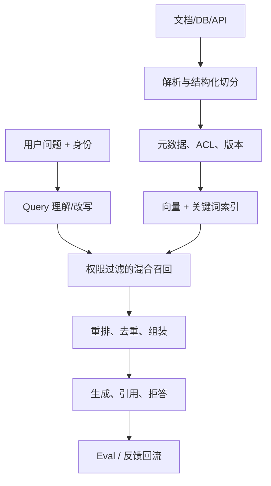
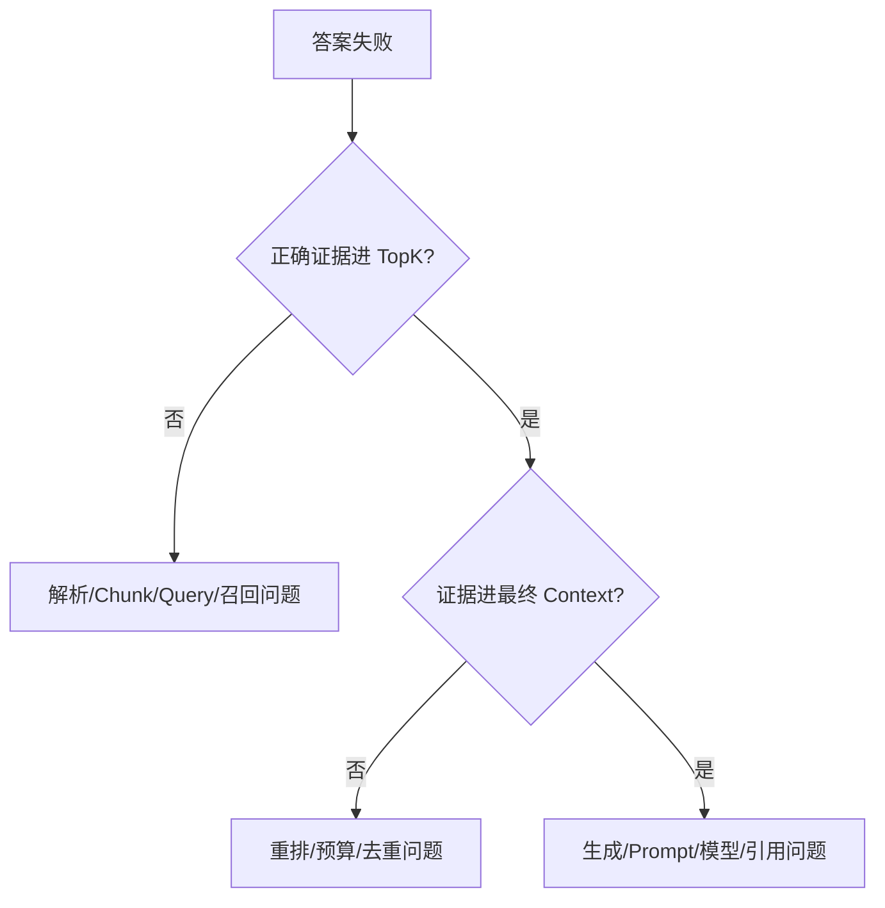

# 03｜RAG 与企业知识系统

> 核心问题：**怎样让模型基于最新、受权限控制、可引用的企业事实回答，并能证明检索和答案分别哪里错了？**

---

## 0. 分层记忆

**关键词**：Ingestion、Chunk、Embedding、BM25、Hybrid Retrieval、Filter、Rerank、Context Assembly、Citation、ACL、Freshness、Retrieval Eval、Answer Eval。

**一句话**：RAG 是在生成前按问题动态选择受权证据的系统；生产难点不在向量库，而在数据治理、召回、重排、引用、权限、更新和分层评测。

**60 秒面试回答**：

> 我把 RAG 拆成离线摄取和在线查询两条链路。离线负责解析、结构化切分、元数据、权限、Embedding、关键词索引和增量版本；在线先理解或改写查询，再做权限过滤下的向量与 BM25 混合召回，重排、去重并按 Token 预算组装上下文，最后生成带引用的答案。评测要拆开：用 Recall@K、MRR、nDCG 测检索，用正确性、faithfulness、引用完整性和拒答率测生成；线上再看任务成功、反馈、延迟和成本。若证据不足，系统应拒答或转人工，而不是让模型补全事实。

---

## 1. 第一性原理：RAG 是“证据选择”

模型已有参数知识，但企业知识有四个特点：

- 更新快：规则、商品、指标口径不断变化；
- 私有：不能进入公共模型训练；
- 受权：同一问题对不同用户可见范围不同；
- 要追责：回答必须能回到原文、数据或版本。

RAG 的目标不是“搜到相似文本”，而是：

优化 RAG 系统的目标函数
> **最大化 $P(\text{正确答案} \mid \text{问题}, \text{授权证据})$**

它由两个条件共同限制：

1. 正确证据能否进入候选集；
2. 模型是否忠实地使用了证据。

因此检索失败和生成失败必须分开归因。

---

## 2. 端到端架构



### 2.1 离线摄取链路

| 步骤       | 关键决策                | 失败处理                     |
| -------- | ------------------- | ------------------------ |
| Source   | 权威源、更新时间、所有者        | 无所有者的数据不进入生产知识库          |
| Parse    | 标题、段落、表格、代码、图片 OCR  | 解析状态和失败原因可观测             |
| Chunk    | 语义完整与检索粒度平衡         | 保留 parent/section/doc 关系 |
| Metadata | 来源、时间、权限、业务域、版本     | 缺关键元数据则隔离                |
| Index    | Embedding、BM25、过滤字段 | 双写/影子索引再切换               |
| Update   | 增量、删除传播、重建          | 版本化、可回滚、过期检测             |

### 2.2 在线查询链路

1. 身份与租户进入检索策略；
2. 判断问题是否需要知识、结构化查询或工具；
3. Query rewrite/decomposition，但保留原始问题；
4. 权限过滤后做候选召回；
5. 重排、去重、冲突/新鲜度处理；
6. 按 Token 预算组装上下文；
7. 生成带证据引用的答案；
8. 对无证据、冲突或低置信问题拒答/澄清；
9. 记录检索列表、分数、版本和最终引用。

---

## 3. Chunking：不是固定字数切割

### 3.1 取舍

- 太小：语义不完整，答案需要跨块拼接；
- 太大：相似度被无关内容稀释，Token 成本高；
- 重叠太多：重复召回，挤占上下文；
- 只按长度：标题、表格和规则结构被破坏。

### 3.2 常见策略

| 数据 | 首选策略 |
| --- | --- |
| Markdown/制度文档 | 标题层级 + 段落，保存父子关系 |
| FAQ | 一个问答为基本单元 |
| 代码 | 函数/类/模块边界 + 符号信息 |
| 表格 | 表头与行/分组绑定，不拆掉口径 |
| 长报告 | 小块召回 + parent 扩展 |
| 规则条款 | 条款/条件/例外/生效时间结构化 |

Chunk 参数必须通过目标问题集评测，而不是照搬经验数值。

---

## 4. 检索：召回和精排分工

### 4.1 BM25 与向量检索

| 方法           | 强项               | 弱项                         |
| ------------ | ---------------- | -------------------------- |
| BM25/关键词     | 专有名词、编号、精确短语、可解释 | 同义表达和语义泛化弱                 |
| Dense Vector | 语义相似、自然语言改写      | 编号/罕见词可能弱，受 Embedding 版本影响 |
| Hybrid       | 同时覆盖精确与语义        | 需要融合、去重和调参                 |

融合可用 Reciprocal Rank Fusion（RRF）：

$$RRF(d) = \sum_{i} \frac{1}{k + rank_i(d)}$$

它只依赖排名，适合融合不同分数量纲。

### 4.2 Filter、Rerank、Contextual Retrieval

- Metadata Filter：租户、ACL（Access Control List）、时间、地区、文档类型；
- Rerank：对小规模候选做更精细的 query-document 相关性判断；
- Contextual Retrieval：为 chunk 补充其在全文中的背景，再生成索引表示；
- Query Decomposition：多条件问题拆成子查询，再合并证据；
- Multi-hop：第二轮检索由第一轮发现的实体驱动。

重排提高质量但增加时延和成本，应通过 Eval 判断是否只在难题启用。

---

## 5. 权限、时效与冲突

### 5.1 权限必须在检索前生效

错误做法：先检索全部文档，再让模型“不要泄露”。

正确做法：


还需测试：跨租户、已撤权、共享链接、继承权限、删除传播和缓存污染。

### 5.2 新鲜度

- 文档带 `effective_at`、`expires_at`、`source_version`；
- 索引延迟可观测；
- 已删除/过期内容可追踪传播；
- 回答展示规则生效时间；
- 冲突时优先权威级别和最新生效版本，并显式说明。

---

## 6. 生成、引用与拒答

### 6.1 上下文组装

目标是最大化证据覆盖，同时控制重复、冲突和 Token：

- 按子问题/主题分组；
- 保留来源 ID、标题、时间和权限范围；
- 相邻块合并，重复块去重；
- 先高权威和高相关；
- 不把检索内容当系统指令；
- 长原文保存 Artifact，需要时展开。

### 6.2 引用

好的引用不是文末列几个链接，而是：

- 关键结论逐项绑定来源片段；
- 引用可定位到文档/章节/版本；
- 计算结果绑定 SQL/工具运行 ID；
- 用户能检查原始证据；
- 引用不存在或不支持结论时判失败。

### 6.3 拒答与澄清

应拒答/澄清的条件：

- 没有召回足够证据；
- 多个权威来源相互冲突；
- 用户身份不足；
- 问题超出知识库边界；
- 时间、主体或指标口径不明确。

---

## 7. RAG 评测体系

### 7.1 数据集

每条样本至少包含：

```json
{
  "question": "...",
  "user_scope": "tenant_a/analyst",
  "gold_evidence_ids": ["doc_12#p3"],
  "reference_answer": "...",
  "must_include": ["生效日期"],
  "must_not_include": ["未授权字段"],
  "answerability": true,
  "tags": ["multi_hop", "permission"]
}
```

数据来源：真实高频问题、专家构造边界、线上 Bad Case、权限攻击、过期/冲突样本。保留 holdout，避免对测试集过拟合。

### 7.2 检索指标

| 指标 | 回答什么 |
| --- | --- |
| Recall@K | 正确证据是否出现在前 K 个候选中 |
| Precision@K | 前 K 个中有多少是相关证据 |
| MRR | 第一个正确证据出现得有多早 |
| nDCG@K | 多级相关性与排序质量 |

$$Recall@K = \frac{|\text{Relevant} \cap \text{TopK}|}{|\text{Relevant}|}$$

### 7.3 答案指标

| 维度                    | 判定方式          |
| --------------------- | ------------- |
| Correctness           | 与参考事实/业务规则一致  |
| Faithfulness          | 每项主张由上下文支持    |
| Citation completeness | 需要证据的结论是否都有引用 |
| Answerability         | 无答案时能否正确拒答    |
| Safety/ACL            | 是否泄露未授权信息     |
| Task success          | 用户最终任务是否完成    |

Grader 组合：规则/代码优先判精确约束，模型 Judge 判语义质量，高风险和校准样本由人工复核。

### 7.4 失败归因



---

## 8. 分层面试题与回答

### Q1：请设计一个生产级 RAG。

回答按“数据摄取—在线检索—生成—评测—治理”五段；必须提 ACL、增量/删除、混合检索、重排、引用、拒答和分层指标，不能只说 Embedding + 向量库。

### Q2：如何选 Chunk 大小？

先看数据结构和问题粒度，再用代表性问题集比较 Recall、答案正确性、Token 和 P95。结构化标题/条款优先于固定长度；必要时小块召回、父块扩展。

### Q3：向量检索和 BM25 怎么选？

专有名词、编号、错误码偏 BM25；自然语言同义改写偏向量；企业知识通常混合检索后重排。选择由查询类型分桶 Eval 决定。

### Q4：检索指标很好，答案仍差，怎么排查？

检查正确证据是否进最终 Context、是否被截断或冲突；再看 Prompt、引用格式、模型是否忠实；最后检查参考答案和 grader。用 Trace 保留候选、分数、重排和上下文版本。

### Q5：如何处理知识更新？

Source 事件触发增量解析与索引；新旧索引双轨验证；文档和 chunk 版本化；删除/撤权必须传播；回答记录知识版本；支持回滚，并监控索引滞后。

### Q6：RAG、微调、长上下文怎么选？

- 最新/私有/可引用知识：RAG；
- 稳定行为、格式、领域表达：可能微调；
- 小而稳定知识：长上下文可能更简单；
- 通常先用 Prompt/RAG 建 Eval，再判断是否微调。

### Q7：GraphRAG 何时值得？

当问题依赖实体关系、多跳路径和全局结构，普通相似检索难覆盖时才考虑；要付出图谱构建、更新和评测成本。若只是品牌词或单文档问答，混合检索更简单。

### Q8：如何防止 RAG 越权？

身份进入检索层，ACL filter 先于召回；缓存按租户/权限分区；引用和下载再次鉴权；做跨租户与撤权测试；日志避免记录敏感原文。

---

## 9. 项目迁移

### 数驭穹图：主承载项目

- 把 Schema/指标口径/样例查询视作不同知识类型；
- 关键词 + 向量混合召回表、字段和业务术语；
- 权限过滤先于 Schema Linking；
- SQL 正确执行不等于语义正确，增加 answer correctness；
- 引用绑定 Schema 版本、SQL AST、运行 ID 和结果摘要。

### RuleArena

- 条款按条件、例外、生效时间切分；
- 召回规则后用确定性状态模型验证；
- 冲突规则显式返回证据，不强行合成唯一答案。

### EnergyOps

- 运维文档、设备数据和实时状态不要混成一个索引；
- 实时事实走 Tool/数据库，静态说明走 RAG；
- 故障建议引用日志/指标 Artifact 和操作手册。

---

## 10. M3 / M4 实践验收

### M3

- 用 PostgreSQL + pgvector 或任一向量库实现摄取与在线查询；
- 支持标题切分、元数据、ACL、混合检索、重排、引用和拒答；
- 建 50 条分桶评测集并输出检索/答案指标；
- 能定位一个失败在摄取、召回、重排还是生成。

### M4

- 用真实项目问题建立 100+ 样本与 holdout；
- 对比至少三种 Chunk/检索策略；
- 做撤权、删除、过期和冲突故障演练；
- 上线反馈自动沉淀为 Eval candidate，并有一次改进复盘。

---

## 11. 知识 Patch：5 + 2 + 3

### 5 个关键点

1. RAG 是受约束证据选择，不是向量库功能；
2. 摄取、召回、重排、生成必须分层追踪；
3. 企业检索通常需要 BM25 + 向量 + Filter + Rerank；
4. 权限在检索前生效，引用绑定来源与版本；
5. 检索 Eval 和答案 Eval 不能混为一个分数。

### 2 个反例

1. 所有文档固定 500 字切块，表格和规则被拆碎却没有评测；
2. 全库召回后让模型自行隐去无权限内容，已经发生数据泄露。

### 3 个迁移

1. 数驭穹图：加入分桶 Retrieval Eval 与权限测试；
2. RuleArena：规则证据与确定性状态验证结合；
3. 面试：回答 RAG 时先画两条链路，再讲向量库。

---

## 12. 主要资料

- [Anthropic：Contextual Retrieval](https://www.anthropic.com/engineering/contextual-retrieval)
- [Anthropic：Self-service data analytics with Claude](https://claude.com/blog/how-anthropic-enables-self-service-data-analytics-with-claude)
- [得物：AI 驱动的数据研发新范式](https://tech.dewu.com/article?id=217)
- [得物：OBS 数据 Agent 实践](https://tech.dewu.com/article?id=195)
- [美团技术团队](https://tech.meituan.com/)
- [PostgreSQL：Partial Indexes](https://www.postgresql.org/docs/current/indexes-partial.html)

