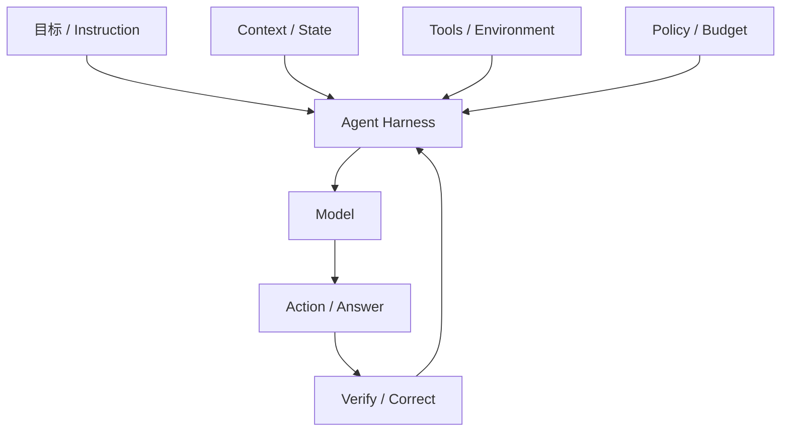
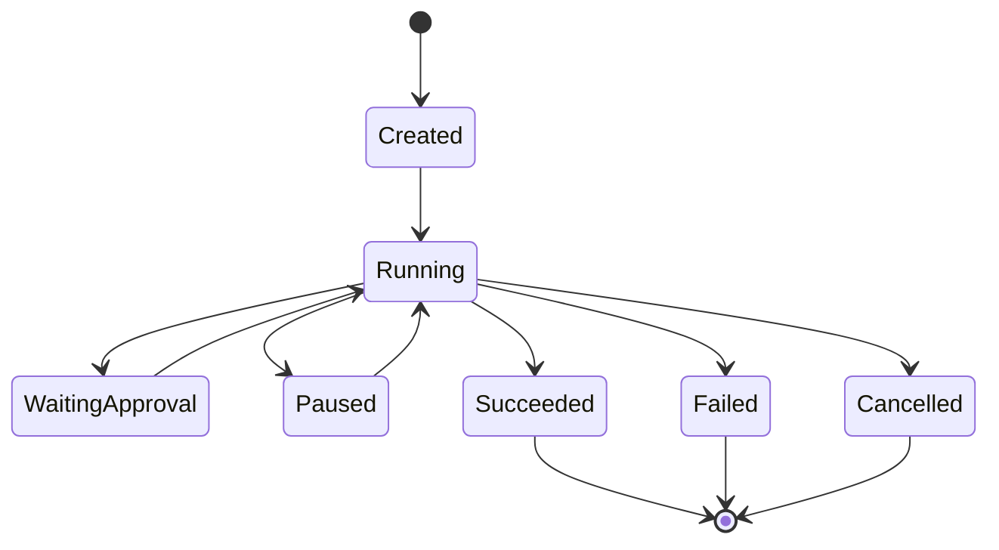
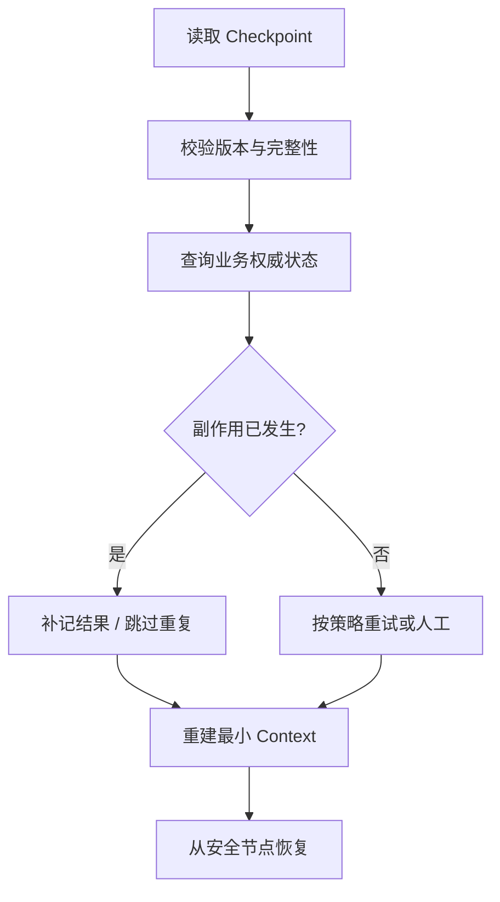

# 04｜Agent Runtime 与 Harness

> 核心问题：**怎样让模型在有限预算内反复观察、决策、行动、验证，并在失败或中断后安全继续？**

---

## 0. 分层记忆

**关键词**：Agent Loop、Harness、Run、Turn、Step、State、Budget、Stop、Checkpoint、Interrupt、Resume、Artifact、Verify。

**一句话**：Agent 是模型驱动的闭环；Harness/Runtime 负责给它上下文和工具，并用状态、预算、检查点、验证与治理把概率行为约束成可运行系统。

**60 秒面试回答**：

> 一个最小 Agent Loop 是 gather context → model decides → execute tool → observe result → verify → continue or stop。生产 Runtime 还要管理 Thread/Run/Step 状态、最大步数与 Token 预算、超时取消、流式事件、Artifact、权限、checkpoint 和终止原因。我会把业务状态放数据库，把运行状态持久化，把上下文视作动态投影；每个外部副作用单独设计幂等和确认。中断恢复时先查询权威状态，再从安全 checkpoint 继续。框架可以用 LangGraph 等，但关键状态和工具契约不应被框架内部对象绑死。

---

## 1. Agent、Loop 与 Harness

### 1.1 最小定义

Agent 的必要条件：

1. 有目标；
2. 能观察环境；
3. 模型能选择下一动作；
4. 动作改变信息或环境；
5. 根据结果继续或停止。

单次“问模型—返回文本”不是 Agent。固定 DAG 即便使用 LLM，也更准确地称为 Workflow。

### 1.2 Harness 是什么

Harness 是包围模型的运行约束与能力环境：



模型像决策核心，Harness 决定它看见什么、能做什么、做错后怎样纠正。

---

## 2. 自己先实现一个最小 Loop

```python
async def run_agent(goal, runtime):
    state = await runtime.start(goal)

    while not state.is_terminal:
        runtime.check_budget(state)
        context = await runtime.build_context(state)
        decision = await runtime.model_call(context)

        if decision.final_answer:
            verdict = await runtime.verify_answer(decision, state)
            if verdict.ok:
                return await runtime.finish(state, decision.final_answer)
            state = await runtime.record_feedback(state, verdict)
            continue

        call = await runtime.validate_tool_call(decision.tool_call, state)
        result = await runtime.execute_tool(call, state)
        state = await runtime.commit_step(state, call, result)

    return await runtime.terminal_result(state)
```

真实实现还需要：超时、取消、重试分类、HITL、流式事件、并发控制、checkpoint、版本和 trace。

关键原则：Loop 很短，复杂度应集中在可测试的边界组件，而不是一个巨大的 Prompt。

---

## 3. 运行时状态模型

### 3.1 生命周期



### 3.2 核心实体

| 实体         | 作用          | 关键字段                                   |
| ---------- | ----------- | -------------------------------------- |
| Thread     | 会话/长期交互容器   | user、scope、memory refs                 |
| Run        | 一次目标执行      | goal、status、versions、budget            |
| Step       | 一次模型或工具动作   | type、input/output refs、latency、error   |
| Branch     | 平行探索或用户回退分支 | parent_step、merge status               |
| Checkpoint | 可恢复状态快照     | state version、resume node、side effects |
| Artifact   | 大结果或中间产物    | URI、hash、ACL、schema、TTL                |
| Event      | 流式/审计事实     | sequence、kind、timestamp、trace IDs      |

### 3.3 一个 Step 应记录什么

```json
{
  "run_id": "r1",
  "step_id": "s7",
  "sequence": 7,
  "kind": "tool",
  "status": "succeeded",
  "model_version": "...",
  "prompt_version": "p12",
  "tool_name": "create_ticket",
  "tool_version": "v3",
  "input_ref": "artifact://...",
  "output_ref": "artifact://...",
  "idempotency_key": "ticket:incident-42",
  "latency_ms": 824,
  "token_usage": null,
  "error_code": null
}
```

不要只存最终聊天文本，否则无法 Replay 和失败归因。

---

## 4. 预算、终止与防失控

### 4.1 预算不是只有 Token

| 预算                | 用途        |
| ----------------- | --------- |
| max_steps         | 防无限循环     |
| max_tokens / cost | 控制模型成本    |
| deadline          | 控制端到端时间   |
| max_tool_calls    | 控制外部系统负载  |
| per-tool quota    | 限制昂贵/危险工具 |
| max_retries       | 防重试放大     |
| artifact size     | 防日志和结果爆炸  |

### 4.2 终止原因必须结构化

- `completed_verified`：结果通过验证；
- `needs_clarification`：缺少必要输入；
- `waiting_approval`：高风险步骤待确认；
- `budget_exhausted`：步骤/Token/时间耗尽；
- `tool_unavailable`：关键依赖失败；
- `policy_blocked`：权限或安全策略拒绝；
- `cancelled_by_user`；
- `unrecoverable_error`。

“模型停了”不是工程可用的终止原因。

---

## 5. Checkpoint 与 Durable Execution

### 5.1 为什么需要

长任务会遇到：进程重启、模型/工具超时、用户确认、限流、网络故障和主动取消。若每次从头开始，会浪费成本并可能重复写操作。

### 5.2 什么时间做 checkpoint

- 进入/离开每个有业务意义的节点；
- 外部副作用之前记录 intent；
- 副作用完成后记录结果与业务幂等键；
- 人工中断前；
- 大型子任务完成后；
- Context 压缩或分支合并后。

### 5.3 恢复协议



Checkpoint 不是简单序列化内存。它必须与工具版本、业务状态和幂等记录协调。

### 5.4 重放与恢复不同

| 操作     | 目标         | 对副作用的处理                   |
| ------ | ---------- | ------------------------- |
| Resume | 完成原任务      | 查询状态，必要时继续执行              |
| Replay | 复现/评估轨迹    | 默认使用记录结果或沙盒，不重做真实副作用      |
| Retry  | 重做一个失败步骤   | 仅对可重试错误且有幂等保障             |
| Fork   | 从历史节点探索新方案 | 新 branch，继承只读事实，不继承未批准写权限 |

---

## 6. 流式、取消与人工中断

### 6.1 事件流

前端不应只看到 Token，可暴露结构化事件：

- `run.started`；
- `plan.updated`；
- `tool.call.requested`；
- `tool.call.completed`；
- `approval.required`；
- `artifact.created`；
- `answer.delta`；
- `run.completed/failed`。

事件带递增 sequence，客户端断线后可从 last event 恢复；数据库状态是权威，SSE 只是传输视图。

### 6.2 取消

- 用户取消设置 run 状态与 cancellation token；
- 正在等待的模型/HTTP 请求应传播取消；
- 已开始的不可取消外部操作进入 `cancelling/unknown`，之后查询状态；
- `finally` 释放连接、锁和临时资源；
- 取消不能被宽泛 `except Exception` 静默吞掉。

### 6.3 Human-in-the-loop

确认页面至少展示：将执行什么、作用对象、关键参数、影响、证据、是否可撤销。批准必须绑定具体动作摘要和版本，不能用一次“允许所有”永久放权。

---

## 7. Verification：Agent 要能检查自己的工作

验证优先级：

1. 确定性测试、Schema、规则、编译器、SQL AST；
2. 工具返回和权威状态查询；
3. 多源交叉证据；
4. 模型 Judge；
5. 人工复核。

模型“自我反思”不能替代外部 oracle。最强的 Harness 通常给 Agent 可执行测试、浏览器、终端、数据库只读查询等真实反馈。

---

## 8. 框架选型

| 场景                   | 首选                           |
| -------------------- | ---------------------------- |
| 单次 Tool Calling、步骤很少 | Provider SDK + 自写 Loop       |
| 显式状态、条件分支、HITL、恢复    | LangGraph 等图运行时              |
| 高并发长期任务和严格队列语义       | 工作流引擎/任务队列 + Agent Step      |
| 需要快速 UI 流式和 TS 全栈    | Vercel AI SDK / Workflow 类工具 |

选型问题：状态是否可导出、checkpoint 粒度、幂等支持、可观测、版本兼容、部署模型和供应商锁定。

框架不会替你决定业务权威状态、权限、幂等键和 Eval 定义。

---

## 9. 分层面试题与回答

### Q1：请解释 Agent Loop。

最小循环是观察当前状态、构建上下文、模型选择回答或工具、校验并执行、记录结果、验证任务是否完成；用步数/时间/成本预算控制终止。生产版加入持久状态、checkpoint、取消、人工审批和 trace。

### Q2：Agent State、Context、Memory 有何区别？

State 是运行时结构化事实；Context 是某一次模型调用看到的投影；Memory 是跨步骤/会话复用的信息。业务状态仍由数据库权威维护。恢复时从 State 和业务状态重新装配 Context。

### Q3：怎么防止 Agent 无限循环？

最大步数/时间/成本/工具次数；检测重复状态和重复调用；工具返回明确错误语义；每轮验证进展；连续无进展触发澄清、降级或人工；终止原因进入 Eval。

### Q4：Checkpoint 存什么？

目标、运行状态、当前节点、结构化中间结果、Artifact 引用、剩余预算、版本、已完成副作用与幂等键、待审批动作。大结果存外部，敏感信息按权限治理。

### Q5：中断恢复时如何避免重复扣款/建单？

副作用前记录 intent 和业务幂等键；调用端和服务端共同支持幂等；超时不确定时先按业务键查询状态；结果落库后 checkpoint；Resume 跳过已完成动作。必要时补偿或人工。

### Q6：什么时候用 LangGraph？

当流程需要显式状态、条件分支、暂停恢复、HITL 和可检查节点时很合适。简单 Loop 不必引入；核心领域状态、Tool 契约、评测数据保持框架无关。

### Q7：Reflection 有什么局限？

同一模型可能重复同一盲点，而且多一次调用增加成本。优先给外部测试/工具反馈；Reflection 适合生成候选修复或检查清单，并通过 Eval 验证增益。

### Q8：如何支持长任务？

任务异步化；运行状态持久化；每个阶段 checkpoint；事件流展示进度；可取消和恢复；大产物外置；工具幂等；超时/重试分类；用户审批不占住进程；版本化并可 Replay。

---

## 10. 项目迁移：RuleArena 主线

建议新增：

1. `threads/runs/steps/checkpoints/artifacts/events` 数据表；
2. 显式审查状态：准备 → 取证 → 各角色审查 → 合并 → 确定性验证 → 人工确认 → 完成；
3. 每个步骤记录 Prompt/Model/Tool/Rule 版本；
4. 高风险修复发布前 interrupt；
5. 从任一步 fork 比较不同策略；
6. Replay 默认使用记录的工具结果；
7. 连续无进展、预算耗尽、证据冲突都有独立终止原因。

EnergyOps 可复用相同模型，把现有任务查询/重试/自愈升级为通用 durable task evidence。

---

## 11. M3 / M4 实践验收

### M3

- 不依赖 Agent 框架手写最小 Loop；
- 实现 Run/Step/Checkpoint/Artifact；
- 支持预算、结构化终止、SSE、取消和人工中断；
- 用 LangGraph 重构并解释差异。

### M4

- 注入模型超时、工具 500、进程重启、用户断线和重复消息；
- 恢复后无重复副作用且结果一致；
- 轨迹可 Replay，失败能定位到 Step；
- 输出成功率、恢复率、P95、平均步数和单任务成本。

---

## 12. 知识 Patch：5 + 2 + 3

### 5 个关键点

1. Agent 的核心是闭环，而不是聊天界面；
2. Harness 用 Context、Tool、Policy、Verify 约束模型；
3. 业务状态、运行状态和上下文必须分层；
4. checkpoint 与幂等共同支撑安全恢复；
5. 终止、取消、Replay 都是 Runtime 一等能力。

### 2 个反例

1. 只保存消息历史，进程重启后不知道哪些写操作已完成；
2. 无限 `while` 等模型说 done，没有预算、进展检测或终止原因。

### 3 个迁移

1. RuleArena：补全通用 Runtime 数据模型；
2. EnergyOps：把任务自愈证据抽象成 checkpoint/recovery 案例；
3. 面试：现场画 Loop、状态实体和恢复流程三张图。

---

## 13. 主要资料

- [Anthropic：Building agents with the Claude Agent SDK](https://www.anthropic.com/engineering/building-agents-with-the-claude-agent-sdk)
- [Anthropic：Building effective agents](https://www.anthropic.com/engineering/building-effective-agents)
- [Anthropic：Harness design for long-running apps](https://www.anthropic.com/engineering/harness-design-long-running-apps)
- [OpenAI：Harness engineering](https://openai.com/index/harness-engineering/)
- [LangGraph：Persistence](https://docs.langchain.com/oss/python/langgraph/persistence)
- [LangGraph：Interrupts](https://docs.langchain.com/oss/python/langgraph/interrupts)
- [Vercel AI SDK：WorkflowAgent](https://ai-sdk.dev/docs/agents/workflow-agent)

