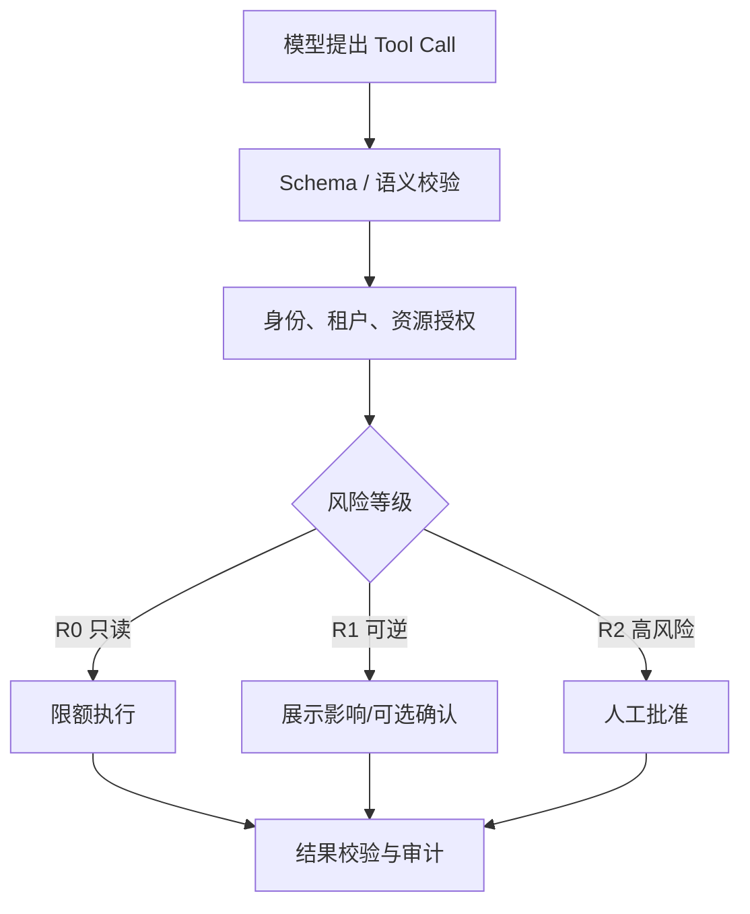
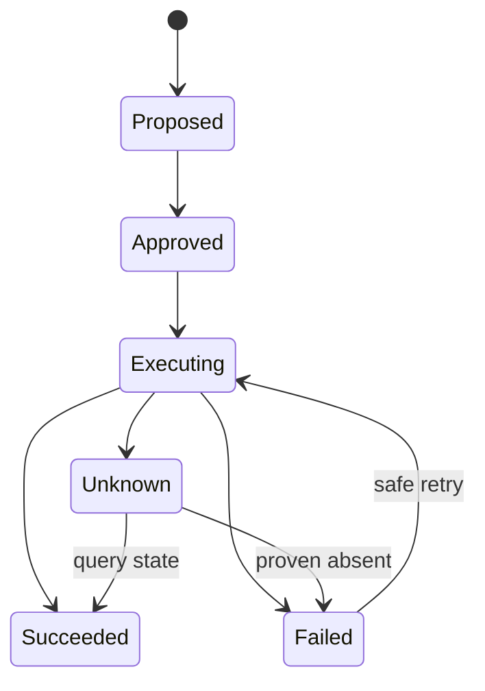
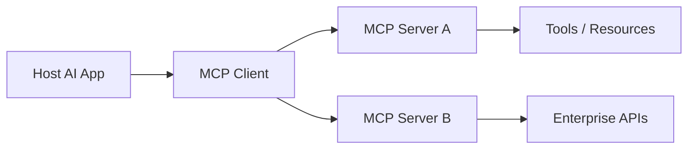

# 05｜Tool、MCP、Skill 与可信执行

> 核心问题：**怎样让模型安全、可审计、可恢复地读取数据和改变真实世界？**

---

## 0. 分层记忆

**关键词**：Tool Contract、Schema、MCP、Skill、Least Privilege、Validation、Idempotency、Unknown Outcome、Confirmation、Sandbox、Audit。

**一句话**：模型可以建议调用工具，但真正执行必须经过契约校验、授权、风险策略、幂等和结果验证；MCP 统一连接，Skill 复用方法，二者都不替代安全边界。

**60 秒面试回答**：

> 我把每个工具当成受治理的业务 API，而不是给模型的一段任意代码。工具契约包含清晰职责、JSON Schema、权限、幂等语义、超时、错误码、风险等级、审计字段和返回上限。调用链是模型提出 → 客户端校验 → 身份授权 → 风险确认 → 隔离执行 → 结果校验 → 写 Trace。读工具和写工具分开，高风险副作用要求最小权限和 Human-in-the-loop；超时后先查询权威状态，不能盲重试。MCP 标准化 Client/Server 连接与能力发现，Skill 则封装可复用的方法和知识，它们解决的是不同层次的问题。

---

## 1. Tool、MCP、Skill 的边界

| 概念 | 解决什么 | 不解决什么 | 例子 |
| --- | --- | --- | --- |
| Tool | 一个可调用动作/查询的契约 | 不自动保证授权、幂等和正确 | `query_order`、`create_ticket` |
| MCP | Client 与 Server 之间发现/调用 Tools、Resources、Prompts 的协议 | 不替代业务策略和隔离 | Agent 连接企业数据系统 |
| Skill | 可复用的任务方法、说明、脚本和资源包 | 不等于远程服务协议 | “审查合同”的步骤与模板 |
| Workflow | 固定的步骤与控制流 | 不提供开放式动态决策 | 审批 DAG |
| Agent | 动态决定调用哪些能力 | 不天然可信或安全 | 运维处置 Agent |

记忆：**Tool 是动作，MCP 是连接，Skill 是方法，Workflow 是路径，Agent 是决策者。**

---

## 2. Tool Contract

### 2.1 契约字段

```yaml
name: create_incident_ticket
description: Create one ticket for a verified incident; never use for inquiry.
input_schema:
  incident_id: string
  severity: enum[P1, P2, P3]
  summary: string(max=500)
auth_scope: ticket.write
risk_level: R1
idempotency: required, key=incident_id
timeout_ms: 3000
retry_policy: query-before-retry
output_schema:
  ticket_id: string
  status: enum[created, existed]
errors:
  - INVALID_INPUT
  - FORBIDDEN
  - CONFLICT
  - RETRYABLE_UPSTREAM
  - UNKNOWN_OUTCOME
audit:
  - actor
  - run_id
  - approval_id
```

### 2.2 好的描述

- 说明“何时用”和“何时不要用”；
- 命名具体，避免 `do_action`；
- 参数枚举和边界收紧；
- 返回简洁且有业务语义；
- 不把秘密、内部实现和长日志塞进描述。

### 2.3 工具粒度

太粗：一个 `admin_execute(command)` 权限巨大、难审计。  
太细：模型需拼接大量低级调用，步骤多、错误累积。

合适粒度是一个可审计的业务意图，例如“为某个已验证事件创建工单”，而不是数据库行操作或任意脚本。

---

## 3. 可信调用链



每一层都应由确定性代码执行。Prompt 里的“请不要越权”不是授权控制。

### 3.1 风险分级示例

| 等级 | 示例 | 控制 |
| --- | --- | --- |
| R0 | 受权只读查询 | 限流、结果上限、审计 |
| R1 | 创建草稿、可撤销工单 | 幂等、展示影响、可撤销 |
| R2 | 支付、删除、发布、权限修改 | 强确认、双人审批/策略、最小权限 |

风险不仅看工具名，还看参数、对象、金额、范围和时间。

---

## 4. 副作用、幂等与未知结果

### 4.1 三种 ID 不要混淆

| ID | 作用 |
| --- | --- |
| tool_call_id | 一次模型协议交互的关联 ID |
| request_id / trace_id | 一次请求或链路追踪 |
| business idempotency key | 保证同一业务意图只生效一次 |

只有业务幂等键能抵抗重试、恢复和重复消息。它通常来自稳定业务身份，如 `order_id + operation_type`，不是随机 UUID。

### 4.2 副作用状态机



### 4.3 超时为什么危险

HTTP 超时只说明客户端没有及时收到响应，不说明服务端没有执行。正确策略：

1. 使用业务幂等键调用；
2. 服务端唯一约束或条件更新；
3. 超时进入 `UNKNOWN_OUTCOME`；
4. 按业务键查询权威状态；
5. 只有确认未发生时才重试；
6. 无法确认则人工处理。

### 4.4 补偿不是回滚

分布式外部动作通常无法 ACID 回滚。补偿是一个新的显式业务动作，也可能失败，需要状态、权限和审计。例如退款不是“撤销扣款事务”，而是另一笔交易。

---

## 5. MCP 架构与安全

### 5.1 基本角色



- Host 管理用户体验、模型与安全策略；
- Client 与某个 Server 建立会话并做能力调用；
- Server 暴露 Tools/Resources/Prompts；
- Server 仍需校验输入、访问控制、限流、清洗输出；
- Client 对敏感调用应展示输入、确认、超时和审计。

### 5.2 授权原则

- 每个用户/租户独立授权，不能共享万能 Token；
- OAuth 2.1/短期 Token/明确 scope；
- Server 不接受不属于自己的 Token；
- 防 confused deputy：授权要绑定目标资源和受众；
- 凭证放密钥系统，不进入 Prompt、日志或 Tool Result；
- 跨 Server 结果继续视为不可信输入。

### 5.3 MCP 不是“安全认证”

使用标准协议不会自动获得：最小权限、沙盒、业务幂等、数据脱敏、审批或安全输出。它只是让能力接入更一致，治理仍由 Host 和 Server 共同承担。

---

## 6. Skill 设计

Skill 适合保存模型反复需要的领域方法：

- 任务触发条件；
- 标准步骤和检查清单；
- 需要读取的模板/参考；
- 可运行脚本；
- 完成定义和失败处理；
- 少量高信息示例。

### Prompt / RAG / Skill / Tool 的选择

| 需要 | 首选 |
| --- | --- |
| 一次性指令或输出格式 | Prompt |
| 动态获取事实 | RAG/Resource |
| 复用复杂工作方法 | Skill |
| 读取/改变外部状态 | Tool |
| 跨系统标准连接 | MCP |

Skill 也要通过代表性任务 Eval 增量构建；不要把所有文档打包成一个超大技能。

---

## 7. Sandbox 与信任分级

当工具允许执行代码、浏览器或文件操作时：

- 每次运行使用隔离容器/沙盒；
- 默认无网络，按域名和协议放行；
- 文件系统只挂载必要目录；
- CPU、内存、时间、进程数、输出大小限额；
- 凭证通过受控代理按调用注入，不直接暴露；
- 执行产物做类型、病毒和敏感信息检查；
- 沙盒逃逸、跨租户和数据外传进入专项测试。

Agent 能力越强，权限越应细分；高自治不等于高权限。

---

## 8. 错误语义与重试矩阵

| 错误               | 是否重试       | 处理                        |
| ---------------- | ---------- | ------------------------- |
| INVALID_INPUT    | 否/最多模型修复一次 | 返回字段级错误                   |
| FORBIDDEN        | 否          | 不允许模型反复绕过                 |
| NOT_FOUND        | 视业务        | 澄清或重新检索                   |
| CONFLICT         | 否/查最新状态    | 乐观锁、状态冲突                  |
| RATE_LIMITED     | 是          | Retry-After + jitter + 预算 |
| UPSTREAM_TIMEOUT | 只在幂等保障下    | 先查状态，限制次数                 |
| UNKNOWN_OUTCOME  | 不能盲重试      | 查询权威状态/人工                 |
| POLICY_BLOCKED   | 否          | 记录原因并安全回应                 |

工具错误应简洁、结构化、可供程序决策；不要把内部堆栈原样给模型或用户。

---

## 9. 分层面试题与回答

### Q1：如何设计一个好用的 Tool？

从单一业务职责、清晰命名和收紧 Schema 开始；定义授权 scope、风险、幂等、超时、错误码、返回上限和审计；描述何时使用/不使用；用 Tool 选择率、参数正确率、任务成功率和错误分布评测。

### Q2：MCP 解决了什么？

标准化 AI 应用与外部能力间的发现、Schema 和调用交互，降低每个数据源/工具重复集成成本。它不替代业务授权、隔离、幂等和审计。

### Q3：ToolCallID 能否做幂等键？

通常不能。模型重试或恢复会生成新 ToolCallID，但业务意图相同。应使用业务实体和操作类型构造稳定键，并由服务端唯一约束或状态机保证。

### Q4：工具超时后可以直接重试吗？

只读且可重试时可以按策略重试；写操作超时结果未知，应先用业务键查询权威状态。只有证明未执行且接口幂等时才重试。

### Q5：如何防 Prompt Injection 导致危险调用？

外部内容始终是数据；模型只提出调用；客户端做独立授权和参数校验；只暴露必要工具；敏感动作确认；执行环境隔离；结果验证；跨系统结果不自动升级为指令。

### Q6：Tool 太多会有什么问题？

Schema 占 Context，名字相似导致误选，权限面变大，评测组合爆炸。按任务动态暴露工具、分组/路由、改进描述和合并合理粒度，并监控误选混淆矩阵。

### Q7：Skill 和 MCP 的关系？

Skill 教 Agent 如何完成一类任务，可能调用多个 MCP Tool；MCP 让 Agent 连接实际服务。一个是方法层，一个是连接/能力协议层。

### Q8：怎样审计 Agent 的副作用？

记录用户/租户、Run/Step、模型/Prompt/Tool 版本、参数摘要、授权决策、批准人、业务幂等键、外部结果 ID、时间、最终状态和补偿关系；敏感字段脱敏且审计日志防篡改。

---

## 10. 项目迁移

### EnergyOps：30 个 MCP 工具治理

- 生成 Tool Catalog：职责、读写、scope、风险、幂等、SLO、Owner；
- 按任务动态暴露，不一次注入全部工具；
- R0/R1/R2 规则从 Prompt 移到 Policy 层；
- 写工具加入业务幂等键、unknown outcome 查询和审计；
- 建工具混淆矩阵、参数正确率和调用失败分布。

### RuleArena

- 规则发布/修复是 R2，必须绑定具体 diff 和审批；
- 审查角色只有只读证据工具，执行角色另行授权；
- 代码/规则验证在沙盒中运行，产物 hash 与版本绑定。

---

## 11. M3 / M4 实践验收

### M3

- 设计 5 个读工具、2 个写工具的完整契约；
- 实现 Schema、授权、风险分级、确认、审计和结构化错误；
- 写操作支持幂等和 unknown outcome 查询；
- 解释 Tool/MCP/Skill/Workflow 的边界。

### M4

- 对 30 个 EnergyOps 工具完成 Catalog 与自动契约测试；
- 注入重复调用、超时、越权、Prompt Injection、Server 故障；
- 证明高风险调用无未确认执行、重复副作用为 0；
- 有 Tool 选择/参数/E2E 指标和一次失败复盘。

---

## 12. 知识 Patch：5 + 2 + 3

### 5 个关键点

1. Tool 是受治理业务 API，不是模型任意代码执行口；
2. 权限和校验在确定性执行层，不在 Prompt；
3. 业务幂等键与 ToolCallID 不同；
4. 超时产生未知结果，写操作不能盲重试；
5. MCP 标准化连接，Skill 复用方法，安全治理另算。

### 2 个反例

1. 给 Agent 一个万能 `execute_sql` 写权限，再要求 Prompt “小心使用”；
2. 写工具 504 后立即重试，重复创建工单或扣款。

### 3 个迁移

1. EnergyOps：为 30 个 MCP 工具建立 Catalog 和契约测试；
2. RuleArena：把修复发布设计为 R2 审批动作；
3. 面试：任何工具题都主动讲 unknown outcome 和业务幂等键。

---

## 13. 主要资料

- [MCP：Architecture](https://modelcontextprotocol.io/docs/2026-07-28/learn/architecture)
- [MCP：Tools specification](https://modelcontextprotocol.io/specification/2026-07-28/server/tools)
- [MCP：Authorization](https://modelcontextprotocol.io/docs/2026-07-28/tutorials/security/authorization)
- [MCP：Security best practices](https://modelcontextprotocol.io/docs/2026-07-28/tutorials/security/security_best_practices)
- [MCP：Client best practices](https://modelcontextprotocol.io/docs/2026-07-28/develop/clients/client-best-practices)
- [Anthropic：Agent Skills](https://claude.com/blog/equipping-agents-for-the-real-world-with-agent-skills)
- [Anthropic：Skills explained](https://claude.com/blog/skills-explained)
- [OWASP：LLM06 Excessive Agency](https://owasp.org/www-project-top-10-for-large-language-model-applications/2_0_vulns/LLM06_ExcessiveAgency.html)

