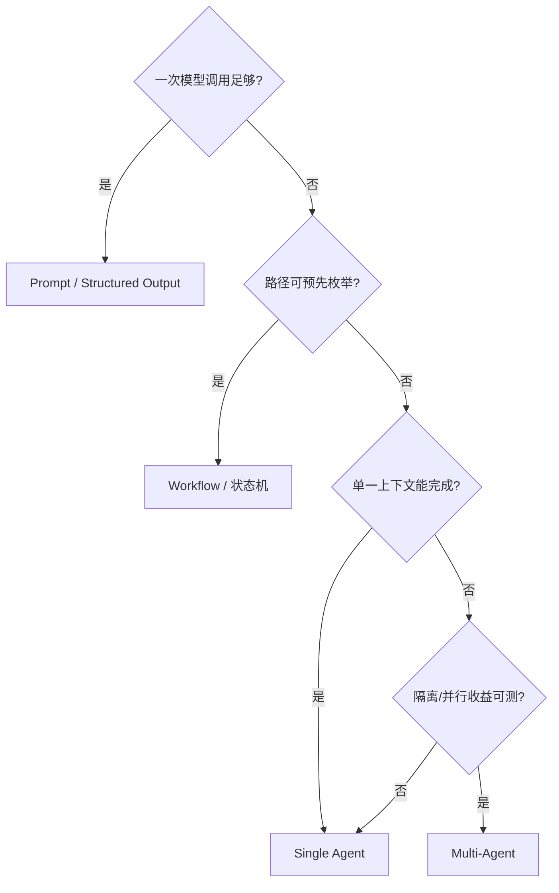
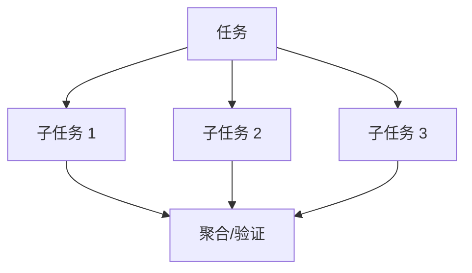
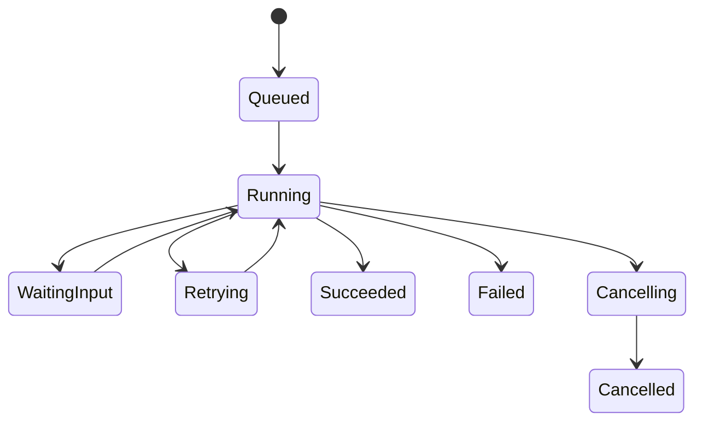

# 06｜Workflow、多 Agent 与长任务

> 核心问题：**复杂任务应该固定编排、交给单 Agent，还是拆成多个 Agent？怎样保证长任务可控且不丢进度？**

---

## 0. 分层记忆

**关键词**：Workflow、Routing、Parallelization、Orchestrator-Workers、Evaluator-Optimizer、Multi-Agent、Context Isolation、Handoff、Long-running、HITL。

**一句话**：稳定路径用 Workflow，动态路径用 Agent；多 Agent 只有在上下文隔离、权限分离、并行或专长带来可测收益时才值得。

**60 秒面试回答**：

> 我先按任务动态性选择架构。步骤固定且可枚举时用代码或状态机；只有下一步依赖开放环境反馈时才用 Agent。常见 Workflow 模式包括路由、并行、编排者—工作者和评估—优化。多 Agent 不是把同一模型换几个角色名，而是要有不同上下文、工具、权限或并行子任务，并定义 handoff Schema、共享状态和合并规则。长任务则把每个阶段做成可重试、可 checkpoint 的离散步骤，大产物外置，人工等待不占进程，副作用幂等，支持取消、恢复和 Replay。

---

## 1. 决策树：从最简单可行结构开始

每一层都要对比：任务成功率、P95、成本、错误影响面、调试难度。

---

## 2. Workflow 与 Agent 的根本区别

| 维度 | Workflow | Agent |
| --- | --- | --- |
| 控制流 | 代码预定义 | 模型动态决定 |
| 可预测性 | 高 | 较低 |
| 适应开放环境 | 有限 | 强 |
| 测试 | 节点与分支断言 | 数据集 + 轨迹统计 |
| 成本/延迟 | 通常更低 | 通常更高 |
| 适用 | 审批、ETL、固定审核 | 研究、跨工具排障、开放任务 |

一个系统可以混合：外层状态机保证业务阶段，某些节点内部运行 Agent Loop。

---

## 3. 五种常见组合模式

### 3.1 Prompt Chaining

前一步输出成为后一步输入，中间有程序门禁。

适合：先抽取事实，再生成报告；先生成 SQL，再 AST 校验。  
风险：错误逐步放大；需要每步 Schema、验证和提前失败。

### 3.2 Routing

按意图、领域、风险或复杂度分流到不同模型/流程。

适合：数驭穹图领域路由；简单问答/复杂分析分流。  
关键指标：路由准确率、错误路由代价、fallback 成功率。

### 3.3 Parallelization

适合：独立证据源、多个审查维度、候选方案生成。  
风险：并发放大成本/限流，结果冲突，最慢子任务决定尾延迟。

### 3.4 Orchestrator–Workers

编排者动态拆任务，Worker 完成局部工作，再合并。

适合：复杂研究、代码库修改、未知子任务数量。  
要求：任务契约、共享/隔离状态、最大 fan-out、去重、合并策略和预算。

### 3.5 Evaluator–Optimizer

一个组件生成，另一个按明确标准评估并给改进反馈，有限迭代。

适合：存在清晰质量标准但一次生成难达标。  
不适合：没有客观判据，只是两个模型互相“觉得不错”。

---

## 4. 多 Agent 的必要条件

至少命中一项且经 Eval 证明：

1. **上下文隔离**：不同任务需要大量不相干资料，拆开能减少噪声；
2. **权限隔离**：审查者只读，执行者写；
3. **并行性**：子任务独立，能降低总时长；
4. **能力差异**：不同模型/工具对特定任务明显更优；
5. **组织边界**：不同团队拥有不同服务和责任。

换角色 Prompt、使用相同模型/上下文/工具，往往只是增加调用次数，不构成有意义的专长。

### 4.1 协作协议

| 项            | 设计要求                     |
| ------------ | ------------------------ |
| Handoff      | 结构化任务、输入引用、完成标准、预算       |
| Result       | 结论、证据、置信/未知项、Artifact 引用 |
| Shared state | 只存必须共享的结构化事实             |
| Ownership    | 每个子任务唯一 owner，避免重复工作     |
| Merge        | 冲突优先级、去重、证据权重、人工升级       |
| Failure      | 局部重试、降级、跳过、取消其他任务        |
| Trace        | 父子 span、Agent ID、版本和成本   |

---

## 5. 多 Agent 的拓扑

### 5.1 Manager 模式

Manager 统一与用户交互，Worker 作为工具被调用。控制清晰，适合企业系统。

### 5.2 Decentralized Handoff

Agent 直接把会话控制交给另一个 Agent。适合不同领域连续服务，但上下文、身份、权限和用户预期更难治理。

### 5.3 Blackboard / Shared Workspace

多个 Agent 向共享结构化空间写候选和证据，再由聚合者读取。适合 RuleArena；必须有 schema、版本、冲突和写权限，不要共享无限消息历史。

---

## 6. 长任务设计

### 6.1 离散步骤

每个步骤应：

- 单一职责；
- 输入/输出可序列化；
- 有明确完成判据；
- 可单独重试或补偿；
- 产物可寻址；
- 有超时、预算和 owner。

### 6.2 长任务状态机

### 6.3 长任务必须具备

- durable queue / scheduler；
- checkpoint 与心跳；
- lease/visibility timeout，防重复 Worker 长期占有；
- 幂等步骤和副作用；
- 进度事件与 ETA（可不精确但不伪造）；
- 大 Artifact 外置；
- 暂停、审批、取消、恢复；
- 版本与兼容策略；
- 失败归因和部分结果。

### 6.4 人工等待

不要让线程/协程一直阻塞。保存 checkpoint，把 Run 置为 `WAITING_INPUT`；审批事件到达后通过唯一事件 ID 恢复。批准内容绑定动作 hash，过期后重新确认。

---

## 7. 错误累积与控制

若每步成功率为 \(p\)，粗略独立假设下 \(n\) 步全部成功约为：

$$P(success) \approx p^n$$

即使单步 95%，10 步全对约 60%。真实步骤不独立，但这个近似解释了为何：

- 减少不必要步骤很重要；
- 每个阶段应验证并早失败；
- 并行/多 Agent 不是免费增益；
- 端到端 Eval 比单步演示重要。

控制方式：结构化 Handoff、确定性检查、局部重试、结果交叉验证、最大 fan-out、预算和降级。

---

## 8. 分层面试题与回答

### Q1：Workflow 和 Agent 怎么选？

步骤稳定可枚举用 Workflow；路径取决于开放环境反馈才用 Agent。可混合为外层状态机 + 内层 Agent。用成功率、延迟、成本和风险证明复杂度收益。

### Q2：什么时候需要多 Agent？

当上下文/权限需要隔离、子任务可并行、能力确有差异或组织边界要求时。若仅角色名不同且共享同一模型/上下文，通常单 Agent + Tools 更简单。

### Q3：多 Agent 如何共享状态？

共享结构化、最小且可版本化的事实与 Artifact 引用；每个 Agent 保持局部 Context。通过 Handoff Schema 传任务和结果，不复制全部消息。业务数据库仍是权威。

### Q4：怎样处理 Agent 结果冲突？

先定义证据与规则优先级；能确定性验证就验证；保留不同结论及来源；聚合者不凭语言自信度决断；高风险冲突交人工。冲突样本进入 Eval。

### Q5：长任务进程崩溃怎么恢复？

队列重新投递；Worker 获取 lease；读取 checkpoint；查询权威状态和已完成副作用；从最后安全步骤继续。步骤幂等，版本兼容，事件 sequence 防前端重复。

### Q6：如何取消一组并行子任务？

父 Run 发 cancellation token；停止未开始任务；传播取消到子任务；等待有界 cleanup；无法取消的外部动作查询结果并标 unknown；聚合器按策略返回部分结果。

### Q7：Evaluator–Optimizer 如何避免无限迭代？

明确评分标准和目标阈值；最大轮数/成本；只针对可行动反馈修改；检测无改进；达到阈值或收益不足时停止；保留每轮差异进入 Eval。

### Q8：多 Agent 为什么可能更差？

调用和错误路径增加、上下文丢失、协调冲突、尾延迟与成本上升。同质 Agent 还会重复相同盲点。必须以单 Agent/Workflow 为基线做消融。

---

## 9. 项目迁移：RuleArena 多 Agent 设计

推荐角色不是“辩论表演”，而是权限和产物不同：

| 组件 | 职责 | 权限 | 输出 |
| --- | --- | --- | --- |
| Orchestrator | 拆分规则审查维度 | 只读任务状态 | 子任务清单 |
| Evidence Worker | 检索规则/案例 | 只读知识 | 证据包 |
| State Validator | 执行确定性状态检查 | 沙盒执行 | 反例轨迹 |
| Reviewer Workers | 按风险维度审查 | 只读 | 结构化 finding |
| Merger | 去重、冲突和优先级 | 无写业务权 | 审查报告 |
| Publisher | 发布修复 | R2，经审批 | 版本化变更 |

对比基线：单 Agent 完整审查。只有召回、质量或并行时延改善，才保留多 Agent。

---

## 10. M3 / M4 实践验收

### M3

- 实现 routing、parallel、orchestrator-worker、evaluator-optimizer 各一个最小案例；
- 为 RuleArena 设计 Handoff/Result Schema；
- 支持长任务 pause/resume/cancel/partial result；
- 解释为何某些环节不用 Agent。

### M4

- 做单 Agent vs 多 Agent 消融；
- 记录任务成功率、P95、Token、工具数、冲突率；
- 注入一个 Worker 崩溃、超时、重复、冲突和审批过期；
- 证明父子 Trace、checkpoint 和部分降级有效。

---

## 11. 知识 Patch：5 + 2 + 3

### 5 个关键点

1. Workflow 的路径由代码控制，Agent 的路径由模型动态决定；
2. 多 Agent 的价值来自隔离、并行、能力或责任差异；
3. Handoff 必须结构化，避免复制全部消息；
4. 长任务由离散、持久、幂等步骤组成；
5. 步骤越多，错误和成本越容易累积。

### 2 个反例

1. 给同一模型设置“产品/开发/测试”三个人设，结果只是成本三倍；
2. 人工审批时协程阻塞数小时，进程重启后任务和批准都丢失。

### 3 个迁移

1. RuleArena：用权限和产物定义真实角色；
2. EnergyOps：把长任务状态机、lease、cancel 变成后端证据；
3. 面试：每次提出多 Agent 都给单 Agent 基线和消融指标。

---

## 12. 主要资料

- [Anthropic：Building effective agents](https://www.anthropic.com/engineering/building-effective-agents)
- [OpenAI：A practical guide to building AI agents](https://openai.com/business/guides-and-resources/a-practical-guide-to-building-ai-agents/)
- [Anthropic：Multi-agent systems](https://www.anthropic.com/research/multiagent-systems)
- [Anthropic：Long-running Claude](https://www.anthropic.com/research/long-running-Claude)
- [LangGraph：Subgraphs](https://docs.langchain.com/oss/python/langgraph/use-subgraphs)
- [Vercel AI SDK：Workflow patterns](https://ai-sdk.dev/docs/agents/workflows)

