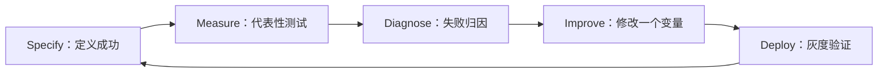
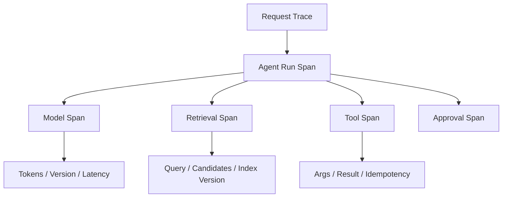
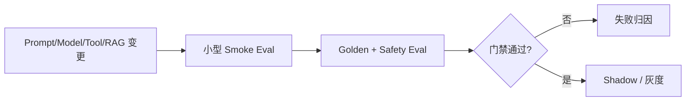

# 07｜Eval、Trace 与 Observability

> 核心问题：**怎样定义“好”，证明改动真的提升，并在一次失败后还原模型为什么做出那条轨迹？**

---

## 0. 分层记忆

**关键词**：Specify–Measure–Improve、Dataset、Golden、Holdout、Grader、Trace、Span、Replay、Regression、A/B、Feedback Flywheel。

**一句话**：Eval 把模糊目标变成可比较标准，Trace 保存一次运行的因果证据，Observability 监测线上分布；三者合在一起才形成可迭代系统。

**60 秒面试回答**：

> 我会从业务任务定义评测，而不是只测最终文案。数据集包含正常、边界、对抗、不可回答和真实 Bad Case，并保留 holdout。指标分为结果、过程、工程和业务：任务成功率、证据与工具正确性、步骤、P95、成本和安全违规。能用代码/规则判定的先用确定性 grader，语义质量再用模型 Judge 并用人工校准。每次 Run 保存模型、Prompt、Tool、知识版本以及每个 Step 的输入输出和错误，支持固定工具结果的 Replay。变更先跑离线 CI Eval，再影子/灰度/A-B，线上反馈继续沉淀为新 Eval。

---

## 1. 第一性原理：先定义“好”

AI 系统输出有分布，单个 Demo 无法证明能力。评测循环：



Eval 的最小单位是：

> **输入/初始环境 + 运行系统 + grader + 指标聚合。**

Agent Eval 还必须构造可交互环境和工具状态，因为任务可能多轮且动作会改变环境。

---

## 2. 指标分层

| 层    | 典型指标                   | 诊断价值    |
| ---- | ---------------------- | ------- |
| 业务结果 | 解决率、转化、人工节省、风险损失       | 是否产生价值  |
| 任务结果 | 任务成功率、答案正确、最终状态        | 端到端是否完成 |
| 过程   | 路由、检索、工具选择/参数、步骤效率     | 为什么成败   |
| 工程   | P50/P95/P99、超时、恢复率、可用性 | 能否稳定服务  |
| 资源   | Token、模型/工具成本、缓存命中、重试  | 是否经济    |
| 安全   | 越权、注入成功、敏感泄露、未确认副作用    | 风险是否可控  |

不要用一个综合分掩盖严重错误。高风险安全违规通常是单独门禁，不与文案质量平均。

---

## 3. 数据集设计

### 3.1 来源

- 真实高频任务；
- 专家定义的关键能力；
- 历史失败与用户纠正；
- 权限、注入、过期、冲突等对抗样本；
- 无答案/需澄清样本；
- 长尾和极端输入。

### 3.2 分层

| 集合 | 作用 |
| --- | --- |
| Dev | 快速迭代，允许频繁查看 |
| Golden regression | 核心不能退化的样本 |
| Holdout | 防对固定测试过拟合 |
| Adversarial | 安全与边界 |
| Online sample | 监测真实分布漂移 |

### 3.3 样本 Schema

```json
{
  "case_id": "agent_042",
  "input": {"goal": "...", "identity": "..."},
  "environment_fixture": "env_v8",
  "expected_outcome": {"ticket_status": "created"},
  "allowed_tools": ["read_metric", "create_ticket"],
  "forbidden_actions": ["restart_production"],
  "required_evidence": ["metric:cpu_5m"],
  "max_steps": 8,
  "tags": ["R1", "unknown_outcome"]
}
```

### 3.4 质量规则

- 样本任务可解且环境完整；
- 参考答案不是唯一可接受措辞时，用 rubric；
- 多人复核高风险样本；
- 版本化 fixture 与数据源；
- 去重并检查泄漏；
- 定期审计“坏题”，不要把错误 benchmark 当目标。

---

## 4. Grader 选择

| Grader               | 最适合                   | 优点       | 风险         |
| -------------------- | --------------------- | -------- | ---------- |
| Code/Rule            | JSON、数值、SQL、安全约束、最终状态 | 快、稳定、可解释 | 语义覆盖有限     |
| Reference comparison | 有标准结果                 | 简单       | 多个正确答案难处理  |
| Model Judge          | 语义正确、完整、风格、证据关系       | 覆盖开放输出   | 偏差、漂移、自洽幻觉 |
| Human                | 高风险、模糊价值判断、校准         | 责任与深度    | 慢、贵、不一致    |

推荐顺序：**能确定性判断的不用模型 Judge；模型 Judge 用人工样本校准，且记录 grader 版本。**

### 4.1 Judge Rubric

一个好 rubric：

- 明确评分维度和等级锚点；
- 要求引用输入证据；
- 将高风险错误单列；
- 不把长度、语气误当正确；
- 随机化顺序，必要时多 Judge/抽样人工复核。

---

## 5. Agent Eval：测轨迹，不只测终点

### 5.1 过程指标

- Tool selection accuracy；
- Argument validity / business validity；
- 不必要 Tool 次数；
- 正确终止率；
- 恢复后重复副作用率；
- 平均/分位步骤；
- evidence coverage；
- clarification precision；
- policy violation rate。

### 5.2 端到端环境

评测环境需要：

- 固定初始数据库/文件/服务状态；
- 模拟或沙盒工具；
- 可重置 fixture；
- 时间、随机数和外部响应可控；
- 副作用可检查；
- 并发和失败注入。

否则同一 Case 的环境变化会污染结果。

### 5.3 错误会累积

多步系统要同时查看：单步能力与端到端完成。优化某个子指标可能伤害总任务，例如召回更多文档提高 Recall，却使上下文噪声增加、最终正确率下降。

---

## 6. Trace 数据模型



### 6.1 最低字段

- trace/run/step/parent IDs；
- user/tenant（脱敏或内部 ID）；
- model/provider/parameters；
- Prompt/System/Tool/Skill/知识版本；
- 输入/输出或受控 Artifact 引用；
- 检索 query、候选、分数、最终 Context；
- 工具参数、错误、业务幂等键、审批；
- Token、延迟、重试、缓存、成本；
- 终止原因、grader 结果、用户反馈。

### 6.2 三个信号的关系

| 信号 | 问题 |
| --- | --- |
| Log | 发生了什么离散事件？ |
| Metric | 一段时间内整体是否异常？ |
| Trace | 这次请求跨组件为什么慢/错？ |

OpenTelemetry 可统一 trace、metric、log 和上下文传播；Agent 特有字段作为 span attributes/events，但注意敏感信息和高基数。

---

## 7. Replay 与回归门禁

### 7.1 Replay 模式

| 模式 | 工具结果 | 用途 |
| --- | --- | --- |
| Exact trace view | 读取历史记录 | 人工复盘 |
| Mock replay | 固定历史 Tool Result | 比较模型/Prompt 变化 |
| Sandbox replay | 在可重置环境重新执行 | 端到端行为验证 |
| Shadow replay | 新版本处理脱敏真实流量但不影响用户 | 上线前分布验证 |

写工具默认不能在生产 Replay。

### 7.2 CI Eval



门禁示例：

- 核心任务成功率不得下降超过阈值；
- R2 未确认执行必须为 0；
- 跨租户泄露必须为 0；
- P95 和单任务成本不能超预算；
- 新增能力样本达到最低成功率。

统计上要报告样本量和置信区间；小样本的 1–2 个波动不要过度解释。

---

## 8. 线上评测与反馈飞轮

### 8.1 上线顺序

离线 Eval → shadow → 内部 dogfood → 小流量灰度 → A/B → 扩量 → 持续监控。

### 8.2 用户反馈不是一个点赞按钮

高价值反馈：

- 用户修改后的正确答案/SQL/规则；
- 放弃、重试、转人工；
- 哪一条引用不支持结论；
- 工具调用被拒绝或撤销；
- 任务实际业务状态；
- 用户对结果的具体分类原因。

每个失败经过隐私处理和人工/规则筛选，成为 Eval candidate；不是未经清洗直接训练。

### 8.3 A/B 的注意点

- 随机化单位要与用户/会话一致，避免污染；
- 先定义主指标与 guardrail；
- 关注新奇效应、网络效应和长期行为；
- 高风险错误不能等待统计显著才停止；
- 记录模型、Prompt、知识、工具的完整 treatment。

---

## 9. 分层面试题与回答

### Q1：如何评测一个 Agent？

从真实任务构造可重置环境；分结果、过程、工程、安全和业务指标；规则/代码 grader 优先，语义用校准过的模型 Judge；保存完整轨迹；离线回归后再 shadow/A-B；线上 Bad Case 回流。

### Q2：LLM-as-a-Judge 有什么问题？

位置/长度/风格偏好、与被测模型共享盲点、Prompt 和版本漂移。需要清晰 rubric、随机化、人工金标校准、确定性约束单独判定，并记录 Judge 版本。

### Q3：Golden Set 怎么维护？

从关键业务、真实高频、历史严重失败中选择；版本化；每个 Case 有 owner、标签和证据；修复线上问题时加入回归；定期去重、审计坏题；另保留 holdout。

### Q4：Trace 和日志有什么区别？

日志是离散事件，Trace 按父子 span 还原一次请求跨模型、检索、工具和数据库的因果链；Metrics 观察总体分布。三者通过 trace ID 关联。

### Q5：怎样定位 RAG Agent 答错？

先看路由，再看正确证据是否召回/重排/进入上下文，再看模型是否忠实使用，然后看工具结果和最终状态；同时检查数据集与 grader 是否有问题。

### Q6：模型输出非确定，CI 怎么做？

使用重复运行或固定随机条件，报告统计；核心安全约束用确定性 grader；对质量设允许波动区间；固定 Tool fixture；关注分桶和严重错误，不要求文本逐字一致。

### Q7：如何评估新模型是否值得切换？

在同一数据集和 Trace fixture 下比较任务成功、分桶能力、P95、Token/价格、工具错误、安全和稳定性；再 shadow 真实分布。模型更强不等于系统更优。

### Q8：线上用户修改怎样回流？

保存原输入、版本、原结果、修改结果和原因；脱敏、去重、确认修改确实正确；加入 candidate 池，经 review 后进入 dev/golden；用回归验证修复而非直接微调。

---

## 10. 项目迁移：RuleArena 评测主线

建议 Eval 分桶：

| 类别 | 样本 | 指标 |
| --- | --- | --- |
| 规则理解 | 条件、例外、时间、主体 | finding correctness |
| 证据 | 正确/冲突/缺失规则 | evidence recall/faithfulness |
| 状态模型 | 可达/非法状态 | deterministic pass rate |
| 多 Agent | 重复/冲突/遗漏 | merge precision、conflict rate |
| 副作用 | 重试、超时、审批 | duplicate side effect、policy violation |
| Runtime | 崩溃、取消、恢复 | recovery success、step loss |

对每次 Commit 自动跑 20 条 Smoke；合并前跑 Golden + Safety；模型/Prompt 大改跑 3 次统计和 shadow。

---

## 11. M3 / M4 实践验收

### M3

- 定义 80–100 个分桶样本和环境 fixture；
- 实现 code grader + model judge + 人工校准；
- Trace 覆盖 model/retrieval/tool/approval；
- 能用 Replay 对比两个版本并定位差异。

### M4

- CI 有 smoke/golden/safety 门禁；
- 有一次模型或 Prompt 消融报告；
- 将真实用户纠正转成 Eval；
- Dashboard 展示成功率、P95、成本、终止/错误分布，并有一次灰度复盘。

---

## 12. 知识 Patch：5 + 2 + 3

### 5 个关键点

1. Eval 先定义成功，再比较改动；
2. Agent 要评结果、过程、工程、成本和安全；
3. 确定性 grader 优先，Judge 需要人工校准；
4. Trace 保存版本和每一步因果，Replay 默认隔离副作用；
5. 线上纠正经过治理后回流，形成持续飞轮。

### 2 个反例

1. 看十个 Demo 都不错就上线，没有 holdout、边界和严重错误门禁；
2. 模型 Judge 给高分，但 Agent 实际越权写入了错误订单状态。

### 3 个迁移

1. RuleArena：建立 CI Eval 与 Trace/Replay；
2. 数驭穹图：把用户改写 SQL 变成候选评测样本；
3. 面试：回答任何优化都给“基线—变量—指标—结论”。

---

## 13. 主要资料

- [Anthropic：Demystifying evals for AI agents](https://www.anthropic.com/engineering/demystifying-evals-for-ai-agents)
- [OpenAI：How evals work—Specify, Measure, Improve](https://openai.com/index/evals-drive-next-chapter-of-ai/)
- [OpenAI：AgentKit and trace grading](https://openai.com/index/introducing-agentkit/)
- [OpenAI：Deployment Simulation](https://openai.com/index/deployment-simulation/)
- [Anthropic：Self-service data analytics and offline evals](https://claude.com/blog/how-anthropic-enables-self-service-data-analytics-with-claude)
- [OpenTelemetry](https://opentelemetry.io/)
- [阿里 Higress：AI 可观测与评测飞轮](https://higress.ai/blog/higress-gvr7dx_awbbpb_ghgh5gf3bfnh1unp/)

