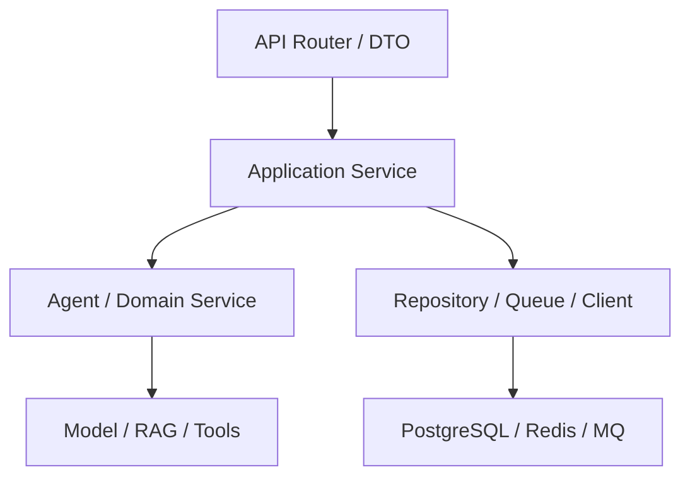

# 08｜Python 异步与 AI 后端

> 核心问题：**怎样用 Python 承载大量慢模型、流式响应、工具 I/O 和长任务，同时避免阻塞、失控并发与资源耗尽？**

---

## 0. 分层记忆

**关键词**：Event Loop、Coroutine、TaskGroup、Cancellation、Timeout、Semaphore、Queue、Backpressure、Connection Pool、SSE、Worker、FastAPI。

**一句话**：asyncio 用协作式调度提高 I/O 并发，不会让 CPU 任务自动并行；生产关键是结构化并发、超时取消、背压和有界资源。

**60 秒面试回答**：

> AI 后端的大部分时间花在模型、检索和外部工具 I/O，适合 asyncio。协程只有在 await 时让出控制，因此 async handler 中调用阻塞 SDK 会阻塞整个 event loop。我会用原生异步客户端、TaskGroup 管理有生命周期的并发、timeout 和取消传播、Semaphore/连接池限制并发、Queue 做生产消费背压。SSE 负责实时事件，但长任务进入持久队列，FastAPI BackgroundTasks 只适合进程内短任务。CPU 密集解析或推理放线程池、进程池或独立服务。最后用并发压测观察 P95、event-loop lag、连接池等待、内存和取消成功率。

---

## 1. 执行模型：IO 并发不等于 CPU 并行

| 任务 | 首选 | 例子 |
| --- | --- | --- |
| 高并发 I/O | asyncio | 模型 API、HTTP、异步 DB、Redis |
| 少量阻塞库 | 线程池 | 无 async SDK 的文件/网络库 |
| CPU 密集 | 进程池/任务服务 | PDF 解析、重排、压缩、大量计算 |
| GPU 推理 | 独立模型服务 | vLLM/供应商 API |
| 长期可靠任务 | 队列/工作流引擎 | 大报告、批量 Agent、索引重建 |

### Event Loop 心智模型

单线程 event loop 调度多个 Task。Task 执行到 `await` 把控制权交回；若做同步阻塞或长 CPU 运算，其他 Task 全部等待。

GIL 的结论不要背成“Python 不能并发”：

- asyncio 的 I/O 并发不依赖多核执行 Python 字节码；
- 线程适合阻塞 I/O，CPU Python 代码受 GIL 影响；
- 进程可用多核，但有序列化和进程开销；
- 具体选择由任务类型与 profiling 决定。

---

## 2. Coroutine、Task 与结构化并发

### 2.1 基本区别

- 调用 `async def` 返回 coroutine object，不会自动执行；
- `await` 在当前 Task 内等待；
- `create_task` 调度并发 Task，必须保存引用并管理生命周期；
- `TaskGroup` 把一组子任务的成功、失败和取消绑定在词法作用域内。

```python
async def gather_evidence(queries, client):
    results = []
    async with asyncio.TaskGroup() as group:
        tasks = [group.create_task(client.search(q)) for q in queries]
    for task in tasks:
        results.append(task.result())
    return results
```

TaskGroup 中一个非取消异常通常会取消同组其他任务，并以异常组报告，比散落的 fire-and-forget 更容易清理和推理。

### 2.2 `gather` 什么时候用

适合收集一组已知 awaitable 的结果；但要明确某个任务失败时是否取消其他任务、是否允许部分结果。不要简单 `return_exceptions=True` 后忽略异常。

---

## 3. Timeout 与 Cancellation

### 3.1 超时要分层

| 层            | 例子             |
| ------------ | -------------- |
| 连接超时         | 建立到模型/工具的连接    |
| 读取超时         | 等待首 Token/下一事件 |
| 单工具截止        | 一次搜索、数据库查询     |
| 单步骤截止        | 一个 Agent Step  |
| 端到端 deadline | 用户请求/Run 总预算   |

内层超时必须受外层 deadline 约束，不能每层都重新获得完整时间。

```python
async with asyncio.timeout(8):
    result = await call_model()
```

### 3.2 正确响应取消

```python
async def stream_work():
    resource = await acquire()
    try:
        await do_work(resource)
    except asyncio.CancelledError:
        await mark_cancel_requested()
        raise
    finally:
        await release(resource)
```

- 用 `finally` 释放连接和临时资源；
- 若捕获 `CancelledError` 做清理，随后重新抛出；
- 宽泛捕获异常可能破坏 TaskGroup/timeout 的结构化取消；
- 外部副作用已开始时，取消不代表操作消失，需查询最终状态。

---

## 4. 有界并发与背压

### 4.1 为什么必须有界

假设每个请求并行调用 5 个工具，100 个并发用户可能瞬间制造 500 个下游调用，耗尽：

- HTTP/DB 连接池；
- Provider rate limit；
- 内存与文件描述符；
- 下游服务容量；
- Token 与预算。

### 4.2 Semaphore

```python
model_slots = asyncio.Semaphore(20)

async def bounded_model_call(payload):
    async with model_slots:
        return await model_client.generate(payload)
```

按 provider、模型、租户、工具分别限额；一个全局 Semaphore 可能造成高优先级任务被低优先级占满。

### 4.3 Queue

```python
queue = asyncio.Queue(maxsize=200)

async def producer(item):
    await asyncio.wait_for(queue.put(item), timeout=0.5)

async def worker():
    while True:
        item = await queue.get()
        try:
            await process(item)
        finally:
            queue.task_done()
```

`maxsize` 让生产速度超过消费时产生背压。进程内 `asyncio.Queue` 不持久，进程崩溃会丢任务；可靠长任务要用外部队列。

### 4.4 容量直觉

Little's Law：

公式：**L = λW**

平均到达率 (λ) 【即单位时间进来多少请求（QPS）】与平均处理时间 \(W\) 【即每个请求在系统内停留多久】决定系统内平均请求数 \(L\)。模型耗时越长，同样 QPS 需要越多在途请求和资源，因此背压比无限扩容更重要。

---

## 5. FastAPI 分层与生命周期

推荐边界：



- Router：HTTP、鉴权依赖、输入输出、错误映射；
- Application Service：用例和事务边界；
- Domain/Agent：业务规则、状态与编排；
- Adapter：模型、MCP、数据库、队列；
- 避免在路由函数中直接堆模型调用和 SQL。

### 5.1 应用生命周期

在 lifespan 中创建/关闭共享资源：HTTP Client、DB Engine、Redis、telemetry。不要每请求新建连接池，也不要在 import 时发网络请求。

### 5.2 同步依赖

FastAPI 可在线程池运行普通 `def` 路由，但这不是无限资源。若 async 路由内部调用同步 SDK，会直接阻塞 event loop；应换 async SDK 或显式 `to_thread`，同时限并发。

### 5.3 HTTP 与 API 契约

后端面试不能只会框架装饰器。至少掌握：

- HTTP 方法、状态码、Header、内容协商、缓存和条件请求；
- 安全与幂等不是同义词：GET 通常安全，PUT/DELETE 语义幂等，POST 可通过业务幂等键实现效果幂等；
- 资源建模、API 版本、分页、过滤、排序、错误码和 OpenAPI；
- 大结果使用 keyset pagination、流式或异步导出；
- 第三方 webhook 需要签名、时间窗、防重放、幂等和状态查询；
- Trace/Request/Run ID 贯穿响应和日志，但不可泄露内部秘密。

Agent API 还要区分：同步生成、流式会话、异步 Run、审批事件、取消和 Artifact 下载。

### 5.4 鉴权、授权与多租户

| 概念 | 问题 | 实现重点 |
| --- | --- | --- |
| Authentication | 你是谁？ | Session/OIDC/OAuth2、密码哈希、MFA |
| Authorization | 你能做什么？ | RBAC/ABAC、资源级权限、scope |
| Tenant isolation | 你能访问哪一组织的数据？ | 服务端 tenant 绑定、DB/缓存/索引隔离 |

JWT 是签名的声明载体，不天然保密，也不自动支持撤销。短期 Access Token + 受保护的 Refresh Token/会话、密钥轮换和 audience/issuer 校验更稳健。Agent 的授权不能只在入口做一次；检索、Tool、Artifact 和高风险操作都要按资源重新判断。

### 5.5 计算机基础最小主线

| 主题 | 必须能解释并关联项目 |
| --- | --- |
| TCP | 三次握手、重传、流量/拥塞控制、keepalive、半连接 |
| HTTP | 1.1 连接复用、HTTP/2 多路复用、代理/超时/缓存 |
| DNS/TLS | 解析链路、证书验证、握手与连接复用 |
| 进程/线程/协程 | 隔离、调度、上下文切换、共享状态 |
| 虚拟内存 | page、缺页、RSS、OOM，为什么大 Context/Artifact 会压内存 |
| 文件与 socket | fd 上限、阻塞/非阻塞 I/O、epoll 的事件通知思路 |
| Linux 排障 | CPU、内存、磁盘、网络、进程、日志、端口和连接 |

学习方式不是背整本操作系统：每个概念必须能回答“它如何造成 Agent P99、连接泄漏、Worker OOM 或流式断开”。

---

## 6. 流式接口：SSE 为主

### 6.1 SSE 适合 Agent 的原因

- 服务端单向推送即可满足 Token/进度事件；
- 基于 HTTP，代理和浏览器支持较简单；
- 可用事件 ID 支持断线续传；
- WebSocket 适合真正双向低延迟交互，但状态和伸缩更复杂。

### 6.2 生产注意

- 设置 `text/event-stream`，关闭代理缓冲；
- 定期心跳；
- 每个事件有 `id`、`event`、`data`；
- 客户端断开时取消生成或转后台任务；
- 不把数据库事务保持到整个流结束；
- 慢客户端需要 bounded buffer 与丢弃/断开策略；
- 事件可从持久 Store 续读，而不是只存在内存。

### 6.3 事件与最终状态

SSE 丢事件不应改变任务真相。客户端重连后查询 Run 状态，再从最后 sequence 拉取事件。

---

## 7. BackgroundTasks、队列与 Worker

| 方式 | 适合 | 不适合 |
| --- | --- | --- |
| FastAPI BackgroundTasks | 响应后短小、可丢失或易重做任务 | 分钟级 Agent、关键通知、大计算 |
| asyncio Task | 当前进程内短生命周期并发 | 需要崩溃恢复的任务 |
| Celery/RQ/Arq/消息队列 | 持久任务、重试、水平扩展 | 极低延迟请求内逻辑 |
| Durable workflow engine | 多阶段、等待人、数小时/天、补偿 | 简单短任务 |

AI 长任务的常见 API：

1. `POST /runs` 返回 `202 + run_id`；
2. Worker 消费任务并更新状态/checkpoint；
3. `GET /runs/{id}` 查询权威状态；
4. `/runs/{id}/events` 以 SSE 推送；
5. `POST /runs/{id}/cancel` 请求取消；
6. 审批/恢复通过幂等事件触发。

---

## 8. 数据库与连接池

连接池是有界资源。并发请求数远大于数据库连接数时，Task 应排队，而不是创建无限连接。

需观测：

- pool size / overflow；
- checkout wait；
- 活跃/空闲连接；
- 事务持续时间；
- 超时和断连；
- N+1 和慢查询。

不要把模型调用放在数据库事务内等待数十秒；先读必要状态，释放事务，模型返回后用版本/条件更新检查并发变化。

---

## 9. 测试与性能验证

### 9.1 测试金字塔

- 单元：Context Builder、路由、策略、错误分类；
- 集成：真实 PostgreSQL/Redis、模型 stub、MCP stub；
- 契约：Provider/Tool Schema 与错误语义；
- E2E：API → queue → Worker → event → final state；
- 故障：超时、取消、连接池耗尽、重复消息、慢客户端；
- 负载：并发、持续、突发、降级恢复。

### 9.2 异步测试

用 `pytest.mark.anyio`/async client；避免把 event loop 生命周期混乱；对时间/重试使用可控时钟；所有 fire-and-forget Task 在测试结束前清理。

### 9.3 指标

- RPS 与并发；
- TTFT（首 Token）、总时长、P95/P99；
- event-loop lag；
- queue depth/age；
- pool wait；
- cancellation latency；
- 内存/连接/文件描述符；
- 下游调用数与重试放大。

---

## 10. 分层面试题与回答

### Q1：asyncio 为什么适合 AI 后端？

模型、检索、数据库和工具调用多数是高延迟 I/O；协程在等待时让出 event loop，可用较少线程承载大量在途请求。但 CPU 密集或同步阻塞需要隔离，且必须有界并发。

### Q2：`async def` 一定更快吗？

不会。它只提供协作式并发。单请求 CPU 计算可能更慢；若内部是同步阻塞，反而阻塞整个 loop。收益取决于 I/O 等待比例、并发和资源上限。

### Q3：TaskGroup 和 gather 有何区别？

TaskGroup 提供结构化并发，作用域退出前等待子任务，一个失败会协同取消其他任务并汇总异常；gather 更像收集 awaitable 结果，失败/取消语义需额外明确。

### Q4：怎样做背压？

入口限流、bounded Queue、Semaphore、连接池、租户配额、下游并发限制；队列过长返回 429/503 或异步受理；监控 queue age，不仅看长度。

### Q5：SSE 断线怎么办？

事件有 sequence 并持久化；客户端携带 last event ID 重连；先查询 Run 权威状态再补事件；生成任务是否取消取决于业务策略，不把网络连接等同任务生命周期。

### Q6：为什么模型调用不应包在数据库事务里？

长等待占用连接和锁，扩大冲突与故障面。先读状态并记版本，事务外调用模型，回来后用乐观锁/条件更新提交，冲突则重新验证。

### Q7：FastAPI BackgroundTasks 能否跑 Agent？

短小且允许进程丢失的响应后工作可以；生产长 Agent 需要持久队列、状态、重试、checkpoint 和独立 Worker。

### Q8：如何处理第三方模型限流？

解析 Retry-After；按 provider/model/tenant 做并发与速率限制；指数退避加 jitter；限制总 deadline 和重试预算；必要时排队、降级模型或返回异步任务。

### Q9：如何定位 P99 突然升高？

从 Trace 分段看 queue wait、pool wait、模型 TTFT、检索、工具和重试；查看 event-loop lag、GC/CPU、连接池、下游限流和队列年龄；按模型/租户/请求类型分桶。

---

## 11. 项目迁移：EnergyOps

建议补证实验：

1. 把三个独立 MCP 读取并发化，用 TaskGroup；
2. Provider、DB、每租户分别限并发；
3. `POST /agent-runs` + Worker + SSE 事件；
4. 支持客户端断线、用户取消和进程重启；
5. 对 10/50/100/200 并发做压测；
6. 比较同步串行、无限并发、有界并发的 P95、错误率和下游调用数；
7. 把结果写成一页性能复盘。

---

## 12. M3 / M4 实践验收

### M3

- 解释 event loop、coroutine、Task、GIL 和四种执行模型；
- 实现 TaskGroup、timeout、cancel、Semaphore、Queue；
- FastAPI 提供异步 Run API、SSE、cancel；
- 正确区分进程内后台任务和持久队列。

### M4

- 故障注入下无 Task 泄漏、连接泄漏和静默取消；
- 100+ 并发压测有 P95、loop lag、pool wait、queue age；
- 证明有界并发比无限并发稳定；
- 留下 profiling、压测脚本、Dashboard 与复盘。

---

## 13. 知识 Patch：5 + 2 + 3

### 5 个关键点

1. asyncio 提高 I/O 并发，不自动提高 CPU 并行；
2. TaskGroup、timeout 和取消构成结构化并发；
3. Queue、Semaphore、连接池共同提供背压；
4. SSE 连接不是任务权威状态；
5. 可靠长任务必须脱离 FastAPI 进程并持久化。

### 2 个反例

1. async 路由里调用同步模型 SDK，单个慢请求阻塞所有协程；
2. `create_task` 后不保存引用，进程退出或异常时任务静默丢失。

### 3 个迁移

1. EnergyOps：做有界并发与故障压测；
2. RuleArena：Run API 与 SSE/Cancel 接入持久 Worker；
3. 面试：所有 async 回答必须主动提阻塞、背压和取消。

---

## 14. 主要资料

- [Python：asyncio Tasks, TaskGroup and cancellation](https://docs.python.org/3/library/asyncio-task.html)
- [Python：asyncio Queue](https://docs.python.org/3/library/asyncio-queue.html)
- [Python：asyncio API index](https://docs.python.org/3/library/asyncio-api-index.html)
- [FastAPI：Concurrency and async/await](https://fastapi.tiangolo.com/async/)
- [FastAPI：Background Tasks](https://fastapi.tiangolo.com/tutorial/background-tasks/)
- [FastAPI：Server Workers](https://fastapi.tiangolo.com/deployment/server-workers/)
- [FastAPI：Async Tests](https://fastapi.tiangolo.com/advanced/async-tests/)
- [RFC 9110：HTTP Semantics](https://www.rfc-editor.org/rfc/rfc9110)
- [RFC 9700：OAuth 2.0 Security Best Current Practice](https://www.rfc-editor.org/info/rfc9700/)
- [FastAPI：OAuth2 Scopes](https://fastapi.tiangolo.com/advanced/security/oauth2-scopes/)
