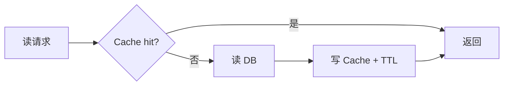
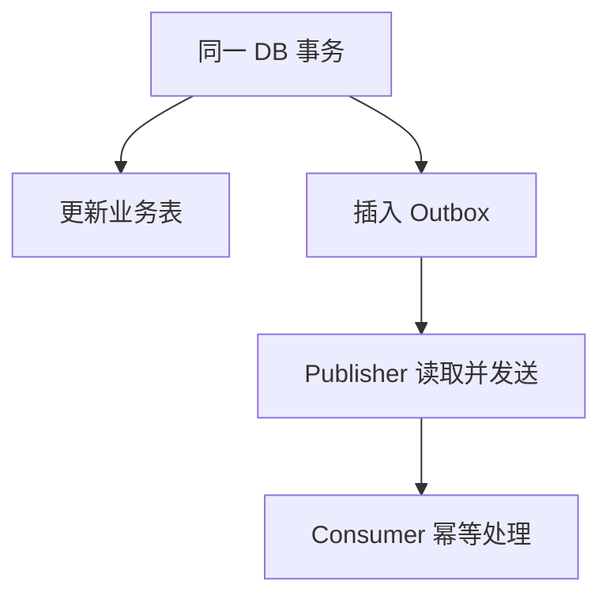

# 09｜数据、缓存、队列与一致性

> 核心问题：**在并发、重试、崩溃和网络不确定下，怎样让 Agent 看到权威状态，并让一个业务动作只产生预期效果？**

---

## 0. 分层记忆

**关键词**：Transaction、MVCC、Isolation、Lock、Index、EXPLAIN、Cache Aside、At-least-once、Idempotency、Outbox、DLQ、State Machine。

**一句话**：数据库维护权威状态，缓存加速读取，队列解耦和削峰；它们的故障语义不同，必须用事务、条件更新、业务幂等和状态机组合，而不是追求口号式 exactly-once。

**60 秒面试回答**：

> 我会把 PostgreSQL 作为业务权威状态，事务保证单库不变量，唯一约束和条件更新抵抗并发；索引用查询模式和 EXPLAIN 验证。Redis 用 Cache Aside、限流或短期去重，但不把缓存当最终事实。消息队列通常提供至少一次投递，所以消费者按业务键幂等，ack 在业务提交后；数据库状态与事件通过 Outbox 同事务记录，再异步发布。任务有显式状态机、attempt、lease、checkpoint 和 DLQ。所谓效果一次来自多层协作，不是仅靠 Broker 配置。

---

## 1. 三种系统的职责

| 组件         | 主要职责                 | 不能默认承担        |
| ---------- | -------------------- | ------------- |
| PostgreSQL | 权威状态、事务、不变量、查询       | 无限吞吐、超低延迟缓存   |
| Redis      | 缓存、限流、短期状态、轻量 Stream | 永不丢失的业务真相     |
| MQ/任务队列    | 异步解耦、削峰、重投递          | 端到端效果一次、业务原子性 |

设计时先写：每个字段的权威来源是谁？其他副本怎样失效、恢复和对账？

---

## 2. PostgreSQL：事务与并发

### 2.1 ACID 的业务落点

- Atomicity：一组状态要么一起提交，要么不提交；
- Consistency：约束/代码使状态从一个合法状态到另一个合法状态；
- Isolation：并发事务的中间结果互不任意干扰；
- Durability：提交后抵抗故障丢失。

数据库不会自动知道业务一致性；外键、唯一/检查约束、事务和应用状态机共同定义它。

### 2.2 隔离级别

| 隔离 | 重点 | 应用策略 |
| --- | --- | --- |
| Read Committed | 每条语句看到当时已提交快照 | PostgreSQL 默认；更新时仍需条件/锁 |
| Repeatable Read | 事务内快照稳定 | 可能序列化失败，需重试 |
| Serializable | 等价于某种串行顺序 | 最强但可能 abort，必须有重试策略 |

不要只背脏读/幻读名称。面试应落到：订单状态、库存扣减、Agent checkpoint 的并发更新如何防丢失。

### 2.3 乐观并发控制

```sql
UPDATE agent_runs
SET status = 'RUNNING', version = version + 1
WHERE run_id = :run_id
  AND status = 'QUEUED'
  AND version = :expected_version;
```

检查受影响行数：0 表示状态/版本已变化，不能覆盖。适合冲突较少、事务外有长模型调用的系统。

### 2.4 悲观锁

`SELECT ... FOR UPDATE` 适合短事务内必须串行修改同一行。不要拿锁后调用外部模型；会长期占用连接和锁，引发死锁/队列。

### 2.5 唯一约束是最终防线

```sql
CREATE UNIQUE INDEX uq_tool_effect
ON tool_effects (tenant_id, operation, business_key);
```

先查再插存在竞态；唯一约束 + 捕获冲突才是数据库级原子保障。

---

## 3. 索引与 EXPLAIN

### 3.1 索引不是越多越好

代价：写放大、空间、vacuum/缓存压力和迁移时间。索引来自真实查询的过滤、连接、排序和唯一性。

### 3.2 联合索引

顺序由等值、范围、排序、选择性和查询组合决定，不只背“最左匹配”。例如多租户常以 `tenant_id` 开头保证过滤和局部性。

### 3.3 Partial Index

```sql
CREATE INDEX idx_runs_active
ON agent_runs (tenant_id, updated_at)
WHERE status IN ('QUEUED', 'RUNNING', 'WAITING_APPROVAL');
```

对少量活跃任务很有效，但查询条件需与谓词匹配。

### 3.4 看 EXPLAIN 的主线

- 实际行数与估计行数差异；
- Seq/Index Scan 是否合理；
- Join 算法与两侧规模；
- Sort/Hash 是否溢出；
- loops 与 N+1；
- buffer hit/read 与总时间；
- 锁等待不一定体现在普通执行计划里。

优化顺序：先减少扫描数据和错误查询，再索引/改写，最后考虑缓存和架构。

---

## 4. Redis 与缓存一致性

### 4.1 Cache Aside



写路径常用：先提交 DB，再删除/更新缓存。无法获得严格同时原子，目标通常是可接受窗口内最终一致，并有 TTL/事件失效/对账。

### 4.2 三类问题

| 问题 | 表现 | 控制 |
| --- | --- | --- |
| 穿透 | 查询不存在键绕过缓存 | 参数校验、短 TTL negative cache、Bloom |
| 击穿 | 热 Key 过期，大量请求打 DB | single-flight/互斥重建、逻辑过期 |
| 雪崩 | 大量 Key 同时过期/Redis 故障 | TTL jitter、多级缓存、限流降级 |

还要处理 hot key、big value、缓存污染和跨租户 key 设计。

### 4.3 分布式锁边界

锁可减少并发执行，但不能替代业务幂等和数据库约束。锁可能过期、持有者暂停、网络分区；关键资源可使用 fencing token/版本号让旧持有者的写入被拒绝。

---

## 5. 消息语义

| 语义 | 含义 | 代价/风险 |
| --- | --- | --- |
| At-most-once | 最多处理一次，可能丢 | 低重复，高丢失风险 |
| At-least-once | 至少到达一次，可能重复 | 常见，需要幂等消费者 |
| Exactly-once effect | 业务效果一次 | 需事务、幂等、状态共同实现 |

### 5.1 Ack 时机

- 处理前 ack：崩溃可能丢；
- 业务提交后 ack：崩溃可能重投，但可用幂等处理；
- 处理超时/lease 到期：另一个 Worker 可能接管，原 Worker 必须防陈旧提交。

### 5.2 消费者幂等

```text
begin transaction
  insert processed_events(event_id) on conflict do nothing
  if already exists: return success
  validate state transition
  apply business change
commit
ack message
```

若事件 ID 每次重投稳定，可以去重；对同一业务意图来自不同消息时，还需要业务键和状态机。

---

## 6. Transactional Outbox

问题：业务事务提交成功，但发消息失败；或消息发出后事务回滚。



Outbox Publisher 也可能重复发送，因此消费者仍幂等。需要监控 backlog、最老事件年龄、发布失败和清理。

---

## 7. AI 长任务数据模型

### 7.1 Run 表

```sql
CREATE TABLE agent_runs (
  run_id uuid PRIMARY KEY,
  tenant_id uuid NOT NULL,
  status text NOT NULL,
  version bigint NOT NULL DEFAULT 0,
  goal_ref text NOT NULL,
  checkpoint_ref text,
  attempt int NOT NULL DEFAULT 0,
  lease_owner text,
  lease_until timestamptz,
  next_retry_at timestamptz,
  terminal_reason text,
  created_at timestamptz NOT NULL,
  updated_at timestamptz NOT NULL
);
```

### 7.2 必要配套

- `agent_steps`：每个模型/检索/工具步骤；
- `tool_effects`：业务幂等、intent、结果与 unknown；
- `run_events`：SSE sequence 与审计；
- `artifacts`：对象存储 URI、hash、ACL；
- `outbox`：状态变更事件；
- `approvals`：动作 hash、决定、过期。

### 7.3 状态转换

必须用允许边表或代码检查：例如 `SUCCEEDED` 不可重新变 `RUNNING`；`CANCELLED` 后迟到 Worker 的写入通过 version/fencing 被拒绝。

---

## 8. 重试、DLQ 与 Poison Message

### 8.1 重试只对暂时性错误

- 网络抖动、429、短暂 5xx：退避+jitter；
- 参数错误、权限拒绝、业务冲突：不自动重试；
- unknown outcome：查询状态；
- 超过次数/截止时间：DLQ 或人工。

### 8.2 DLQ 不是垃圾桶

记录原消息引用、错误分类、attempt、版本、最后 Trace；提供 inspect/replay/discard 操作，Replay 前验证 bug 已修复且副作用安全。监控 DLQ 速率和年龄。

---

## 9. 分层面试题与回答

### Q1：如何保证消息不重复消费？

Broker 通常只能保证至少一次；消费者用稳定事件 ID/业务幂等键、唯一约束、状态机和事务，使重复消息不产生重复业务效果。ack 在提交后。

### Q2：什么是 Outbox？

把业务变更和待发布事件写入同一数据库事务，再由独立 Publisher 发送，解决 DB 提交与发消息的双写不一致；发送可能重复，所以消费者仍幂等。

### Q3：Redis 缓存和数据库不一致怎么办？

明确数据库权威；写 DB 后失效/更新缓存；TTL + jitter；必要时 Outbox/CDC 驱动失效；缓存读取携带版本；对关键数据直接读 DB 或强一致路径；有对账与监控。

### Q4：乐观锁和悲观锁怎么选？

冲突少、外部操作长用版本条件更新；冲突高且短事务必须串行可用行锁。无论哪种，都避免锁内调用模型/外部 API，并处理重试与死锁。

### Q5：Agent 任务被两个 Worker 同时执行怎么办？

用 queue lease/visibility timeout、数据库条件抢占、lease_owner/lease_until 与 fencing version；每个步骤和副作用幂等；迟到 Worker 更新时版本不匹配被拒。

### Q6：怎样设计业务幂等键？

从“同一业务意图”推导，稳定且作用域明确，如 tenant + incident + create_ticket；服务端唯一约束；定义结果保存期限、冲突参数处理和状态查询。

### Q7：索引为什么没被用？

可能选择性低、统计不准、查询表达式/类型不匹配、谓词不满足 partial index、函数包裹列、成本估算认为顺扫更便宜。用 EXPLAIN ANALYZE/BUFFERS 和真实数据验证。

### Q8：Redis Stream 能否替代 Kafka/Celery？

可做中小规模流和 consumer group，提供 XREADGROUP/XACK 与待处理追踪；但持久、保留、分区、运维、重放和生态需求不同。按可靠性/吞吐/运维选择，不因已用 Redis 就默认替代。

---

## 10. 项目迁移

### EnergyOps

- 任务从 APScheduler/进程内执行升级为持久 Queue；
- `run/version/lease/checkpoint` 抵抗重复 Worker；
- 告警和建单使用业务幂等键与唯一约束；
- 数据接入与质量事件用 Outbox；
- 压测连接池等待、索引和活跃任务 partial index。

### Ovanta

- 订单、支付、权益写入事务和状态机；
- 支付超时用商户订单号查询，不能重复扣款；
- 支付成功与权益发放用 Outbox + 幂等消费者；
- Webhook 验签、防重放、唯一事件 ID。

---

## 11. M3 / M4 实践验收

### M3

- 用 SQL 演示丢失更新并用乐观锁/唯一约束修复；
- 对真实查询写索引并读 EXPLAIN ANALYZE；
- 实现 Cache Aside、TTL jitter、single-flight；
- 实现至少一次队列、幂等消费者、Outbox 和 DLQ。

### M4

- 故障注入：DB 提交后发布崩溃、消息重复、Worker lease 过期、Redis 故障；
- 业务最终状态正确且无重复副作用；
- 有 Outbox lag、queue age、DLQ、pool wait、慢 SQL Dashboard；
- 完成一次账单/支付/任务恢复对账复盘。

---

## 12. 知识 Patch：5 + 2 + 3

### 5 个关键点

1. PostgreSQL 是权威状态，缓存与消息都是派生/传输层；
2. 唯一约束和条件更新是并发正确性的关键防线；
3. Cache Aside 通常提供有界最终一致，不是原子同步；
4. 至少一次投递要求业务幂等消费者；
5. Outbox 解决双写，但不消除重复投递。

### 2 个反例

1. 先查是否存在再插入，没有唯一约束，并发下创建两条记录；
2. Worker 处理消息前 ack，随后崩溃，任务永久丢失。

### 3 个迁移

1. EnergyOps：落地 lease + Outbox + DLQ；
2. Ovanta：支付 unknown outcome 与权益幂等；
3. 面试：一致性回答从权威状态和故障窗口开始，不背口号。

---

## 13. 主要资料

- [PostgreSQL：Transaction Isolation](https://www.postgresql.org/docs/current/transaction-iso.html)
- [PostgreSQL：Multicolumn Indexes](https://www.postgresql.org/docs/current/indexes-multicolumn.html)
- [PostgreSQL：Partial Indexes](https://www.postgresql.org/docs/current/indexes-partial.html)
- [PostgreSQL：Using EXPLAIN](https://www.postgresql.org/docs/current/using-explain.html)
- [PostgreSQL：Unique Indexes](https://www.postgresql.org/docs/current/indexes-unique.html)
- [Redis：Cache Aside](https://redis.io/docs/latest/develop/use-cases/cache-aside/)
- [Redis：Streaming](https://redis.io/docs/latest/develop/use-cases/streaming/)
- [Redis：Rate Limiter](https://redis.io/docs/latest/develop/use-cases/rate-limiter/)

