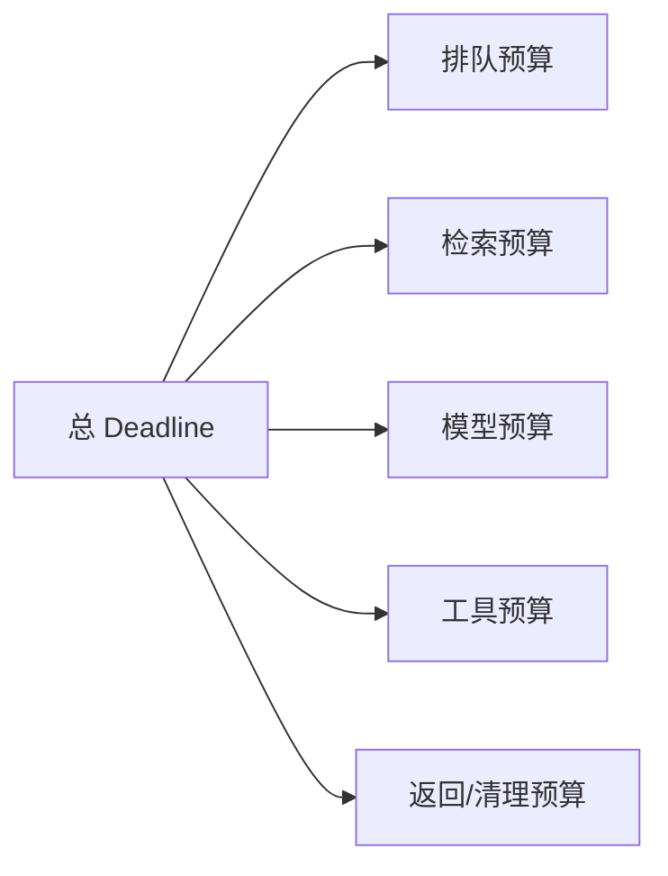
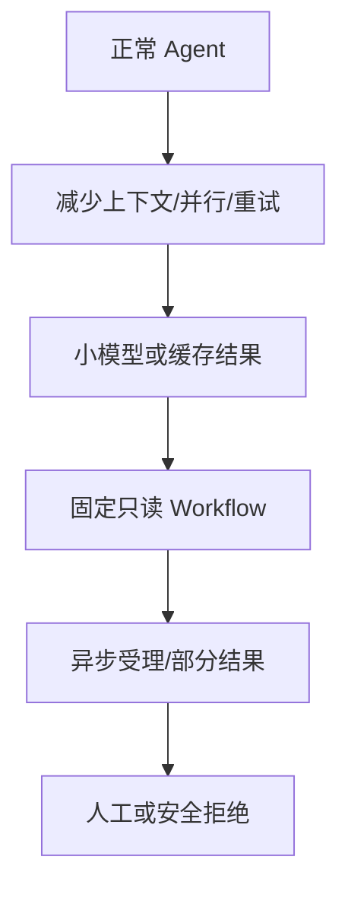
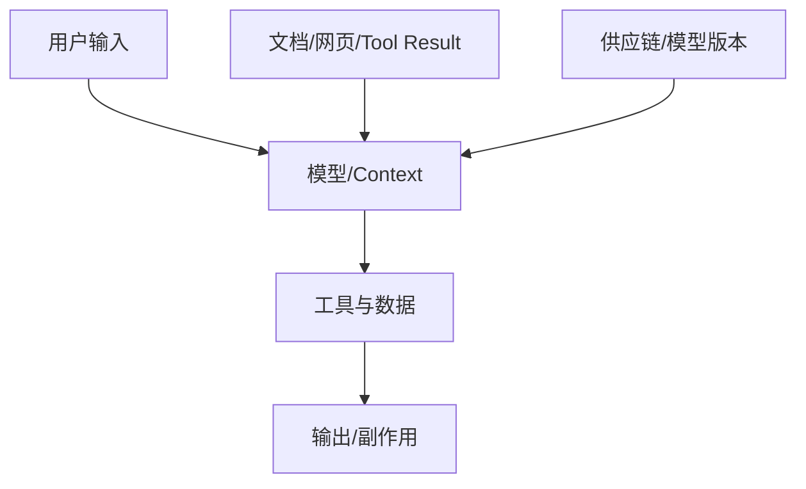
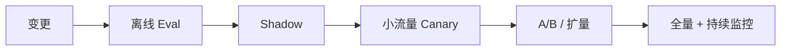

# 10｜生产治理、安全、性能与成本

> 核心问题：**当流量、故障、攻击、模型漂移和成本同时出现时，怎样让 AI 系统可上线、可扩展、可回滚？**

---

## 0. 分层记忆

**关键词**：SLI/SLO、Error Budget、Timeout Budget、Retry/Jitter、Circuit Breaker、Bulkhead、Rate Limit、Degrade、Canary、Rollback、Prompt Injection、Excessive Agency、Cost Routing。

**一句话**：生产化是在概率模型外建立确定性约束层，用 SLO、容量、降级、安全策略、版本和观测把质量、延迟、成本与风险控制在预算内。

**60 秒面试回答**：

> 我会先按业务定义 SLI/SLO，包括任务成功、可用性、P95、恢复率和高风险错误；再把端到端 deadline 分配给模型、检索和工具。入口做租户限流与并发控制，下游调用有超时、有限重试、指数退避加 jitter、熔断和 bulkhead，过载时按“减少并行/上下文 → 降级模型或只读 Workflow → 异步受理/转人工”逐级降级。安全上把外部内容视为不可信，权限在执行层校验，高风险工具确认并沙盒隔离。模型、Prompt、Tool、知识和策略全部版本化，先离线 Eval、shadow、灰度，再按错误预算扩量，Trace 支持回滚和复盘。

---

## 1. 生产目标：四维预算

| 维度     | 关键问题          | 指标示例                               |
| ------ | ------------- | ---------------------------------- |
| 质量     | 任务能否正确完成？     | success rate、faithfulness          |
| 延迟/可靠性 | 用户能否及时稳定获得结果？ | TTFT、P95/P99、availability、recovery |
| 成本     | 每个成功任务花多少？    | cost/success、Token、工具与重试成本         |
| 风险     | 错误影响是否受控？     | 越权、泄露、未确认副作用、严重错误                  |

优化的是可行域，不是单一准确率。质量提高但成本 10 倍、P95 超过用户耐心，系统仍不可用。

---

## 2. SLI、SLO 与错误预算

### 2.1 AI 系统 SLI

- API 可用性和端到端成功率；
- TTFT、总时长、异步任务完成时间；
- 经 Eval 或用户结果确认的任务成功；
- 恢复成功率、重复副作用率；
- 检索/工具/模型分层错误率；
- 安全/权限违规；
- 单成功任务成本。

### 2.2 SLO 要按任务等级分层

| 任务 | 示例 SLO 思路 |
| --- | --- |
| 在线问答 | 首 Token 快、可降级、无越权 |
| 数据分析 | 总耗时可更长，结果/引用正确更重要 |
| 高风险执行 | 延迟次要，确认和效果一次必须严格 |
| 离线批任务 | 完成期限、恢复率、单位成本优先 |

### 2.3 错误预算

SLO 允许的失败额度用于平衡迭代速度和可靠性。严重安全事件不应被普通错误预算平均；它们是独立零容忍/极低容忍门禁。

---

## 3. Deadline、Timeout 与 Retry

### 3.1 端到端时间预算

每个下游调用用剩余 deadline，而不是层层重新计时。还需区分连接、读取、首 Token 和总调用超时。

### 3.2 重试的三个条件

1. 错误是暂时性的；
2. 操作幂等或已确认未生效；
3. 仍有 deadline 和重试预算。

指数退避加 jitter 避免大量客户端同时重试：

$$delay_n = \min(cap, base \times 2^n) + jitter$$

### 3.3 重试风暴

若服务链每层都重试 3 次，最坏放大呈乘法。重试应集中在最了解语义的一层，并限制总次数；过载时优先快速失败/削峰，而不是继续加压。

---

## 4. 过载保护

| 机制                | 解决问题        | 关键点                         |
| ----------------- | ----------- | --------------------------- |
| Rate limit        | 限制时间窗口请求量   | 按用户/租户/模型/工具；返回 Retry-After |
| Concurrency limit | 限制在途昂贵工作    | Semaphore、Provider slots    |
| Queue             | 吸收短期突发      | 有界、监控 age、超限拒绝              |
| Load shedding     | 主动拒绝低优先级    | 保住核心流量                      |
| Circuit breaker   | 下游持续失败时快速失败 | half-open 探测、避免长时间雪崩        |
| Bulkhead          | 隔离资源池       | 不让一个模型/租户拖垮全部               |
| Cache             | 避免重复计算      | 版本、权限、TTL、污染控制              |

### 降级阶梯

降级结果要明确标识，不能把低质量结果伪装成正常成功。

---

## 5. 模型路由与成本工程

### 5.1 单任务成本

$$C_{task}=C_{input}+C_{output}+C_{tools}+C_{retrieval}+C_{retries}+C_{infra}$$
其中 **$C_{retries}$ 是最容易被低估的隐藏成本**——它不只是多付几次 API 费用，还包括：

- 重试带来的额外 $C_{input}$ + $C_{output}$
- 重试拉长的端到端延迟，可能导致用户超时放弃（间接损失）
- 重试对下游服务的额外压力（可能加剧失败率，形成恶性循环）

更有意义的指标：

$$C_{success}=\frac{\text{总成本}}{\text{成功任务数}}$$
原因就是：成功率低 → 重试多 → $C_{retries}$ 呈指数级放大 → 总成本被拖垮。

便宜模型若失败和重试多，`cost per successful task` 可能更高。

### 5.2 优化顺序

1. 删除无价值任务/步骤；
2. 改善路由和终止，减少错误调用；
3. 压缩 Context/Tool Result，利用稳定前缀缓存；
4. 并行真正独立步骤，避免盲目 fan-out（一个任务同时派生出多个子任务去并行执行）；
5. 按复杂度/风险路由模型；
6. 批处理 Embedding/离线任务；
7. 再考虑价格与基础设施优化。

### 5.3 路由策略

| 任务 | 模型策略 |
| --- | --- |
| 简单分类/抽取 | 小模型 + Schema |
| 常规问答 | 中等模型 + RAG |
| 多步高价值分析 | 强模型 + 工具 + 验证 |
| 高风险执行 | 强模型提出 + 确定性验证 + 人工确认 |

不要只用模型自评难度；可结合规则、历史成功率、输入特征和预算。

---

## 6. AI 安全威胁模型

### 6.1 五个面

每个面都可能引入不可信数据、越权、泄露或错误执行。

### 6.2 高频风险

| 风险                       | 例子                        | 主要控制                    |
| ------------------------ | ------------------------- | ----------------------- |
| Prompt Injection         | 文档诱导忽略规则并传出秘密             | 不可信数据隔离、最小工具、执行层授权      |
| Sensitive disclosure     | Prompt/Trace 泄露 PII/Token | 数据最小化、脱敏、加密、访问审计        |
| Insecure output handling | 把模型输出直接拼 SQL/HTML/命令      | Schema、AST、转义、参数化、沙盒    |
| Excessive agency         | Agent 有过多功能/权限/自治         | 工具收窄、R0/R1/R2、HITL、额度   |
| DoS/resource abuse       | 超长输入、工具循环、并发 fan-out      | 大小/步数/成本/并发限制           |
| Supply chain             | MCP/Skill/依赖被替换           | 签名、版本锁、审查、权限隔离          |
| Data poisoning           | 知识库被写入恶意/错误内容             | Source owner、审核、版本、异常检测 |

### 6.3 防御原则

- 模型不在信任边界内；
- 外部内容是数据，不是高优先级指令；
- 先授权再检索/执行，最小权限；
- 高风险动作展示具体影响并确认；
- 代码/浏览器/文件在隔离环境；
- 结果校验、引用、审计和可撤销；
- 日志和 Eval 数据也受隐私治理。

---

## 7. 多租户与隐私

- 所有表、缓存 Key、对象存储和向量索引有租户边界；
- 授权在服务端按资源验证，不信客户端传来的 tenant；
- RAG 检索前 ACL；
- Prompt/Trace 默认不记录秘密与完整 PII；
- 数据保留、导出、删除和用户记忆可控；
- 加密传输/存储，密钥轮换；
- Provider 数据策略按业务合规审查；
- 线上数据进入 Eval 前脱敏和最小化。

---

## 8. 版本、发布与回滚

### 8.1 AI 应用需要组合版本

一次运行至少绑定：

- 应用代码；
- 模型/provider/参数；
- System Prompt/模板；
- Tool/MCP/Skill；
- 知识索引与 Embedding；
- Policy/guardrail；
- Eval dataset/grader。

### 8.2 发布流程

- 数据库/Tool Schema 做向前向后兼容；
- 长 Run 继续使用启动时版本，或定义迁移；
- 回滚不只回代码，必须能恢复 Prompt/模型/索引/策略组合；
- 新约束可先 shadow，只记录会拦截什么，再灰度 enforce；
- 设置自动停止条件：严重安全错误、P95/成本/成功率越界。

### 8.3 部署与交付底线

- Docker 使用可信、精简且固定版本/摘要的基础镜像，多阶段构建，非 root 运行；
- 镜像不含密钥，依赖/镜像扫描并生成可追踪版本；
- 进程无状态，Run/事件/Artifact 外置，才能水平扩展；
- Nginx/API Gateway 负责 TLS、请求大小、基础限流和路由；SSE 路径关闭响应缓冲并配置合理超时；
- readiness 只在真正可接流量时通过，liveness 不应因短暂下游故障反复杀进程；
- 优雅停机停止接新请求、释放 lease、保存 checkpoint、在 deadline 内清理；
- CI 至少运行 lint/type/test/security/Eval；CD 记录制品、配置、迁移和组合版本；
- 数据库迁移采用 expand → migrate → contract，避免新旧版本同时运行时不兼容。

---

## 9. 可观测与告警

### 9.1 Dashboard 最小集合

- 请求量、任务成功率、P95/P99、TTFT；
- 按模型/租户/任务的 Token 与成本；
- Queue depth/age、Worker 利用率、恢复率；
- Tool 错误、限流、重试、unknown outcome；
- RAG Recall proxy、无答案、引用缺失；
- 终止原因、步骤数、循环检测；
- policy block、越权尝试、安全事件。

### 9.2 告警原则

告警面向用户影响和行动：SLO burn rate、队列老化、严重安全违规、下游连续失败、成本突增。每条告警有 runbook、owner、trace 示例和降级/回滚动作。

---

## 10. 故障矩阵

| 故障               | 用户影响  | 自动措施              | 人工措施               |
| ---------------- | ----- | ----------------- | ------------------ |
| 模型 429/超时        | 慢/失败  | 限制重试、排队、小模型/异步    | 调整配额/路由            |
| 向量索引滞后           | 旧答案   | 显示版本、降级权威查询       | 修复摄取/回滚            |
| Tool 5xx         | 任务中断  | 熔断、幂等重试、部分结果      | 处理 unknown outcome |
| DB pool 耗尽       | 全链路慢  | load shed、减少并发    | 查长事务/泄漏            |
| Queue backlog    | 长任务延迟 | 扩 Worker/拒绝低优先级   | 容量复盘               |
| Prompt Injection | 越权企图  | policy block、工具隔离 | 安全调查/规则更新          |
| 新模型质量退化          | 错误增加  | 自动停止灰度/回滚         | Eval 归因            |
| 成本突增             | 预算超标  | 限额、模型/步骤降级        | 查循环/滥用/版本          |

---

## 11. 分层面试题与回答

### Q1：怎样把 Agent 上生产？

先有任务 Eval 和风险边界；Runtime 持久状态/恢复；工具授权/幂等；异步、背压和 SLO；完整 Trace；版本组合；离线→shadow→canary；降级、回滚和 runbook。不是部署一个接口就结束。

### Q2：如何设计超时和重试？

端到端 deadline 向下传递；连接/读取/单步分层超时；只重试暂时错误、幂等动作且仍有预算；指数退避+jitter；写超时先查状态；避免层层重试放大。

### Q3：怎样做降级？

按业务风险预先设计阶梯：减少步骤/上下文、缓存、小模型、只读 Workflow、异步/部分结果、人工/拒绝。降级状态明确展示并进入指标。

### Q4：Prompt Injection 能靠 Prompt 防住吗？

不能。Prompt 只是一层提示。核心是信任边界：外部内容当数据、最小工具和权限、独立参数授权、沙盒、结果验证、高风险确认和审计。

### Q5：如何优化 AI 成本？

用 cost per successful task；先减少无价值步骤和错误路由，再压缩 Context/Tool Result、缓存、模型分层、批处理；评估对成功率/P95 的影响，不只看 Token 单价。

### Q6：模型更新如何灰度？

固定组合版本；同一 Eval 对比；shadow 脱敏真实流量；按用户/租户稳定分流；设置质量/安全/P95/成本 guardrail；保存 treatment；异常自动停止并回滚。

### Q7：如何设计多租户 Agent？

身份上下文贯穿 API、检索、Tool、DB、Cache、Artifact 和 Trace；服务端资源级授权；每租户配额/并发；缓存和索引隔离；跨租户安全测试；审计和数据生命周期。

### Q8：AI 服务的 SLO 如何定义？

不只 API 200。按任务类别定义可用性、验证成功率、TTFT/总时长、恢复、成本和风险；高风险违规单独门禁；用错误预算决定扩量或冻结变更。

### Q9：如何防级联故障？

有界资源、超时、重试预算+jitter、熔断、bulkhead、load shedding、降级、容量/过载测试；下游恢复时缓慢放量，避免积压瞬间冲击。

---

## 12. 项目迁移：生产证据组合

### EnergyOps

- 为任务成功、P95、恢复率、重复动作、成本定义 SLO；
- 做模型/Tool/DB 故障矩阵和 runbook；
- OTel Trace 串联 API → Agent → MCP → DB；
- 按租户、模型和工具限流；
- Prompt/Tool/规则版本灰度和回滚。

### 数驭穹图

- 高成本 SQL 预算与查询取消；
- 权限与 Prompt Injection Eval；
- Schema/Embedding/索引组合版本；
- 执行失败降级为解释/澄清，不伪造数据。

### RuleArena

- R2 修复发布强确认；
- 沙盒运行状态模型；
- 多 Agent fan-out 和成本预算；
- 安全、质量、延迟门禁与 shadow policy。

---

## 13. M3 / M4 实践验收

### M3

- 为一个 Agent 服务写 SLO、容量估算、降级阶梯和故障矩阵；
- 实现 timeout/retry/jitter/limit/breaker/bulkhead；
- 完成 Prompt Injection、越权、泄露和过度代理测试；
- 组合版本可灰度和回滚。

### M4

- 做一次过载测试、一次恢复演练、一次安全红队；
- Dashboard 与告警可定位到 Trace；
- 灰度触发自动停止并成功回滚；
- 输出一次成本/成功率帕累托对比和 incident 复盘。

---

## 14. 知识 Patch：5 + 2 + 3

### 5 个关键点

1. SLO 应包含验证后的任务结果，不只是 HTTP 可用；
2. deadline、有限重试、jitter 和有界资源共同防级联；
3. 降级必须预先设计且对用户透明；
4. 安全依赖确定性信任边界，不依赖模型自律；
5. AI 发布是代码、模型、Prompt、Tool、知识和策略的组合版本发布。

### 2 个反例

1. 每层都重试三次，下游过载时流量被指数放大；
2. 新 Prompt 直接全量，错误后只回滚代码却找不到旧索引和 Tool 版本。

### 3 个迁移

1. EnergyOps：补 SLO/降级/OTel/故障演练；
2. RuleArena：做安全门禁与 shadow policy；
3. 面试：系统设计结尾统一收束到质量、P95、成本、风险和回滚。

---

## 15. 主要资料

- [Google SRE：Addressing cascading failures](https://sre.google/sre-book/addressing-cascading-failures/)
- [Google SRE：Monitoring distributed systems](https://sre.google/sre-book/monitoring-distributed-systems/)
- [Google SRE：Reliable product launches](https://sre.google/sre-book/reliable-product-launches/)
- [OWASP：Top 10 for LLM Applications](https://owasp.org/www-project-top-10-for-large-language-model-applications/)
- [Anthropic：Trustworthy AI agents](https://www.anthropic.com/research/trustworthy-agents)
- [Anthropic：Measuring agent autonomy](https://www.anthropic.com/research/measuring-agent-autonomy)
- [OpenAI：New tools for building agents](https://openai.com/index/new-tools-for-building-agents/)
- [阿里 Higress：Agent 基础设施与约束](https://higress.ai/blog/higress-mmse_awbbpb_ulz1m97a0tcbd95k/)
- [Docker：Build best practices](https://docs.docker.com/build/building/best-practices/)
- [Nginx：HTTP proxy buffering](https://nginx.org/en/docs/http/ngx_http_proxy_module.html)
