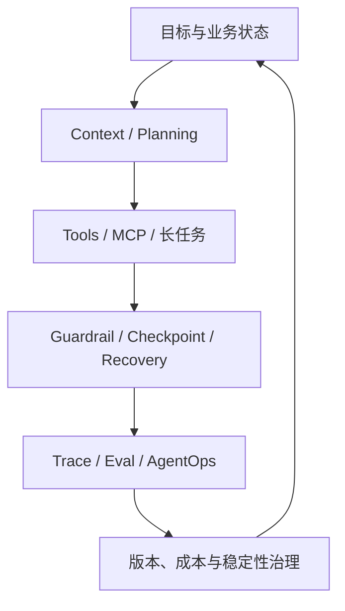

# 字节跳动 AI 应用开发岗位：融合 JD 与能力核对表

> 调研日期：2026-09-01  
> 目标画像：2027 届 AI 应用开发 / Agent 后端工程师（Python）  
> 主要样本：AI Agent 服务端、Agent 开发、Agent 开发套件、经营平台、AI 全栈、AI Platform

---

## 0. 核心结论

字节的岗位要求最明显地把 Agent 从“应用功能”推进为“生产运行时”：

> **既要构建 RAG、Context、Tool/MCP、多 Agent 和长任务编排，也要治理 Prompt/模型版本、限流降级、成本、可观测、AgentOps 与系统稳定性。**

字节更看重以下组合：

1. 扎实代码、算法和后端工程；
2. Agent Harness/运行时，而非只会框架编排；
3. RAG、上下文、工具、MCP、多 Agent；
4. 长任务、状态、异常恢复和执行可靠性；
5. Prompt/模型版本、Trace、Eval、AgentOps；
6. 高并发、性能、稳定性、限流降级和成本；
7. AI Coding 驱动的快速端到端交付；
8. 研究和工程并重，能跟踪论文/开源并落地。

对你的匹配度很高，但技术面门槛也高。最应补的是 Python 异步/高并发、Agent Runtime、Eval/Observability 和 CS 基础。

---

## 1. 岗位分流

| 岗位簇 | 典型内容 | 匹配度 | 准备策略 |
| --- | --- | --- | --- |
| AI Agent 服务端 | 应用全流程、RAG、Agent、MCP/工具 | **最高** | 主投 |
| Agent 开发/Harness | 工具执行、上下文、轨迹、运行时 | **最高** | 补底层机制与测试 |
| Agent 开发套件 | 数据开发/治理 Agent、Context、Tool、多 Agent | **最高** | 数驭穹图强匹配 |
| 经营平台 Agent | Tools/MCP、长任务、版本、限流降级、成本 | **最高** | EnergyOps 强匹配 |
| AI 全栈 | 前后端、AI Coding、业务交付 | 高 | 后端主导，补前端 |
| AgentOps/AI Platform | Trace、Eval、平台、LangSmith/Langfuse | 高 | 补观测和评测 |
| AI Agent 算法 | 训练、SFT/RL、轨迹优化 | 中低 | 算法分支 |
| AI Infra | 模型训练/推理、算力、底层系统 | 低到中 | 仅投偏 Agent 后端的部分 |

### 1.1 对你的最佳顺序

1. 经营/数据/研发效能类 Agent 服务端；
2. Agent 开发套件与 Harness；
3. AI Platform 中偏 AgentOps/Eval 的后端；
4. 后端主导 AI 全栈；
5. 纯算法、模型训练和底层 Infra 降级。

---

## 2. 第一性原理：为什么字节强调 AgentOps

规模化 Agent 有四种随机性：模型输出、检索结果、工具环境和业务状态。若不记录版本和轨迹，同一次失败无法复现；若不治理并发和成本，开放式循环会放大资源消耗。

因此 AgentOps 不是上线后的补丁，而是运行时的一部分：每次模型、Prompt、工具、上下文和状态变化都必须可追踪、可比较、可回放。

---

## 3. 融合后的字节岗位 JD

### 3.1 岗位名称

**AI Agent 服务端 / Agent Harness 研发工程师**

### 3.2 岗位定位

面向开发者服务、数据平台、经营平台、抖音/豆包/飞书及国际业务，建设 Agent 应用和通用运行时，负责上下文、RAG、工具、长任务、后端服务、评测、观测、性能和成本，使 AI 稳定、可控、可观测地进入业务。

### 3.3 融合岗位职责

1. 负责 AI 应用全流程，从场景定义、原型验证到系统上线和指标迭代；
2. 建设 Agent Harness：Loop、Planning、Context、Memory、Tool、终止和异常处理；
3. 构建 RAG、模型上下文管理、工具调用、MCP 和多 Agent 编排；
4. 建设 Tools/MCP 层与长任务编排，处理状态、checkpoint、重试和恢复；
5. 建设 Prompt、模型、知识库和工具版本管理；
6. 开发高并发后端，完成 API、流式、存储、缓存、队列和服务治理；
7. 建设 AI 调用限流、降级、熔断、模型路由和成本治理；
8. 建设 Trace、Eval、Replay 和 AgentOps 平台，支持质量回归与问题定位；
9. 参与稳定性、性能、可用性和安全优化；
10. 使用 AI Coding 提升端到端研发效率，并沉淀团队方法与工具；
11. 跟踪 Agent 技术和论文，通过实验、基准和业务数据推动落地。

### 3.4 校招硬门槛

- 2027 届本科及以上，计算机/人工智能/数学等相关专业优先；
- 代码能力、数据结构和基础算法扎实；
- 熟练至少一门 Java/Go/Python/C++/JavaScript 等语言；
- 理解 LLM 应用、Agent、RAG 和工具调用；
- 能完成工程项目并定位问题；
- 有学习、研究、协作和快速落地能力。

### 3.5 强竞争力要求

- RAG、Context、Tool Use、MCP、多 Agent 实际落地；
- Agent Harness、长任务和异常恢复；
- LangSmith/Langfuse 等 AgentOps 或自建 Trace/Eval；
- 高并发、性能调优、流式、限流降级与成本；
- AI Coding/Skills/Prompt 工程的深度项目应用；
- Java/Spring + Python 或 Go/Python 双栈阅读与联调；
- 开源、论文复现或可展示 Agent 产品。

---

## 4. 掌握标准

M0 未接触；M1 能解释；M2 参考实现；M3 独立实现、选型、排障；M4 有工程证据、测试、指标、复盘。`E/G/U` 代表已有证据、明确缺口、待核对。

---

## 5. 能力核对表

### 5.1 Agent Harness 与上下文

| ID | 优先级 | 核对项 | M3 验收 | 当前判断 |
| --- | --- | --- | --- | --- |
| BD-A01 | P0 | Agent Loop | 自己实现模型/工具循环、预算和终止 | G/M2 |
| BD-A02 | P0 | Planning | ReAct、Plan-Execute、Workflow/DAG 取舍 | G/M1 |
| BD-A03 | P0 | Context 管线 | 选择、排序、裁剪、压缩、缓存、分支 | G/M2 |
| BD-A04 | P0 | State/Memory | 权威/运行/会话/长期记忆分层 | G/M2 |
| BD-A05 | P0 | Harness 接口 | 模型、工具、状态、策略可插拔并可测试 | G/U |
| BD-A06 | P0 | 终止与纠错 | 死循环、无进展、预算耗尽、重复调用检测 | G/M1 |
| BD-A07 | P1 | Multi-Agent | 调度、共享状态、冲突、隔离和回收 | G/M1 |

### 5.2 Tool/MCP 与长任务

| ID | 优先级 | 核对项 | M3 验收 | 当前判断 |
| --- | --- | --- | --- | --- |
| BD-T01 | P0 | Tool Schema | 类型、错误、权限、结果语义和版本 | E/M2 |
| BD-T02 | P0 | MCP Server/Client | 鉴权、流式、超时、取消和错误映射 | E/M2 |
| BD-T03 | P0 | Side-effect | 幂等、确认、补偿、审计、最小权限 | E/M2 |
| BD-T04 | P0 | 长任务状态机 | pending/running/waiting/succeeded/failed/cancelled | E/M2 |
| BD-T05 | P0 | checkpoint/recovery | 安全恢复且不重复外部副作用 | G/M2 |
| BD-T06 | P0 | 并行与背压 | 限并发、依赖、聚合、取消和资源回收 | G/M1 |
| BD-T07 | P1 | 沙盒 | 代码/浏览器/工具的网络、文件和资源限制 | G/U |

### 5.3 RAG、模型与版本

| ID | 优先级 | 核对项 | M3 验收 | 当前判断 |
| --- | --- | --- | --- | --- |
| BD-R01 | P0 | RAG 全链路 | 解析、切分、混合检索、重排、引用 | G/M2 |
| BD-R02 | P0 | RAG Eval | Recall@K/MRR/nDCG + 答案正确性 | G/M1 |
| BD-R03 | P0 | 权限与增量 | 检索过滤、删除、更新和版本 | E/M2 |
| BD-L01 | P0 | 模型 API/流式 | 超时、重试、取消、流式和用量统计 | E/M2 |
| BD-L02 | P0 | Prompt/模型版本 | 可追踪、灰度、对比、回滚 | G/U |
| BD-L03 | P1 | 模型路由 | 能力、成本、延迟、限额和故障路由 | G/U |
| BD-L04 | P1 | Token/语义缓存 | 命中、失效、隔离和污染防护 | G/U |

### 5.4 Python 后端与高并发

| ID | 优先级 | 核对项 | M3 验收 | 当前判断 |
| --- | --- | --- | --- | --- |
| BD-E01 | P0 | Python 工程 | 类型、异常、测试、profiling、包管理 | E/M2 |
| BD-E02 | P0 | asyncio | task group、取消、超时、锁、队列、背压 | G/M2 |
| BD-E03 | P0 | API/流式 | FastAPI、SSE/WebSocket、断连与清理 | E/M2 |
| BD-E04 | P0 | 数据库/事务 | 索引、隔离、锁、迁移、慢 SQL | E/M2 |
| BD-E05 | P0 | Redis/缓存 | 一致性、击穿、过期、幂等和限流 | E/M2 |
| BD-E06 | P0 | 消息队列 | 消费语义、重试、DLQ、积压、顺序 | G/U |
| BD-E07 | P0 | 分布式系统 | 一致性、故障传播、负载、容错和幂等 | G/M2 |
| BD-E08 | P0 | CS/算法 | 算法、OS、网络、数据库达到高强度面试线 | G/M2 |

### 5.5 AgentOps、评测与治理

| ID | 优先级 | 核对项 | M3 验收 | 当前判断 |
| --- | --- | --- | --- | --- |
| BD-Q01 | P0 | Trace 数据模型 | 记录版本、上下文、步骤、工具、Token、状态 | G/M2 |
| BD-Q02 | P0 | Replay | 固定/替换模型或工具重放失败轨迹 | G/U |
| BD-Q03 | P0 | 分层 Eval | 检索、工具、步骤、任务、业务指标 | G/M2 |
| BD-Q04 | P0 | Golden/CI Eval | 变更自动回归并设置门禁 | E/M2 |
| BD-Q05 | P1 | LLM-as-Judge 校准 | 与规则/人工对齐并检查偏差和稳定性 | G/U |
| BD-P01 | P0 | 限流/熔断/降级 | 多模型、多租户和依赖故障下可用 | E/M2 |
| BD-P02 | P0 | 性能与 SLO | 首 Token、P95/P99、成功率和错误预算 | G/U |
| BD-P03 | P0 | 成本治理 | Token、模型、工具、重试和并行预算 | G/U |
| BD-P04 | P0 | 安全 | Prompt 注入、越权、敏感数据、危险工具 | E/M2 |
| BD-C01 | P0 | AI Coding | 需求→计划→代码→测试→Review→验证 | E/M2 |

---

## 6. 你的项目映射

| 项目 | 字节高匹配证据 | 必补证据 |
| --- | --- | --- |
| EnergyOps | FastAPI/DB/Redis/调度/告警/恢复、25 MCP、风险分级、自愈、乱序补数、对账 | asyncio 压测、队列/DLQ、Agent Trace、SLO/成本、Prompt/模型版本 |
| 数驭穹图 | 意图/领域、Schema Linking、SQL 安全、权限、证据 | RAG Eval、Context 管线、AgentOps 回放 |
| Ovanta | 复杂交易/权益状态和国际化 | 事件/队列、幂等补偿、Agent 接入 |
| RuleArena | Multi-Agent、状态模型、确定性非法状态、证据链 | Harness 可插拔、checkpoint、Replay、CI Eval |

字节面试中最强的叙事不是功能多，而是：**如何让一个非确定性 Agent 在异步、故障、版本变化和成本约束下仍可复现、可恢复、可优化。**

---

## 7. 定向学习顺序

1. Python asyncio、队列、流式、高并发和性能诊断；
2. Agent Harness、Context、State/Memory、长任务与 checkpoint；
3. Tool/MCP 副作用、权限、取消和沙盒；
4. 生产 RAG 与检索/答案分层 Eval；
5. Trace 数据模型、Replay、CI Eval、AgentOps；
6. 限流、降级、SLO、版本、成本和模型路由；
7. 持续强化算法、OS、网络、数据库。

---

## 8. 预测面试追问

1. 不使用 LangGraph，如何实现一个可恢复 Agent Loop？
2. Context Window 不够时如何选择、压缩和淘汰？
3. 长任务取消时，已启动的并行工具怎样回收？
4. 模型、Prompt、工具同时变更，如何定位回退原因？
5. Trace 和普通日志的区别是什么？
6. 设计一个支持 Replay 的 Agent 轨迹数据模型；
7. asyncio 中超时、取消和屏蔽取消怎样处理？
8. 模型服务 429/5xx 时如何路由和降级？
9. 怎样避免并行 Agent 导致 Token 和工具成本爆炸？
10. RAG 检索指标很好但用户反馈差，排查路径是什么？
11. 手写中等算法并分析复杂度；
12. 设计多租户 Agent Platform 的限流、权限和观测。

---

## 9. 来源与置信度

字节官方招聘，高置信度：

- [AI Agent 服务端研发实习生—开发者服务](https://jobs.bytedance.com/campus/m/position/detail/7615512993191086389)
- [AI Agent 研发工程师—开发套件方向](https://jobs.bytedance.com/campus/position/7452318081927350546/detail)
- [AI Agent 研发—经营平台方向](https://jobs.bytedance.com/campus/m/position/detail/7664986569519008053)
- [Agent 开发工程师—AI Platform](https://jobs.bytedance.com/campus/m/position/detail/7667885791859837237)
- [后端开发实习生—AI Platform](https://jobs.bytedance.com/campus/m/position/detail/7593366455604791557)
- [AI 应用开发实习生—Cross Platform](https://jobs.bytedance.com/campus/m/position/detail/7616306918211324213)
- [AI 全栈工程师—飞书](https://jobs.bytedance.com/campus/m/position/detail/7668261926326798597)
- [AI 全栈工程师—TikTok Shop](https://jobs.bytedance.com/campus/m/position/detail/7667052077542770949)

官方页面常为动态渲染；文档基于搜索引擎可见的官方 JD 片段归纳，投递时以最新完整页面为准。

---

## 10. 维护规则

- 每个字节岗位先归类：应用服务端 / Harness / AgentOps / AI 全栈 / 算法 / Infra；
- P0 能力至少有一个压测、故障注入、Trace 或回归测试证据；
- 框架使用必须能下钻到状态、循环、取消和持久化机制；
- 每周做一道算法、一次系统设计、一次 Agent 故障复盘；
- 不用“接过 API”替代生产级 LLM 工程经验。
