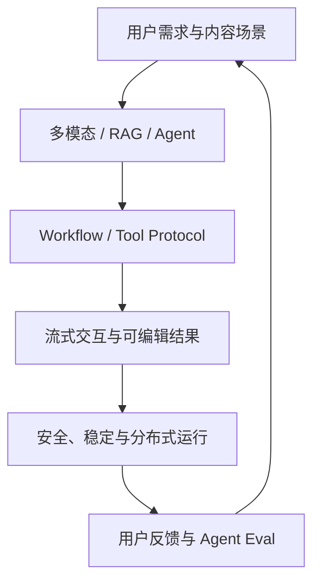

# 小红书 AI 应用开发岗位：融合 JD 与能力核对表

> 调研日期：2026-09-01  
> 目标画像：2027 届 AI 应用开发 / Agent 后端工程师（Python）  
> 主要样本：Product Engineer（AI 与全栈）、Serverless/AI Agent、AI 创作、内容审核/Trust & Safety

---

## 0. 核心结论

小红书的岗位标签虽然分散，但核心人才画像很统一：

> **AI 时代的 Product Engineer：既能用 Agent/LLM 重新定义产品体验，也能端到端完成高质量工程交付，并对运行、评测和用户价值负责。**

公司特色集中在四个方向：

1. **产品工程**：从真实用户体验出发，强调设计与编码品味、独立交付；
2. **AI Native 创作**：图像、视频、文案、多模态工作流、流式交互与 Tool Protocol；
3. **Agent 平台/Serverless**：DeepResearch、PlanExecutor、Multi-Agent、分布式研发运维、调试上线和评测；
4. **社区信任与安全**：内容审核、亿级数据流、稳定后端、Agentic AI 与可控执行。

对你的最佳方向不是客户端或多媒体算法，而是：

> **审核/T&S、Serverless Agent、内部效率、数据与规则驱动的 AI 应用后端。**

主要缺口是面向用户的产品体验、前端可交付、Agent Runtime/Eval，以及对“设计和编码品味”的公开作品证明。

---

## 1. 岗位分流

| 岗位簇 | 典型内容 | 匹配度 | 策略 |
| --- | --- | --- | --- |
| Product Engineer—AI/全栈 | 核心功能、Agent、端到端交付 | 高 | 后端为主，补交互与产品判断 |
| Serverless/AI Agent | Agent 框架、运维、评测、FaaS | **最高** | EnergyOps + Runtime/Eval |
| 审核/T&S AI 应用 | 内容安全、Agent 后端、亿级数据流 | **最高** | RuleArena + 后端可靠性 |
| AI 创作研发 | 多模态创作链、Workflow、Tool Protocol | 中高 | 工程可投，多媒体是额外领域 |
| Dots/Life OS Agent | Harness、生活助手、长期 Agent | 高但前沿 | 补 Memory/Context/产品体验 |
| AI Agent 算法 | 后训练、RL、蒸馏、Memory 算法 | 低 | 算法分支，不并入应用开发硬门槛 |
| 客户端/多媒体 | Android/iOS/音视频/编辑器 | 低到中 | 需专门语言与领域，不临时转向 |

### 1.1 你的投递顺序

1. Product Engineer（审核/T&S、AI 应用研发）；
2. Serverless/AI Agent 研发；
3. 社区工程 AI/全栈中后端占主导岗位；
4. 内部研发效率/Data Agent；
5. AI 创作后端；
6. 强客户端、音视频或后训练算法岗位降级。

---

## 2. 第一性原理：小红书为何强调“产品工程师”

内容社区的 AI 功能直接面对用户。一次技术正确但体验糟糕的回答仍是失败；一次创作成功但延迟过高、不可编辑、不可撤销的任务也无法形成产品价值。

因此岗位把产品、前后端、Agent、运维和评测揉在一起。工程师不只是实现需求，而要判断功能是否自然、可控、值得用户使用。

---

## 3. 融合后的小红书岗位 JD

### 3.1 岗位名称

**Product Engineer—AI Agent 与全栈应用方向（后端主导）**

### 3.2 岗位定位

面向社区、创作、审核、信任安全、生活助手或研发效能场景，使用 AI Native 方法完成从问题定义、Agent/Workflow、后端/前端到分布式运行、评测和用户反馈的完整交付；追求高质量设计、代码、产品体验和真实影响。

### 3.3 融合岗位职责

1. 发现社区/创作/审核/内部效率中的真实问题，定义用户价值和效果指标；
2. 设计 Agent、PlanExecutor、DeepResearch 或 Multi-Agent 工作流；
3. 建设 Prompt、RAG、Function Calling、Workflow、MCP 和 Tool Protocol；
4. 接入图像、视频、文案、搜索、审核、数据等多种能力，并做统一编排；
5. 开发 Java/Go/Python 后端及必要的 React/TypeScript 前端或跨端功能；
6. 处理流式推理、任务进度、取消、重试、多模型路由和高并发；
7. 建设 Agent 分布式研发运维体系，包括调试、部署、上线、可观测和回放；
8. 建设 Agent/RAG 评测，推动复杂业务持续迭代；
9. 保障内容安全、隐私、权限、稳定性、性能和成本；
10. 深度使用 AI Coding，提高从设计到测试发布的交付效率；
11. 与产品、算法、客户端、音视频、审核和业务团队协作，产出高质量设计与代码。

### 3.4 校招/初级岗位硬门槛

- 本科及以上，计算机等相关专业；
- 一门主力语言和扎实数据结构算法、网络等计算机基础；
- 热爱写代码，能产出高质量设计和实现；
- 对生成式 AI、智能编程和 Agent 设计敏感；
- 理解 LLM 应用、RAG、Agent/Workflow、工具调用；
- 至少有一个 AI Native 或全栈项目，可展示实际运行结果；
- 能快速学习、独立推动、协作表达并关注用户体验。

### 3.5 强竞争力要求

- Agent 框架、DeepResearch/PlanExecutor/Multi-Agent 实践；
- K8s、Knative、Operator、Serverless/FaaS；
- Agent 调试、运维、上线、Trace、Replay 和 Eval；
- 创作/多模态工作流、流式渲染和高并发推理；
- 内容安全、规则审核、隐私权限和亿级系统；
- LangChain/LangGraph/Spring AI 等框架扩展；
- 开源贡献、ACM/ICPC 或优秀公开作品；
- 对 AI 产品有审美，能解释交互和设计取舍。

---

## 4. 掌握标准

M0 未接触；M1 能解释；M2 参考实现；M3 独立实现、设计与排障；M4 有工程证据、用户/业务指标和复盘。`E/G/U` 为已有证据、明确缺口、待核对。

---

## 5. 能力核对表

### 5.1 产品工程与交互

| ID | 优先级 | 核对项 | M3 验收 | 当前判断 |
| --- | --- | --- | --- | --- |
| XHS-B01 | P0 | 用户问题定义 | 从场景、旅程、痛点到指标 | E/M2 |
| XHS-B02 | P0 | AI 产品形态 | 比较助手、自动化、共创、推荐等形态 | G/M2 |
| XHS-B03 | P0 | 交互可控性 | 进度、取消、编辑、确认、撤销、失败解释 | G/M2 |
| XHS-B04 | P0 | 设计与编码品味 | 用简洁 API/状态/UI 解释取舍 | G/M2 |
| XHS-B05 | P1 | 用户反馈闭环 | 埋点、反馈、留存/成功率和 Bad Case 联动 | G/U |
| XHS-B06 | P1 | 内容/创作业务 | 理解草稿、素材、版本、审核、发布链路 | G/U |

### 5.2 Agent、Workflow 与 Tool Protocol

| ID | 优先级 | 核对项 | M3 验收 | 当前判断 |
| --- | --- | --- | --- | --- |
| XHS-A01 | P0 | Agent Loop | 独立实现循环、预算、终止和错误 | G/M2 |
| XHS-A02 | P0 | PlanExecutor/Workflow | 计划、依赖、状态、并行和恢复 | G/M1 |
| XHS-A03 | P0 | Context/Memory | 上下文压缩、会话恢复、长期记忆边界 | G/M2 |
| XHS-A04 | P1 | DeepResearch | 搜索、证据、去重、引用和停止条件 | G/U |
| XHS-A05 | P1 | Multi-Agent | 角色、共享状态、冲突、成本和终止 | G/M1 |
| XHS-T01 | P0 | Tool Protocol/MCP | 统一 Schema、能力注册、鉴权、错误和版本 | E/M2 |
| XHS-T02 | P0 | 工具副作用 | 确认、幂等、补偿、审计和撤销 | E/M2 |
| XHS-T03 | P1 | 多模态工具 | 图像/视频/文本任务的异步接口和结果契约 | G/U |

### 5.3 RAG、内容与安全

| ID | 优先级 | 核对项 | M3 验收 | 当前判断 |
| --- | --- | --- | --- | --- |
| XHS-R01 | P0 | RAG 全链路 | 解析、切分、混合检索、重排、引用 | G/M2 |
| XHS-R02 | P0 | 检索/答案 Eval | 指标分层并分析 Bad Case | G/M1 |
| XHS-R03 | P0 | 权限/隐私 | 检索与工具按用户/角色/资源过滤 | E/M2 |
| XHS-S01 | P0 | 内容安全 | 规则、模型、人工审核分层和证据 | E/M2 |
| XHS-S02 | P0 | Prompt Injection | 不可信内容隔离和工具权限限制 | G/M1 |
| XHS-S03 | P1 | 多模态输入 | 图像/视频/文本的格式、元数据与安全 | G/U |

### 5.4 后端、全栈与 Serverless

| ID | 优先级 | 核对项 | M3 验收 | 当前判断 |
| --- | --- | --- | --- | --- |
| XHS-E01 | P0 | Python/Java/Go | 一门语言达到工程与调试深度 | E/M2 |
| XHS-E02 | P0 | API/数据库/缓存 | 鉴权、事务、索引、一致性、迁移 | E |
| XHS-E03 | P0 | 异步/流式 | SSE/WebSocket、取消、背压、资源回收 | G/M2 |
| XHS-E04 | P0 | 任务队列 | 重试、DLQ、幂等、状态和积压 | G/U |
| XHS-E05 | P0 | 高并发/分布式 | 限流、隔离、一致性、故障传播 | G/M2 |
| XHS-F01 | P1 | React/TypeScript | 流式、任务进度、编辑、反馈和错误恢复 | G/M2 |
| XHS-I01 | P1 | Serverless/FaaS | 冷启动、隔离、伸缩、事件和资源限制 | G/U |
| XHS-I02 | P2 | K8s/Knative/Operator | 完成最小部署并解释控制器/伸缩 | G/U |
| XHS-E06 | P0 | CS 基础 | 算法、网络、OS、数据库达到校招线 | G/M2 |

### 5.5 评测、运维和 AI Coding

| ID | 优先级 | 核对项 | M3 验收 | 当前判断 |
| --- | --- | --- | --- | --- |
| XHS-Q01 | P0 | Agent Eval | 任务、步骤、工具、内容质量、用户指标 | G/M2 |
| XHS-Q02 | P0 | Trace/Replay | 调试、复现、对比 Agent 轨迹 | G/M2 |
| XHS-Q03 | P0 | CI 回归 | 模型/Prompt/工具变更自动门禁 | E/M2 |
| XHS-P01 | P0 | 部署与观测 | Logs/Metrics/Trace、告警、灰度、回滚 | E/M2 |
| XHS-P02 | P0 | 性能/成本 | 首 Token、P95/P99、队列时延和模型成本 | G/U |
| XHS-P03 | P1 | 多模型路由 | 按内容类型、质量、延迟和成本路由 | G/U |
| XHS-C01 | P0 | AI Coding | 用 AI 完成开发但保留设计、Review 和验证 | E/M2 |
| XHS-C02 | P1 | 公开作品 | 在线 Demo、README、设计说明、指标与复盘 | G/M2 |

---

## 6. 你的项目映射

| 项目 | 小红书匹配点 | 需要补齐 |
| --- | --- | --- |
| EnergyOps | 生产后端、任务、数据质量、告警、自愈、MCP、权限与审计 | 用户交互、流式、队列、高并发、Agent Eval |
| 数驭穹图 | RAG/NL2SQL、权限、证据、可信结果 | 做一个面向用户的分析交互与反馈闭环 |
| Ovanta | 全栈业务状态、交易、支付、版本和国际化 | 公开 UI、产品取舍和 AI 功能 |
| RuleArena | T&S/审核高度匹配：规则、状态、证据、修复、多 Agent | 内容样本、人工复核、Trace/Replay、审核指标、在线 Demo |

### 最优项目叙事

- 投审核/T&S：RuleArena 主项目，EnergyOps 证明生产后端；
- 投 Serverless/Agent：EnergyOps 主项目，RuleArena 证明 Agent；
- 投 Product Engineer：数驭穹图或 RuleArena 必须补一个精致可用的前端和用户反馈链路。

---

## 7. 定向学习顺序

1. Agent Loop、PlanExecutor、Context/Memory、checkpoint；
2. Python 异步、流式、队列、高并发和分布式基础；
3. RAG Eval、Tool Protocol、权限与内容安全；
4. Agent Trace、Replay、CI Eval 和线上反馈；
5. React/TypeScript 做精致可用 Demo，练交互取舍；
6. Serverless/FaaS 基础，K8s/Knative 做最小实验；
7. 若投 AI 创作，再补多模态任务和素材/版本链路。

---

## 8. 预测面试追问

1. 什么叫 Product Engineer，与传统后端有什么不同？
2. 如何设计一个可编辑、可取消、可恢复的创作 Agent？
3. Agent 的长期记忆如何避免错误和隐私泄露？
4. PlanExecutor 失败后如何局部重试？
5. Tool Protocol 如何统一图像、视频和文案能力？
6. 内容审核中模型、规则和人工如何分工？
7. Agent Eval 如何连接用户体验指标？
8. Serverless 冷启动和长连接/长任务冲突如何处理？
9. 如何从一次 Trace 复现内容错误或工具失败？
10. 展示一个你认为“有设计和编码品味”的模块；
11. 现场算法题与网络/数据库追问；
12. 设计亿级用户 AI 创作系统的后端和降级策略。

---

## 9. 来源与置信度

官方/官方索引，高置信度：

- [小红书校园招聘：Product Engineer（AI 与全栈方向）](https://job.xiaohongshu.com/campus/position?positionName=Product+Engineer+)
- [小红书校园招聘：社区工程](https://job.xiaohongshu.com/campus/position?positionName=%E7%A4%BE%E5%8C%BA%E5%B7%A5%E7%A8%8B)
- [小红书校园招聘主页](https://job.xiaohongshu.com/)

完整岗位转载，用于补齐动态页面文本：

- [AI Agent 创作研发工程师](https://jobs.niuqizp.com/job-vkk5LLCnZ.html)
- [Serverless/AI Agent 研发工程师](https://www.nowcoder.com/jobs/detail/406125)
- [大模型应用研发—内容审核](https://jobs.niuqizp.com/job-vsm5LLtNN.html)
- [Product Engineer—社区工程职位转载](https://campus.niuqizp.com/job-vwk5zCLNL.html)

官方页面动态加载，转载样本用于恢复职责全文；投递前以小红书招聘官网的最新状态、城市和完整要求为准。

---

## 10. 维护规则

- 先将岗位归入产品工程 / Agent 平台 / 审核 T&S / AI 创作 / 客户端 / 算法；
- 每项“产品能力”必须对应用户旅程、交互或指标，不只写感受；
- 公开作品要同时包含代码质量、界面、运行说明、指标和失败复盘；
- K8s/Knative、多模态按岗位分流，不提前吞掉主线；
- RuleArena 优先做成可演示、可评测、有人审闭环的作品。
