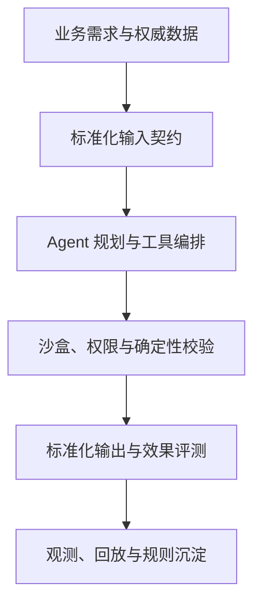

# 得物 AI 应用开发岗位：融合 JD 与能力核对表

> 调研日期：2026-09-01  
> 目标画像：AI 应用开发 / Agent 后端工程师（Python）  
> 用途：岗位理解、能力核对、项目补证、面试复习  
> 样本说明：公开可检索的得物 AI 应用岗位以社招和团队实践为主，校招硬门槛需在正式投递时重新核验。

---

## 0. 核心结论

得物的 AI 应用工程信号可以归纳为一句话：

> **把 Agent 做成能够进入电商、供应链、数仓和研发流程的受控执行系统：输入输出有契约，工具有权限，执行有隔离，失败可恢复，结果可评估。**

公司特征不是“多会几个框架”，而是以下组合：

1. Agent Loop、Context、Tool、子任务编排等运行时能力；
2. Skill/Tool 动态注册、容器/微虚拟机沙盒和分级信任；
3. 长任务拆解、并行执行、异常恢复、会话与消息去重；
4. 电商、供应链、数仓、数据分析等业务知识；
5. Spec-Driven Development 与标准化 I/O，把自由文本变成受约束输出；
6. RAG/MCP 接入真实表结构、血缘、SQL、日志和任务实例；
7. 准确性、幻觉、合规、安全、一致性与业务效果评测；
8. 强后端、异步/并发/分布式排障与稳定性意识。

对你的高匹配点是 EnergyOps 和数驭穹图；主要风险是部分岗位偏资深 Java 架构或 Agent 平台深度改造，不应把社招年限当成应届硬门槛。

---

## 1. 岗位分流

| 岗位簇 | 典型内容 | 匹配度 | 准备方式 |
| --- | --- | --- | --- |
| Agent 平台/核心引擎 | Loop、Context、Tool 注册、调度、沙盒、渠道 | **最高但门槛高** | 补 Runtime、源码级理解与隔离 |
| 业务 AI 应用 | 供应链、电商治理、客服、运营 | **高** | 用业务状态、效果与稳定性证明 |
| Data/Code Agent | 数仓、SQL、血缘、日志、研发效能 | **最高** | 数驭穹图和 EnergyOps 直接映射 |
| AI 测试与评测 | RAG/Agent 测试、幻觉、安全、一致性 | 中高 | 提取质量体系，不必转纯测试 |
| 大模型算法 | 分类、检索、多模态、微调、训练 | 中低 | 算法分支，非当前主线 |
| 供应链 Java 专家 | Java/Spring Cloud、架构与 AI Agent | 未来上限 | 观察生产要求，不照搬 6 年门槛 |

### 1.1 你的主投顺序

1. Data Agent、数仓研发效能、智能分析；
2. 业务 AI 应用后端；
3. Agent 平台中偏工具、状态、任务编排和评测的岗位；
4. AI 测试开发中偏 Eval Platform 的岗位；
5. 纯算法或要求长期 Java 架构经验的岗位降级。

---

## 2. 第一性原理：得物场景为什么强调“契约 + 隔离”

电商、供应链和数仓系统有三类不可接受的错误：

- 模型编造字段、口径或业务状态；
- Agent 未经确认执行写操作或重复执行；
- 长任务失败后无法定位、恢复或审计。

因此合理架构是：

LLM 负责理解、规划和生成候选；真实 Schema、业务规则、权限、执行与校验由确定性系统负责。沙盒不是“高级加分项”，而是代码执行、浏览器操作和高风险工具进入生产的安全边界。

---

## 3. 融合后的得物岗位 JD

### 3.1 岗位名称

**AI Agent 应用与平台研发工程师（电商 / 数据 / 供应链方向）**

### 3.2 岗位定位

面向电商交易、供应链、内容治理、数仓与研发效能场景，建设可扩展的 Agent 运行时和生产级 AI 应用。负责上下文、工具、工作流、沙盒、后端服务、评测与稳定性，使 AI 能力以受控方式访问真实数据并执行任务。

### 3.3 融合岗位职责

1. 从业务痛点和数据资产出发定义 Agent 场景、边界、验收指标与风险等级；
2. 开发 Agent Loop、Context/Memory、模型路由、任务规划和终止机制；
3. 建设 Skill/Tool 动态注册、Schema 校验、版本管理与多级信任体系；
4. 设计子任务编排引擎，支持拆解、并行、超时、重试、checkpoint 和异常恢复；
5. 通过 MCP 接入表结构、血缘、任务、日志、搜索、业务 API 等真实环境；
6. 建设容器/microVM 沙盒，隔离代码执行、浏览器自动化和高风险操作；
7. 建设 Web/企业 IM 等渠道，处理流式输出、消息去重和会话状态；
8. 构建 RAG 与数据 Agent，确保生成前获取权威 Schema/知识并绑定证据；
9. 建立准确率、幻觉、安全、输出一致性、任务成功率、延迟和成本评测；
10. 处理异步、并发、分布式场景的故障，保障稳定性、可观测与可恢复；
11. 与业务、数据、供应链、算法和测试团队协作，沉淀规范、工具和平台能力。

### 3.4 应届/初级岗位合理硬门槛

- 本科及以上，计算机、软件、数据等相关专业；
- 熟练 Python/Java/Go 至少一门，扎实编程和数据结构算法基础；
- 理解 LLM API、Token、流式输出、上下文窗口和错误处理；
- 有 Agent/RAG/Tool-use 项目，不只调用框架默认接口；
- 具备后端 API、数据库、缓存、异步任务、测试和 Docker 基础；
- 理解工具权限、幂等、状态、异常恢复和评测；
- 能写清技术设计，并独立定位复杂问题。

### 3.5 强竞争力要求

- 修改或扩展过 LangGraph/Dify/AutoGen 等框架核心机制；
- Agent 子任务并行、checkpoint、replay 和恢复；
- Firecracker/microVM、容器隔离或受限执行环境；
- MCP Server/Client 和企业内部平台接入；
- Playwright/浏览器自动化或飞书/企业 IM 集成；
- 数仓、SQL、血缘、Schema、数据质量和权限治理；
- AI 质量评测、自动回归与安全测试体系；
- Java/Spring Boot/Cloud 能力对部分供应链团队加分。

---

## 4. 掌握标准

M0 未接触；M1 能解释；M2 可参考实现；M3 可独立实现和排障；M4 有项目、测试、指标与复盘。P0 最低目标为 M3。

状态标记：`E` 已有证据待验收；`G` 明确缺口；`U` 尚未核对。

---

## 5. 能力核对表

### 5.1 业务、数据与契约

| ID | 优先级 | 核对项 | M3 验收 | 当前判断 |
| --- | --- | --- | --- | --- |
| DW-B01 | P0 | 电商/供应链/数据链路建模 | 讲清实体、状态、口径、异常与责任边界 | E/M2 |
| DW-B02 | P0 | AI 适用性与指标 | 有人工/规则基线和可测验收 | E/M2 |
| DW-B03 | P0 | 标准化输入契约 | 用 JSON/CSV/Schema 收敛模糊需求 | E |
| DW-B04 | P0 | 标准化输出契约 | 强类型校验、错误反馈和拒绝策略 | E/M2 |
| DW-B05 | P1 | SDD 工作流 | 从规范生成代码/配置并自动验证 | G/M2 |

### 5.2 Agent Runtime 与任务编排

| ID | 优先级 | 核对项 | M3 验收 | 当前判断 |
| --- | --- | --- | --- | --- |
| DW-A01 | P0 | Agent Loop | 独立实现循环、终止与最大步数 | G/M2 |
| DW-A02 | P0 | Context/Memory | 预算、裁剪、摘要、长期记忆与权威状态分离 | G/M2 |
| DW-A03 | P0 | 子任务分解 | DAG/状态机表达依赖、并行和聚合 | G/M1 |
| DW-A04 | P0 | checkpoint/恢复 | 中断后从安全节点恢复且不重复副作用 | G/M2 |
| DW-A05 | P1 | 多 Agent 协作 | 定义角色、共享状态、冲突、失败和终止 | G/M1 |
| DW-A06 | P1 | 多渠道会话 | 流式、断线续传、消息去重、会话一致性 | G/U |

### 5.3 Tool、MCP、权限与沙盒

| ID | 优先级 | 核对项 | M3 验收 | 当前判断 |
| --- | --- | --- | --- | --- |
| DW-T01 | P0 | Tool Schema | 参数/返回/错误/权限契约完整 | E/M2 |
| DW-T02 | P0 | 动态注册与版本 | 新工具可发现、启停、灰度、回滚 | G/U |
| DW-T03 | P0 | MCP 接入 | 开发一个 MCP Server 并处理鉴权/超时 | E/M2 |
| DW-T04 | P0 | 多级信任 | 只读、低风险写、高风险写分级确认 | E/M2 |
| DW-T05 | P0 | 幂等与补偿 | 重试不重复，失败可补偿和审计 | E/M2 |
| DW-T06 | P1 | 容器沙盒 | 限 CPU/内存/时间/文件/网络/系统调用 | G/U |
| DW-T07 | P2 | microVM | 能解释与容器隔离差异并完成最小实验 | G/U |
| DW-T08 | P1 | 浏览器自动化 | Playwright 受控执行、超时和页面变化处理 | G/U |

### 5.4 RAG、SQL 与数据证据

| ID | 优先级 | 核对项 | M3 验收 | 当前判断 |
| --- | --- | --- | --- | --- |
| DW-R01 | P0 | RAG 全链路 | 独立完成解析、切分、检索、重排、引用 | G/M2 |
| DW-R02 | P0 | Schema Linking | 查询前找到真实表/字段/关系 | E |
| DW-R03 | P0 | SQL 安全执行 | AST、只读、扫描量、Join、超时和权限 | E |
| DW-R04 | P0 | 数据血缘与口径 | 结果可追溯到权威来源 | E/M2 |
| DW-R05 | P1 | Graph/Neo4j | 用图表达表关系并比较向量检索 | G/M1 |
| DW-R06 | P0 | 证据绑定 | 每个关键结论可指向数据或工具结果 | E/M2 |

### 5.5 后端、异步与分布式

| ID | 优先级 | 核对项 | M3 验收 | 当前判断 |
| --- | --- | --- | --- | --- |
| DW-E01 | P0 | Python/Java/Go 工程 | 一门主力语言达到高质量编码与调试 | E/M2 |
| DW-E02 | P0 | API/数据库/缓存 | 鉴权、事务、索引、一致性和迁移 | E |
| DW-E03 | P0 | asyncio/并发 | 超时、取消、背压、连接池、竞态 | G/M2 |
| DW-E04 | P0 | 任务队列 | 重试、DLQ、幂等、调度和积压处理 | G/U |
| DW-E05 | P0 | 分布式排障 | 通过 Trace/日志定位跨服务故障 | G/M2 |
| DW-E06 | P1 | Java/Spring 生态 | 了解 Spring Boot/Cloud、线程和 JVM 基础 | G/U |
| DW-E07 | P0 | CS 基础 | 算法、OS、网络、数据库可通过校招面试 | G/M2 |

### 5.6 评测与生产治理

| ID | 优先级 | 核对项 | M3 验收 | 当前判断 |
| --- | --- | --- | --- | --- |
| DW-Q01 | P0 | 评测集 | 正常、边界、对抗、历史失败覆盖 | E/M2 |
| DW-Q02 | P0 | 质量指标 | 准确、幻觉、合规、安全、一致性、任务成功 | G/M2 |
| DW-Q03 | P0 | 轨迹回放 | 重放上下文、模型、工具和状态变化 | G/M2 |
| DW-Q04 | P1 | 线上反馈飞轮 | Bad Case 分类、标注、回归和规则沉淀 | G/U |
| DW-P01 | P0 | 限流/降级/故障隔离 | 设计故障预算和降级路径 | E/M2 |
| DW-P02 | P0 | 可观测 | 日志、指标、Trace、告警可关联任务 | E/M2 |
| DW-P03 | P1 | 成本/延迟 | 首 Token、P95/P99、并行与 Token 预算 | G/U |

---

## 6. 你的项目映射

| 项目 | 得物高匹配证据 | 下一步补证 |
| --- | --- | --- |
| EnergyOps | 原始到日聚合链路、质量规则、告警、重试/状态查询、自愈、乱序补数、25 个 MCP 工具、计费对账 | 工具动态注册、分级信任、任务 checkpoint/replay、队列背压 |
| 数驭穹图 | Schema Linking、SQL AST、只读、扫描与大导出限制、Join 爆炸、权限、证据 | 做混合检索/重排 Eval、接入血缘图、标准化 I/O 示例 |
| Ovanta | 交易、订单、支付、权益和版本状态 | 提炼重复执行、补偿、审批和审计案例 |
| RuleArena | 多 Agent、确定性状态校验、证据链、修复建议 | 加沙盒执行、并行子任务、故障恢复和任务评测 |

对得物最有说服力的组合是：**数驭穹图证明 Data Agent，EnergyOps 证明真实工具和后端，RuleArena 证明不确定模型受确定性规则约束。**

---

## 7. 定向学习顺序

1. Agent Loop、State、Context、checkpoint 和副作用；
2. asyncio、任务队列、并行 DAG、超时取消和背压；
3. RAG 检索评测、SQL/Schema/血缘与权限；
4. Tool 动态注册、版本、信任分级和审计；
5. Docker 受限执行，再做 microVM 原理与最小实验；
6. Golden Set、轨迹回放、幻觉/安全/一致性评测；
7. 若目标团队明确 Java，再补 Spring Boot/Cloud 基线。

---

## 8. 预测面试追问

1. Agent 长任务执行到第 8 步失败，如何恢复？
2. 工具动态注册后，怎样避免模型调用不兼容版本？
3. 容器与 microVM 的隔离边界有什么不同？
4. 同一消息被飞书重复推送，如何保证只执行一次？
5. 如何让模型写 SQL 前必须获取真实 DDL？
6. RAG、知识图谱和实时 MCP 查询分别适合什么信息？
7. 多 Agent 并行时共享状态如何避免竞态和污染？
8. 怎样衡量幻觉、输出一致性和任务成功率？
9. 一次异步/分布式故障你如何从 Trace 定位？
10. EnergyOps 的乱序补数和 Agent checkpoint 有何共同点？
11. 如何限制代码执行的网络、文件、时间和资源？
12. 手写算法，并追问并发、数据库或缓存边界。

---

## 9. 来源与置信度

公司实践，高置信度：

- [得物技术：智能分析 OBS 埋点数据的 AI Agent](https://tech.dewu.com/article?id=195)
- [得物技术：Claude 在数仓的深度集成与 Galaxy MCP](https://tech.dewu.com/article?id=217)
- [得物技术官网](https://tech.dewu.com/)

岗位样本，需投递前复核：

- [Agent 平台核心引擎开发岗位转载](https://www.recruit.net/job/agent--jobs/C7F624B5B50FCE27)
- [供应链平台 Java 技术专家（AI 应用开发）](https://www.jdwatch.work/jobs/jwctgt0h9)
- [AI 测试开发岗位索引](https://www.zhipin.com/zhaopin/e8c84d19de42717d1Hd-0tS6/)

公司技术文章用于判断真实工程范式；转载 JD 用于抽取能力信号，不据此断言当前校招 HC 或年限门槛。

---

## 10. 维护规则

- 投递前把岗位标成“业务应用 / Data Agent / 平台 Runtime / 算法 / Java 专家”；
- 只把校招或明确不限经验的要求作为当前硬门槛；
- 每个能力都保存 Demo、测试、指标和失败复盘；
- 沙盒、分布式框架源码等 P1/P2 项只在目标 JD 命中后深入；
- 当前主线保持 Python，Java 是按团队补的第二语言，不反客为主。
