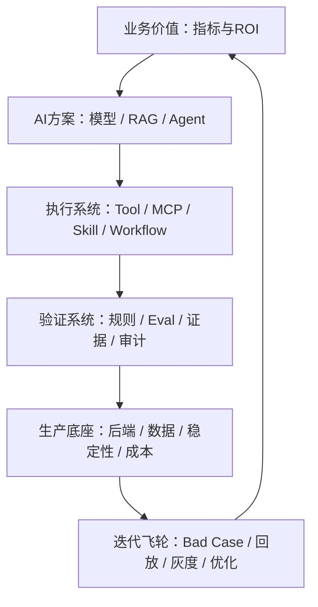

# 快手 AI 应用开发岗位：融合 JD 与能力核对表

> 来源：用户提供的《JD.md》  
> 分析日期：2026-09-01  
> 目标画像：2027 届 AI 应用开发 / Agent 后端工程师（Python）  
> 用途：岗位理解、能力核对、学习排序、项目补证、面试复习

---

## 0. 核心结论

快手这批 JD 释放的最强信号不是“多学几个 Agent 框架”，而是：

> **从真实业务指标出发，把 LLM、RAG、Agent、Tool/MCP/Skill 组装成可执行系统，再用 Python/后端工程、评测、可观测、稳定性和 AI Coding Harness 将其送进生产环境。**

快手要的 AI 应用开发者，本质上是三种角色的交集：

1. **AI 应用工程师**：知道模型能做什么、不能做什么，能选择 Prompt、RAG、Agent、SFT 等方案；
2. **后端/全栈工程师**：能把方案接入真实系统，处理数据、接口、并发、权限、异常、部署和联调；
3. **效果负责人**：能建立评测集、指标、Bad Case、日志与数据飞轮，证明业务收益而不是讲故事。

对你最匹配的定位仍然是：

> **AI 应用与 Agent 工程为主，Python 后端为底座，企业数据、规则审查、可信执行和评测体系为差异化。**

---

## 1. 先分流：这些 JD 不是同一个岗位

如果把所有 JD 的要求机械相加，会得到“前端 + Java/Go/Python + Agent + RAG + SFT/RL + 推理优化 + 分布式训练 + GPU/K8s + 顶会论文”的虚假全能画像。正确做法是先判断岗位类型。

| 岗位簇 | 原始岗位/片段 | 与目标相关度 | 使用方式 |
| --- | --- | --- | --- |
| A. Agent 应用研发 | AI Agent 全栈工程师、音视频 Agent、通用 AI Agent 应用 | **最高** | 作为主投岗位基线 |
| A. Agent 运行时/平台 | 大模型 AI Agent 开发工程师 | **最高** | 补 Agent Core、评测、观测、部署 |
| A. Data Agent | 快Star Data Agent 研发工程师 | **最高** | 与数驭穹图、数据工程经历强匹配 |
| B. AI 全栈/后端 | AI 全栈数据平台、智能媒体处理研发 | 较高 | 提炼后端、全栈、质量和分布式要求 |
| B. 高级 AI 应用 | 快Star AI 应用开发工程师（要求 3 年以上经验） | 中等 | 作为未来 2—3 年生产工程上限，不当作校招硬门槛 |
| C. 大模型评测 | 大模型评测工程师 | 中等 | 提取评测思维，不转为纯评测岗位路线 |
| D. 模型训练 Infra | 大模型训练平台开发工程师 | 低 | GPU、NCCL、RDMA、训练调度不进入当前主线 |
| D. 研究岗位 | AIOps 自主进化研究员 | 低 | 顶会、终身学习、在线增量学习属于研究分流 |

### 1.1 最值得主投的快手岗位

按你的经历和方向，匹配顺序建议为：

1. **Data Agent 研发工程师**：数驭穹图的 NL2SQL、Schema Linking、权限、安全执行、证据绑定与其高度一致；
2. **AI Agent 全栈工程师 / Agent 应用研发**：EnergyOps 的 MCP 工具、业务工作流、风险分级、告警闭环可以迁移；
3. **大模型 AI Agent 开发工程师**：需要进一步补强 Agent Runtime、上下文、记忆、Multi-Agent、评测与部署；
4. **AI 全栈开发 / AI 应用后端**：后端部分匹配，但需核对 Java/Go、React 和大数据引擎是否为硬门槛；
5. **智能媒体处理研发**：后端工程要求很强，音视频是额外领域门槛，可投但不是最优先。

### 1.2 不应因为这批 JD 临时改道

- 不为训练平台岗突击 CUDA、NCCL、RDMA、Megatron、DeepSpeed；
- 不为研究岗临时转向顶会论文、强化学习、终身学习；
- 不要求自己同时精通 Python、Java、Go、TypeScript；
- 不把快Star 高级岗位的亿级流量和 3 年经验要求当作应届生最低线；
- 不因“全栈”二字暂停 Agent 与 Python 后端主线，前端先达到可联调、可做 Demo 即可。

---

## 2. 第一性原理：生产级 AI 应用为什么需要这些能力

一个生产 AI 应用必须完成六层闭环：

### 2.1 业务价值层

模型输出本身不是价值。价值必须表现为：业务指标提升、人工成本降低、故障处理更快、系统更稳定或研发效率提高。因此 JD 反复要求业务理解、ROI、指标拆解和可证伪实验。

### 2.2 AI 方案层

业务问题不同，需要的技术也不同：

- Prompt：改变指令、格式和推理方式；
- RAG：补充动态、私有、可引用知识；
- Agent：让模型分解任务并调用外部能力；
- SFT/偏好对齐：改变模型稳定行为或领域能力；
- 确定性程序：执行权限、规则、计算和最终校验。

真正的能力不是“都用”，而是判断何时用、为什么用、代价是什么。

### 2.3 执行系统层

Agent 从“能问”变成“能干”后，会访问数据库、浏览器、监控、风控、调度等真实系统。此时必须处理 Tool Schema、权限、副作用、幂等、状态、终止、异常和人工审批。

### 2.4 验证系统层

LLM 非确定且会漂移，不能只靠单元测试或人工体验。必须建立评测集、业务规则、证据绑定、轨迹回放、Bad Case 分类和版本回归。

### 2.5 生产底座层

真实用户关心的是 P99、首 Token、可用性、结果正确率和成本。模型只是依赖之一，系统仍需要 API、数据库、缓存、任务队列、日志、监控、限流、降级、灰度和回滚。

### 2.6 迭代飞轮层

上线不是终点。需要把失败样本、用户反馈、工具轨迹和业务指标沉淀成数据资产，再驱动 Prompt、RAG、规则、模型或架构迭代。

---

## 3. 融合后的岗位 JD

### 3.1 岗位名称

**AI 应用开发 / Agent 后端工程师（AI Native 全栈方向）**

### 3.2 岗位定位

面向数据分析、风控、安全治理、音视频、研发效能等真实业务，负责将大模型能力转化为可执行、可评测、可观测、可持续迭代的生产级 AI 应用。工作覆盖业务 AI 化设计、Agent/RAG 开发、工具和工作流集成、Python/后端服务、评测与稳定性建设，并借助 AI Coding 提升端到端交付效率。

### 3.3 融合岗位职责

1. 深入业务核心链路，识别适合 AI 的节点，定义业务目标、技术边界、风险和验收指标；
2. 设计和开发 Agent 应用及核心能力，包括任务规划、上下文管理、记忆、模型路由、结构化输出、工具调用和多 Agent 协作；
3. 将业务平台能力封装为 Tool / MCP / Skill，构建可执行工作流，并处理权限、参数校验、副作用、幂等、超时、异常和结果验证；
4. 建设领域知识库，完成文档解析、切分、向量/混合检索、重排序、权限过滤、证据引用和检索效果优化；
5. 构建 Agent/RAG 评测集和评估链路，分析任务成功率、准确率、召回率、延迟、Token/成本、安全违规和业务收益；
6. 基于 Python/Java/Go 等开发 AI 后端服务，完成 API、数据库、缓存、异步任务、服务集成和必要的前端联调；
7. 建设日志、Metrics、Trace、告警、灰度、回滚、模型/Prompt/知识库多版本和异常兜底能力，保障生产可用性；
8. 深度使用 AI 编程工具，将需求、编码、测试、审查、排障和重构纳入 Harness/Loop Engineering，并坚持先验证再采用；
9. 跟踪 Agent、RAG、MCP、Browser/Computer Use、多模态和 AI Infra 进展，通过原型和实验判断是否适合业务；
10. 与产品、算法、数据、前端及业务团队协作，沉淀可复用的工程范式、技术文档、开源成果或技术分享。

### 3.4 应届岗位硬门槛

- 本科及以上，计算机、软件、数据、人工智能等相关专业；
- 一门主力语言具备扎实编程能力，目标岗位优先 **Python**；
- 掌握数据结构与算法、操作系统、网络、数据库等计算机基础；
- 理解 LLM、Prompt、上下文、Function Calling、RAG、Agent 的基本原理与边界；
- 至少完成一个可运行的 Agent/RAG/AI 应用项目，能讲清问题、方案、实现、指标与失败案例；
- 具备基本后端开发、测试、Git、Linux、Docker 和问题排查能力；
- 能借助 AI Coding 完成开发，但可以解释、验证和修正生成结果；
- 学习、表达、协作和动手能力良好。

### 3.5 强竞争力要求

- 真实 Tool/MCP/Skill 集成和可执行工作流经验；
- Agent 上下文、记忆、状态、模型路由和异常恢复实践；
- RAG 混合检索、重排序、权限过滤及离线评测实践；
- Agent 任务级 Eval、轨迹回放、可观测和 Bad Case 飞轮；
- Python 异步、高并发 API、数据库/Redis/任务队列及稳定性治理；
- 在线 Demo、GitHub、技术博客、开源贡献或清晰作品集；
- Text2SQL、知识图谱、Browser Automation、风控/安全/音视频等一项领域能力。

### 3.6 分流能力，不作为统一硬门槛

| 分流方向 | 额外要求 |
| --- | --- |
| 高级 AI 应用 | SFT/偏好对齐、量化/蒸馏/投机解码、KV Cache、语义缓存、P99/SLO、灰度多版本 |
| Data Agent | Text2SQL、知识图谱、数据资产语义、沙箱、微服务、Java/Spring |
| AI 全栈数据平台 | React/Vue、Java/Go、Hive/Spark/Flink/ClickHouse/Doris |
| Browser Agent | Playwright/Puppeteer/Selenium、页面理解、Computer Use、安全隔离 |
| 音视频 Agent | 编解码、转码、流媒体、媒体调度和成本优化 |
| 模型评测 | Transformer/CLIP/Diffusion、主流 Benchmark、统计与评测方法 |
| 训练 Infra | GPU/K8s Operator、NCCL/RDMA、分布式训练、存储和调度 |
| 研究岗位 | 深度学习/RL、长期记忆/持续学习、论文和科研能力 |

---

## 4. 掌握标准

沿用统一的 M0—M4 标准：

| 等级 | 标准 | 是否算掌握 |
| --- | --- | --- |
| M0 | 未接触 | 否 |
| M1 | 能解释概念 | 否 |
| M2 | 参考资料可实现标准案例 | 否 |
| M3 | 能独立实现、解释取舍、处理常见失败 | **应届核心项最低线** |
| M4 | 有真实/高仿业务证据、测试、指标和复盘 | **简历重点** |

每个能力必须经过四项验收：

1. 60 秒讲清主线；
2. 能写关键代码、SQL、伪代码或架构；
3. 能回答失败、边界、替代方案和取舍；
4. 能指向项目、测试、指标、Demo、Commit 或文档。

初始状态标记：

- `E`：已有项目证据，待验收；
- `G`：明确缺口；
- `U`：尚未核对；
- `M3/M4`：通过验收后填写。

---

## 5. 模块一：业务 AI 化与方案选型

第一性原理：**技术只在改变业务结果时产生价值；先定义问题和指标，再选择模型能力。**

| ID | 优先级 | 核对项 | M3 验收标准 | 当前判断 |
| --- | --- | --- | --- | --- |
| KS-B01 | P0 | 识别用户、业务链路、痛点、输入输出和系统边界 | 用一个项目 3 分钟讲清完整闭环 | E |
| KS-B02 | P0 | 定义业务指标、技术指标、基线和验收条件 | 指标可测量、可证伪，不只说“提高效率” | E/M2 |
| KS-B03 | P0 | 判断 AI 与确定性程序的边界 | 能说明哪些交给模型、规则、数据库或人工 | E/M2 |
| KS-B04 | P0 | 选择 Prompt/RAG/Agent/Workflow | 对同一问题比较至少两种方案和代价 | G/M2 |
| KS-B05 | P1 | 判断 SFT/偏好对齐是否必要 | 根据知识更新、行为稳定和成本选择 | G/M1 |
| KS-B06 | P0 | 从最坏失败反推设计 | 覆盖误判、越权、重复执行、不可恢复等风险 | E/M2 |
| KS-B07 | P1 | ROI 与技术成本 | 估算人工节省、模型成本、延迟和维护成本 | G/U |

---

## 6. 模块二：LLM、Prompt 与模型路由

第一性原理：**LLM 是概率推理引擎，不是数据库、规则引擎或权威状态。**

| ID | 优先级 | 核对项 | M3 验收标准 | 当前判断 |
| --- | --- | --- | --- | --- |
| KS-L01 | P0 | LLM 基本机制与能力边界 | 讲清 Token、上下文、生成、幻觉和非确定性 | G/M1 |
| KS-L02 | P0 | Prompt 设计 | 会组织任务、约束、数据、示例、输出格式 | E/M2 |
| KS-L03 | P0 | 结构化输出 | 使用 JSON Schema/Pydantic 校验并处理失败 | E/M2 |
| KS-L04 | P0 | 模型 API | 鉴权、流式、超时、重试、错误映射和取消 | E/M2 |
| KS-L05 | P1 | 模型路由 | 按任务、质量、成本、延迟和故障选择模型 | G/U |
| KS-L06 | P1 | Token 与语义缓存 | 能估算成本并设计缓存键、失效和污染防护 | G/U |
| KS-L07 | P2 | SFT/LoRA/偏好对齐 | 做过最小实验并知道何时优于 Prompt/RAG | G/M1 |
| KS-L08 | P2 | 多模态模型 | 理解 LLM/VLM/生成模型的输入输出和适用场景 | G/U |

---

## 7. 模块三：Agent Runtime、上下文与多 Agent

第一性原理：**Agent = 模型 + 上下文 + 工具 + 运行循环；生产 Agent 还需要约束、验证、纠正和恢复。**

| ID | 优先级 | 核对项 | M3 验收标准 | 当前判断 |
| --- | --- | --- | --- | --- |
| KS-A01 | P0 | Agent Loop | 独立实现 Model→Tool→Result→Continue/Stop 循环 | G/M2 |
| KS-A02 | P0 | 任务规划 | 比较 ReAct、Plan-Execute、Workflow 的适用边界 | G/M1 |
| KS-A03 | P0 | 上下文工程 | 选择、排序、裁剪、压缩系统指令/历史/检索/工具结果 | G/M2 |
| KS-A04 | P0 | State/Context/Memory | 区分权威状态、运行状态、短期上下文和长期记忆 | G/M2 |
| KS-A05 | P0 | 终止条件 | 最大步数、完成判定、无进展、失败和人工接管 | G/M2 |
| KS-A06 | P0 | Checkpoint 与恢复 | 正确选择保存时机并避免重复副作用 | E/M2 |
| KS-A07 | P1 | Reflection/自纠正 | 通过外部反馈或验证修正，不让模型自说自话 | G/U |
| KS-A08 | P1 | Multi-Agent | 说明为什么分 Agent、如何通信、仲裁、并发和防发散 | G/U |
| KS-A09 | P1 | 长期记忆 | 记忆写入、检索、可信度、过期、冲突和遗忘 | G/U |
| KS-A10 | P1 | Agent 框架 | 至少用过 LangGraph 等一个框架，核心逻辑不被框架绑死 | G/M2 |

---

## 8. 模块四：Tool / MCP / Skill 与可执行工作流

第一性原理：**模型可以建议动作，但确定性系统必须控制动作是否允许、如何执行、如何证明执行结果。**

| ID | 优先级 | 核对项 | M3 验收标准 | 当前判断 |
| --- | --- | --- | --- | --- |
| KS-T01 | P0 | Tool Schema | 职责单一、参数明确、错误可区分、结果可验证 | E/M2 |
| KS-T02 | P0 | Function Calling 生命周期 | 讲清调用 ID、参数校验、执行、结果回填和继续推理 | E/M2 |
| KS-T03 | P0 | MCP/Skill | 能设计一个协议化工具并解释与普通函数/Prompt 的区别 | E/M2 |
| KS-T04 | P0 | Workflow/SOP | 将业务 SOP 拆成显式状态、节点、条件和失败分支 | E/M2 |
| KS-T05 | P0 | 权限与风险分级 | 默认拒绝、最小权限、高风险确认/审批和审计 | E/M2 |
| KS-T06 | P0 | 幂等与副作用 | ToolCallID 不等于业务幂等键；重复请求效果一次 | E/M2 |
| KS-T07 | P0 | 结果验证 | 查询权威状态或使用确定性规则确认动作结果 | E/M2 |
| KS-T08 | P0 | 超时、重试与未知结果 | 区分明确失败、成功和 result_unknown，并安全恢复 | E/M2 |
| KS-T09 | P1 | Browser/Computer Use | 掌握元素定位、状态验证、权限、沙箱和失败恢复 | G/U |
| KS-T10 | P1 | A2A/多 Agent 协议 | 理解发现、消息、任务状态、身份和结果边界 | G/U |

---

## 9. 模块五：RAG 与领域知识系统

第一性原理：**RAG 的目标不是“接一个向量库”，而是在权限、时效和证据约束下找回足够支持答案的知识。**

| ID | 优先级 | 核对项 | M3 验收标准 | 当前判断 |
| --- | --- | --- | --- | --- |
| KS-R01 | P0 | 数据源与权威边界 | 定义来源、权限、时效、版本和不可回答范围 | E/M2 |
| KS-R02 | P0 | 文档解析与切分 | 能处理结构、元数据、增量和解析失败 | G/M1 |
| KS-R03 | P0 | Embedding/向量检索 | 理解相似度、索引、过滤和模型版本影响 | G/M1 |
| KS-R04 | P0 | Hybrid Search | 实现关键词+向量+元数据过滤并解释收益 | G/U |
| KS-R05 | P1 | Query Rewrite 与 Rerank | 通过实验比较召回质量、时延和成本 | G/U |
| KS-R06 | P0 | 上下文与引用 | 去重、排序、Token 控制、逐项证据绑定和拒答 | E/M2 |
| KS-R07 | P0 | 权限检索 | 检索前过滤，不依赖生成后脱敏 | E/M2 |
| KS-R08 | P0 | 检索评测 | Recall@K/MRR + 回答正确性/忠实性 + Bad Case | G/M1 |
| KS-R09 | P1 | 知识图谱/Text2SQL | 能说明图谱、语义层或数据库查询与 RAG 的分工 | E/M2 |

---

## 10. 模块六：评测、可观测与数据飞轮

第一性原理：**非确定系统若不可测、不可回放，就无法稳定迭代，也无法证明业务收益。**

| ID | 优先级 | 核对项 | M3 验收标准 | 当前判断 |
| --- | --- | --- | --- | --- |
| KS-E01 | P0 | Golden/Bad Case/Holdout | 从真实业务构造并版本化评测集 | G/M2 |
| KS-E02 | P0 | Agent 指标 | 任务成功、工具准确、步骤、终止、违规、恢复 | G/M1 |
| KS-E03 | P0 | RAG 指标 | 召回、重排、引用、忠实性、答案正确率 | G/M1 |
| KS-E04 | P0 | 系统指标 | P95/P99、首 Token、错误率、可用性、Token/成本 | G/M1 |
| KS-E05 | P0 | 业务指标 | 与人工/旧系统基线对比并排除故事化归因 | E/M2 |
| KS-E06 | P0 | 轨迹与回放 | 固定模型/Prompt/工具/知识版本，重放输入和步骤 | G/M2 |
| KS-E07 | P0 | 日志/Metrics/Trace | API→Agent→模型→Tool→DB 全链路关联 | G/M1 |
| KS-E08 | P0 | 失败归因 | 将失败分为模型、检索、工具、状态、权限、系统等 | G/M2 |
| KS-E09 | P1 | 数据飞轮 | Bad Case→标注/规则/Prompt/RAG/模型→回归 | G/U |
| KS-E10 | P1 | 在线实验 | 灰度、A/B、回滚、样本污染和显著性基本意识 | G/U |

---

## 11. 模块七：Python 后端与计算机基础

第一性原理：**Agent 最终运行在普通服务系统中，仍受并发、事务、网络、数据库和资源约束。**

| ID | 优先级 | 核对项 | M3 验收标准 | 当前判断 |
| --- | --- | --- | --- | --- |
| KS-P01 | P0 | Python 核心 | 数据模型、异常、类型、生成器、上下文管理器 | E/M2 |
| KS-P02 | P0 | asyncio/并发 | event loop、Task、取消、超时、背压、线程/进程边界 | G/M1 |
| KS-P03 | P0 | FastAPI/API | DI、中间件、生命周期、错误、REST、SSE、OpenAPI | E/M2 |
| KS-P04 | P0 | PostgreSQL/SQLAlchemy | 建模、事务、锁、索引、EXPLAIN、Session、连接池 | E/M2 |
| KS-P05 | P0 | Redis | 缓存、TTL、去重、原子操作、热 Key 和一致性 | E/M2 |
| KS-P06 | P0 | 异步任务/消息 | 至少一次、ack、重试、幂等、Outbox、死信 | E/M2 |
| KS-P07 | P0 | 测试 | 单元、集成、契约、E2E、回归和故障路径 | E/M3 候选 |
| KS-P08 | P0 | 操作系统 | 进程/线程/协程、内存、I/O、文件描述符 | G/M1 |
| KS-P09 | P0 | 网络 | TCP、DNS、HTTP/HTTPS、代理、连接池和超时 | G/M1 |
| KS-P10 | P0 | 数据结构与算法 | 高频母题可稳定手写，能解释不变量和复杂度 | E/M2 |
| KS-P11 | P1 | 分布式基础 | 一致性、任务调度、分片、故障恢复和容量估算 | G/M2 |
| KS-P12 | P1 | 最小全栈 | React/Vue 基本页面、接口联调和流式 UI | G/U |
| KS-P13 | P2 | Java/Go | 只在目标岗位明确硬性要求时升级 | U |

---

## 12. 模块八：生产工程、稳定性、性能与成本

第一性原理：**生产系统的目标不是平均情况下能跑，而是在容量、故障和版本变化下仍满足用户承诺。**

| ID | 优先级 | 核对项 | M3 验收标准 | 当前判断 |
| --- | --- | --- | --- | --- |
| KS-O01 | P0 | 超时/重试/幂等 | 分层预算，只重试瞬时错误，避免重复副作用 | E/M2 |
| KS-O02 | P0 | 限流/背压/隔离 | 入口、队列、模型和下游容量一致 | G/U |
| KS-O03 | P0 | 降级与人工接管 | 降级结果明确可见，不静默伪装成功 | E/M2 |
| KS-O04 | P0 | 灰度与回滚 | 模型、Prompt、工具、知识库多版本并存和快速回退 | G/U |
| KS-O05 | P0 | SLO | 为准确率、P99、首 Token、可用性和成本设预算 | G/U |
| KS-O06 | P0 | 安全 | Prompt Injection、越权 Tool、SSRF、注入、Secret、审计 | G/M1 |
| KS-O07 | P0 | Docker/Linux/CI | 可复现构建、自动测试、健康检查、部署和回滚 | E/M2 |
| KS-O08 | P1 | Kubernetes | 会部署、探针、资源配置、日志和滚动发布 | G/U |
| KS-O09 | P1 | 推理成本优化 | batching、KV Cache、量化、语义缓存的作用与代价 | G/M1 |
| KS-O10 | P2 | 蒸馏/投机解码 | 理解原理和适用场景，高级 AI 应用岗再实践 | G/U |
| KS-O11 | P1 | 压测与容量 | 从 QPS、Token、并发、连接和数据量推导瓶颈 | G/U |

---

## 13. 模块九：AI Coding、Harness 与端到端交付

第一性原理：**AI Coding 的价值不是生成更多代码，而是缩短“需求—实现—验证—修正”的可靠闭环。**

| ID | 优先级 | 核对项 | M3 验收标准 | 当前判断 |
| --- | --- | --- | --- | --- |
| KS-H01 | P0 | AI Coding 基本流程 | 需求澄清→Spec→实现→测试→Review→修正 | E/M2 |
| KS-H02 | P0 | Context 工程 | 给 AI 正确代码、规范、状态、约束和验收条件 | E/M2 |
| KS-H03 | P0 | 先复核再采用 | 能识别错误假设、伪实现、吞异常、错误测试 | E/M2 |
| KS-H04 | P0 | Harness Engineering | 将工具、约束、验证、反馈和停止条件固化 | G/M2 |
| KS-H05 | P0 | 测试驱动 AI | 测试证明问题存在，AI 修改后完成回归 | E/M2 |
| KS-H06 | P1 | Loop Engineering | 自动执行、读取反馈、修正，防止无限循环和越权 | G/U |
| KS-H07 | P0 | Git/Review | 小步 Commit、差异审查、冲突、回滚和证据保留 | G/M2 |
| KS-H08 | P1 | 端到端全栈 | 能独立做出可用 Demo，而非长期依赖前端同学 | G/U |

---

## 14. 模块十：沟通、研究与作品证明

第一性原理：**岗位无法直接观察“潜力”，只能根据你能否解释、交付和展示可信证据来判断。**

| ID | 优先级 | 核对项 | M3 验收标准 | 当前判断 |
| --- | --- | --- | --- | --- |
| KS-S01 | P0 | 项目表达 | 业务→难点→方案→取舍→结果→失败/演进 | E/M2 |
| KS-S02 | P0 | 技术方案文档 | 目标/非目标、架构、数据、接口、风险、测试、上线 | E/M2 |
| KS-S03 | P0 | 跨团队协作 | 能说明如何对齐口径、接口、优先级和风险 | E/M3 候选 |
| KS-S04 | P1 | 技术调研 | 读官方文档/源码/论文，做最小实验再下结论 | E/M2 |
| KS-S05 | P1 | GitHub/Demo | 仓库可运行、README 清楚、在线演示、评测卡 | G/U |
| KS-S06 | P1 | 博客/开源输出 | 输出真实工程问题、证据和复现，不堆概念 | G/M2 |
| KS-S07 | P0 | 学习与动手 | 新知识能迁移到代码、项目或面试答案 | E/M2 |

---

## 15. 你的现有证据与快手 JD 映射

| 快手能力簇 | 你已有的证据 | 当前评价 | 下一步补证 |
| --- | --- | --- | --- |
| 真实业务与 ROI | EnergyOps 服务行政/运维/财务，覆盖能耗、告警、分摊、账单 | 有真实业务优势 | 补“旧流程基线→结果指标→收益”表达 |
| Tool/MCP/Skill | EnergyOps 25 个 MCP 工具、R0/R1/R2、六类业务闭环 | 与 Agent 应用岗高度相关 | 选一个高风险 Tool 展示权限、幂等、审计、恢复 |
| Workflow/SOP | 异常规则→告警→通知；数据→账单；数驭穹图查询链路 | 有复杂链路证据 | 用显式状态机和失败路径重新表达 |
| 数据与 Data Agent | 数驭穹图的领域路由、Schema Linking、SemQL/SQL、安全验证 | 与 Data Agent 高匹配 | 做可运行 Demo 或最小代码证据，增加评测集 |
| 数据质量 | raw→interval→hourly→daily、七类质量状态、黄金对账 | 强差异化，可冲 M4 | 准备口径、异常、回放与指标追问 |
| 后端工程 | FastAPI、SQLAlchemy、PostgreSQL、Redis、调度、Docker、Nginx | 基本盘较完整 | 补 asyncio、高并发、网络/OS、压测与 SLO |
| 测试可靠性 | 单测、回归、逐单元格黄金对账、checkpoint、补数、自愈 | 有真实证据 | 将可靠性原则迁移到 Agent Eval 和工具副作用 |
| RAG | 数驭穹图/项目设计涉及知识和证据，但全链路实践证据不足 | 当前明显缺口 | 完整实现解析、Hybrid、Rerank、引用和离线评测 |
| Agent Runtime | 已学习 Pi/Claude Code，理解部分幂等、恢复和上下文问题 | 知识碎片较多 | RuleArena 实现最小 Agent Kernel、轨迹、终止和恢复 |
| Multi-Agent | RuleArena 定位匹配 | 尚不能只靠设计证明 | 先证明单 Agent/Workflow 基线，再做有必要的多 Agent 对照 |
| Eval/Observability | EnergyOps 有业务测试和告警，但 Agent 指标体系不足 | 关键缺口 | RuleArena 建 Golden/Bad Case/Holdout、Trace 和成本指标 |
| AI Coding/Harness | 已使用 Codex/Claude Code、AGENTS.md、Spec/Review 思路 | 有过程但证据分散 | 在 RuleArena 仓库固化 AI Native SDLC 并展示一次失败纠正 |
| 全栈 | 有 Vue/前后端联调经历，但不是当前强项 | 达到联调即可 | 做 RuleArena 最小 UI，不深挖视觉工程 |
| 作品证明 | RuleArena 计划开源、在线 Demo；个人网站在建 | 尚未闭环 | 仓库、Demo、README、评测卡、3 分钟视频一次完成 |

### 15.1 你最有竞争力的组合

不是“我会很多框架”，而是：

> **我做过真实企业数据与业务系统，能把 SOP 和外部能力封装为 Agent 工具，通过权限、规则、证据、幂等、评测和恢复约束模型行为，并用 Python 后端把它稳定交付。**

### 15.2 当前最需要补的不是新项目数量

优先补齐五个闭环：

1. 可运行的 Agent Runtime，而不只是框架调用；
2. 可测量的 RAG 全链路；
3. Tool/MCP 的权限、副作用、幂等和结果验证；
4. Agent Eval、轨迹回放、观测和 Bad Case 飞轮；
5. Python 异步、高并发、SLO、压测和生产部署表达。

---

## 16. 学习与查漏补缺顺序

### 阶段一：先验收已有能力

1. EnergyOps 的业务、数据、后端、可靠性和测试；
2. 数驭穹图的 Data Agent/NL2SQL、安全与证据链；
3. Python、FastAPI、PostgreSQL、Redis、任务和计算机基础；
4. 已完成算法母题随机手写，补树、堆、图、二分和 DP。

未通过验收的点才进入专项学习，不从头重学整个模块。

### 阶段二：用 RuleArena 补 AI 应用缺口

按一条黄金业务案例依次完成：

1. 单 Agent/确定性 Workflow 基线；
2. Tool/MCP/Skill 与权限、副作用和幂等；
3. Context/State/Memory、终止和 checkpoint；
4. RAG Hybrid/Rerank/引用/权限；
5. Golden/Bad Case/Holdout 与任务级 Eval；
6. 日志、Metrics、Trace、成本和轨迹回放；
7. 只有基线证明单 Agent 不足时再增加 Multi-Agent。

### 阶段三：形成求职证据

1. 在线 Demo；
2. 可复现 GitHub 仓库；
3. README + 架构 + 评测卡 + 失败案例；
4. 3 分钟演示和 60 秒项目回答；
5. 把每次模拟/真实面试问题回写到 KS 能力 ID。

### 阶段四：按岗位分流补充

- Data Agent：强化 Text2SQL、语义层、知识图谱和沙箱；
- 全栈：补 React/流式 UI；
- Browser Agent：补 Playwright 与安全隔离；
- 高级 AI 应用：补 SFT、模型路由、KV Cache、量化和灰度；
- 训练 Infra/研究：除非求职方向变化，否则不投入。

---

## 17. 快手岗位面试重点预测

这些问题不是原 JD 原文，而是根据其职责反推的高概率考察点：

### 17.1 业务与架构

- 如何判断一个业务节点适合 Agent，而不是普通 Workflow？
- 如何把“提高效率”变成可证伪的指标？
- 为什么需要 Multi-Agent？单 Agent 基线是什么？
- 如何在效果、成本、延迟之间做取舍？

### 17.2 Agent 与工具

- Context、State、Memory 有什么区别？
- ToolCallID 能否作为业务幂等键？
- 工具超时后不知道是否成功，如何恢复？
- 如何防止 Agent 越权、无限循环或重复执行？
- MCP、Skill、普通函数和 Workflow 的边界是什么？

### 17.3 RAG 与数据

- 为什么只用向量检索不够？Hybrid/Rerank 如何验证收益？
- Chunk 大小如何选择？如何处理权限和知识更新？
- Text2SQL 中领域路由、Schema Linking、执行验证分别解决什么问题？
- 如何发现 SQL 扫描、JOIN 膨胀和大结果风险？

### 17.4 评测与生产

- Agent 的成功率如何定义？评测集怎么防止过拟合？
- Prompt/模型/知识库升级后如何回归？
- 如何定位一次任务失败是模型、检索、工具还是系统问题？
- P99、首 Token、Token 成本分别如何优化？
- AI 服务如何灰度、回滚和多版本并存？

### 17.5 后端与计算机基础

- async FastAPI 中出现阻塞调用会怎样？
- 数据库事务隔离、锁、索引和连接池如何影响 Agent 服务？
- 消息至少一次交付如何实现效果一次？
- Redis 缓存、去重和分布式锁有哪些失败边界？
- 如何设计压测并估算模型并发与服务容量？

### 17.6 AI Coding

- 你如何让 AI 理解一个大型仓库？
- AI 生成代码后如何验证，而不是只看能否运行？
- AGENTS.md、Spec、测试和 Review 分别约束什么？
- 讲一个 AI Coding 做错、你定位并纠正的真实案例。

---

## 18. 维护总表

| 模块 | P0 数量 | 当前最强证据 | 当前最大缺口 | M3 | M4 | 最近验收 |
| --- | ---: | --- | --- | ---: | ---: | --- |
| 业务 AI 化 | 5 | EnergyOps 真实业务 | ROI/实验表达 | 0 | 0 |  |
| LLM/Prompt | 4 | 项目中的结构化链路 | 模型边界与路由 | 0 | 0 |  |
| Agent Runtime | 6 | Pi/Claude 学习、RuleArena 设计 | 可运行内核与 Multi-Agent 取舍 | 0 | 0 |  |
| Tool/MCP/Skill | 8 | EnergyOps 25 个 MCP 工具 | 高风险副作用完整演示 | 0 | 0 |  |
| RAG | 7 | 数驭穹图知识/证据设计 | Hybrid/Rerank/评测实证 | 0 | 0 |  |
| Eval/Observability | 8 | 黄金数据与回归 | Agent 任务级评测/Trace | 0 | 0 |  |
| Python/后端/CS | 10 | EnergyOps 技术栈 | async、网络/OS、压测 | 0 | 0 |  |
| 生产工程 | 7 | Docker/Nginx/告警/恢复 | SLO、灰度、限流背压 | 0 | 0 |  |
| AI Coding/Harness | 6 | Spec/Review/AI Coding 实践 | 仓库内可核验证据 | 0 | 0 |  |
| 沟通与作品 | 4 | 实习和项目材料 | 在线 Demo/README/评测卡 | 0 | 0 |  |

> M3/M4 暂记 0，不代表从零开始，而是尚未按统一标准验收。完成一次口述、实现、追问和证据核对后再更新。

---

## 19. 一页记忆版

快手融合岗位只需要记住十个关键词：

> **业务价值 → 范式选型 → Agent Runtime → Tool/MCP/Skill → RAG → Eval → Python 后端 → 稳定性/SLO → AI Coding Harness → 作品证据。**

面试回答统一按下面结构组织：

> **业务链路 → 节点问题 → 方案与边界 → 关键实现 → 失败与预防 → 指标与证据 → 后续演进。**

---

## 20. 更新规则

- 新快手 JD 先归入岗位簇，再决定是否影响主线；
- 同一能力在 3 个以上高匹配岗位反复出现，才考虑提升优先级；
- 不把高级岗、研究岗和训练 Infra 的要求混入应届应用开发硬门槛；
- 每项“已掌握”必须有验收日期和证据；
- 学习资料另存，本文只维护能力、状态、证据和下一步；
- 新面试问题必须关联到一个 KS 能力 ID，形成闭环。
