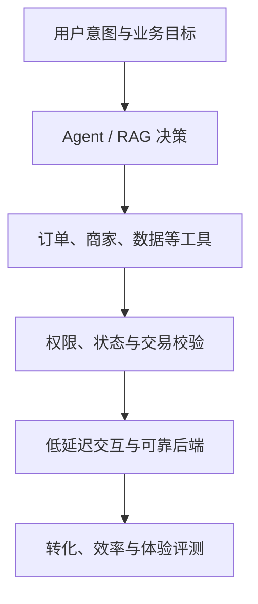

# 美团 AI 应用开发岗位：融合 JD 与能力核对表

> 调研日期：2026-09-01  
> 目标画像：2027 届 AI 应用开发 / Agent 后端工程师（Python）  
> 主要样本：2027 校招 AI Agent 开发、AI 全栈，以及相邻数据/后端 AI 岗位

---

## 0. 核心结论

美团这批岗位最清晰的信号是：

> **把 Agentic 能力嵌入本地生活的复杂交易与履约场景，并由同一位工程师承担从原型、前后端、模型接入到性能、评测和上线的完整交付。**

岗位分成两条主线：

1. **AI Agent 开发工程师**：规划、工具、记忆、学习机制、Agentic 交互、评估与优化；
2. **AI 全栈工程师**：前端/后端功能、LLM 集成、RAG/工作流、模型服务化、流式响应与从 0 到 1 上线。

对你的建议不是转强前端，而是：

> **主投 Agent 开发与后端占主导的 AI 全栈；保持 Python 后端深度，补足可交互 Demo、Agent Runtime、RAG Eval 和流式/高并发。**

---

## 1. 岗位分流与选岗

| 岗位簇 | 核心责任 | 匹配度 | 策略 |
| --- | --- | --- | --- |
| AI Agent 开发（校招） | Agent 架构、规划、工具、记忆、评估 | **最高** | 主投，补 Runtime 与 Eval |
| AI 全栈（校招） | 前后端、AI 功能、模型服务化、流式响应 | 高 | 投后端占主导团队，前端达到可交付 |
| AI 应用后端 | 服务、Agent/RAG 接入、稳定性 | **最高** | 用 EnergyOps 证明后端生产能力 |
| 数据 + AI Agent | 数据研发、OLAP/实时、AI 工作流 | 高 | 数驭穹图/数据工程强匹配 |
| 搜索/推荐大模型应用算法 | 生成式搜索、推荐、模型调优 | 中低 | 若训练/算法为主则分流 |
| Agent 基建/高级岗 | Agent 生态、GraphRAG、框架和平台 | 中 | 作为能力上限，不照搬工作年限 |

### 1.1 最适合你的场景

- 经营分析、商家/门店智能助手、数据 Agent；
- 履约、运营、风控、研发效能类 Agent；
- 有明确 API、数据、状态和人工审批链路的业务；
- 需要 Python 服务、RAG、工具调用和评测的后端岗。

### 1.2 不要误判“全栈”

美团的 AI 全栈强调端到端交付，但校招样本要求通常是前端或后端框架至少一侧扎实、具备完整 Web 项目经验。你的目标是：

- 后端 M3/M4；
- React/Vue/TypeScript 达到 M2—M3，可实现聊天、流式、任务状态和结果页；
- 不在秋招前转成前端专项工程师。

---

## 2. 第一性原理：本地生活 AI 的核心约束

本地生活连接用户、商家、商品、库存、价格、订单和履约。AI 应用必须同时满足：

- 需求开放，但交易状态必须确定；
- 用户体验需要流式、低延迟和可取消；
- 工具调用可能改变订单或经营数据，必须幂等与确认；
- 场景效果不能只看模型分数，还要看任务完成和业务收益；
- 业务多而变化快，需要快速原型和通用 AI 基础设施。

---

## 3. 融合后的美团岗位 JD

### 3.1 岗位名称

**AI Agent / AI 全栈研发工程师（后端主导）**

### 3.2 岗位定位

面向本地生活、交易履约、商家经营、数据研发或内部效率场景，负责 AI 功能从需求分析、交互原型、Agent/RAG 开发到模型服务、后端系统、评测和上线的完整链路。

### 3.3 融合岗位职责

1. 理解用户和业务流程，定义 AI 适用边界、基线、风险与成功指标；
2. 设计 Agentic 交互、任务规划、工具调用、记忆、学习/反馈和终止机制；
3. 建设 Prompt、Function Calling/Tool Binding、RAG 和工作流；
4. 集成订单、商家、数据、搜索、运营等业务服务，并处理权限与副作用；
5. 开发 Python/Java/Go/TypeScript 后端及必要前端，完成端到端功能；
6. 参与模型服务化、推理性能优化、流式响应、模型路由和缓存；
7. 建立 Agent/RAG 评估体系，分析任务成功率、正确性、延迟、成本和业务指标；
8. 建设日志、Trace、回放、限流、降级、灰度、回滚和故障恢复；
9. 使用 AI Coding 快速验证创新，同时保障设计、测试和代码质量；
10. 与产品、算法、前端、后端和业务团队协作，推动从 0 到 1 上线与迭代。

### 3.4 校招硬门槛

- 本科及以上，计算机、软件或相关专业；
- Python/Java/TypeScript/Go 至少一门，编程基础与代码习惯良好；
- 数据结构算法、网络、数据库等基本功；
- 至少掌握前端或后端一种主流框架，并完成过 Web 项目；
- 理解 LLM、Prompt、RAG、Function Calling 和 Agent 基本原理；
- 有 Bot/Agent/自动化工作流从 0 到 1 的项目更有竞争力；
- 快速学习、问题分析、沟通协作和技术好奇心。

### 3.5 强竞争力要求

- 复杂 Agent 的规划、工具、记忆、调试和评估；
- Multi-Agent/Autonomous Agent 的必要性与控制方法；
- RAG/GraphRAG/知识库优化；
- 模型微调、量化、部署或推理优化的最小实践；
- 全栈原型、流式交互和模型服务化；
- 高并发、分布式、稳定性和成本治理；
- 高质量开源项目、论文或可演示作品。

---

## 4. 掌握标准

M0 未接触；M1 能解释；M2 参考可做；M3 独立实现、选型和排障；M4 有项目、测试、指标和复盘。`E/G/U` 分别代表已有证据、明确缺口、待核对。

---

## 5. 能力核对表

### 5.1 业务与产品交付

| ID | 优先级 | 核对项 | M3 验收 | 当前判断 |
| --- | --- | --- | --- | --- |
| MT-B01 | P0 | 用户旅程与业务状态 | 画出用户、商家、订单/任务和异常状态 | E/M2 |
| MT-B02 | P0 | AI 价值与基线 | 用人工/规则/旧系统比较 | E/M2 |
| MT-B03 | P0 | 端到端交付 | 从需求到 API、页面、上线和指标完整复盘 | E/M2 |
| MT-B04 | P0 | AI 与确定性边界 | 交易/权限由系统，理解/规划由模型 | E |
| MT-B05 | P1 | 产品可用性 | 设计确认、取消、进度、失败解释和重试体验 | G/M2 |

### 5.2 Agent 与 LLM 工程

| ID | 优先级 | 核对项 | M3 验收 | 当前判断 |
| --- | --- | --- | --- | --- |
| MT-A01 | P0 | Agent Loop | 独立实现循环、终止、步数与预算 | G/M2 |
| MT-A02 | P0 | Planning | ReAct/Plan-Execute/Workflow 选型 | G/M1 |
| MT-A03 | P0 | Tool Calling | Schema、校验、权限、错误、结果验证 | E/M2 |
| MT-A04 | P0 | Memory/State | 短期、长期、权威状态和会话恢复 | G/M2 |
| MT-A05 | P0 | Side-effect | 确认、幂等、补偿、审计 | E/M2 |
| MT-A06 | P1 | Multi-Agent | 证明优于单 Agent/工作流并控制冲突 | G/M1 |
| MT-L01 | P0 | Prompt/Context | 结构化提示、注入防护、裁剪与压缩 | G/M2 |
| MT-L02 | P0 | 模型 API/流式 | 超时、重试、取消、SSE/WebSocket | E/M2 |
| MT-L03 | P1 | 模型路由 | 质量、成本、延迟和故障路由 | G/U |

### 5.3 RAG 与知识增强

| ID | 优先级 | 核对项 | M3 验收 | 当前判断 |
| --- | --- | --- | --- | --- |
| MT-R01 | P0 | RAG 全链路 | 解析、切分、索引、检索、重排、引用 | G/M2 |
| MT-R02 | P0 | 检索评测 | Recall@K/MRR/nDCG 与答案指标 | G/M1 |
| MT-R03 | P0 | 权限与时效 | 用户/商家权限过滤和增量更新 | E/M2 |
| MT-R04 | P1 | GraphRAG | 说明关系型问题何时值得用图 | G/M1 |
| MT-R05 | P0 | 无证据拒答 | 证据不足时澄清、拒答或转人工 | E/M2 |

### 5.4 后端与全栈

| ID | 优先级 | 核对项 | M3 验收 | 当前判断 |
| --- | --- | --- | --- | --- |
| MT-E01 | P0 | Python 后端 | FastAPI、Pydantic、测试、异常、类型 | E |
| MT-E02 | P0 | 数据库/事务 | 索引、锁、隔离、迁移、慢 SQL | E/M2 |
| MT-E03 | P0 | Redis/缓存 | 一致性、击穿、过期、幂等 | E/M2 |
| MT-E04 | P0 | 异步/并发 | asyncio、取消、背压、连接池 | G/M2 |
| MT-E05 | P1 | 队列与调度 | 重试、DLQ、积压和分布式任务 | G/U |
| MT-E06 | P0 | Web/API 设计 | 鉴权、错误、分页、版本、OpenAPI | E |
| MT-F01 | P1 | 前端可交付 | React/Vue 聊天、流式、任务状态、错误恢复 | G/M2 |
| MT-F02 | P1 | BFF/全链路 | 解释 UI—BFF—Agent—业务服务的数据流 | G/U |
| MT-E07 | P0 | CS 基础 | 算法、OS、网络、数据库达到校招线 | G/M2 |

### 5.5 模型服务、评测与生产

| ID | 优先级 | 核对项 | M3 验收 | 当前判断 |
| --- | --- | --- | --- | --- |
| MT-I01 | P1 | 模型服务化 | 理解网关、并发、批处理、流式和部署 | G/M1 |
| MT-I02 | P1 | 延迟优化 | 首 Token、P95/P99、缓存、并行与截断 | G/U |
| MT-Q01 | P0 | Agent Eval | 任务/步骤/工具/答案/业务分层指标 | G/M2 |
| MT-Q02 | P0 | Golden Set/Bad Case | 可回归且覆盖失败类型 | E/M2 |
| MT-Q03 | P0 | Trace/Replay | 定位模型、检索、工具或状态失败 | G/M2 |
| MT-P01 | P0 | 稳定性 | 超时、限流、熔断、降级、故障隔离 | E/M2 |
| MT-P02 | P0 | 可观测 | Logs/Metrics/Trace/告警统一 trace ID | E/M2 |
| MT-P03 | P1 | 灰度与成本 | 版本、回滚、Token/调用预算和业务收益 | G/U |
| MT-C01 | P0 | AI Coding | 从需求到测试/Review 的验证闭环 | E/M2 |

---

## 6. 你的项目映射

| 项目 | 美团匹配点 | 补证方向 |
| --- | --- | --- |
| EnergyOps | 真实后端、数据质量、告警、任务、重试、自愈、MCP 工具、计费对账 | 流式 Agent API、异步并发压测、任务级 Eval、业务 ROI |
| 数驭穹图 | 数据 Agent、意图/领域路由、Schema/SQL/权限/证据 | RAG 检索评测、澄清交互、可视化结果页 |
| Ovanta | 交易/订单/支付/权益和国际化 | 提炼本地生活类状态机、幂等与补偿叙事 |
| RuleArena | 多 Agent + 确定性状态/证据/修复 | 加 Session、Memory、checkpoint、Replay 和在线 Demo |

最合适的作品组合：**EnergyOps 证明后端生产性，RuleArena 证明 Agent 深度，数驭穹图证明数据场景与可信 RAG。**

---

## 7. 定向学习顺序

1. Python asyncio、流式 SSE、任务队列和高并发 API；
2. Agent Loop、State/Memory、Tool side-effect、checkpoint；
3. RAG 混合检索、重排、权限和 Eval；
4. Agent Trace、Replay、Golden Set 与业务指标；
5. React/TypeScript 做出可用交互，不追求复杂前端工程；
6. 模型服务化、延迟/成本、灰度与降级；
7. 持续补算法、网络、OS、数据库。

---

## 8. 预测面试追问

1. Agent、Workflow 和普通后端服务如何选？
2. 用户让 Agent 下单时，哪些步骤必须确认？
3. 如何实现流式响应、客户端取消与服务端资源释放？
4. Memory 为什么不能直接等于聊天记录？
5. RAG 的离线指标与线上业务指标如何关联？
6. 工具调用失败、超时、重复执行分别怎么处理？
7. 如何设计一个高并发商家经营 Agent？
8. 模型服务慢或不可用时怎样降级？
9. 多 Agent 是否会增加延迟、成本和不稳定？为什么还用？
10. 介绍一个从 0 到 1 上线的项目及关键取舍；
11. 现场写算法题并分析复杂度；
12. 设计任务状态页和后端状态机。

---

## 9. 来源与置信度

官方招聘页，高置信度：

- [美团 2027 校招：AI Agent 开发工程师](https://zhaopin.meituan.com/web/position/detail?highlightType=campus&jobUnionId=4697317646)
- [美团 2027 校招：AI 全栈工程师](https://zhaopin.meituan.com/web/position/detail?highlightType=campus&jobUnionId=4697320043)
- [美团：AI Agent 研发工程师](https://zhaopin.meituan.com/web/position/detail?jobUnionId=4589451683)
- [美团：数据平台研发—AI + 数据方向](https://zhaopin.meituan.com/web/position/detail?highlightType=social&jobUnionId=4592574493)
- [美团：AI 应用/Agent 工程岗位样本](https://zhaopin.meituan.com/web/position/detail?highlightType=social&jobUnionId=4449544248)

补充转载：

- [美团 AI Agent 校招岗位完整片段](https://campus.niuqizp.com/job-vw85aLzNn.html)

官方页面为动态渲染，文档以可检索片段和转载全文交叉验证；投递时重新确认职位状态与完整要求。

---

## 10. 维护规则

- 为每个目标岗标明 Agent / AI 全栈 / AI 后端 / 数据 AI / 算法分支；
- 前端只补到目标岗位需要的交付深度；
- 每个 P0 必须有代码、测试、指标或可运行页面；
- 每周做一次“模型失败—定位—修复—回归”练习；
- 目标岗位若偏模型训练，则另建分支，不挤占后端与 Agent 主线。
