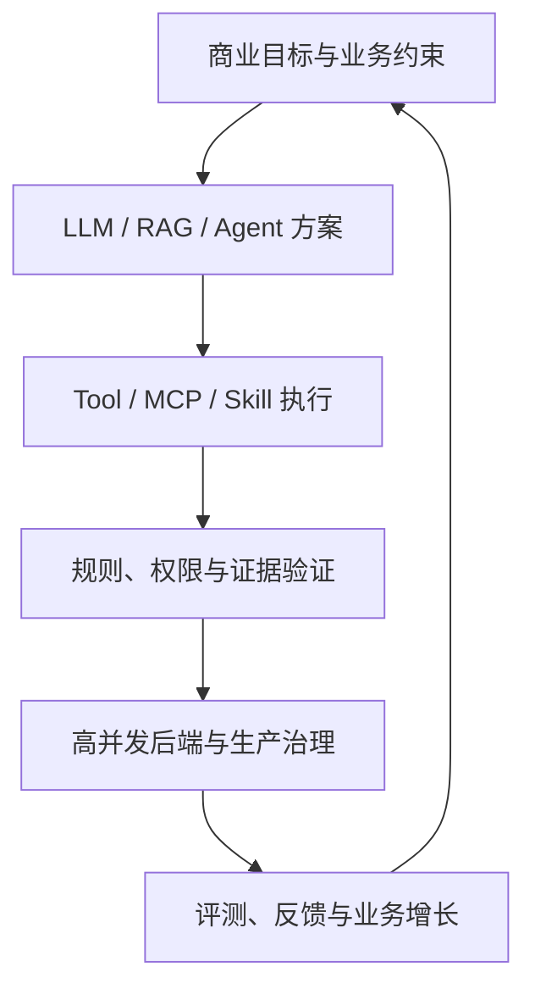

# 阿里巴巴 AI 应用开发岗位：融合 JD 与能力核对表

> 调研日期：2026-09-01  
> 目标画像：2027 届 AI 应用开发 / Agent 后端工程师（Python）  
> 用途：选岗、能力核对、项目补证、面试复习  
> 说明：融合的是 AI 应用研发、业务技术、Agent 系统及相邻后端岗位；算法训练与纯 AI Infra 单独分流。

---

## 0. 核心结论

阿里这类岗位真正筛选的是：

> **能从商业或企业业务问题出发，借助 AI Coding 快速完成 Agent/RAG 应用，再用工程边界、评测、观测和高可用系统把它交付到生产环境的“系统构建者”。**

它不是传统后端简单加一个模型 API，也不是只会 LangChain 的 Demo 开发。高频信号包括：

1. 从需求洞察到系统构建的端到端责任；
2. Agent、RAG、Context Engineering、Tool/MCP/Skill；
3. AI Coding 的项目级使用，而非只做代码补全；
4. 能判断 LLM 与确定性逻辑的边界，并处理幻觉、注入和副作用；
5. 扎实编程、数据结构算法、网络、操作系统和后端工程；
6. 可展示项目、GitHub、博客或开源贡献；
7. 对推理服务、延迟、KV Cache、流式输出等有工程全局视角。

对你的最佳切入点是：

> **业务技术 / AI 应用研发 / Data Agent，以 Python 后端、可信执行、企业数据和规则系统为差异化。**

---

## 1. 岗位分流：不要把阿里所有 AI JD 相加

| 岗位簇 | 典型内容 | 匹配度 | 准备策略 |
| --- | --- | --- | --- |
| AI 应用研发 | 需求洞察、Agent/RAG、工具、业务增长 | **最高** | 主投基线 |
| 淘天业务技术 | 交易、营销、会员、商家、内容、数据治理 | **最高** | 用真实业务闭环和可靠后端证明 |
| Agent 应用/平台 | Planning、Memory、Tool、上下文、AgentOps | 高 | 补 Runtime、Eval、Trace、成本 |
| AI 技术服务/FDE | Python、方案落地、客户交付 | 中高 | 需要沟通、需求抽象和交付能力 |
| AI Agent 优化 | SFT/RL、轨迹数据、评测、模型优化 | 中低 | 算法分支，不作为当前主线 |
| Agent Infra / AI Infra | 推理、容器、调度、GPU、平台 | 中低 | 只投偏应用运行时，不主攻训练基础设施 |
| 基础模型/研究 | 预训练、后训练、论文 | 低 | 不因品牌临时转纯算法路线 |

### 1.1 最适合你的阿里方向

1. 淘天数据、商家经营、会员、交易等 AI 应用研发；
2. 需要 Tool/MCP/Skill、RAG、流程编排的业务技术岗位；
3. 企业数据 Agent、运营分析、研发效能与质量 Agent；
4. Python 为主或语言不限的 AI 应用后端；
5. Agent Infra 中偏上下文、工具、调度、评测、可观测的岗位。

### 1.2 看到这些词要降级或分流

- 预训练、分布式训练、CUDA、NCCL、RDMA：纯 Infra/训练路线；
- SFT、DPO、GRPO、RL 为主要职责：应用算法路线；
- 硕博、顶会论文为硬门槛：研究岗位；
- 6 年以上 Java 架构经验：用来观察生产上限，不是校招门槛。

---

## 2. 第一性原理：阿里为什么强调这些能力

阿里 AI 应用通常运行在交易、营销、商家、会员、云服务等真实链路中。核心矛盾不是“模型会不会回答”，而是：

- 商业场景有复杂口径，所以先要业务建模，不能裸接模型；
- Agent 会操作真实系统，所以 Tool 必须有 Schema、鉴权、幂等和审批；
- 亿级业务容不得偶发成功，所以要评测、回放、观测、灰度和降级；
- 业务变化快，所以 RAG、Memory、Prompt、模型与规则必须版本化；
- AI Coding 提升交付速度，但工程师仍需对架构、验证和结果负责。

---

## 3. 融合后的阿里岗位 JD

### 3.1 岗位名称

**AI 应用研发工程师（Agent / RAG / 业务技术方向）**

### 3.2 岗位定位

面向电商、会员、营销、商家经营、数据治理或企业服务等核心场景，负责从业务问题识别、AI 方案设计、Agent/RAG 系统开发到生产交付和效果迭代的完整链路；以扎实后端工程为底座，用确定性系统约束大模型的不确定性。

### 3.3 融合岗位职责

1. 深入业务链路，抽象用户目标、约束、风险与指标，识别适合 AI 的高价值节点；
2. 设计 Agent 的规划、记忆、上下文、模型路由、工具调用、反思与终止机制；
3. 建设 Tool/MCP/Skill 体系，接入业务 API、数据库、搜索、调度和审批系统；
4. 构建 RAG/知识增强链路，处理解析、切分、检索、重排、权限过滤、引用与更新；
5. 开发高可用 AI 后端，完成 API、缓存、数据库、异步任务、流式输出和服务治理；
6. 建立任务成功率、答案正确率、工具成功率、延迟、成本、安全与业务收益评测；
7. 建设 Trace、日志、回放、Bad Case、灰度、回滚、限流、降级和人工兜底；
8. 使用 AI Coding 完成需求拆解、开发、测试、审查和排障，并验证生成结果；
9. 与产品、算法、数据和业务团队协作，推动原型进入真实业务并持续迭代；
10. 沉淀可复用框架、文档、Demo、开源项目或技术分享。

### 3.4 应届硬门槛

- 本科及以上，计算机、软件、数据、人工智能等相关专业优先；
- 深入掌握 Python/Java/Go/JavaScript 至少一门，具备高质量编码能力；
- 数据结构算法、网络、操作系统、数据库等基础扎实；
- 理解 LLM 局限、Prompt/Context Engineering、Agent、RAG、工具调用；
- 有一个完整 AI 应用项目，能展示代码、运行结果、指标与失败复盘；
- 会 Linux、Git、测试、Docker 和基本后端开发；
- 能使用 AI 编程工具，同时能审查、解释、验证和修正代码。

### 3.5 强竞争力要求

- 真实 Agent/RAG/MCP/Skill 项目；
- 上下文、记忆、状态、工具副作用和恢复机制；
- 任务级 Eval、Agent Trace、回放和持续回归；
- 高并发、高可用、模型网关、流式输出、成本治理；
- GitHub 高质量项目、开源贡献、技术博客或在线作品；
- 了解 vLLM/Ollama、KV Cache、批处理和推理服务边界；
- 有电商、数据、规则、风控、运营或企业服务领域理解。

---

## 4. 掌握标准

| 等级 | 定义 | 使用方式 |
| --- | --- | --- |
| M0 | 未接触 | 不算掌握 |
| M1 | 能解释 | 不算掌握 |
| M2 | 参考资料可实现 | 仍需补边界 |
| M3 | 可独立实现、选型、排障 | P0 最低线 |
| M4 | 有项目、测试、指标、复盘 | 简历重点 |

当前判断：`E` 已有证据待验收；`G` 明确缺口；`U` 尚未核对。

---

## 5. 能力核对表

### 5.1 业务与方案

| ID | 优先级 | 核对项 | M3 验收 | 当前判断 |
| --- | --- | --- | --- | --- |
| ALI-B01 | P0 | 业务链路与边界 | 3 分钟讲清用户、状态、输入输出和异常 | E |
| ALI-B02 | P0 | 指标与基线 | 定义可证伪的业务/技术指标 | E/M2 |
| ALI-B03 | P0 | AI/规则/人工边界 | 对同一问题给出职责划分 | E/M2 |
| ALI-B04 | P0 | Prompt/RAG/Agent 选型 | 比较两种方案的质量、成本和风险 | G/M2 |
| ALI-B05 | P1 | 商业 ROI | 估算收益、模型成本和维护成本 | G/U |

### 5.2 LLM、RAG 与上下文

| ID | 优先级 | 核对项 | M3 验收 | 当前判断 |
| --- | --- | --- | --- | --- |
| ALI-L01 | P0 | LLM 能力与局限 | 解释 Token、上下文、幻觉、采样与非确定性 | G/M1 |
| ALI-L02 | P0 | Prompt/结构化输出 | JSON Schema 校验、重试和失败降级 | E/M2 |
| ALI-L03 | P0 | RAG 全链路 | 独立完成解析到引用输出 | G/M2 |
| ALI-L04 | P0 | 混合检索与重排 | 用 Recall@K/MRR/答案正确率比较策略 | G/M1 |
| ALI-L05 | P0 | 权限感知检索 | 检索前过滤并阻止越权证据 | E/M2 |
| ALI-L06 | P1 | Context Engineering | 做选择、排序、裁剪、压缩和预算 | G/M2 |
| ALI-L07 | P1 | 模型路由与缓存 | 按质量/成本/延迟路由并防缓存污染 | G/U |

### 5.3 Agent、Tool、MCP 与 Skill

| ID | 优先级 | 核对项 | M3 验收 | 当前判断 |
| --- | --- | --- | --- | --- |
| ALI-A01 | P0 | Agent Loop | 独立实现 Model→Tool→Result→Stop | G/M2 |
| ALI-A02 | P0 | Planning 与 Workflow | 解释何时用 ReAct、计划执行或状态机 | G/M1 |
| ALI-A03 | P0 | State/Context/Memory | 区分权威状态、运行态、短期与长期记忆 | G/M2 |
| ALI-A04 | P0 | Tool Schema 与校验 | 类型、枚举、权限、错误和返回契约完整 | E/M2 |
| ALI-A05 | P0 | MCP/Skill | 能开发服务端并说明协议与业务能力边界 | E/M2 |
| ALI-A06 | P0 | 副作用与幂等 | 幂等键、确认、重试、补偿、审计 | E/M2 |
| ALI-A07 | P1 | 多 Agent | 用职责、共享状态、冲突和终止证明必要性 | G/M1 |
| ALI-A08 | P1 | Prompt 注入防护 | 分离可信/不可信内容并限制工具权限 | G/M1 |

### 5.4 Python 后端与系统基础

| ID | 优先级 | 核对项 | M3 验收 | 当前判断 |
| --- | --- | --- | --- | --- |
| ALI-E01 | P0 | Python 语言与工程 | 类型、异常、包、测试、性能诊断 | E/M2 |
| ALI-E02 | P0 | FastAPI/API 设计 | 鉴权、分页、错误、版本、幂等 | E |
| ALI-E03 | P0 | PostgreSQL/事务 | 索引、隔离、锁、慢 SQL 和迁移 | E/M2 |
| ALI-E04 | P0 | Redis/缓存 | 一致性、击穿、雪崩、过期与幂等 | E/M2 |
| ALI-E05 | P0 | 异步与并发 | asyncio、取消、超时、背压、连接池 | G/M2 |
| ALI-E06 | P1 | 队列与任务 | 至少实践一种队列、重试和 DLQ | G/U |
| ALI-E07 | P0 | CS 基础 | 算法、网络、OS、数据库可应对校招面试 | G/M2 |
| ALI-E08 | P1 | Java/Go 阅读能力 | 能联调和理解团队服务，不要求双栈精通 | G/U |

### 5.5 评测、生产与 AI Coding

| ID | 优先级 | 核对项 | M3 验收 | 当前判断 |
| --- | --- | --- | --- | --- |
| ALI-Q01 | P0 | Golden Set | 覆盖正常、边界、对抗和历史 Bad Case | E/M2 |
| ALI-Q02 | P0 | 分层指标 | 模型、检索、工具、任务、业务五层指标 | G/M2 |
| ALI-Q03 | P0 | Trace/回放 | 复现一次失败的完整轨迹 | G/M2 |
| ALI-Q04 | P1 | 版本回归 | Prompt/模型/知识/工具变更自动比较 | G/U |
| ALI-P01 | P0 | 超时、重试、限流、降级 | 能画故障链并避免重试风暴 | E/M2 |
| ALI-P02 | P0 | 可观测与告警 | Logs/Metrics/Trace 关联 request/trace ID | E/M2 |
| ALI-P03 | P1 | 灰度、回滚与 SLO | 定义上线门槛和回滚条件 | G/U |
| ALI-P04 | P1 | 成本与延迟 | 首 Token/P95/P99/Token/工具成本预算 | G/U |
| ALI-C01 | P0 | AI Coding 工作流 | 需求→计划→实现→测试→审查→验证闭环 | E/M2 |
| ALI-C02 | P1 | 可复用规则与 Harness | 将项目约束固化为 spec、脚本和检查 | G/U |

---

## 6. 你的项目如何映射阿里要求

| 项目 | 可证明的能力 | 需要补成的证据 |
| --- | --- | --- |
| EnergyOps | FastAPI/PostgreSQL/Redis、任务调度、质量规则、告警闭环、25 个 MCP 工具、风险分级、恢复与对账 | Agent Session/State、工具副作用轨迹、任务级 Eval、成本/延迟面板 |
| 数驭穹图 | NL2SQL、Schema Linking、权限、AST/只读/扫描限制、证据绑定 | 完整 RAG 检索评测、上下文压缩、模型路由、线上 Trace |
| Ovanta | 鉴权、版本、会员、订单、支付、权益、国际化 | 将一个业务流程改造成可审批、可回滚的 Agent Workflow |
| RuleArena | 多 Agent 审查、可执行状态模型、非法状态确定性校验、证据链与修复建议 | 做出 Loop、checkpoint、回放、自动评测和副作用模拟 |

### 当前最有说服力的阿里叙事

“我不是让模型直接决定交易或规则，而是让模型负责理解、规划和解释；权威状态、权限、执行和最终校验由后端与规则系统负责。系统通过 MCP 工具接入真实能力，以证据、评测和回放持续优化。”

---

## 7. 定向学习顺序

1. **补 CS 与 Python 并发**：算法、网络/OS/数据库、asyncio、队列；
2. **补 Agent Runtime**：Loop、State、Memory、Context、checkpoint、side-effect；
3. **做生产级 RAG**：混合检索、重排、权限、引用、离线 Eval；
4. **做评测与观测**：Golden Set、Trace、Replay、版本回归；
5. **补商业表达**：基线、ROI、成本、业务指标；
6. **了解推理服务**：vLLM、KV Cache、批处理、流式与网关，不主攻 CUDA。

---

## 8. 预测面试追问

1. 为什么这里要用 Agent，而不是固定 Workflow？
2. Tool 调用重复执行订单或写数据库怎么办？
3. RAG 召回正确但答案仍错，如何定位？
4. Context 超长时保留什么、压缩什么、丢弃什么？
5. 如何证明你的 Agent 比人工或规则系统更有价值？
6. Prompt/模型升级后如何防止效果回退？
7. Redis、数据库和模型服务同时故障时如何降级？
8. 如何防 Prompt Injection 和越权工具调用？
9. EnergyOps 的 MCP 工具为何不是普通 API 包装？
10. AI Coding 生成的代码如何验证，出现架构偏差如何纠正？
11. 手写一道中等算法题，并追问复杂度与边界；
12. 设计一个高并发商家经营 Agent 的后端架构。

---

## 9. 资料来源与置信度

高置信度：

- [阿里巴巴 2027 届 AI 应用研发工程师](https://campus-talent.alibaba.com/campus/position/199903220038?deptCodes=WMREYL%2CVKQ50F%2CHEVDFW%2CFJNV9M)
- [淘天：AI 应用研发工程师—内容消费](https://talent.taotian.com/off-campus/position-detail?positionId=100021080009)
- [淘天：AI 应用研发工程师—用户运营](https://talent.taotian.com/off-campus/position-detail?positionId=100021120004)
- [淘天：AI 应用研发工程师—首页与推荐](https://talent.taotian.com/off-campus/position-detail?positionId=100021160002)
- [阿里妈妈：AI 应用研发工程师](https://talent.taotian.com/off-campus/position-detail?positionId=100031660002)
- [阿里云 AI 原生应用架构白皮书介绍](https://higress.ai/blog/higress-gvr7dx_awbbpb_ksx4ge93i5zcflry/)

补充验证：

- [阿里 2027 AI 应用研发实习岗位转载](https://www.nowcoder.com/jobs/detail/442597)
- [淘天会员技术团队 Agent/RAG 招募信息](https://www.nowcoder.com/feed/main/detail/f3c9a5ed4a404e56b0ae1e59c3d04590)

投递前重新核验岗位状态、事业群、城市和语言要求；第三方页面只用于补齐官方动态页面未稳定展示的文本。

---

## 10. 维护规则

- 每项只有通过“能讲、能写、能追问、能举证”才改为 M3；
- 新增项目证据时写明 Commit/Demo/测试/指标位置；
- 每周只提升 2—3 个 P0，不把阅读量当进度；
- 每次投递前复制目标 JD，标出硬门槛、加分项和分流项；
- 若岗位主责变为训练/RL/Infra，另建分支，不污染当前主线。
