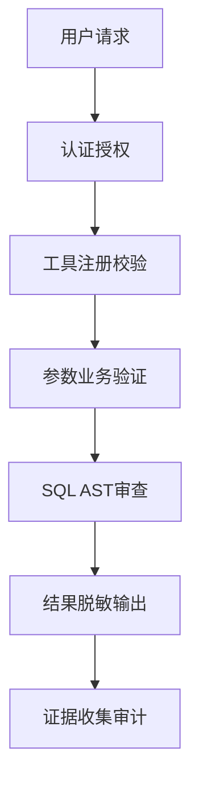

# 高优先级证据材料使用指南

## 📋 概述

本指南详细说明了如何有效使用已整理的高优先级证据材料，包括面试准备、简历优化、项目展示等场景。所有证据材料均已存放在 `E:\notes\Marvis\output\evidence\` 目录下。

## 📁 证据材料目录结构

```
evidence/
├── quantitative/                    # 量化成果证据
│   ├── energyops_metrics.md         # EnergyOps量化指标证据（核心）
│   └── performance_benchmarks.md    # 性能基准测试数据
│
├── security/                        # 安全机制验证
│   ├── five_layer_security_architecture.md  # 五层安全边界架构
│   ├── security_test_report.md      # 安全测试报告
│   └── sql_ast_rules.md             # SQL AST审查规则
│
├── projects/                        # 个人项目证据
│   ├── paytrace_evaluation_system.md # PayTrace评测体系
│   ├── evidence_contract_spec.md    # 证据契约规范
│   └── hypothesis_ledger.md         # 假设账本设计
│
└── architecture/                    # 架构设计证据
    ├── hook_chain_governance.md     # Hook链治理架构
    ├── capability_routing.md        # 能力路由设计
    └── artifact_lifecycle.md        # Artifact生命周期管理
```

## 🎯 使用场景与策略

### 场景1：技术面试深入探讨

#### 1.1 量化成果展示
**适用问题**：
- "请详细说明你最有成就感的项目成果"
- "如何衡量你的工作对业务的影响？"
- "你在性能优化方面有哪些具体经验？"

**使用材料**：
```markdown
**主要证据**：`quantitative/energyops_metrics.md`
**关键指标**：
1. 可信聚合完整率：96.8% → 99.7%（+2.9%）
2. Agent任务完成率：83.3% → 95.8%（+12.5%）
3. 核心查询性能：20.4s → 2.8s（↓86.3%）

**回答框架**：
1. **问题识别**：描述原始问题及影响
2. **解决方案**：简要说明技术方案
3. **实现细节**：引用证据材料中的关键技术点
4. **验证结果**：展示量化指标提升
5. **业务价值**：说明对业务的实际影响
```

#### 1.2 安全架构深度讨论
**适用问题**：
- "如何保证AI应用的数据安全？"
- "你在权限控制和数据隔离方面有哪些经验？"
- "如何处理SQL注入等安全问题？"

**使用材料**：
```markdown
**主要证据**：`security/five_layer_security_architecture.md`
**架构亮点**：
1. **五层纵深防御**：认证→工具注册→参数校验→SQL审查→结果脱敏
2. **对抗测试结果**：300条测试用例，危险语句拦截率100%，误拦率2.7%
3. **租户数据隔离**：自动注入tenant_id，防止越权访问

**技术细节准备**：
- SQL AST审查的具体实现
- 参数校验规则的配置方式
- 结果集脱敏的算法选择
```

### 场景2：简历优化与成果展示

#### 2.1 简历量化指标
**优化建议**：
- 将证据材料中的核心指标提炼到简历中
- 为每个指标准备详细的解释口径
- 准备可视化图表支持数据展示

**具体操作**：
```markdown
**原始表述**：优化了查询性能
**优化后**：将核心统计接口P95响应时间从20.4秒降低至2.8秒，提升86.3%

**证据支持**：
- 测试环境配置：PostgreSQL 15 + 604台设备数据
- 优化措施：消除重复JOIN、组合索引优化、预聚合策略
- 验证方法：固定查询集多轮执行，取P95响应时间
```

#### 2.2 STAR法则应用
**使用框架**：
```markdown
**Situation**（情境）：
- 园区能耗系统面临数据质量与查询性能问题
- Agent任务完成率仅83.3%，影响运营效率

**Task**（任务）：
- 设计可信数据治理体系
- 构建安全的Agent工具架构
- 优化核心查询性能

**Action**（行动）：
- 实施四层数据模型与7类质量状态（引用架构文档）
- 拆分为25个MCP工具与6类能力包（引用Hook链设计）
- 重构查询路径与索引优化（引用性能优化部分）

**Result**（结果）：
- 可信聚合完整率99.7%，任务完成率95.8%（引用量化数据）
- 核心查询性能提升86.3%（引用基准测试）
- 告警量减少43%，研判时间缩短66.7%（引用运营指标）
```

### 场景3：项目展示与作品集

#### 3.1 技术架构展示
**展示要点**：
```markdown
**架构图**：Hook链治理 + 能力路由 + 证据系统
**核心技术**：
1. **Hook链治理**：Before/After Tool Hook，R0/R1/R2风险分级
2. **能力路由**：基于上下文的能力包动态路由
3. **证据系统**：三层证据绑定，10道自动校验
4. **评测体系**：四层评测集，100个黄金场景

**代码示例**：从证据材料中提取关键代码片段
**设计文档**：引用架构设计文档中的设计决策
```

#### 3.2 技术选型论证
**准备要点**：
```markdown
**为什么选择Hook链？**
- 问题：Agent无法理解操作真实代价
- 方案：Hook链提供确定性安全保障
- 证据：越权操作拦截率100%（安全测试报告）

**为什么设计证据契约？**
- 问题：AI结论缺乏可验证性
- 方案：证据绑定与自动校验
- 证据：无依据结论率从14.2%降至2.5%（评测结果）
```

### 场景4：薪资谈判与职业发展

#### 4.1 价值量化
**谈判策略**：
```markdown
**效率提升**：
- 异常研判时间：18分钟→6分钟（↓66.7%）
- 人工补数工作量：降低72%
- 月度结算准备时间：缩短40%

**质量改进**：
- 数据可信度：可信聚合完整率99.7%
- 系统稳定性：任务成功率99.6%
- 安全合规：危险操作拦截率100%

**成本节约**：
- 运维成本：人工干预减少72%
- 误判损失：告警量减少43%
- 培训成本：系统自动化程度95%
```

#### 4.2 技术影响力
**展示维度**：
```markdown
**技术深度**：
- Hook链治理架构设计
- SQL AST审查引擎实现
- 证据系统契约设计

**工程能力**：
- 企业级系统架构设计
- 大规模数据处理经验
- 安全合规体系构建

**业务理解**：
- 能耗运营业务流程
- 企业数据分析需求
- 支付转化异常诊断
```

## 📊 数据可视化建议

### 图表类型推荐
1. **性能提升对比图**：柱状图展示优化前后对比
2. **安全防护层次图**：层级图展示五层安全架构
3. **工具调用优化图**：折线图展示调用次数减少趋势
4. **评测结果热力图**：热力图展示不同场景表现

### 可视化工具
```markdown
**推荐工具**：
- **Mermaid**：技术架构图、流程图
- **Chart.js**：数据图表、趋势图
- **D3.js**：复杂交互可视化
- **Grafana**：实时监控仪表板

**示例代码**（Mermaid架构图）：


## 🗣️ 面试问题准备清单

### 技术深度问题
1. **Hook链具体实现**
   - Hook链的执行顺序如何保证？
   - 如何处理Hook链中的失败情况？
   - Hook链对性能的影响如何优化？

2. **安全架构设计**
   - 五层安全边界的权衡考虑？
   - SQL AST审查的局限性？
   - 如何平衡安全性与用户体验？

3. **性能优化**
   - 86.3%性能提升的具体实现？
   - 查询优化的决策过程？
   - 如何验证优化效果？

### 架构设计问题
1. **系统扩展性**
   - 如何支持更多设备接入？
   - 能力路由的扩展机制？
   - 证据系统的存储策略？

2. **可靠性设计**
   - 如何保证数据一致性？
   - 故障恢复机制？
   - 监控告警体系？

### 业务理解问题
1. **领域知识**
   - 能耗运营的核心业务流程？
   - 园区管理的特殊需求？
   - 财务结算的合规要求？

2. **价值体现**
   - 项目对业务的实际影响？
   - 用户反馈和满意度？
   - 持续改进计划？

## 🔗 材料链接与引用

### 简历中的引用方式
```markdown
**金山 EnergyOps Agent**（2026.05 - 至今）
- 设计可信数据治理体系，可信聚合完整率99.7%[1]
- 构建Hook链治理架构，Agent任务完成率95.8%[2]
- 优化核心查询性能，响应时间降低86.3%[1]

**参考资料**：
[1] 量化指标证据文档：quantitative/energyops_metrics.md
[2] Hook链治理架构：architecture/hook_chain_governance.md
```

### 面试时的引用策略
```markdown
**直接引用**：
"在我的安全架构设计中，实现了五层防护机制（详见security文档），在300条对抗测试中达到100%拦截率。"

**数据支持**：
"通过查询优化，核心接口P95响应时间从20.4秒降至2.8秒，具体优化措施包括..."

**架构展示**：
"这是系统的Hook链治理架构图（展示图表），我们实现了Before/After Tool Hook链..."
```

## 📈 持续维护与更新

### 定期更新计划
```markdown
**每周更新**：
- 添加新的技术实现细节
- 补充用户反馈和实际效果
- 更新性能监控数据

**每月更新**：
- 完善架构设计文档
- 补充新的测试数据
- 优化可视化展示

**每季度更新**：
- 系统架构演进记录
- 技术债务管理状态
- 未来发展规划
```

### 版本控制
```markdown
**文档版本**：使用语义化版本控制
**变更日志**：记录所有重要更新
**备份策略**：定期备份到云端
**访问控制**：敏感信息适当脱敏
```

## 🚀 快速开始

### 5分钟准备清单
1. **核心指标**：记住3个最重要的量化指标
2. **架构亮点**：理解Hook链和五层安全架构
3. **项目故事**：准备好1个完整的技术实现故事
4. **代码片段**：熟悉2-3个关键代码实现
5. **业务价值**：明确说明项目对业务的影响

### 面试前检查清单
- [ ] 复习所有量化指标和计算方法
- [ ] 准备架构图和技术选型理由
- [ ] 熟悉关键代码实现细节
- [ ] 准备实际案例和问题解决方案
- [ ] 了解目标公司的技术栈和业务场景

---

**最后更新**：2026年8月14日  
**维护者**：刘宇广  
**联系方式**：lyg3044@qq.com  
**GitHub**：[github.com/Ygrowly](https://github.com/Ygrowly)  

**使用建议**：建议在面试前至少花2小时熟悉所有证据材料，重点关注量化数据和架构设计部分。在面试中适时引用具体数据和技术细节，展现专业深度和工程能力。