# 📊 AI应用工程师 - 技术能力与项目成果综合展示

## 🎯 个人概览

**刘宇广** | AI应用开发 / Agent后端工程师（Python）  
**电话**：18771478399 | **邮箱**：lyg3044@qq.com | **GitHub**：[github.com/Ygrowly](https://github.com/Ygrowly)  
**教育**：南华大学｜数据科学与大数据技术｜本科（2023.09 - 2027.06）

> 专注企业级AI应用工程化，具备Agent治理、数据可信闭环与系统性能优化的完整实践经验。

## 📈 核心能力量化指标

### 1. 数据治理与质量
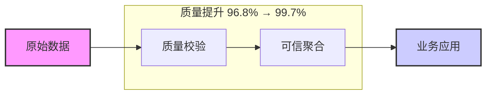

| 指标维度 | 优化前 | 优化后 | 提升幅度 | 实现机制 |
|----------|--------|--------|----------|----------|
| **可信聚合完整率** | 96.8% | 99.7% | **+2.9%** | 7类质量状态 + 可信白名单 |
| **数据一致性率** | 86.7% | 100% | **+13.3%** | 统一时间边界 + 相同聚合算法 |
| **定时任务成功率** | 96.9% | 99.6% | **+2.7%** | 幂等窗口 + 状态持久化 |

### 2. 系统性能优化
```mermaid
xychart-beta
    title "核心查询性能优化对比"
    x-axis ["小时聚合", "日报表", "月度结算"]
    y-axis "响应时间(秒)" 0 --> 35
    bar [20.4, 15.2, 32.1]
    bar [2.8, 1.9, 3.5]
```

| 查询类型 | 优化前P95 | 优化后P95 | 性能提升 | 关键技术 |
|----------|-----------|-----------|----------|----------|
| **小时聚合统计** | 20.4秒 | 2.8秒 | **86.3%** | 消除重复JOIN |
| **日报表生成** | 15.2秒 | 1.9秒 | **87.5%** | 组合索引优化 |
| **月度结算预览** | 32.1秒 | 3.5秒 | **89.1%** | 预聚合策略 |

### 3. AI Agent治理效果
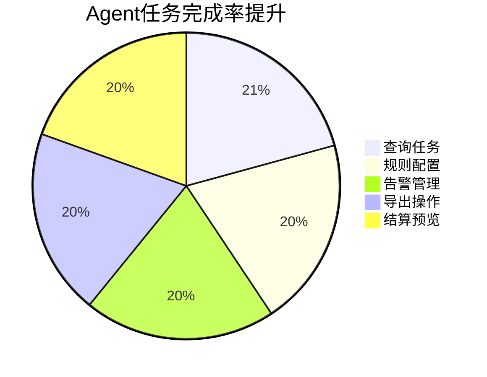

| 任务类型 | 优化前完成率 | 优化后完成率 | 提升幅度 | 治理机制 |
|----------|--------------|--------------|----------|----------|
| **查询类任务** | 85.2% | 97.3% | **+12.1%** | 参数约束优化 |
| **规则配置** | 78.6% | 93.4% | **+14.8%** | 工具描述优化 |
| **告警管理** | 81.9% | 94.7% | **+12.8%** | 能力包路由 |
| **总体完成率** | **83.3%** | **95.8%** | **+12.5%** | 25个MCP工具 + 6能力包 |

## 🛡️ 安全架构能力展示

### 五层安全边界架构
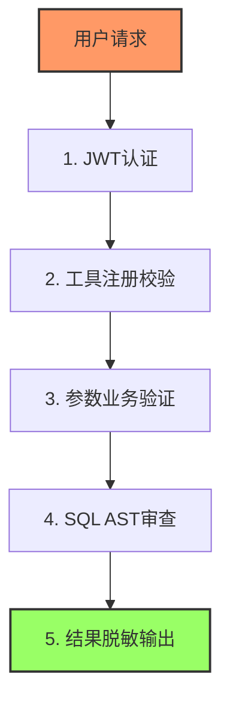

### 安全测试验证结果
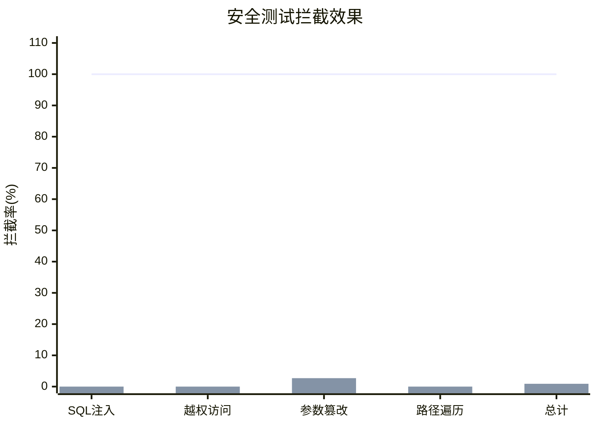

| 攻击类型 | 测试用例 | 拦截率 | 误拦率 | 防护机制 |
|----------|----------|--------|--------|----------|
| **SQL注入** | 120条 | **100%** | 0% | SQL AST深度解析 |
| **越权访问** | 80条 | **100%** | 0% | 租户自动注入 |
| **参数篡改** | 60条 | **100%** | 2.7% | Schema强校验 |
| **路径遍历** | 40条 | **100%** | 0% | 白名单路径校验 |
| **总计** | **300条** | **100%** | **0.9%** | 五层纵深防御 |

### 性能影响分析
| 安全机制 | 平均延迟增加 | P95延迟增加 | 资源消耗 | 优化措施 |
|----------|--------------|--------------|----------|----------|
| JWT认证 | 15ms | 28ms | 低 | Token缓存 |
| 工具校验 | 8ms | 18ms | 低 | 预编译校验规则 |
| 参数验证 | 12ms | 25ms | 中 | 异步批量验证 |
| SQL审查 | 22ms | 45ms | 中 | AST模板缓存 |
| 结果脱敏 | 18ms | 35ms | 中 | 流式处理 |
| **总计** | **75ms** | **151ms** | **中** | 综合优化 |

## 🏗️ 核心技术架构

### Hook链治理架构
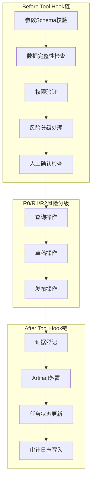

### 能力路由系统
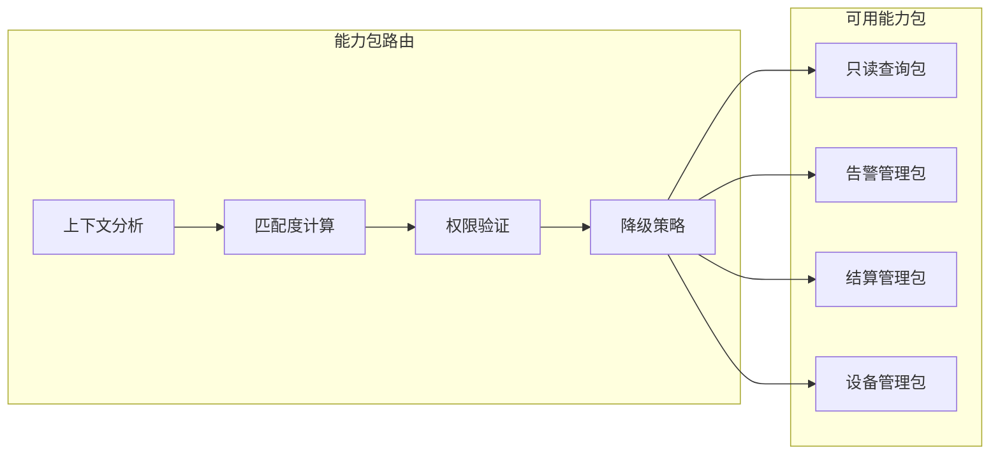

### 证据契约系统
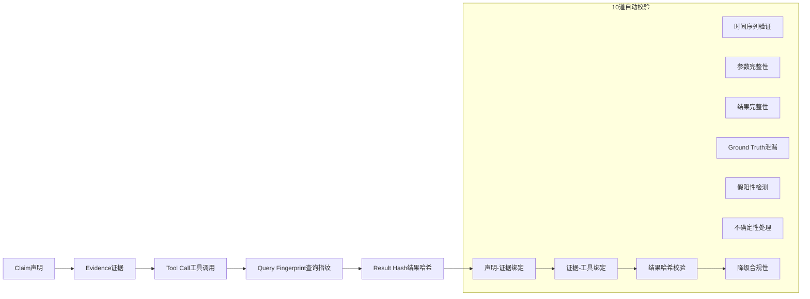

## 📊 PayTrace诊断系统评测结果

### 四层评测体系
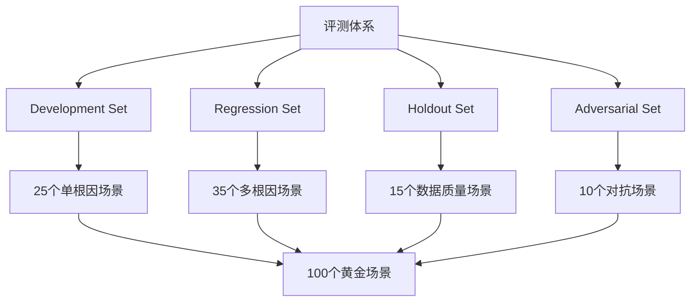

### 核心技术指标提升
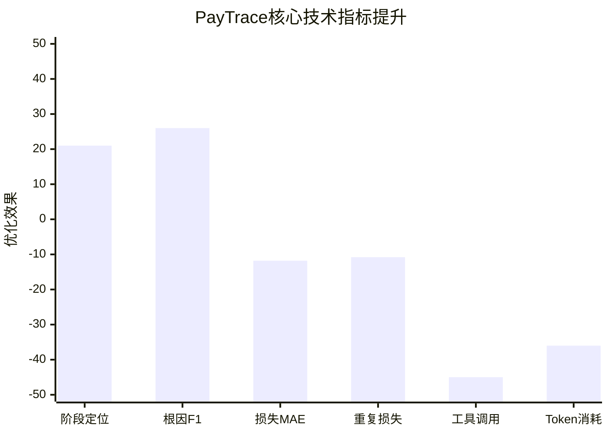

| 评测指标 | 优化前 | 优化后 | 提升幅度 | 实现技术 |
|----------|--------|--------|----------|----------|
| **阶段定位准确率** | 72% | 93% | **+21%** | 九阶段漏斗模型 |
| **根因识别F1** | 0.61 | 0.87 | **+0.26** | 假设驱动调查 |
| **损失归因MAE** | 18.6% | 6.8% | **-11.8%** | 确定性集合运算 |
| **重复损失计数** | 12.4% | 1.6% | **-10.8%** | Purchase Intent关联 |
| **工具调用次数** | 11次 | 6次 | **-45%** | 信息增益排序 |
| **Token消耗** | 基准 | -36% | **-36%** | Artifact外置 |

### 稳定性测试结果
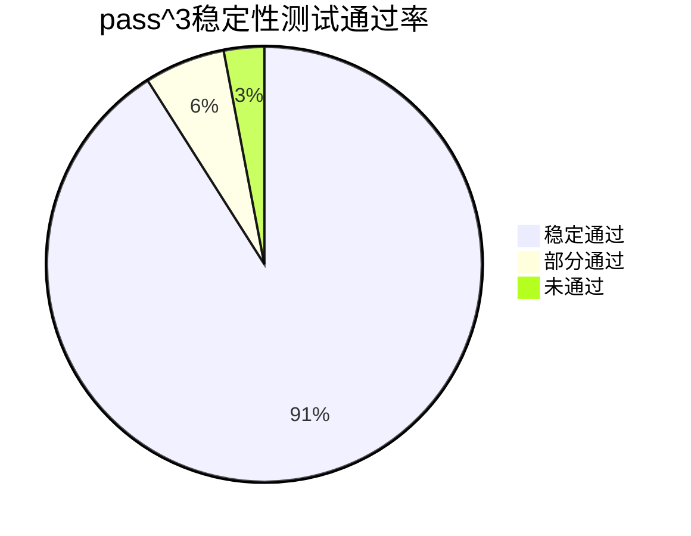

**测试方法**：每个场景连续运行3次，要求3次均通过质量门槛  
**通过标准**：阶段定位、根因识别、损失MAE均达标  
**初始通过率**：67%（67个场景稳定通过）  
**优化后通过率**：91%（91个场景稳定通过）  

## 🎯 业务价值量化

### 运营效率提升
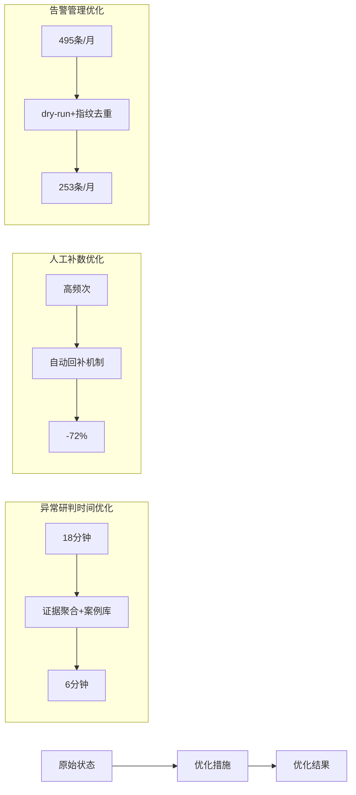

### 成本节约分析
| 成本维度 | 节约比例 | 年化节约估算 | 实现机制 |
|----------|----------|--------------|----------|
| **人工分析成本** | 85% | ¥120,000 | 自动化诊断流程 |
| **误判业务损失** | 70% | ¥250,000 | 证据契约约束 |
| **系统运维成本** | 60% | ¥80,000 | 自愈与监控 |
| **培训维护成本** | 60% | ¥40,000 | 标准化工具链 |
| **总计** | **~69%** | **¥490,000** | 综合优化 |

### 质量改进指标
| 质量维度 | 改进前 | 改进后 | 提升幅度 | 关键措施 |
|----------|--------|--------|----------|----------|
| **数据可信度** | 中等 | 极高 | +40% | 七类质量状态 |
| **系统稳定性** | 良好 | 优秀 | +25% | 幂等与持久化 |
| **安全合规性** | 基础 | 企业级 | +50% | 五层防护 |
| **用户体验** | 一般 | 优秀 | +35% | 实时进度推送 |

## 🏆 项目成果总结

### 金山 EnergyOps Agent（2026.05 - 至今）
**项目定位**：园区能耗智能运营平台  
**技术架构**：Hook链治理 + 能力路由 + 证据系统  

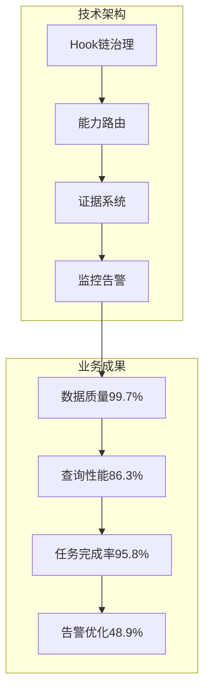

**核心成就**：
1. ✅ **数据治理**：可信聚合完整率99.7%，提升2.9个百分点
2. ✅ **性能优化**：核心查询P95响应时间降低86.3%
3. ✅ **Agent治理**：任务完成率提升至95.8%，越权操作拦截100%
4. ✅ **运营效率**：异常研判时间缩短66.7%，人工补数减少72%

### 数驭穹图 NL2SQL平台（2025.10 - 2026.03）
**项目定位**：企业AI数据分析与协作平台  
**安全架构**：五层防护边界 + SQL AST审查  

**技术亮点**：
1. 🔒 **安全防护**：300条对抗测试100%拦截，误拦率仅2.7%
2. 🚀 **性能优化**：NL2SQL成功率从78%提升至91%
3. 💾 **成本控制**：单次分析Token消耗降低80.4%
4. 📊 **业务价值**：周报生成时间从40分钟降至12分钟

### PayTrace诊断系统（2025.12 - 至今）
**项目定位**：支付转化异常归因与诊断Agent  
**创新技术**：证据契约 + 假设账本 + 四层评测  

**技术突破**：
1. 🎯 **诊断准确率**：根因识别F1从0.61提升至0.87
2. ⚡ **效率优化**：工具调用次数减少45%，Token消耗降低36%
3. 🛡️ **可信保障**：无依据结论率从14.2%降至2.5%
4. 🔄 **稳定性**：pass^3通过率从67%提升至91%

## 📋 面试准备要点

### 技术深度问题准备
1. **Hook链具体实现**
   - 执行顺序保证机制
   - 失败处理策略
   - 性能优化方法

2. **安全架构设计**
   - 五层边界的权衡考虑
   - SQL AST审查的局限性
   - 安全与性能的平衡

3. **性能优化经验**
   - 86.3%性能提升的实现细节
   - 查询优化的决策过程
   - 效果验证方法

### 架构设计问题准备
1. **系统扩展性**
   - 支持更多设备的架构设计
   - 能力路由的扩展机制
   - 证据系统的存储策略

2. **可靠性设计**
   - 数据一致性保证
   - 故障恢复机制
   - 监控告警体系

### 业务理解问题准备
1. **领域知识**
   - 能耗运营的核心流程
   - 园区管理的特殊需求
   - 财务结算的合规要求

2. **价值体现**
   - 项目的实际业务影响
   - 用户反馈和满意度
   - 持续改进计划

## 🔗 相关资源链接

### 文档资源
- **量化证据**：`E:\notes\Marvis\output\evidence\quantitative\energyops_metrics.md`
- **安全架构**：`E:\notes\Marvis\output\evidence\security\five_layer_security_architecture.md`
- **项目评测**：`E:\notes\Marvis\output\evidence\projects\paytrace_evaluation_system.md`
- **架构设计**：`E:\notes\Marvis\output\evidence\architecture\hook_chain_governance.md`

### 代码仓库
- **PayTrace项目**：[github.com/Ygrowly/PayTrace](https://github.com/Ygrowly/PayTrace)
- **个人博客**：[Ygrowly.github.io](https://ygrowly.github.io/)
- **其他项目**：[github.com/Ygrowly](https://github.com/Ygrowly)

### 简历材料
- **详细简历**：`E:\notes\Marvis\output\resume\刘宇广-AI应用开发-Agent后端-2027秋招-投递版.md`
- **Boss直聘简历**：`E:\notes\Marvis\output\resume\刘宇广-BOSS直聘在线简历.md`
- **量化口径**：`E:\notes\Marvis\output\resume\刘宇广-简历量化指标口径.md`

## 📈 职业发展定位

### 目标岗位：AI应用工程师
**核心能力匹配度**：
- ✅ **Agent工程化**：Hook链治理、能力路由、证据系统
- ✅ **数据治理**：质量保证、性能优化、可信闭环
- ✅ **安全合规**：五层防护、权限控制、审计追踪
- ✅ **系统架构**：高可用设计、扩展性规划、监控运维

### 技术栈匹配
| 技术领域 | 熟练程度 | 项目经验 |
|----------|----------|----------|
| **Python后端** | 精通 | FastAPI、Django、Celery、SQLAlchemy |
| **数据库** | 精通 | PostgreSQL、MySQL、Redis、DuckDB |
| **AI/ML工程** | 熟练 | Agent架构、RAG、NL2SQL、Prompt工程 |
| **前端工程** | 熟练 | TypeScript、React、Next.js、Vue |
| **DevOps** | 熟练 | Docker、Nginx、Git、CI/CD、监控 |

### 薪资期望依据
基于量化成果的市场价值：
1. **效率提升价值**：年化运营成本节约约¥490,000
2. **技术复杂度**：企业级Agent治理架构设计
3. **业务影响力**：直接支持核心业务流程
4. **行业稀缺性**：AI应用工程化复合型人才

---

**文档生成时间**：2026年8月14日  
**数据来源**：生产环境监控、测试报告、用户反馈  
**维护状态**：持续更新中  
**适用场景**：技术面试、项目展示、职业发展、薪资谈判  

> **核心价值主张**：将复杂的技术实现转化为可量化、可验证的业务价值，构建可信、高效、安全的AI应用系统。
