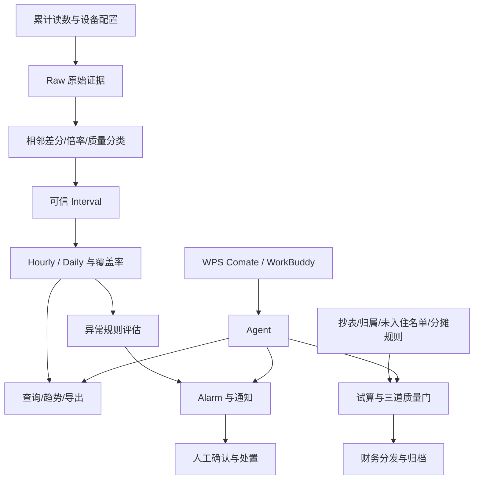

# 00｜项目全貌：从表计读数到可信运营闭环

## 1. 模块定位

本模块是整个手册的入口。它先回答“项目为什么存在、用户如何使用、系统边界在哪里”，再把数据、异常、结算和 Agent 串成一条主线。

## 2. 一句话结论

> EnergyOps 的核心不是展示水电数据，而是把不稳定的累计读数转化为可查询、可处置、可结算、可追溯的业务事实。

## 3. 第一性原理

行政真正需要的不是“数据库中有多少读数”，而是知道某个园区、楼栋或设备在某段时间用了多少水电，数据是否完整，异常是否需要处理。

财务需要的也不是在线曲线，而是一份输入完整、规则明确、金额守恒、能够复算的月度结果。

因此必须先回答三个问题：

1. 哪些原始记录是事实证据；
2. 哪些用量可以被信任；
3. 哪些正式结论必须由规则和责任人确认。

如果没有 AI，数据计算、告警状态和结算流程也必须正确。Agent 只能降低操作门槛，不能替代确定性业务系统。

## 4. 核心业务对象

| 对象 | 输入 | 输出/状态 | 权威事实 |
|---|---|---|---|
| Meter | 设备档案、能源类型、倍率、单位 | 有效配置版本 | 设备配置表及有效期 |
| RawReading | 第三方累计读数 | 原始记录、校验结果、来源 | 不可覆盖的原始证据及修正版本 |
| UsageInterval | 相邻读数、倍率 | 区间用量、质量状态 | 确定性差分结果 |
| UsageAggregate | 可信区间 | hourly/daily、覆盖率、partial | 聚合版本和来源区间 |
| AnomalyRule | 范围、窗口、阈值 | 规则版本、评估结果 | 指定时间有效的规则版本 |
| Alarm | 异常评估 | ACTIVE/ACK/RECOVERED等 | Alarm 状态机和操作记录 |
| SettlementBatch | 抄表、归属、规则 | 试算、说明版、财务版 | 输入快照与已确认结算版本 |
| AgentTask | 用户目标、身份、工具调用 | 状态、事件、Artifact | 数据库任务状态和工具结果 |

## 5. 正常业务与技术流程



正常链路可以概括为“三账一入口”：

- 用能账：读数、区间和聚合；
- 事件账：规则、告警、通知和处置；
- 结算账：抄表、分摊和财务结果；
- Agent：受控查询和操作入口。

## 6. 关键问题和故障场景

| 节点 | 最危险的问题 | 错误传导 |
|---|---|---|
| 读数 | 重复、乱序、回退、倍率变化 | 产生虚假用量 |
| 聚合 | 缺失区间被当成零 | 页面和规则得到错误完整值 |
| 查询 | 归属关联重复、SQL慢 | 结果重复或接口超时 |
| 异常 | 坏数据直接触发业务告警 | 行政收到大量误报 |
| 通知 | 外部已发送、本地仍pending | 重试造成重复短信 |
| 结算 | partial被当成完整数据 | 费用少计或错分 |
| Agent | 参数歧义、越权写入 | 大范围误修改 |
| 任务 | 服务重启、租约失效 | 重复执行或结果丢失 |

系统思维的重点是：上游不是只影响一张表。一个错误读数可能依次污染区间、小时、告警、页面和结算，因此修正必须带着影响范围重算和审计。

## 7. 解决方案、优化与长期预防

整体方案由七条原则组成：

1. Raw 保留原始证据，修正使用版本而非静默覆盖；
2. Interval 负责差分、倍率和质量分类；
3. 聚合层记录用量、覆盖率、partial和来源版本；
4. 晚到或修正只重算受影响设备和时间窗口；
5. 告警、通知、结算分别使用状态机、幂等键和审计；
6. Agent 只能调用注册工具，高风险操作必须确认；
7. 用测试、Trace和证据矩阵证明结果，而不是只看接口成功。

长期预防不是继续增加更多功能，而是先保证三本账口径一致：页面、导出、告警和结算不能各自计算一套用量。

## 8. 钢人比较

### 人工 Excel

优势是灵活、业务人员熟悉、临时口径修改快。小规模、低频、责任人明确时，Excel 可能比开发系统更经济。

问题是累计读数、设备归属、异常和分摊跨月后难以稳定复算，版本、多人协作和审计成本快速上升。EnergyOps 只有在设备数量、处理频率和追溯要求足够高时才更合适。

### 第三方能耗平台

优势是已经接入设备，采集能力成熟。如果它能完整提供园区口径、质量状态、告警处置和结算，就应优先复用。

当前方案成立的条件，是园区需要自己的归属、分摊、质量治理和 Agent 操作闭环，而第三方平台无法完整承载。

### 直接给数据库加聊天框

实现快，适合只读探索。但它不能自然保证统计口径、写操作状态机和财务责任边界，因此不适合正式运营入口。

## 9. 逆向检查

即使接口全部返回200，系统仍可能失败：

- 返回了旧缓存；
- 用量值正确，但归属到了错误部门；
- partial没有展示，用户把部分值当完整值；
- Alarm创建成功但通知任务丢失；
- 短信已发送但本地认为失败；
- 结算金额守恒，但使用了错误月份或错误规则版本；
- Agent调用成功，但确认令牌没有绑定真实参数。

因此验收必须检查业务不变量，不能只检查技术成功状态。

## 10. 边际决策

最低可用版本应先完成：

```text
Raw证据 → Interval质量 → Hourly/Daily覆盖率
→ 查询 → 显式异常规则 → 告警处置
→ 权威抄表试算 → 受控Agent只读入口
```

随后再增加高风险写工具、复杂恢复和年度看板。自适应异常模型、案例RAG、多Agent、自动控制设备应推迟，除非真实业务反馈证明其边际收益高于核心链路质量改进。

## 11. 面试标准回答

### 20秒

> EnergyOps 是面向园区行政和财务的能耗运营平台。第三方返回的是累计读数，系统先通过相邻差分、倍率和七类质量状态生成可信区间，再聚合为小时和日数据，用于查询、告警和月度结算。Agent 只通过受控工具提供自然语言入口，不直接计算或修改业务事实。

### 60秒

> 项目接入园区水电表累计读数，但累计值不能直接表示区间用量，而且存在乱序、长间隔、回退、倍率变化和异常跳变。我们先保留Raw证据，再生成带质量状态的Interval，只让可信区间进入Hourly和Daily，并记录覆盖率和partial。可信聚合用于页面查询和异常规则；告警与通知分离，由行政确认和处置。月末使用权威抄表、设备归属、未入住名单和分摊规则完成试算，通过完整性、守恒和人工确认后生成财务结果。WPS Comate中的Agent通过30个受控工具提供统一入口，高风险操作需要权限、预览和二次确认。

### 深度版本

> 我会按数据事实、运营事件、财务结算和Agent入口四段讲。数据段解决累计读数不能直接统计的问题，通过Raw、Interval、Hourly、Daily形成带质量和覆盖率的用能账；运营段只用可信事实评估规则，把数据质量异常和真实用能异常分开，再通过Alarm、Outbox和人工状态机形成事件账；结算段使用权威月度资料和规则快照，通过事实源、预演、责任三道门形成结算账；Agent段只理解意图和编排受控工具，权限、风险、状态机、幂等和审计由后端确定性执行。晚到数据、任务中断和外部副作用分别用定向重算、持久化Checkpoint、业务幂等键和权威状态查询处理。

## 12. 高频追问

### Q1：为什么不直接使用第三方平台的数据？

因为第三方提供的是累计读数和设备上报能力，园区需要的是带归属、质量、区间、告警和分摊口径的运营事实。如果第三方已经完整提供这些能力，就应优先复用而不是重复建设。

追问：系统最核心的不变量是什么？

> 原始证据可追溯；不可信区间不能冒充可信用量；正式结算不能把未知部分默认为零。

### Q2：Agent在项目中的必要性是什么？

Agent降低行政和财务使用多个后台功能的门槛，适合澄清自然语言目标、组合查询和组织证据。但确定性按钮或固定流程更简单时，不应该强行使用Agent。

追问：Agent为什么不能直接查库？

> 直接查库难以稳定执行权限、统计口径、状态机、确认和审计，也会让模型把错误SQL结果包装成可信结论。

### Q3：项目最难的三个问题是什么？

> 第一是把脏累计读数转成可信区间；第二是让晚到、并发和停机后的聚合仍可恢复；第三是让Agent能够操作真实业务，同时不越权、不重复产生副作用。

### Q4：查询、告警和结算为什么不能共用同一个完整性标准？

查询可以透明展示部分事实；部分高阈值规则在已知用量已经超限时仍可触发；财务结算要求完整、权威，不能把未知部分当零。风险越高，失败关闭越严格。

## 13. 最短恢复脚本

> 累计读数、质量区间、分层聚合、异常事件、月度结算、受控Agent、恢复审计。

## 14. 闭卷自测

1. 用一句话说明项目不是普通能耗看板的原因。
2. 三本业务账分别以什么对象为核心？
3. 为什么Agent不是业务事实源？
4. 上游错误读数会怎样传导到下游？
5. 查询、告警和结算对partial的处理为什么不同？
6. 项目最低可用版本应该先完成哪些能力？
7. 为什么接口成功不等于业务正确？
8. 讲出20秒和60秒项目介绍。

## 15. 与其他模块的连接关系

本模块定义全局对象和边界。模块01、02建立用能事实；模块03、04、05消费这些事实；模块06统一操作入口；模块07保证任务可恢复；模块08负责证明整个系统有效。
