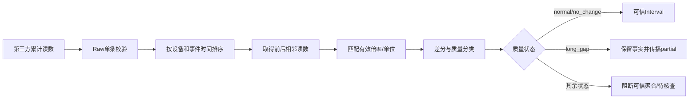

# 01｜可信用量底座：从累计读数到区间事实

## 1. 模块定位

本模块位于业务链路最上游，负责把第三方累计读数转化为带质量结论的区间用量。后面的聚合、查询、告警和结算都依赖这里的结果。

## 2. 一句话结论

> 累计读数只能说明某一时刻表计走到了哪里，必须经过相邻差分、倍率和质量判断，才能形成可使用的区间用量。

## 3. 第一性原理

业务真正需要的是“某个时间区间用了多少”，不是“表当前显示多少”。理想情况下：

```text
interval_usage = (current_reading - previous_reading) × multiplier
```

但这个公式只有在以下条件成立时才可靠：

- 前后读数属于同一设备和同一计量口径；
- 时间顺序正确；
- 读数没有重置、回退或冲突；
- 倍率和单位在区间内没有不明确的变化；
- 增量没有违反设备或业务合理范围。

因此“差分”和“质量判断”是同一业务动作。只算差值、不判断质量，会把坏数据加工成更难发现的错误事实。

## 4. 核心业务对象

| 对象 | 关键字段 | 状态 | 权威事实 |
|---|---|---|---|
| RawReading | device_id、reading_timestamp、value、source、received_at | valid/invalid/conflict/version | 第三方原始内容与修正版本 |
| MeterConfig | unit、multiplier、valid_from、valid_to | active/expired | 指定时刻生效的配置版本 |
| UsageInterval | start/end、start/end reading、usage、quality | 七类质量状态 | 指定两个相邻读数确定的区间结果 |
| QualityReason | rule、observed value、threshold、message | open/confirmed/corrected | 质量分类依据 |
| RecomputeImpact | device、time range、downstream windows | pending/running/done | 修正影响范围 |

Raw 的业务唯一键可设计为：

```text
device_id + reading_timestamp + source
```

相同业务键、相同内容是重复上报；相同业务键、内容不同是冲突或修正，不能静默覆盖。

## 5. 正常业务与技术流程



质量检测分两层：

### Raw 单条校验

检查设备、时间、数值格式、来源、必要字段和可解析性，主要发现 `invalid`。Raw仍保留原始响应和失败原因。

### Interval 相邻区间分类

Raw落库后，按设备和事件时间找到相邻读数，结合倍率版本、间隔和合理范围做确定性分类。这样才能发现负差分、长间隔、倍率边界和异常跳变。

## 6. 关键问题和故障场景

### 七类质量状态

| 状态 | 判断与含义 | 下游处理 |
|---|---|---|
| `normal` | 差分、时间和配置均正常 | 进入可信聚合 |
| `no_change` | 相邻差分为0 | 作为有效零用量进入；连续不变另做冻结监测 |
| `long_gap` | 相邻读数间隔超过允许范围 | 保留总增量证据，但不伪造小时分布；父窗口标记partial |
| `reset_or_negative` | 新读数小于旧读数 | 可能换表、清零、回退；阻断并核查 |
| `unit_changed` | 区间内倍率或单位发生不明确变化 | 缺少边界读数时不猜测，阻断当前区间 |
| `suspected_abnormal` | 正差分远超设备或历史合理范围 | 先作为数据质量问题核查，不能直接生成用能过高告警 |
| `invalid` | 字段缺失、格式错误、无权威配置等 | Raw保留，区间阻断并记录原因 |

### `no_change` 的边界

单个零增量可能是真实没有使用，也可能是设备冻结。删除它会把真实零用量变成数据缺失，破坏覆盖率。因此先保留为可信区间；连续多次不变再交给异常检测或设备质量规则判断。

### `long_gap` 的边界

长间隔只知道整个区间总增量，不知道用量发生在哪个小时。例如10:00到12:00增加40，不能默认每小时20。可以保留区间事实和总增量，但不能混入精确小时可信用量。

### 倍率变化

倍率作用于对应时间段的差值，而不是分别乘两个累计总量。若边界读数已知：

```text
(1008 - 1000) × 20 + (1012 - 1008) × 40
```

若只知道区间两端读数，不知道倍率具体何时改变，就标记 `unit_changed`，不能默认分配。

### 合法补数

已有10:00和10:30读数，10:15晚到：

- 10:15已经存在：重复或冲突；
- 10:15不存在：合法补数；
- 原10:00–10:30区间失效；
- 新建10:00–10:15和10:15–10:30两个区间；
- 重新分类并重算下游。

倍率稳定、读数未修正时，拆分前后总量应守恒。

## 7. 解决方案、优化与长期预防

### 确定性分类器

质量状态由代码规则产生，而不是由模型判断。输入相同的Raw、配置版本和规则版本，结果必须相同，便于重算和回归。

### 版本化事实

Raw原始内容不覆盖。第三方修正可以形成新版本，并记录哪个版本当前有效。Interval保存来源Raw版本、配置版本和质量规则版本。

### 受影响范围重算

插入或修正某个时间点后，只失效与其前后相邻读数相关的Interval，并继续重建受影响的hourly、daily和异常评估，不重跑全部历史。

### 失败关闭

系统没有权威倍率时，不能默认倍率为1进入正式可信聚合。可以保留Raw并创建待核查项；确认配置后再重算。

### 审计字段

至少记录原始值、设备时间、接收时间、来源、质量状态、理由、使用的倍率版本、规则版本和修正链。

## 8. 钢人比较

### 查询时临时差分

优势是存储结构简单、早期开发快，少维护一张Interval表。数据量小、没有复杂质量规则时是合理方案。

但在本项目中，每个查询都要重复排序、找前值、匹配配置和判断质量，页面、导出、告警容易出现不同口径，晚到数据也难追踪影响范围。因此沉淀Interval事实层更合适。

### 直接丢弃异常点

实现简单，聚合结果看起来干净。但它会丢失审计证据，并把“未知”伪装成“正常”。EnergyOps选择保留Raw、显式降级或阻断。

### 人工修正后覆盖原值

运营上直观，但无法解释历史结果为什么变化。版本化修正成本更高，却能支持重算、审计和财务复核。

## 9. 逆向检查

即使差分结果是正数，还可能错误：

- 前后读数来自不同物理表；
- 设备在区间中途换表；
- 倍率版本取成当前值而不是事件时间值；
- 同一时间点存在冲突版本；
- 事件时间正确但单位不同；
- 阈值配置错误，把真实高用量标成跳变；
- 补数后旧长区间没有失效，导致重复计算。

最危险的错误不是任务失败，而是任务成功地产生了一个看似正常的错误用量。

## 10. 边际决策

必须先做：Raw保留、唯一约束、相邻差分、七类状态、配置有效期、定向重算和审计。

可以暂缓：复杂插值、机器学习质量模型、自动推断换表边界、跨设备相关性检测。没有权威依据时，宁可显示未知并等待核查，也不增加“聪明但不可解释”的估算。

## 11. 面试标准回答

### 20秒

> 第三方返回的是累计读数，不能直接代表某段时间用量。系统先保留Raw证据，再按设备和事件时间取相邻读数，应用当时有效的倍率并判断七类质量状态，生成Interval。只有normal和no_change进入可信聚合，其他状态显式partial或阻断。

### 60秒

> 累计读数转区间不能只做本次减上次，因为可能存在重复、乱序、长间隔、回退、倍率变化和异常跳变。我把检测拆成两层：Raw入库时做单条格式、设备和必要字段校验；Raw落库后按设备、事件时间排序，对相邻读数做差分、倍率匹配和质量分类。normal与no_change进入可信聚合；long_gap保留总增量证据但向上标记partial；负差分、倍率边界不明、异常跳变和invalid阻断。晚到补数会失效原长区间，拆成两个新区间，再定向重算hourly、daily和异常结果。

### 深度版本

> Raw是不可覆盖的证据层，业务键通常是设备、读数时间和来源。相同键相同内容幂等跳过，相同键不同内容进入冲突或修正版本。Interval由相邻两个有效Raw和事件时间对应的倍率版本确定，同时保存质量规则版本。倍率中途变化但有边界读数时按段计算；边界不明时标记unit_changed而不是猜测。suspected_abnormal先按数据质量处理，确认读数真实后才能放行到业务异常规则。整个分类器必须确定性和可幂等重算，因为晚到、补数和配置修正都会改变过去窗口。

## 12. 高频追问

### Q1：为什么质量判断不能只放在Raw入库Hook？

单条Raw只能判断格式、字段和设备是否合法。负差分、长间隔和倍率跨界都需要比较相邻读数，因此必须在Interval阶段判断。Hook可以触发任务，但不能把质量判断做成不可修正的一次性动作。

追问：Raw入库后立即算Interval可以吗？

> 可以作为低延迟触发，但结果仍必须可幂等重算，因为可能有乱序和晚到数据。

### Q2：相同时间戳、不同读数怎么办？

不能当普通重复。保留冲突或修正版本，记录来源和接收时间，根据权威规则确定有效版本，然后重算受影响区间。

追问：唯一约束不是会挡住第二条吗？

> 唯一约束保护业务主记录；冲突内容可以进入版本表或原始事件表，不能直接丢失。

### Q3：为什么`no_change`可以聚合？

因为它对应一个完整覆盖的零用量区间。删除它会把真实零用量误判为缺失。连续不变是否代表冻结，应由另一条质量或异常规则判断。

### Q4：为什么`long_gap`不能平均分配？

已知的是整个区间总增量，不知道真实时间分布。平均分配会伪造小时事实，可能改变峰值告警和同比结果。

### Q5：跳变为什么不能直接触发高用量告警？

跳变首先表示读数可信度可疑。只有确认原始读数、倍率和换表状态正常后，才可以把它解释为真实业务用量。

### Q6：补数后怎样避免重复Interval？

Interval由设备、起始Raw版本和结束Raw版本确定；在事务中失效旧区间并upsert新区间。下游任务使用设备加时间窗口业务键，Worker通过条件更新抢占。

## 13. 最短恢复脚本

> Raw证据、相邻差分、倍率版本、七类状态、晚到拆分、定向重算。

## 14. 闭卷自测

1. 为什么累计读数不能直接用于小时统计？
2. Raw校验和Interval分类分别发现什么问题？
3. 七类质量状态及其下游处理是什么？
4. `no_change`为什么不能删除？
5. `long_gap`为什么不能平均分配？
6. 倍率中途改变时如何计算，缺少边界读数怎么办？
7. 10:15晚到读数如何重建10:00–10:30区间？
8. 相同时间戳、不同读数为什么不是普通重复？
9. suspected_abnormal与业务高用量异常有什么区别？

## 15. 与其他模块的连接关系

模块02消费Interval并形成hourly/daily；模块03使用聚合和设备归属查询；模块04只在数据质量允许时评估业务异常；模块05使用其质量证据辅助结算核查；模块08为差分、状态分类和守恒建立测试。

