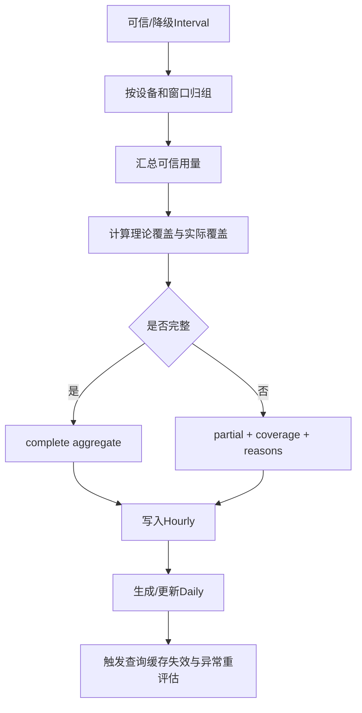

# 02｜聚合与恢复：从可信区间到稳定小时、日事实

## 1. 模块定位

本模块承接Interval，把分散区间组织成可复用的hourly和daily事实，并处理数据缺失、晚到、并发重算和服务停机。

## 2. 一句话结论

> 聚合不仅要计算用量总和，还必须记录覆盖率、partial和来源版本，并能在晚到或停机后按窗口幂等重建。

## 3. 第一性原理

用户需要的是“这个小时或这一天用了多少”，但可信区间可能不完整。系统必须同时回答：

1. 已知可信用量是多少；
2. 理论窗口覆盖了多少；
3. 哪些区间缺失或被阻断；
4. 这个结果能否用于当前业务。

如果只返回总和，60可能被误解为完整小时用量；如果只因为不完整就完全不展示，又会丢失已知的可信事实。因此聚合结果必须包含数值与质量两部分。

## 4. 核心业务对象

| 对象 | 输入 | 输出/状态 | 权威事实 |
|---|---|---|---|
| AggregateWindow | device、energy_type、window_start/end | pending/running/succeeded/failed | 数据库任务状态 |
| HourlyAggregate | 可信Interval、理论窗口 | usage、coverage、partial、missing_count | 当前聚合版本 |
| DailyAggregate | Hourly或Interval | usage、coverage、quality | 当前聚合版本 |
| RecomputeTask | device、window、reason、version | pending/running/succeeded | 任务业务键与状态 |
| Watermark/Cutoff | 事件时间、延迟容忍 | 可计算范围 | 调度配置，不代表绝对完整 |

任务业务键示例：

```text
task_type + device_id + energy_type + window_start + aggregation_version
```

## 5. 正常业务与技术流程



例如理论采样间隔为15分钟，[10:00,11:00)应覆盖四个连续区间。缺一个时，可以返回已知可信用量，但必须标记partial和75%覆盖率。理论区间数必须来自设备有效配置，不能在代码里固定写死。

黄金案例中，T6的10:15读数晚到后，系统只重建相邻Interval和包含它的小时、日期窗口，刷新覆盖率并触发异常重评估；不会全量重跑T6历史。

## 6. 关键问题和故障场景

### 调度延迟不等于数据完整

小时任务安排在11:10，只是给11:00前的数据预留到达时间。网络或第三方接口仍可能在11:18之后补数据，因此还需要晚到重算机制。

### 晚到数据

Raw晚到后：

```text
识别前后相邻读数
→ 失效原Interval
→ 生成新区间
→ 重算受影响Hourly
→ 重算Daily
→ 刷新覆盖率
→ 重新评估异常与告警
```

只处理受影响设备和窗口，不重跑全部历史。

### 并发重算

11:18和11:20两个Worker可能同时发现同一小时缺口。“先查是否存在，再插入”存在并发窗口，两个Worker都可能执行。

正确领取方式：

```sql
UPDATE aggregation_task
SET status = 'running', worker_id = :worker_id
WHERE id = :task_id AND status = 'pending';
```

只有受影响行数为1的Worker继续执行。

### 只成功一半

如果Hourly已更新但任务状态没有更新，恢复时可能重复执行；如果Daily已更新而Hourly事务回滚，则上下游版本不一致。相关本地写入需要在合适的数据库事务中提交，并保留聚合版本。

### 服务停机

普通调度器重启后通常只继续未来任务，过去窗口可能永久缺失。因此启动时要检查有限历史范围内的预期窗口和已完成窗口差集。

## 7. 解决方案、优化与长期预防

### 分层幂等

| 层 | 唯一性与更新方式 |
|---|---|
| Raw | device + timestamp + source唯一；冲突走版本 |
| Interval | 由前后Raw版本唯一确定；重算替换当前有效结果 |
| Hourly | device + energy_type + hour_start唯一；确定性upsert |
| Daily | device/范围 + energy_type + stat_date唯一；确定性upsert |
| Task | task_type + device + window + version唯一；条件抢占 |

唯一约束保证最终不重复；事务防止本地多步只成功一半；条件更新防止多个Worker同时领取。数据库已经能解决时，不默认增加分布式锁。

### 启动回补

启动时扫描最近七天是当前简历口径，具体窗口和证据待验证。恢复流程：

1. 计算理论应存在的窗口；
2. 排除数据库中已成功且通过完整性检查的窗口；
3. 为缺口生成低优先级回补任务；
4. 按Interval→Hourly→Daily依赖顺序分批执行；
5. 实时任务优先，限制回补并发；
6. 两类任务共享业务键和条件抢占。

### 质量向上传播

聚合结果保存可信用量、覆盖率、缺失数量、质量原因和来源版本。页面、异常规则和结算根据风险使用不同策略，不在聚合层替所有业务做决定。

### 缓存与下游失效

重算事务提交后生成失效事件，由消费者删除或更新查询缓存，并重新评估受影响异常。Redis删除不能与数据库事务天然组成一个本地ACID事务，因此使用Outbox、版本键或可重试失效任务，而不是假装“放进同一事务”即可解决。

## 8. 钢人比较

### 每次全量重跑

实现简单，适合数据量小或离线批处理。它避免维护精细依赖图，也容易理解。

但设备和时间跨度增长后，全量重跑耗时长、资源冲突大，还会重复触发缓存和告警。当前方案使用有限窗口和定向重算；只有规则或底层口径全局变化时才考虑受控全量回放。

### 使用分布式锁

锁能减少同一临界区并发，但存在过期、续租和误释放问题，也不能代替唯一约束和事务。当前优先数据库条件更新；只有跨多个资源、数据库条件无法表达时才考虑锁。

### 等数据绝对完整再计算

理论上最准确，但外部数据可能永远晚到，页面和运营无法及时使用。更实际的方案是按Cutoff先生成带质量标签的结果，再通过晚到机制收敛。

## 9. 逆向检查

即使聚合任务显示succeeded，还可能：

- 使用了旧Interval版本；
- 覆盖率分母按错误采样频率计算；
- long_gap总量被错误分摊到小时；
- 时区或半开区间处理错误，边界重复计数；
- Hourly更新但Daily和缓存没有失效；
- 回补任务压垮数据库，影响实时任务；
- 重评估告警时重复创建通知。

因此“任务成功”必须同时校验版本、覆盖、守恒和下游传播。

## 10. 边际决策

必须先做窗口唯一键、条件抢占、partial、定向重算和有限历史回补。

可以暂缓全量依赖图、复杂流式计算、跨机房调度和自动容量预测。约604台设备的当前规模下，数据库任务表、批处理和受控并发通常足够；规模和延迟要求显著上升后再评估消息队列或流处理。

## 11. 面试标准回答

### 20秒

> Hourly和Daily不能只存用量，还要存覆盖率、partial和来源版本。晚到数据会定向重算受影响窗口；任务用窗口业务键、唯一约束和条件抢占保证幂等，服务重启后扫描最近七天缺口并低优先级回补。

### 60秒

> 聚合任务按设备和窗口汇总可信Interval，同时根据设备有效采样配置计算理论覆盖。窗口不完整时保留已知可信用量，但返回partial、覆盖率和原因。调度延迟只能减少晚到，不能保证完整，所以Raw补数后会先重建相邻Interval，再重算对应Hourly、Daily和异常评估。每层都有业务唯一键，Worker通过pending到running的条件更新抢占；本地多表更新放在事务中。服务重启后扫描最近七天的预期窗口和成功窗口差集，按依赖顺序生成低优先级任务，实时任务优先。

### 深度版本

> 我把聚合正确性分为结果唯一、过程一致和可恢复三层。结果唯一由Hourly、Daily和任务业务键保证；过程一致由事务、版本和确定性upsert保证；可恢复由持久化任务、有限窗口缺口扫描和Checkpoint保证。对于缓存和告警等下游，数据库事务内写Outbox，提交后异步失效或重评估。这样即使同一晚到数据重复上报、两个Worker同时重算或服务停机，最终也能收敛到同一聚合版本，同时不会把部分数据冒充完整结果。

## 12. 高频追问

### Q1：唯一约束、事务和条件更新分别解决什么？

> 唯一约束防止最终重复行；事务防止本地多步只成功一半；条件更新保证只有一个Worker获得执行权。

追问：还需要分布式锁吗？

> 能用数据库唯一键、事务和条件更新解决时不需要。锁只用于确实跨资源的临界区，且不能作为唯一正确性保证。

### Q2：为什么先查询pending再更新不安全？

两个Worker可以同时查到pending。应直接执行带`WHERE status='pending'`的更新，并检查受影响行数。

### Q3：页面能否展示partial的60？

可以，但必须同时展示partial、覆盖率和缺失原因，不能把60显示成完整小时总量。

追问：异常和结算呢？

> 低用量、同比等规则通常返回UNKNOWN；已知部分本身超过高阈值时可以触发。正式结算不能把未知部分当零，应阻断自动发布。

### Q4：为什么启动时不能全部重跑？

历史跨度和数据量可能很大，全量重跑会与实时任务争抢数据库并重复产生下游动作。应限定窗口、分批低优先级执行，并共享同一幂等体系。

### Q5：删除缓存可以和数据库更新放同一事务吗？

普通数据库事务不能覆盖Redis。可以在数据库事务中更新数据并写Outbox，提交后可靠删除缓存；也可以使用版本键，让旧缓存自然不可命中。

### Q6：晚到数据重算后，旧结果怎样处理？

使用聚合版本或当前有效标记进行确定性upsert，不在旧值上累加。随后刷新覆盖率、失效缓存并重评估受影响告警。

## 13. 最短恢复脚本

> 窗口覆盖、partial、业务键、条件抢占、定向重算、七天回补。

## 14. 闭卷自测

1. 聚合结果为什么必须保存覆盖率？
2. 调度延迟为什么不能替代晚到机制？
3. 两个Worker怎样通过一条条件更新抢任务？
4. 唯一约束、事务、条件更新和锁分别解决什么？
5. 晚到数据的完整重算链路是什么？
6. 为什么不能启动后全量重跑？
7. long_gap如何向hourly传播？
8. 数据库更新与Redis缓存失效怎样保证最终一致？
9. 如何证明聚合任务成功不只是状态字段成功？

## 15. 与其他模块的连接关系

本模块读取模块01的Interval；模块03依赖Hourly/Daily和版本；模块04在聚合完成后评估规则；模块05使用质量和覆盖信息进行核查；模块07提供通用任务恢复；模块08验证窗口守恒、幂等和回补。
