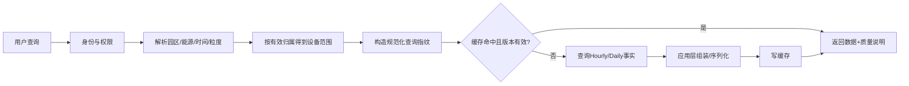

# 03｜查询与性能：让结果既正确、透明，又足够快

## 1. 模块定位

本模块把可信hourly/daily事实交付给页面、导出、异常调查和Agent。核心不是单纯降低SQL耗时，而是在正确业务范围内稳定返回带质量说明的结果。

## 2. 一句话结论

> 查询优化先确定设备与归属范围，再命中合适粒度的事实表和联合索引，并分别测量数据库、应用处理、序列化和总延迟。

## 3. 第一性原理

用户问“某园区最近30天每日用电量”，需要先确定：

- 用户有权访问哪个园区；
- 哪些设备在对应日期属于该园区；
- 能源类型是否为electricity；
- 查询粒度是daily；
- partial和覆盖率如何返回。

因此性能优化必须服从业务口径。如果先扫描全量事实再过滤园区，即使加缓存，也只是在加速一条错误或低效链路。

## 4. 核心业务对象

| 对象 | 关键字段 | 输出/状态 | 权威事实 |
|---|---|---|---|
| QueryScope | tenant/campus/building/device、energy_type、time range | 可访问设备集合 | 权限与有效归属版本 |
| DailyFact | device/scope、date、usage、coverage、version | complete/partial | 聚合层当前有效版本 |
| QueryResult | series、quality summary、updated_at | complete/partial | 本次查询口径和数据版本 |
| CacheEntry | canonical query、data version、TTL | hit/miss/stale | 数据版本决定可用性 |
| QueryTrace | SQL、plan、rows、timing | succeeded/timeout | 实际执行计划和分段耗时 |

查询指纹应由规范化范围、粒度、能源类型、时间和必要版本组成，不能只用自然语言文本做缓存键。

## 5. 正常业务与技术流程



查询“最近30天每日用电”应优先访问daily，不回到Raw临时差分。结果同时返回时间范围、范围口径、可信用量、覆盖率、partial原因和更新时间。

黄金案例中，用户查询“T6昨天每小时用电”。系统先确认T6归属和权限，再读取hourly；如果10点窗口因晚到数据仍是partial，就连同覆盖率展示，而不是回到Raw临时计算或用缓存中的旧完整值。

## 6. 关键问题和故障场景

### 范围错误

先关联所有设备、组织和事实，再在最后过滤园区，会产生大量中间行。若归属关系存在一对多或历史版本未限制有效期，还可能重复统计同一设备。

### N+1

N+1是先查询一批主对象，再为每个对象单独查询一次关联数据。例如先查100台设备，再循环查询每台设备30天用量，形成1+100次数据库往返。单条SQL可能很快，总接口仍很慢。

处理方式包括批量查询、JOIN、预加载或DataLoader，但必须防止JOIN造成行数膨胀。

### 联合索引不匹配

B+树联合索引遵循最左前缀。一般把稳定等值过滤放在前面，把时间范围放后面。例如事实表按设备查询可考虑：

```text
(device_id, energy_type, stat_date)
```

若事实表合法冗余了园区快照，可考虑：

```text
(campus_id, energy_type, stat_date)
```

具体顺序必须结合选择性、排序、返回列和执行计划，不能只背规则。

### 应用层耗时

接口慢不一定只因为SQL。大量Python对象构造、重复聚合、JSON序列化、网络传输和日志也可能占主要时间。

### 缓存陈旧

晚到数据重算后，数据库已经是新值，Redis仍可能返回旧结果。删除缓存本身幂等，但“数据库提交”和“Redis删除”不能依赖同一个普通数据库事务。

## 7. 解决方案、优化与长期预防

### 先缩小业务范围

先根据园区、权限和事件时间得到有效device_id集合，再查事实表；或在聚合层保存经过审计的归属快照。避免无条件展开所有归属关系。

### 选择正确粒度

- 日趋势查daily；
- 小时调查查hourly；
- 质量下钻查interval；
- 原始证据核查才查raw。

上层查询不重复实现差分和质量规则。

### 执行计划驱动索引

使用`EXPLAIN ANALYZE`观察实际扫描行数、过滤行数、JOIN算法、排序/哈希是否落盘以及估算偏差。优化后重新验证，而不是看到使用索引就结束。

### 避免N+1与重复JOIN

批量取得设备范围和事实数据；对稳定高频口径使用预聚合或物化结果；返回前做业务唯一性和总量守恒检查。

### 缓存一致性

推荐流程：

```text
数据库事务更新聚合 + 写CacheInvalidation Outbox
→ 提交
→ Worker删除/更新缓存
→ 失败可重试
```

也可把聚合版本放入缓存键，新版本提交后自然不再命中旧键，并配合TTL清理。

### 分段计时

统一记录数据库执行、应用处理、序列化、缓存和接口总时间。固定数据集、固定查询集、相同并发条件下比较优化前后P50/P95及业务结果。

## 8. 钢人比较

### 直接JOIN查询

数据规模不大、关系简单时，单条JOIN最透明、维护成本低，不应过早预聚合。只有执行计划证明扫描、重复行或延迟成为瓶颈时，再增加索引和预聚合。

### 缓存所有结果

缓存可快速降低热点延迟，但会增加一致性、键数量和失效复杂度。低频、强个性化或经常重算的查询可能不值得缓存。

### 搜索引擎或OLAP系统

大规模多维分析下更强，但当前设备规模未必需要。PostgreSQL事实表、索引和预聚合能满足时，额外系统的运维成本可能高于收益。

## 9. 逆向检查

即使P95下降，还可能：

- 返回结果少了设备；
- 历史设备使用了当前归属；
- JOIN消重方式把真实多条数据合并；
- 缓存键缺少能源类型或聚合版本；
- partial字段在DTO或前端序列化时丢失；
- 测试只跑单用户，没有线上并发；
- 对比使用了不同数据集或不同时间范围。

性能验证必须同时断言结果行数、总量、覆盖率和质量状态。

## 10. 边际决策

优先级应是：修正范围和JOIN逻辑 → 建联合索引 → 选择正确聚合层 → 消除N+1 → 再考虑缓存和预聚合。

暂缓复杂读写分离、分库分表和OLAP迁移。只有实际执行计划、容量增长和SLO证明当前方案不足时才升级。

## 11. 面试标准回答

### 20秒

> 查询先根据权限、园区归属、能源类型和时间范围确定设备集合，再查daily或hourly事实表。通过联合索引、批量查询和预聚合减少扫描与N+1，同时返回partial和覆盖率；最后分解数据库、应用、序列化和接口总耗时验证。

### 60秒

> 原查询慢的根因不是单一SQL，而是先展开设备归属和大量事实数据，再过滤园区，既可能重复JOIN，也增加扫描和应用处理。优化时先固定业务口径，根据有效归属得到device_id范围，然后按查询粒度访问daily或hourly，并为等值条件加时间范围设计联合索引。用EXPLAIN ANALYZE检查扫描行数、JOIN、排序和落盘情况，消除N+1。重算后通过数据库Outbox可靠失效缓存。性能测试使用固定数据集和查询集，在相同并发下比较数据库、应用、序列化和P95，同时校验总量、行数和partial状态不变。

### 深度版本

> 如果事实表按设备存储，典型索引是device_id、energy_type、stat_date，等值条件在前、范围条件在后；如果园区归属合法快照化，也可以使用campus_id维度索引。最终选择要看选择性和执行计划，而不是机械套最左匹配。缓存采用Cache Aside，但数据库提交和Redis删除不能形成普通ACID事务，所以事务内写失效Outbox或使用版本缓存键。简历中P95从20.4秒到2.8秒属于待验证数字，面试前需要补齐数据规模、并发、查询集合、测试环境和正确性断言。

## 12. 高频追问

### Q1：N+1是什么？

先查N个主对象，再对每个对象发一次关联查询，最终产生1+N次往返。它通常来自ORM循环访问关联字段。

追问：全部改成JOIN就好吗？

> 不一定。JOIN可能产生笛卡尔式膨胀，需要批量查询、预加载或预聚合，并验证业务唯一性。

### Q2：联合索引为什么把范围列放后面？

B+树先按左侧等值条件定位连续区间，再对时间做范围扫描。范围列之后的列通常难以继续用于精确定位，但覆盖索引和排序场景仍需结合执行计划判断。

### Q3：怎样知道索引真正有效？

用`EXPLAIN ANALYZE`看实际扫描方式、rows、loops、过滤行数和总耗时，并在固定负载下比较P95。仅看到Index Scan不足以证明整体接口改善。

### Q4：缓存和数据库更新怎样一致？

数据库事务提交聚合和失效Outbox，异步Worker幂等删除缓存；读取未命中后回源并重建。也可使用数据版本组成缓存键。

### Q5：性能优化怎样证明没有改错结果？

在同一数据快照上运行固定查询集，对比行数、总量、覆盖率、partial、排序和边界日期，再在相同并发下比较耗时。

### Q6：简历中的20.4秒到2.8秒如何防守？

需要说明查询范围、样本数、并发、硬件、缓存冷热、统计窗口和P95计算方法。当前手册未关联原始报告，应标记待验证，不能只背下降百分比。

## 13. 最短恢复脚本

> 权限范围、有效归属、正确粒度、联合索引、执行计划、分段计时、版本缓存。

## 14. 闭卷自测

1. 查询30天日用量为什么应该查daily？
2. 设备历史归属会怎样影响查询结果？
3. N+1怎样产生，JOIN为什么也可能有问题？
4. 联合索引的等值和范围列怎样排列？
5. `EXPLAIN ANALYZE`重点看什么？
6. 接口总耗时应拆成哪些部分？
7. 为什么Redis删除不能直接纳入数据库事务？
8. 性能优化后要验证哪些业务字段？
9. 如何完整防守P95优化数字？

## 15. 与其他模块的连接关系

查询读取模块02的聚合并继承模块01质量状态；查询结果为模块04提供诊断证据，为模块06提供只读工具；长导出由模块07管理；性能与正确性证据进入模块08。
