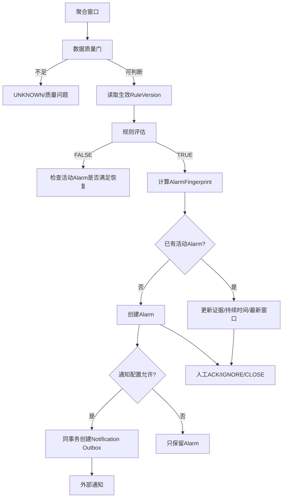

# 04｜异常、告警与处置：从数据偏离到可处理事件

## 1. 模块定位

本模块消费可信Interval、Hourly或Daily，把规则命中转化为可去重、可通知、可确认和可恢复的业务事件。

## 2. 一句话结论

> 先证明数据足以判断，再执行规则；异常评估、Alarm和通知分离，避免坏数据、重复窗口和外部重试制造告警噪声。

## 3. 第一性原理

业务用户需要的不是“某个点超过阈值”，而是一个值得处理、证据明确、状态可追踪的事件。

因此需要区分：

```text
数据质量问题 ≠ 真实用能异常
规则命中 ≠ 新建Alarm
Alarm存在 ≠ 必须发送短信
后续正常 ≠ 原告警数据错误
```

异常结论具有不确定性；权限、状态迁移、去重和通知副作用必须确定性执行。

## 4. 核心业务对象

| 对象 | 输入 | 输出/状态 | 权威事实 |
|---|---|---|---|
| RuleVersion | type、target、window、operator、threshold | draft/enabled/disabled | 指定时间有效规则版本 |
| Evaluation | aggregate、quality、rule_version | TRUE/FALSE/UNKNOWN | 本次确定性评估结果 |
| Alarm | rule、target、异常类型、当前证据 | ACTIVE/ACK/RECOVERED/IGNORED/CLOSED/INVALIDATED | Alarm状态机 |
| AlarmFingerprint | rule、target、异常类型、活动范围 | active/released | 活动事件唯一身份 |
| NotificationOutbox | alarm、channel、recipient、idempotency_key | pending/submitted/confirmed/result_unknown/failed | 本地通知任务状态 |
| ActionRecord | actor、action、reason、before/after | immutable | 人工处置审计 |

## 5. 正常业务与技术流程



规则类型包括threshold、range、day_over_day和trend；目标可以是单设备、楼栋逐设备或楼栋总量；窗口可以是interval、current_hour、completed_hour或day。具体当前实现范围以项目配置为准。

黄金案例中，T6的完成小时先通过质量门，再评估高阈值规则。晚到补数若只改变覆盖率，就更新同一Alarm证据；若推翻原窗口异常，则把原Alarm标记INVALIDATED；若后续独立窗口恢复正常，则按恢复策略标记RECOVERED。

## 6. 关键问题和故障场景

### 数据质量与业务异常

- `suspected_abnormal`：读数本身可疑，先核查数据；
- threshold命中：读数可信、覆盖满足规则，真实用量超过阈值；
- partial高阈值：已知可信用量本身已超过上限，可以触发并说明基线不足；
- partial低阈值、同比或趋势：未知部分可能改变结论，通常返回UNKNOWN。

采用三值逻辑：

| 结果 | 含义 |
|---|---|
| TRUE | 现有可信证据足以证明规则成立 |
| FALSE | 现有可信证据足以证明规则不成立 |
| UNKNOWN | 数据不足或质量不允许作出结论 |

### 重复告警

如果每个小时窗口都生成一条Alarm，同一持续异常会淹没用户。活动Alarm指纹通常由规则、目标和异常类型组成，不把每个检测窗口直接作为新事件身份；新窗口更新已有Alarm的最新证据和持续时间。

### 状态语义

| 状态 | 含义 |
|---|---|
| ACTIVE | 当前证据支持异常，尚未确认 |
| ACKNOWLEDGED | 人工已看到并接手，异常不一定消失 |
| RECOVERED | 后续可信窗口满足恢复条件 |
| IGNORED | 人工判断当前事件无需处理或属于误报 |
| CLOSED | 处置完成并正式结束 |
| INVALIDATED | 晚到修正或质量变化证明原检测依据失效 |

8点小时真实超限、9:10告警，9点小时恢复正常：满足恢复规则后可标记RECOVERED。若晚到数据重算8点本身不再超限，则原告警应INVALIDATED，而不是RECOVERED。

### 通知状态未知

短信平台实际发送成功，但进程在本地保存成功状态前崩溃。恢复后只看到pending，直接重发可能重复通知。

## 7. 解决方案、优化与长期预防

### 规则准入

新规则先保存草稿，执行Schema和业务校验，再基于历史窗口dry-run，展示命中数、样例、数据质量和影响范围，确认后启用。规则变更创建新版本，不覆盖历史口径。

### Alarm去重与冷却

活动指纹控制“是否同一事件”；cooldown控制“多久再次通知”。两者解决不同问题。活动期间新窗口更新同一Alarm；终态释放活动指纹后，新的独立异常过程才可创建新Alarm。

### Alarm与通知分离

即使`notification_enabled=false`，仍可创建Alarm供页面处理，只是不创建通知任务。创建Alarm和Notification Outbox必须在同一数据库事务中，避免Alarm存在但通知任务静默丢失。

### 外部副作用

Worker携带稳定业务幂等键调用通知平台。调用超时标记`result_unknown`：

- 平台支持幂等：使用同一键重试；
- 支持状态查询：先查询外部权威状态；
- 两者都不支持：无法严格保证只发送一次，必须在漏发和重复之间做业务取舍。

### 规则与数据版本

历史窗口晚到重算时，默认使用该窗口原本有效的规则版本；新规则版本通常只对生效后的窗口执行。若业务要求用v2重评历史，应创建显式回放任务，不能悄悄改变历史告警。

## 8. 钢人比较

### 规则命中直接发短信

实现最简单、延迟最低，适合极少数高置信安全事件。但能耗数据存在partial、跳变和持续过程，直接通知会产生重复和误报。

### 只做人工巡检

人工能理解活动、维修和现场上下文，对低频设备可能更准确。但设备数量和时间窗口增多后容易漏检，且难形成稳定审计。系统适合筛选和聚合候选，人工保留业务裁决。

### 完全自适应模型

可以发现未知模式，但解释、冷启动和漂移治理成本高。当前优先可解释显式规则；自适应候选只有在历史样本和运营收益足够时再引入。

## 9. 逆向检查

即使规则计算返回TRUE，还可能：

- 用了partial却没返回质量提示；
- 规则目标是building_total，但错误地逐设备比较；
- 规则版本不是窗口发生时版本；
- 重算更新了Alarm，却重复创建短信；
- ACK被错误当成异常已恢复；
- IGNORED删除了历史证据；
- 通知联系人或权限范围错误；
- 大量Alarm下降只是因为漏检，而非准确度提高。

## 10. 边际决策

先做显式规则、三值判断、指纹去重、状态机、Outbox和人工处置。再做dry-run、恢复策略和历史回放。

案例检索、自适应基线、LLM根因分析和自动升级应后置。下一项投入应优先降低重复率、UNKNOWN误用和误报，而不是增加规则数量。

## 11. 面试标准回答

### 20秒

> 异常检测先过数据质量门，使用TRUE、FALSE、UNKNOWN三值结果。规则命中后按活动指纹创建或更新Alarm，Alarm和通知Outbox同事务，但通知是否发送由配置和冷却决定；人工通过ACK、IGNORE、CLOSE处理，可信后续窗口可RECOVERED，原数据被修正则INVALIDATED。

### 60秒

> 我们先区分数据质量异常和真实用能异常。suspected_abnormal不会直接变成高用量告警；完整可信数据可以正常评估，partial只有已知值本身已超过高阈值时才触发，低阈值、同比和趋势通常返回UNKNOWN。规则启用前做历史dry-run并保留版本。命中后根据规则、目标和异常类型生成活动指纹，持续异常更新同一Alarm而不是每小时新建。Alarm与Notification Outbox同事务，通知Worker使用业务幂等键和外部状态查询。后续正常是RECOVERED，晚到修正推翻原证据则INVALIDATED。

### 深度版本

> 规则评估、Alarm和通知是三层。Evaluation是某个数据版本和规则版本上的确定性TRUE/FALSE/UNKNOWN；Alarm把多个连续窗口聚合成一个可处置事件；Notification是可独立失败和重试的外部副作用。活动指纹负责事件去重，cooldown负责通知频率，状态机区分人工接手、自然恢复、忽略、关闭和数据作废。创建Alarm和Outbox在本地事务中保证不丢任务，但外部短信无法被数据库事务回滚，所以超时必须进入result_unknown，并依赖外部幂等或状态查询。

## 12. 高频追问

### Q1：partial为什么有时能触发高阈值？

如果已知可信部分已经超过上限，未知部分只能让总量更高，结论仍成立；但必须标明partial。低用量则不能，因为缺失部分可能补足差额。

追问：同比和趋势呢？

> 通常需要两个完整、口径一致的窗口，数据不足返回UNKNOWN。

### Q2：告警指纹为什么不直接包含小时窗口？

因为连续多个窗口可能属于同一异常过程。窗口放入事件身份会每小时创建新Alarm。窗口仍保存在Evaluation和Alarm证据列表中。

### Q3：ACK和RECOVERED有什么区别？

ACK表示人已接手，不表示异常消失；RECOVERED表示后续可信数据满足恢复条件。

### Q4：9:10告警，10:10同设备未超限，怎样处理？

先确认10:10评估的是后续窗口还是对原窗口的重算。后续可信窗口正常且满足恢复策略，标记RECOVERED；原8点窗口因晚到修正不再异常，标记INVALIDATED。

### Q5：为什么Alarm与Outbox要同事务？

否则Alarm提交后进程崩溃，通知任务没有创建，系统会静默漏发。同事务保证两者同时存在或都不存在。

### Q6：通知超时后为什么不能直接重试？

超时表示结果未知，不代表失败。外部可能已经发送，应先用业务幂等键查询或使用相同键重试。

### Q7：新规则v2是否重算所有历史告警？

默认不重算。历史窗口保持当时规则版本；只有用户明确发起历史回放，才使用v2产生独立回放结果和审计。

## 13. 最短恢复脚本

> 质量门、三值评估、规则版本、活动指纹、状态机、Outbox、外部幂等。

## 14. 闭卷自测

1. 数据质量异常和业务用量异常有什么区别？
2. TRUE、FALSE、UNKNOWN分别表示什么？
3. partial的高阈值和低阈值为什么不同？
4. 告警指纹和冷却时间分别解决什么？
5. ACTIVE、ACK、RECOVERED、INVALIDATED有什么区别？
6. Alarm与通知为什么分离？
7. 为什么Alarm和Outbox必须同事务？
8. 外部短信结果未知时怎样处理？
9. 晚到数据与新规则版本怎样影响历史告警？

## 15. 与其他模块的连接关系

本模块依赖模块01的质量状态和模块02的聚合版本；告警查询与诊断使用模块03；Agent通过模块06受控操作；通知任务和回放由模块07恢复；规则准确度与告警指标由模块08验证。
