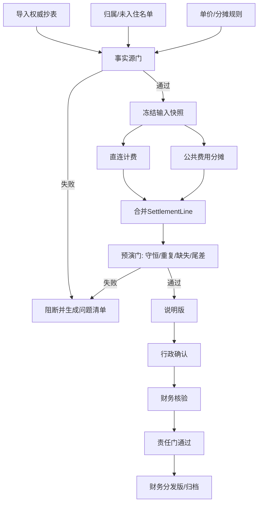

# 05｜月度结算：从权威抄表到可核验财务结果

## 1. 模块定位

本模块是项目的财务终点。它使用权威月度抄表、设备归属、未入住名单和分摊规则，生成试算、说明版和财务分发版。

## 2. 一句话结论

> 查询可以展示带质量标签的部分事实，结算必须使用完整、权威、版本固定且金额守恒的输入，任何未知部分都不能默认按零计费。

## 3. 第一性原理

财务真正需要的是“每个费用主体应承担多少钱，以及这个数字能否复算”。因此必须明确：

- 本月起止读数以谁为准；
- 每台表在本月属于谁；
- 哪些是直连用量，哪些需要公共分摊；
- 未入住公寓和人工调整如何处理；
- 单价、人数、面积或其他分摊因子使用哪个版本；
- 分摊前总额和分摊后总额是否守恒。

在线聚合适合运营观察，但只要存在partial，就不能替代完整权威抄表完成正式结算。

## 4. 核心业务对象

| 对象 | 关键字段 | 状态 | 权威事实 |
|---|---|---|---|
| MeterReadingSnapshot | month、meter、start/end、source | valid/blocked | 月度权威抄表快照 |
| OwnershipVersion | meter、business_unit、valid_from/to | active/expired | 业务发生时有效归属 |
| OccupancySnapshot | apartment、month、occupied | confirmed/pending | 当月入住名单 |
| AllocationRuleVersion | rule_type、factor、scope、effective_month | draft/effective | 当月生效规则版本 |
| SettlementBatch | month、input_hash、rule_version | draft/calculated/confirmed/published/failed | 批次状态与快照 |
| SettlementLine | subject、usage、unit_price、amount、reason | valid/blocked/adjusted | 可复算明细 |
| ReconciliationReport | source_total、allocated_total、difference | passed/failed | 守恒与差异结果 |

## 5. 正常业务与技术流程

三道质量门：

| 质量门 | 判断 | 失败处理 |
|---|---|---|
| 事实源门 | 月份、表计、主体、抄表、单价和规则是否完整权威 | 阻断计算或列出待补项 |
| 预演门 | 是否重复、漏分、金额不守恒、尾差异常 | 保留试算，不生成正式版 |
| 责任门 | 行政是否确认说明版，财务是否核验 | 未确认不发布 |

黄金案例中，T6在线小时数据只用于趋势和差异核查；正式月度费用仍引用当月权威起止抄表、T6有效归属和对应分摊规则。若任一输入待确认，批次停在试算或阻断状态。

## 6. 关键问题和故障场景

### partial在线数据

页面可以展示部分可信用量，但结算不能把缺失区间视为零。当前月度模块以权威抄表为主，是为了避免在线聚合不完整直接影响费用。

### 归属版本错误

设备本月中途调拨，如果只读取当前归属，历史用量会全部计入新单位。需要按业务发生时间匹配有效归属，或对月度边界制定明确规则并保存快照。

### 未入住名单重复或冲突

同一公寓可能在多个表或名单中重复；“未入住”也可能与人工计费调整同时出现。不能简单去重后丢失原因，需要确定业务主记录和调整规则。

### 金额精度与尾差

金额不能使用二进制浮点随意累计。应使用Decimal或数据库定点数，并明确：

- 用量保留精度；
- 单行金额舍入规则；
- 总额在行级舍入前还是后计算；
- 尾差由谁承担；
- 尾差调整是否保留单独明细。

### 重跑覆盖正式批次

规则或输入修正后不能直接覆盖已发布批次。应创建新版本或复算批次，保留原输入Hash、结果和差异。

## 7. 解决方案、优化与长期预防

### 输入快照

计算前固定抄表、归属、入住、单价和规则版本，计算全过程只引用该快照。用户修改源数据后，需要显式创建新批次或复算版本。

### 确定性结算引擎

Agent可以帮助解释和发起试算，但用量、金额、分摊和守恒由确定性代码执行。每条SettlementLine保存来源表计、计算公式、因子和规则版本。

### 双产物

- 说明版：给行政和财务核查，包含读数、规则、过程和差异；
- 财务分发版：只在三道门通过后生成，结构符合财务模板。

### 黄金对账

固定一个已人工确认月份，将每个业务单元格、明细行和合计作为Oracle。引擎或模板变更后执行逐单元格比较，而不是只比较总金额。

### 已确认材料中的证据候选

本会话曾确认6月复现包含8个抄表Sheet、1112条记录、66条电费规则、逐行对账和33项相关测试等口径。它们适合进入面试证据，但当前手册没有绑定原始文件、命令和报告，统一标记为“材料已确认，证据待关联”。

## 8. 钢人比较

### 完全使用Excel

Excel对财务人员透明，临时调整和人工批注方便，而且已有模板就是事实上的业务语言。小规模结算时，保留Excel可能是最优方案。

系统化的价值不是消灭Excel，而是把输入校验、规则版本、重复检查、守恒和复算自动化，再输出财务熟悉的表格。

### 直接使用在线daily总量

口径统一、自动化程度高。如果设备完整率和权威性满足财务要求，它可以逐步成为辅助事实源。但当前存在partial、人工表和分摊调整，因此不能直接替代权威抄表。

### 购买财务SaaS

通用财务系统擅长记账、付款和总账，但不一定理解园区表计归属和能耗分摊。EnergyOps应止步于生成可核验分发结果，不扩展为完整财务系统。

## 9. 逆向检查

即使总金额守恒，还可能：

- 使用了错误月份；
- 同一主体被拆成两个名称；
- 正确金额分给了错误单位；
- 某表计既直连又进入公共分摊；
- 未入住名单版本错误；
- 单价或人数规则是最新值而非当月值；
- 说明版和财务版来自不同批次；
- Excel公式或合并单元格导致导出位置错位。

因此守恒只是必要条件，不是充分条件。

## 10. 边际决策

必须先保证一个月份能够完整复现：输入识别、规则、明细、守恒、说明版和逐单元格回归。然后再扩展多月份、页面管理和年度看板。

不应优先做自动原因生成、复杂预测或视觉升级。结算离资金近，核心链路质量的边际收益远高于增加功能数量。

## 11. 面试标准回答

### 20秒

> 月度结算不直接使用partial在线聚合，而是以权威抄表、当月归属、未入住名单和分摊规则形成输入快照。系统确定性计算直连和公共费用，通过完整性、守恒和人工确认三道门后，才生成财务分发版。

### 60秒

> 结算和页面查询的风险不同。页面可以展示带覆盖率的部分事实，但财务不能把未知部分默认为零。因此月度模块先导入权威抄表、设备归属、未入住名单、单价和分摊规则，校验月份、重复、缺失和主体映射后冻结快照。结算引擎分别计算直连用量和公共费用分摊，每条明细保留来源和公式，再检查总量金额守恒、尾差和异常差异，生成说明版。只有行政确认和财务核验后才生成正式分发版；输入修正会创建新批次版本，不覆盖历史结果。

### 深度版本

> 我把结算设计成事实源门、预演门和责任门。事实源门确保输入来自正确月份和权威资料；预演门运行确定性规则，检查重复、缺失、守恒、Decimal精度和尾差；责任门要求行政和财务对说明版负责。SettlementBatch保存输入Hash、规则版本和输出Hash，SettlementLine能回溯到表计、主体、因子和公式。Agent只能发起导入、试算和解释，高风险发布仍需要明确确认。这样即使规则修改或历史复算，也能比较两个批次，而不是静默改账。

## 12. 高频追问

### Q1：为什么partial可以展示，不能结算？

查询是在透明前提下展示已知事实；结算会产生正式费用，未知部分不能被默认为零。风险不同，失败策略不同。

### Q2：在线聚合完全没用吗？

有用。它可以辅助对账、发现抄表差异和解释趋势，但在完整性和权威性未满足前，不作为正式计费唯一事实源。

### Q3：怎样保证分摊守恒？

固定分摊前总量和金额，所有明细归一到唯一主体，使用确定性精度与舍入规则，再断言分摊后合计加显式尾差等于源总额。

追问：守恒就一定正确吗？

> 不一定，还要检查月份、归属、重复、规则版本和明细Oracle。

### Q4：为什么要保存输入快照？

源表、归属或规则后续会变化。没有快照就无法复算当时结果，也无法解释两个版本的差异。

### Q5：规则修正后如何处理已发布账单？

创建复算或更正批次，保留原批次，生成差异报告并重新经过责任门；不能直接覆盖原账。

### Q6：Agent能否自动发布财务版？

不能。发布属于高风险写操作，需要权限、预览、绑定批次和版本的确认令牌，并再次检查三道门状态。

## 13. 最短恢复脚本

> 权威抄表、归属快照、确定性分摊、守恒尾差、三道门、版本归档。

## 14. 闭卷自测

1. 月度结算的权威输入有哪些？
2. 在线聚合和权威抄表分别起什么作用？
3. 三道质量门分别检查什么？
4. 为什么归属必须按有效时间或快照处理？
5. 如何处理金额精度和尾差？
6. 为什么守恒不是充分条件？
7. 输入修正后为什么不能覆盖原批次？
8. 说明版和财务分发版有什么区别？
9. Agent在结算链路中的边界是什么？

## 15. 与其他模块的连接关系

模块01和02提供在线质量证据；模块03提供对账查询；模块06允许自然语言发起试算和核查；模块07承载导入、试算和导出长任务；模块08负责黄金对账、金额不变量和证据口径。
