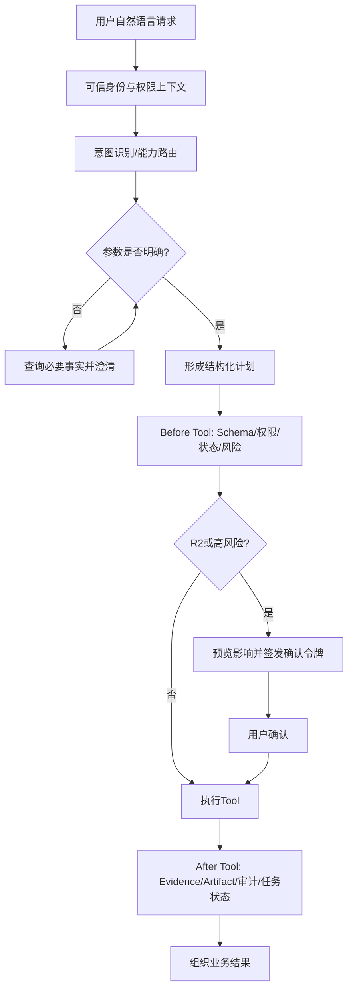

# 06｜Agent受控操作：从自然语言到可审计业务动作

## 1. 模块定位

本模块是用户入口层。WPS Comate、WorkBuddy等客户端把身份和自然语言请求交给Agent，Agent通过受控工具查询或修改EnergyOps业务状态。

## 2. 一句话结论

> Agent负责理解、澄清和编排；后端工具负责权限、业务规则、风险确认、状态机、幂等和审计，模型不能直接操作数据库。

## 3. 第一性原理

用户真正需要的是简单完成业务任务，而不是学习多个后台页面。但自然语言天然存在歧义，模型输出也具有不确定性。

必须确定的部分包括：

- 用户和租户身份；
- 是否有权限操作目标对象；
- 参数是否合法；
- 当前版本和状态是否允许迁移；
- 高风险操作是否得到对应参数的确认；
- 副作用是否只执行一次；
- 操作结果能否审计。

这些不能只靠Prompt约束，必须由代码和数据状态保证。

## 4. 核心业务对象

| 对象 | 输入 | 状态/输出 | 权威事实 |
|---|---|---|---|
| AgentRequest | trusted user context、message | intent/clarifications | 客户端认证上下文 |
| Tool | typed schema、bounded action | result/error | 业务服务执行结果 |
| CapabilityBundle | 当前任务允许的工具集合 | selected/denied | 服务端路由与权限策略 |
| ConfirmationToken | user、action、target、version、params digest、expiry | unused/consumed/expired | 服务端签发记录 |
| WorkflowPlan | steps、dependencies、risk、expected versions | draft/confirmed/running/partial/completed | 持久化工作流状态 |
| AuditRecord | actor、tool、canonical params、before/after、result | immutable | 审计表 |

定义：

- Tool：边界明确的原子业务操作；
- Capability Bundle：相关工具的能力目录和路由单元；
- Workflow：多个Tool按依赖顺序完成一个用户目标。

Bundle是项目组织方式，不是MCP协议原语。

## 5. 正常业务与技术流程



25个MCP工具按六类能力包组织：健康检查、能耗查询与导出、设备维护、异常规则、告警闭环、普通抄表。工具数量和分类来自当前简历口径，最终清单以代码或注册表为准。

黄金案例的请求是：“把T6阈值调高一点，处理掉今天告警。”Agent必须先查询规则版本和实际Alarm集合，再澄清阈值、动作和范围；两个R2副作用分别保存结果，不能把一句自然语言当成无限授权。

## 6. 关键问题和故障场景

### 参数歧义

用户说：“把T6阈值调高一点，处理掉今天告警。”至少存在这些未知：

- 哪条T6规则、哪种能源类型；
- 新阈值是多少、何时生效；
- “今天告警”是全部还是部分；
- 哪些状态，具体多少条；
- “处理”是ACK、IGNORE还是CLOSE。

Agent先用R0工具查询当前规则和符合范围的Alarm，再让用户选择，不让用户猜数量。

### 风险分级

| 等级 | 示例 | 处理 |
|---|---|---|
| R0 | 查询昨日用量、查看告警 | 权限与参数校验后执行 |
| R1 | 导出敏感明细、单条ACK、保存草稿 | 预览或轻量确认，完整审计 |
| R2 | 修改规则、设备归属、批量关闭、结算发布 | 影响说明、二次确认、版本和幂等保护 |

风险级别是服务端策略，不相信模型传入的`is_admin`或`confirmed=true`。

### 确认后参数被篡改

用户确认阈值120，但执行请求改成1200。确认令牌必须绑定用户、租户、工具、目标、expected_version、前后值、规范化参数摘要、业务幂等键、签发和过期时间、一次性nonce。参数摘要不匹配就拒绝。

### 多步骤部分成功

“修改规则并关闭告警”是两个副作用。如果修改成功、关闭失败，多个MCP调用不会自动成为一个事务。应逐步保存Checkpoint，状态标记PARTIAL_SUCCESS，只重试失败步骤。

## 7. 解决方案、优化与长期预防

### 受控工具而非通用SQL

工具Schema表达业务动作，例如：

```text
update_anomaly_rule(rule_id, expected_version, new_threshold, confirmation_token)
```

而不是：

```text
execute_sql(sql)
```

服务端再次做Schema、权限、业务规则、状态条件、幂等和审计检查。

### Capability Routing

不把25个工具全部塞入每次模型上下文。先按任务目标选择一个或少数Bundle，再向模型暴露必要工具，减少上下文、误选和风险面。

### Hook链

- Before Tool：参数、权限、业务对象、版本、风险、确认令牌；
- After Tool：记录调用结果、Evidence、Artifact、状态和错误；
- Before Model：注入已确认范围、剩余步骤和未解决风险。

### Workflow一致性

若多个写操作在同一数据库且必须原子，可以设计一个边界明确的复合领域命令，在一个事务中完成。它不是万能大工具，而是维护一个明确业务不变量。

跨数据库或服务时使用Saga和补偿；若补偿也失败，状态进入`COMPENSATION_FAILED`或`MANUAL_INTERVENTION_REQUIRED`，保留实际状态、幂等重试和人工修复入口，不能简单标记FAILED后结束。

## 8. 钢人比较

### 传统页面与固定Workflow

参数明确、频率高、步骤固定时，表单和固定Workflow更快、更可预测。Agent不应该替代所有按钮。

Agent更适合跨查询、需要澄清、组合多个能力和解释结果的任务。最佳方案通常是Agent负责入口和编排，确定性Workflow负责关键执行。

### 一个万能工具

上下文短、开发快，但参数巨大、风险难分级、权限和重试粒度粗，审计也无法准确表达业务动作。

### 完全自主Agent

探索能力强，但生产写入风险高。EnergyOps选择“模型提出计划，代码执行边界，人工确认高风险”的混合方案。

## 9. 逆向检查

即使Tool返回success，还可能：

- 身份来自模型参数而非可信上下文；
- 操作对象在确认后已被其他人修改；
- 确认令牌未绑定具体Alarm列表；
- bulk close只关闭部分，但Agent说全部成功；
- Rule修改成功却错误地使历史Alarm失效；
- 补偿恢复了规则，但外部通知已经发送；
- 审计只记录工具名，没有before/after和调用人。

因此每次写入要重新检查权限、版本、目标集合和实际受影响行数。

## 10. 边际决策

第一阶段优先R0只读工具和R2硬门禁；第二阶段开放少量状态清晰、可撤销的R1写入；最后才开放规则、设备和结算等R2操作。

不优先做多Agent、自由规划和自动补偿编排。先提高核心工具Schema、错误语义、确认覆盖和任务完成率。

## 11. 面试标准回答

### 20秒

> EnergyOps Agent不直接查库或计算用量，而是把用户意图转成结构化Tool调用。服务端使用Capability Bundle缩小工具范围，并在Before Tool中做权限、参数、版本和R0/R1/R2风险检查；高风险操作绑定具体参数二次确认，After Tool记录证据、Artifact和审计。

### 60秒

> 用户通过WPS Comate提出请求后，Agent先根据可信身份路由到对应Capability Bundle。参数有歧义时，先调用R0查询工具获取当前规则、告警数量和状态，再澄清目标。执行前由后端检查Schema、权限、业务状态和expected_version；R2操作生成影响预览，确认令牌绑定用户、目标、前后值和参数摘要，不能被模型用一个confirmed字段绕过。执行后保存工具结果、Evidence和审计。多个副作用逐步持久化，部分失败只重试失败步骤；跨服务需要Saga，补偿失败进入人工修复状态。

### 深度版本

> 我把Agent的不确定性限制在意图理解和计划选择，把业务正确性放到确定性工具。25个工具按六类Bundle按需暴露，避免平铺造成上下文和误选问题。Tool是有类型的原子领域命令，服务端注入tenant和user，不信任模型参数。高风险写入用一次性确认令牌绑定canonical params digest和expected_version，执行时再次鉴权和并发检查。工作流每步保存结果和幂等键；同库强原子不变量用复合领域事务，跨服务则接受最终一致和显式补偿边界。

## 12. 高频追问

### Q1：MCP和普通API有什么区别？

MCP提供模型可发现的工具描述、Schema和调用协议；真正的权限、业务规则和事务仍由后端API或领域服务实现。使用MCP不自动获得安全和幂等。

### Q2：为什么不把25个工具全部给模型？

工具描述占上下文，名称相近会增加误选，模型还可能接触不必要的高风险能力。Bundle路由只暴露当前任务所需工具。

### Q3：为什么不能使用一个大工具？

一个大工具把不同风险、权限、事务和重试语义混在一起。边界明确的复合命令可以存在，但必须对应一个真实业务不变量。

### Q4：用户说“调高一点”时怎么处理？

先查询准确规则和当前版本，再询问目标阈值与生效时间；“处理今天告警”还要查询实际Alarm集合并澄清动作，不直接执行。

### Q5：确认令牌要绑定什么？

用户、租户、工具、目标、expected_version、前后值、规范化参数Hash、操作幂等键、签发/过期时间和一次性nonce。

### Q6：两个副作用怎样保证一致？

同库且必须原子时，用边界明确的复合领域事务；跨库使用Saga、补偿和持久化状态。若不可补偿，就必须接受PARTIAL_SUCCESS和人工修复，或重新设计边界。

### Q7：补偿失败后能否标记FAILED结束？

不能。系统已处于不一致状态，应标记补偿失败或人工介入，幂等重试补偿、阻止冲突操作、告警运营人员，并展示各系统真实状态。

## 13. 最短恢复脚本

> 可信身份、Bundle路由、参数澄清、风险分级、绑定确认、受控工具、分步审计。

## 14. 闭卷自测

1. Agent和业务服务分别负责什么？
2. Tool、Bundle、Workflow有什么区别？
3. R0、R1、R2怎样划分？
4. “调高一点，处理今天告警”有哪些歧义？
5. 为什么不能相信模型传入的确认字段？
6. 确认令牌必须绑定哪些内容？
7. 一个万能工具有什么问题？
8. 多步骤部分成功怎样恢复？
9. 同库事务和跨服务Saga怎样选择？
10. 补偿失败后怎样处理？

## 15. 与其他模块的连接关系

本模块调用模块03的查询、模块04的告警、模块05的结算能力；模块07保存工作流状态、SSE事件和Artifact；模块08评测工具选择、任务完成率和越权拦截。
