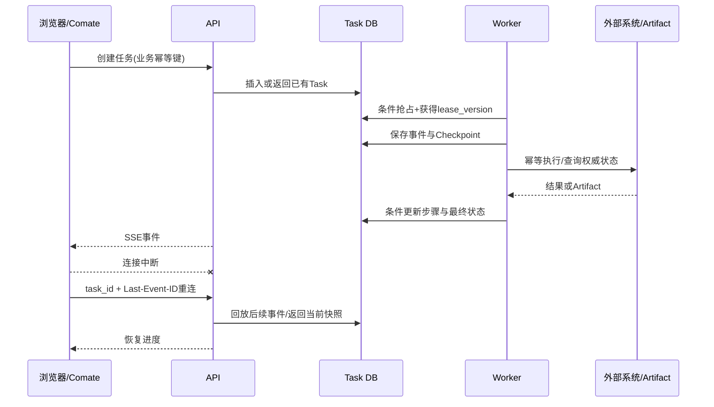

# 07｜任务与结果交付：中断后继续，而不是从头猜测

## 1. 模块定位

本模块为聚合、导出、规则回放、结算和Agent Workflow提供统一任务生命周期，解决页面断线、服务重启、Worker失联和外部副作用状态未知。

## 2. 一句话结论

> 数据库保存任务权威状态和事件，SSE只负责推送；恢复时从Checkpoint继续，但每个副作用必须先查询业务权威状态，不能仅凭本地进度重放。

## 3. 第一性原理

用户关闭浏览器，不应该导致后台任务停止；后端服务重启，也不应该丢失任务已完成工作。

但“继续执行”不能等同于“把最后一步再做一次”。某些操作可能已经在外部成功，只是本地状态没有保存。恢复系统必须区分：

- 用户是否收到进度；
- 本地任务状态是什么；
- 已完成Artifact是否存在；
- 外部业务动作是否实际完成；
- 当前Worker是否仍有执行权。

SSE连接、内存缓存和Worker心跳都不是最终业务事实。

## 4. 核心业务对象

| 对象 | 关键字段 | 状态 | 权威事实 |
|---|---|---|---|
| Task | task_id、goal、idempotency_key、current_step | pending/running/waiting/partial/completed/failed | 数据库Task记录 |
| TaskEvent | event_id、task_id、type、payload、created_at | persisted | 有序事件日志 |
| Checkpoint | step、inputs、outputs、artifact_refs、external_keys | resumable/non-resumable | 最近可恢复点 |
| Lease | worker_id、lease_version、expires_at | owned/expired | 条件更新后的数据库租约 |
| Artifact | artifact_id、hash、size、status | ready/expired/invalid | 对象存储/文件存储及元数据 |
| ExternalOperation | business_key、provider_status | pending/confirmed/result_unknown/failed | 外部平台或本地映射状态 |

`worker_id`和`lease_version`不是简单拼成业务唯一键。worker_id表示当前所有者，lease_version是fencing token，用于拒绝旧Worker的过期写入。

## 5. 正常业务与技术流程



浏览器重连只恢复“看见进度”，不决定任务是否需要重跑。后端根据Task、Checkpoint、Artifact和外部权威状态决定后续动作。

黄金案例中，用户发起T6月度明细导出后关闭页面。Worker继续生成Artifact；用户重连时回放进度。若服务重启，系统检查导出文件及Hash，已完成就直接返回，未完成才从最近Checkpoint继续。

## 6. 关键问题和故障场景

### SSE断线

客户端携带task_id和Last-Event-ID重连：

- 事件仍在保留期：回放该event_id之后的事件，再继续实时推送；
- 事件已压缩或过期：返回数据库任务快照和最新event_id，再继续推送；
- task_id不属于当前用户或租户：拒绝访问。

### Worker被误判死亡

网络暂停或GC停顿可能导致续租失败，系统把旧Worker视为失联，并把任务交给新Worker。旧Worker恢复后仍可能继续写入或调用外部系统。

lease_version解决本地过期写：每次领取递增版本，更新Task时必须同时匹配worker_id和lease_version。新Worker领取后，旧版本写入受影响行数为0。

### 外部操作已经成功

租约版本只能阻止本地数据库旧写，不能撤回旧Worker已经发送的短信或创建的外部任务。因此外部调用必须使用稳定业务幂等键，并在恢复或结果未知时先查询外部权威状态。

### Checkpoint位置错误

如果先产生副作用，再在保存Checkpoint前崩溃，恢复时可能重复执行。Checkpoint是恢复线索，不是业务完成证明；外部动作必须以幂等键和权威状态为准。

### Artifact不稳定

任务状态completed，但导出文件不存在、Hash不匹配或已经过期，用户仍拿不到结果。最终完成条件必须包含Artifact存在性和完整性校验。

## 7. 解决方案、优化与长期预防

### 权威状态持久化

Task至少保存目标、用户和权限范围、当前步骤、已执行工具结果、待确认操作、错误、重试、Artifact引用和最终结果。内存只做缓存。

### 租约与fencing

Worker周期续租；过期任务可被恢复Worker条件抢占。所有本地状态更新带expected lease_version，防止旧Worker覆盖新状态。

### Checkpoint恢复

Checkpoint记录最近已验证可恢复点，而不是每个函数调用。恢复顺序：

```text
读取Task和Checkpoint
→ 验证Artifact
→ 查询已执行业务动作的权威状态
→ 跳过已确认步骤
→ 只执行未完成步骤
```

### 外部副作用

调用外部系统时记录稳定业务键和请求摘要。结果分为：

- confirmed：权威状态确认成功；
- failed：权威状态确认失败，可按策略重试；
- result_unknown：调用超时或状态不明，先查询而非盲目重试。

### Saga补偿失败

补偿本身也要幂等。如果补偿外部成功但本地状态更新前崩溃，恢复时先按补偿业务键查询权威状态。持续失败则保存每个前向和补偿步骤的实际状态，进入人工修复，限制同资源冲突Workflow并通知运营人员。

## 8. 钢人比较

### 任务只存在内存

实现简单、速度快，适合短请求和可安全重试的无副作用计算。但浏览器断线、进程重启和多Worker环境下无法可靠恢复。

### 失败后全部从头重跑

对于纯函数计算可能是最稳妥方案，不必维护复杂Checkpoint。存在大结果、长耗时或外部副作用时，重跑成本和重复风险不可接受。

### WebSocket

支持双向通信，适合实时协作或客户端频繁控制任务。当前主要是服务端向客户端推送进度，SSE基于HTTP、自动重连语义简单；控制动作仍可走普通API。若未来需要高频双向交互再评估WebSocket。

## 9. 逆向检查

即使Task状态completed，还可能：

- 最终Artifact为空或损坏；
- 用户连接看到了别人的task_id；
- 事件回放重复导致前端状态倒退；
- 旧Worker已失去租约但仍调用外部接口；
- 外部查询接口本身最终一致，过早判断未完成；
- Checkpoint引用了已经过期的临时文件；
- Saga被标记FAILED，但系统实际处于部分修改状态。

完成状态必须绑定业务结果和产物，不只是Worker退出。

## 10. 边际决策

先做数据库Task、单调event_id、SSE重连、关键Checkpoint、业务幂等键和Artifact校验。再做租约与fencing、自动孤儿恢复和事件压缩。

复杂工作流引擎、跨区域任务编排和通用Saga平台应后置。当前业务规模下，明确状态表和领域任务通常比引入大型框架更可控。

## 11. 面试标准回答

### 20秒

> 长任务状态和事件都持久化到数据库，SSE只负责推送。客户端用task_id和Last-Event-ID重连；Worker用租约和lease_version防止旧实例写入。恢复从Checkpoint开始，但外部副作用必须用业务幂等键查询权威状态后再决定是否执行。

### 60秒

> 任务创建时先生成业务幂等键，数据库保存Task、进度、事件和Artifact引用。Worker通过条件更新领取任务并获得lease_version，执行中续租和保存Checkpoint。浏览器断线不会停止任务，重连时带task_id和Last-Event-ID，后端回放后续事件或返回当前快照。服务重启后先检查Checkpoint、Artifact和已完成步骤；短信等外部动作不能只看本地pending，应按业务幂等键查询外部权威状态。租约版本只能防本地旧写，外部重复仍依赖幂等和状态查询。

### 深度版本

> 我把恢复拆成展示恢复、计算恢复和副作用恢复。展示恢复由持久化event_id和SSE回放完成；计算恢复依赖Task状态、Checkpoint和确定性步骤；副作用恢复依赖业务幂等键和外部权威状态。Worker租约过期后新Worker可以条件抢占，递增lease_version作为fencing token，旧Worker的本地写入会失败。最终COMPLETED要求目标状态和Artifact都经过校验。跨系统Saga补偿失败时进入人工介入状态，持续幂等重试并暴露实际不一致，不能用普通FAILED掩盖。

## 12. 高频追问

### Q1：SSE重连后后端是否要重新执行任务？

不由SSE决定。SSE只恢复事件展示；后端查询数据库Task、Checkpoint、Artifact和业务状态，任务仍运行就继续追踪，已完成就返回结果，孤儿任务才进入恢复。

### Q2：怎样识别孤儿任务？

Worker持有有期限租约并持续续约。租约过期后任务成为恢复候选，但新Worker仍需条件抢占并生成新lease_version。

### Q3：租约过期一定说明Worker死亡吗？

不一定，可能是网络暂停或进程停顿。因此需要fencing阻止旧Worker本地写入；外部操作还要使用幂等键。

### Q4：lease_version能防止重复短信吗？

不能。它只约束本地条件更新。短信平台需要业务幂等键、状态查询或接受无法严格exactly-once的业务取舍。

### Q5：Checkpoint应保存什么？

已完成步骤、经过验证的输出、Artifact引用、外部业务键、必要输入版本和下一步。不能只存“第3步完成”而没有结果证据。

### Q6：补偿成功但本地更新失败怎么办？

恢复时用同一补偿幂等键查询外部权威状态，确认已补偿后再更新本地，不能重复执行补偿。

### Q7：为什么completed还要检查Artifact？

用户需要的是可下载、Hash正确的结果。任务状态成功但文件丢失仍是业务失败或需要重建。

## 13. 最短恢复脚本

> DB权威、event回放、Checkpoint、租约fencing、Artifact校验、外部幂等查询。

## 14. 闭卷自测

1. SSE断线和任务中断有什么区别？
2. Last-Event-ID怎样恢复进度？
3. 怎样识别并抢占孤儿任务？
4. worker_id和lease_version分别有什么作用？
5. 为什么lease_version不能防止外部重复副作用？
6. Checkpoint为什么不是业务完成证明？
7. 结果未知时应该重试还是查询？
8. completed状态还要验证哪些内容？
9. Saga补偿失败后为什么不能普通FAILED结束？

## 15. 与其他模块的连接关系

本模块为模块02的聚合回补、模块03的导出、模块04的规则回放与通知、模块05的结算、模块06的Agent Workflow提供统一恢复能力；模块08验证断线、租约、重复副作用和Artifact完整性。
