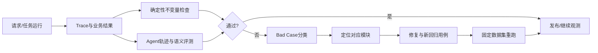

# 08｜观测、评测与证据：证明系统真的有效

## 1. 模块定位

本模块贯穿所有业务链路，负责发现问题、验证修复、形成回归，并把简历中的结果数字绑定到可核验口径。

## 2. 一句话结论

> 接口成功和模型有回答都不代表业务正确；必须同时验证数据不变量、工具轨迹、风险门禁、最终产物和统计口径。

## 3. 第一性原理

用户真正需要的是正确且可使用的业务结果。系统可能在每个技术组件都“成功”的情况下返回错误归属、过期缓存、重复告警或错误账单。

因此评测必须回答：

- 业务事实是否正确；
- 过程是否走了允许的路径；
- 风险操作是否被正确拦截或确认；
- 失败后是否恢复且没有重复副作用；
- 性能改进是否在同一负载和正确结果下成立；
- 用户是否更快完成真实任务。

## 4. 核心业务对象

| 对象 | 输入 | 输出/状态 | 权威事实 |
|---|---|---|---|
| Trace | session/task/step/tool、latency、versions | completed/partial/failed | 内部观测记录 |
| Evidence | call_id、query_fingerprint、result_hash | valid/stale/invalid | 工具结果与数据版本 |
| TestCase | fixture、action、expected invariants | pass/fail | 固定Oracle |
| EvalRun | dataset_version、system_version、metrics | passed/blocked | 可复现评测记录 |
| BadCase | symptom、root_cause、owner、fix | open/regression/closed | 真实失败分类 |
| MetricClaim | numerator、denominator、window、environment | verified/pending | 原始日志和统计脚本 |

用户界面只展示业务进度和必要证据；内部Trace保存工具、版本、耗时和错误，但不暴露凭据或模型私有推理。

## 5. 正常业务与技术流程



回答故障题时使用：

```text
发现 → 止血 → 定位 → 修复 → 验证 → 预防
```

黄金案例被固化为跨模块回归：T6晚到读数应保持区间总量守恒、刷新partial、正确重评告警、避免重复通知，并保证查询和导出引用同一聚合版本。

## 6. 关键问题和故障场景

### 只看最终答案

Agent可能偶然得到正确答案，但调用了越权工具、读取错误租户后又被过滤、重复执行写操作或消耗大量无效调用。必须同时评估结果和轨迹。

### 只看技术状态码

SQL执行成功不代表口径正确；Alarm创建成功不代表通知任务存在；结算守恒不代表归属正确；Task completed不代表Artifact可用。

### 指标口径不完整

“成功率95.8%”如果没有说明任务集合、成功定义、样本量、版本和失败分类，无法证明改进。“P95 2.8秒”如果没有并发和查询范围，也不可比较。

### 数据集泄漏

如果开发时反复针对同一评测集调Prompt或规则，指标可能提升但不能迁移。需要开发集、回归集和保留集，并隔离答案或Ground Truth。

### 平均分掩盖高风险失败

越权写入、账单不守恒、敏感数据泄露等P0错误不能被其他高分平均掉，应作为硬门禁。

## 7. 解决方案、优化与长期预防

### 分层观测

```text
Session
└── Task
    └── Step
        ├── Before Tool校验
        ├── Tool调用与耗时
        ├── After Tool证据/Artifact
        └── 状态、重试、错误和版本
```

### 测试矩阵

| 模块 | 必测不变量与边界 |
|---|---|
| 数据 | 差分、倍率边界、七类状态、晚到拆分、守恒 |
| 聚合 | 覆盖率、partial、并发幂等、停机回补 |
| 查询 | 归属版本、N+1、索引、缓存陈旧、结果一致 |
| 告警 | 三值判断、指纹、冷却、状态迁移、Outbox |
| 结算 | 重复/缺失、Decimal、守恒、逐单元格Oracle |
| Agent | 工具选择、参数澄清、权限、确认令牌、部分成功 |
| 任务 | SSE重连、租约竞争、Checkpoint、外部结果未知 |

### 评测分工

- 确定性规则：数据、权限、状态机、金额、Hash、工具Schema；
- LLM Judge：解释是否清晰、是否遗漏关键风险，只评开放语义；
- 人工复核：争议案例、业务原因和责任确认。

### Bad Case闭环

每次线上问题或用户纠正按数据、范围、规则、工具、权限、任务、上下文或展示分类，修复对应模块，并把最小复现场景加入回归集。

### 简历数字证据矩阵

| 简历口径 | 当前状态 | 面试前需要的证据 |
|---|---|---|
| 约604台设备、日均17.4万条 | 材料已写明；17.4万可由频率推导，仍待核验实际采集口径 | 设备清单、有效设备数、实际频率、统计SQL |
| 可信完整率96.8%→99.7% | 待验证 | 前后时间窗、分母、质量白名单、SQL结果 |
| Agent完成率83.3%→95.8% | 待验证 | 任务集、成功标准、版本、失败分类 |
| 80条越权用例拦截100% | 待验证 | 用例清单、权限矩阵、测试报告 |
| 查询P95 20.4s→2.8s | 待验证 | 数据量、查询集、并发、环境、执行计划 |
| 聚合成功率96.9%→99.6% | 待验证 | 调度日志、失败定义、时间窗、回补影响 |
| 人工补数次数降低72% | 待验证 | 前后工单/操作记录与统计周期 |
| 30次断线恢复100% | 回放口径待关联 | 演练脚本、断点类型、通过标准 |
| 告警量降低43% | 待验证 | 规则版本、同一数据窗、漏报与UNKNOWN检查 |
| 研判时间18min→6min | 待验证 | 起止事件定义、样本数、分布 |
| 92单测+30回归、核心链路98.4% | 材料已写明，报告待关联 | 测试清单、执行报告、失败项与版本 |

任何数字不能只保存结论，必须能够解释分子、分母、样本、窗口、环境和归因边界。

## 8. 钢人比较

### 只做单元测试

速度快、定位准，适合确定性函数和状态机。但无法证明跨模块、数据库事务、SSE和外部副作用完整工作。

### 只做端到端测试

最接近用户，但慢、脆弱、定位困难。最佳组合是大量单元和契约测试、关键集成测试、少量黄金E2E与故障注入。

### 只看线上指标

反映真实使用，但发现问题较晚，也可能缺少Ground Truth。上线指标必须与离线回归、抽样人工复核结合。

## 9. 逆向检查

评测流程本身也可能错误：

- Oracle来源不权威；
- 测试和生产规则版本不同；
- 指标只统计成功返回的请求，失败样本被排除；
- 性能优化开启缓存，而基线是冷缓存；
- 告警量下降却漏报上升；
- LLM Judge知道Ground Truth并泄漏给Agent；
- 测试通过率包含被跳过用例；
- 量化提升同时包含其他团队或外部系统变化。

## 10. 边际决策

优先为高风险不变量和简历直接声称的能力补证据：数据守恒、权限拦截、告警去重、财务守恒、任务恢复和P95。

不优先追求大而全评测平台、复杂自动Judge或大量低价值用例。每个新测试都应覆盖一个真实失败模式或关键边界。

## 11. 面试标准回答

### 20秒

> 我们不只看接口成功，而是分层验证数据不变量、工具轨迹、风险门禁、最终Artifact和业务结果。线上失败进入Bad Case分类并转成回归用例；所有简历数字都要绑定样本、时间窗、环境和统计脚本。

### 60秒

> EnergyOps的评测分为数据、工具契约、任务结果、过程、安全和效率。差分、覆盖率、权限、状态机、金额守恒和Hash由确定性规则检查；开放文本解释才使用模型或人工复核。Trace按Session、Task、Step和Tool记录版本、耗时、结果、Artifact和重试。每个Bad Case定位到数据、规则、工具、权限或任务模块，修复后加入回归。越权、账单不守恒和未确认R2写入属于硬门禁，不能被平均分抵消。性能或成功率数字必须在固定数据集和同一负载下验证，同时证明业务结果未变化。

### 深度版本

> 我把“证明有效”拆成正确性、可靠性、安全性和业务效果。正确性用黄金数据和不变量；可靠性用晚到、并发、断线和外部结果未知故障注入；安全性用权限矩阵、确认令牌篡改和跨租户对抗；业务效果用任务完成率、告警重复率、研判时间和人工修改率。每次EvalRun固定数据版本、系统版本和配置版本，开发集用于迭代，回归集防退化，保留集检查泛化。当前简历中的多项数字仍需要关联原始证据，面试时不能把待验证数字包装成确定线上结果。

## 12. 高频追问

### Q1：为什么最终答案正确还不够？

因为Agent可能走了越权、重复或不可恢复的路径，偶然得到正确结果。生产系统还要保证过程安全、成本可控和结果可追溯。

### Q2：哪些指标必须是硬门禁？

跨租户越权、高风险操作未经确认、原始证据被覆盖、账单不守恒、重复产生资金或通知副作用、敏感信息泄露。

### Q3：怎样验证P95优化？

固定数据快照、查询集、并发、缓存冷热和环境，多轮采样比较P50/P95，同时校验行数、总量、覆盖率和质量状态。

### Q4：告警量下降43%就说明更好吗？

不一定。还要看漏报、UNKNOWN、重复率、误报率、通知送达和处理时间，确保不是简单关闭规则造成下降。

### Q5：LLM Judge适合评什么？

适合解释完整性、表达和开放语义，不适合权限、金额、状态机或Hash等可由代码精确判断的问题。

### Q6：如何把线上问题变成长期预防？

保存最小复现输入、实际输出、期望不变量和根因，修复对应模块后加入固定回归集，并监控同类错误指标。

### Q7：没有原始证据时怎样讲简历数字？

明确说当前材料口径和待补证据，不虚构日志。优先补统计SQL、测试报告或固定回放；无法补齐时改成定性表达。

## 13. 最短恢复脚本

> 业务不变量、Trace、黄金数据、故障注入、硬门禁、Bad Case、数字口径。

## 14. 闭卷自测

1. 为什么接口200不等于业务正确？
2. EnergyOps应分哪几层评测？
3. 哪些内容用确定性规则，哪些可以用LLM Judge？
4. 七个模块各自最重要的不变量是什么？
5. P0硬门禁有哪些？
6. 怎样建立Bad Case闭环？
7. 性能验证为什么必须同时检查结果正确性？
8. 告警量下降为什么可能是坏事？
9. 简历数字需要说明哪六类口径？
10. 当前哪些数字仍是待验证？

## 15. 与其他模块的连接关系

模块01提供数据质量测试对象；模块02提供幂等与恢复场景；模块03提供性能与结果一致性指标；模块04提供告警准确度和通知指标；模块05提供财务Oracle；模块06和07提供Agent轨迹、安全与恢复评测。本模块把所有断点转成下一轮定向学习入口。
