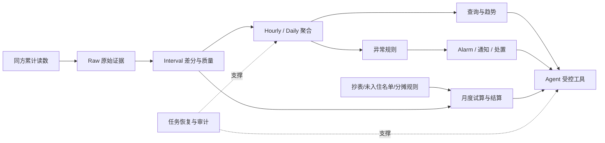

# EnergyOps 项目学习与面试手册

## 手册目标

这套手册用于快速建立 EnergyOps 项目全貌，并直接训练面试表达。它不按“幂等、缓存、MCP”等技术名词拆分，而是沿一条业务链路组织：

> 第三方累计读数 → 可信区间用量 → 小时/日聚合 → 查询与异常 → 告警处置 → 月度结算 → Agent 受控操作。

如果没有 AI，这条链路也必须正确运行。Agent 只负责理解意图、澄清参数和编排受控工具，不负责计算业务事实。

## 项目一句话

> EnergyOps Agent 面向园区行政和财务人员，把不稳定的水电表累计读数转化为可信用能账、异常事件账和财务结算账，并通过 WPS Comate 等入口提供受控的自然语言操作能力。

## 文档索引

| 顺序 | 文档 | 首要问题 |
|---|---|---|
| 0 | [项目全貌](00-project-map.md) | 项目为什么存在，三本业务账怎样连接？ |
| 1 | [可信用量底座](01-trusted-usage-foundation.md) | 累计读数怎样变成可信区间用量？ |
| 2 | [聚合与恢复](02-aggregation-and-recovery.md) | 晚到、并发和停机后怎样保持聚合正确？ |
| 3 | [查询与性能](03-query-and-performance.md) | 怎样返回口径正确且足够快的查询结果？ |
| 4 | [异常、告警与处置](04-anomaly-alarm-incident.md) | 怎样从异常规则形成可处置事件，而不是告警噪声？ |
| 5 | [月度结算](05-monthly-settlement.md) | 怎样形成完整、守恒、可核验的财务结果？ |
| 6 | [Agent 受控操作](06-controlled-agent-operations.md) | 怎样让自然语言操作不越权、不误改？ |
| 7 | [任务与结果交付](07-task-lifecycle-and-delivery.md) | 长任务中断后怎样恢复，外部副作用怎样避免重复？ |
| 8 | [观测、评测与证据](08-observability-evaluation-evidence.md) | 怎样证明功能、性能、安全和简历数字成立？ |

## 项目地图



## 三本业务账

| 业务账 | 权威对象 | 回答的问题 |
|---|---|---|
| 用能账 | Raw、Interval、Hourly、Daily及质量状态 | 在什么范围、什么时间用了多少，结果是否完整？ |
| 事件账 | Rule、Evaluation、Alarm、Notification、ActionRecord | 为什么告警，谁确认，如何处理，是否恢复？ |
| 结算账 | 抄表快照、归属版本、分摊规则、SettlementBatch | 费用属于谁，如何计算，是否守恒、可追溯？ |

Agent 是三本账的统一入口，不是第四本事实账。

## 统一黄金案例

整套手册使用“T6 用电业务链路”串联。下面的读数只是学习样例，不是线上结果：

```text
10:00 累计读数 1000
10:30 累计读数 1040
10:15 晚到读数 1012
```

系统先把一个长区间拆成两个新区间，再重算小时覆盖率、异常规则和告警。月末再结合权威抄表、设备归属、未入住名单和分摊规则完成结算。用户可以通过 Agent 查询 T6 用量、修改规则或处理告警，但高风险写入必须经过澄清、预览和确认。

## 事实与证据标记

| 标记 | 含义 | 面试表达 |
|---|---|---|
| 已确认 | 本会话、项目材料或实现中已明确 | “系统采用……” |
| 回放验证 | 固定数据、测试或演练中验证 | “我在固定场景中验证……” |
| 待验证 | 简历已有数字，但当前手册未关联原始证据 | “简历口径是……，面试前还要补齐样本和统计窗口。” |
| 设计方案 | 合理但尚未确认完整落地 | “如果扩展到该场景，我会……” |
| 外部启发 | 只借鉴方法，不属于项目结果 | “参考其方法优化了设计，不引用其数据。” |

## 快速学习顺序

第一遍只读每篇的“一句话结论、流程图、20秒回答、恢复脚本”，建立地图。

第二遍闭卷完成：

1. 20秒项目定位；
2. 90秒完整主线；
3. 5分钟选择两个节点深挖；
4. 每轮模拟只记录三个最关键断点；
5. 只复习断点对应文档，并在第1、3、7天复训。

## 项目级恢复脚本

> 累计读数 → 质量区间 → 分层聚合 → 查询告警 → 月度结算 → Agent受控操作 → 恢复审计。

## 当前学习边界

优先掌握完整业务主线、简历已写能力和高频工程追问。暂不扩展为多 Agent、复杂流处理、自动设备控制、碳核算、完整财务记账或机器学习异常平台。

