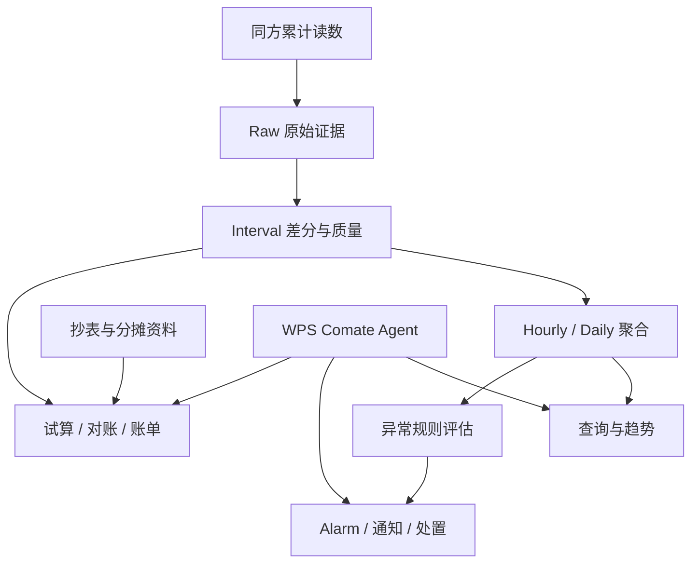

# EnergyOps 快速学习掌握与面试实战

> 目标：在较短时间内，把“看过但讲不出来”的项目知识压缩成可复述、可追问、可迁移的面试能力。

## 0. 断点诊断

当前不是从零开始。你已经能讲清用户、业务痛点、主要输入输出和总体链路，说明**功能层主线基本存在**。真正的断点是：

1. 四层数据模型、质量状态、晚到重算等内容有印象，但不能主动恢复；
2. 能说“系统用了什么”，还不能稳定说清“为什么这样设计、为什么不选其他方案”；
3. 调度重叠、慢查询、外部状态未知、部分成功等工程问题缺少统一回答框架；
4. Agent、告警和结算是分散知识，尚未压成三个能够深讲的真实难题。

因此本轮不再逐模块重学，而是建立：

> 一条项目主线 + 三个真实难题 + 六张选型卡 + 六个故障闭环 + 三版项目表达。

---

## 1. 项目主线

### 1.1 一句话定位

> EnergyOps 面向园区行政、运维和财务人员，将同方平台的智能表累计读数转化为可信用能事实，在此基础上完成查询分析、异常告警、月度结算和年度看板，并通过 WPS Comate 中的 Agent 提供受控的自然语言操作入口。

### 1.2 业务痛点

同方平台主要提供智能表累计读数和基础统计，不能直接满足园区自己的设备归属、数据质量、异常处置和费用分摊需求。月末还需要人工抄表、匹配未入住名单、应用分摊规则并整理财务表，过程重复、容易出错，也难以复算。

EnergyOps 解决的不是“把数据展示出来”，而是建立三本可信业务账：

| 业务账 | 核心对象                                      | 回答的问题                 |
| --- | ----------------------------------------- | --------------------- |
| 用能账 | Raw、Interval、Hourly、Daily、质量状态            | 在什么时间、什么范围用了多少，结果是否完整 |
| 事件账 | Rule、Evaluation、Alarm、Notification、Action | 为什么告警、是否通知、谁处理、是否恢复   |
| 结算账 | 抄表快照、归属、分摊规则、SettlementBatch              | 费用属于谁、怎样计算、能否复算和对账    |

Agent 是三本账的统一操作入口，不是新的事实源。

### 1.3 完整链路



### 1.4 系统边界

- 同方平台负责设备接入和累计读数来源；EnergyOps 不替代底层采集平台。
- 确定性程序负责用量、质量、告警状态和结算金额；模型不能自行计算业务事实。
- Agent 负责理解意图、澄清参数和编排工具；权限、状态机、幂等、确认和审计由后端完成。
- 查询可以显示带质量标签的部分事实；财务结算不能把未知部分当成零。

---

## 2. 三版项目表达

### 2.1 20 秒版本

> EnergyOps 是园区能耗智能运营平台。系统接入智能水电表累计读数，通过 Raw、Interval、Hourly、Daily 四层模型生成带质量和覆盖率的可信用能数据，再用于查询、异常告警和月度结算。Agent 接入 WPS Comate，通过受控工具让行政和运维人员用自然语言完成业务操作。

### 2.2 90 秒版本

> 原来的能耗数据主要在同方平台中，提供的是智能表累计读数和基础统计，园区缺少自己的实时查询、异常处置和费用分摊能力，月末还要人工抄表和整理账单。我的工作是把这些数据转成可查询、可处置、可结算的业务事实。
>
> 数据链路先保留 Raw 原始证据，再对相邻累计读数做差分，结合倍率和七类质量状态形成 Interval。可信区间进入 Hourly 和 Daily 聚合，同时记录覆盖率和 partial，避免把缺失数据当成零。聚合结果用于趋势查询和异常规则评估，异常再进入 Alarm、通知和人工处置闭环。月末则以权威抄表、设备归属、未入住名单和分摊规则形成输入快照，通过完整性、守恒和人工确认后生成账单与年度看板。
>
> 在此基础上，我们将能力封装为约 30 个 MCP 工具和 6 类业务闭环，接入 WPS Comate。Agent 只负责理解、澄清和编排，高风险写操作通过 R0/R1/R2 分级、影响预览、二次确认、幂等和审计进行控制。

### 2.3 5 分钟版本骨架

1. 背景：累计读数不能直接等于区间用量，月末结算依赖大量人工资料；
2. 数据：Raw 保留证据，Interval 差分并分类，Hourly/Daily 聚合并传播质量；
3. 运营：数据充分性判断、异常评估、Alarm、Notification、人工处置；
4. 财务：权威抄表、规则快照、试算、质量门、财务版导出；
5. Agent：意图澄清、能力路由、风险分级、Tool、Workflow、审计；
6. 工程：晚到重算、任务幂等、停机补偿、Outbox、慢查询治理；
7. 取舍：当前规模使用 PostgreSQL + APScheduler，达到升级条件才引入消息队列和流处理。

---

## 3. 主战难题：累计读数如何变成可信用能事实

### 3.1 第一性原理

业务真正需要的是“某段时间用了多少”，累计读数只说明某一时刻表走到了哪里：

```text
区间用量 = (当前累计读数 - 上一累计读数) × 有效倍率
```

这个公式只有在设备一致、时间有序、读数没有重置、倍率边界明确且增量合理时才可信。因此差分和质量判断必须是同一个业务动作。

### 3.2 四层数据模型

| 层 | 粒度 | 职责 | 为什么不能省 |
|---|---|---|---|
| Raw | 设备某时刻的一条累计读数 | 保存来源、接收时间、原值和修正版本 | 没有原始证据就无法审计和重算 |
| Interval | 两个相邻读数之间 | 差分、倍率、质量状态和来源版本 | 直接查 Raw 临时差分会重复实现质量逻辑 |
| Hourly | 设备每小时 | 查询、小时规则、覆盖率和 partial | 直接扫描 Interval 查询成本高，长区间分布也不一定精确 |
| Daily | 设备每天 | 日趋势、同比和年度汇总 | 降低长时间范围聚合成本 |

设计代价是写放大、存储增加、晚到数据需要级联重算。但它换来统一口径、快速查询、可重算和可追溯，适合持续运营系统。

### 3.3 七类质量状态

| 状态 | 含义 | 下游处理 |
|---|---|---|
| `normal` | 时间、差分、倍率正常 | 进入可信聚合 |
| `no_change` | 差分为 0 | 作为有效零用量进入；连续不变另做冻结检测 |
| `long_gap` | 读数间隔超过阈值 | 保留总增量，但不伪造小时分布；父窗口标记 partial |
| `reset_or_negative` | 新读数小于旧读数 | 可能换表、清零或回退；阻断并核查 |
| `unit_changed` | 区间内倍率或单位边界不明 | 没有边界读数就不猜测，阻断 |
| `suspected_abnormal` | 正增量超出合理范围 | 先作为数据质量问题，不能直接制造高用量告警 |
| `invalid` | 字段、设备、格式或配置无效 | Raw 保留，阻断可信区间 |

首次读数没有前驱读数，不能单独形成 Interval。它作为该设备的基线保留，等下一条合法读数到达后再计算区间；如果能从权威历史源取得上一读数，则可以补齐边界后计算。

### 3.4 晚到数据

已有：

```text
10:00 1000
10:30 1040
```

后来收到：

```text
10:15 1012
```

正确处理：

1. 识别 10:15 是合法补数还是同业务键冲突；
2. 失效原 10:00—10:30 Interval；
3. 新建 10:00—10:15 和 10:15—10:30；
4. 重新执行质量分类；
5. 重算受影响的 Hourly、Daily 和异常评估；
6. 若倍率稳定，检查 `12 + 28 = 40` 的用量守恒；
7. 已产生的告警根据新事实进入保留、恢复或 `INVALIDATED`，不能静默删除。

只重算该设备和受影响窗口，不全量重跑历史。

### 3.5 倍率变化

倍率作用于对应时间段的差值，不是分别乘两个累计总量。如果切换点有权威边界读数，可以分段计算；如果只知道倍率在区间内变化，却不知道具体边界，就标记 `unit_changed` 并阻断，确认后再重算。

### 3.6 幂等、并发与恢复

- Raw 使用 `device_id + reading_timestamp + source` 作为业务唯一键；相同内容是重复，相同键不同值是冲突或修正。
- Aggregate 使用 `device_id + granularity + window_start` 作为窗口业务键，并加数据库唯一约束。
- Worker 先条件抢占任务，再在事务内计算和写入；重复执行得到同一结果，而不是重复累加。
- 服务启动后扫描最近窗口的缺口和 `RUNNING` 超时任务，补回停机期间未完成的窗口。
- Checkpoint 记录做到哪一步；幂等键保证同一业务动作只产生一次效果；唯一约束守住数据库最终边界，三者不能互相替代。

### 3.7 查询性能

查询先确定设备范围和数据粒度：近几小时使用 Hourly，需要分钟级证据再查 Interval/Raw；长期趋势优先 Daily。

索引一般遵循“等值列在前、范围列在后”：

```text
(device_id, energy_type, window_start)
```

慢查询排查顺序：

1. 用 Trace 分开数据库、应用处理、序列化和网络耗时；
2. 使用 `EXPLAIN ANALYZE` 检查扫描行数、索引、排序和聚合落盘；
3. 检查 JOIN 前后行数是否符合声明的数据粒度和基数；
4. 排查 N+1 和重复归属记录；
5. 先修 SQL、数据模型和索引，再决定是否缓存。

Redis 不能掩盖错误 SQL，否则首次查询、缓存失效和冷数据仍会很慢，并引入失效一致性问题。

---

## 4. 增强难题一：异常、告警和通知为什么要拆开

### 4.1 三个对象

| 对象 | 回答的问题 |
|---|---|
| Evaluation | 指定规则版本在指定窗口上是否命中，数据是否足以判断 |
| Alarm | 是否形成一个需要人工处理的业务事件，目前是什么状态 |
| Notification | 通过什么渠道向谁发送，外部系统的执行状态是什么 |

拆开后可以做到：同一个 Alarm 多次评估但不重复建事件；一次 Alarm 可以有多次或多渠道通知；通知失败不改变异常事实；晚到数据修正后可以作废评估或告警并保留审计。

### 4.2 Partial 的风险分级

- 查询：可以展示已知值，但必须显示覆盖率和 partial；
- 高阈值告警：如果已知下界已经超过阈值，可以告警并标注证据不完整；依赖完整分布或同比的规则应返回 UNKNOWN；
- 月度结算：必须失败关闭，未知部分不能按零计费。

风险越高，完整性要求越严格。

### 4.3 Outbox 与外部状态未知

创建 Alarm 和 Notification Outbox 放在同一数据库事务中，保证“有告警必有待通知任务”。Worker 提交事务后再调用短信服务。

若短信已发送、本地落成功前宕机，状态是 `RESULT_UNKNOWN`。恢复时先使用供应商消息 ID 或业务幂等键查询权威状态：已发送则补记成功；未发送才重试；无法查询则进入人工核查或谨慎重试，不能盲目发送。

---

## 5. 增强难题二：月度结算如何做到可核验

### 5.1 为什么不能直接使用在线聚合

Hourly/Daily 主要用于监控和分析，可能存在 partial、晚到和归属修正。财务结算需要权威抄表、实际入住情况、设备归属、价格和分摊规则，并冻结输入版本。两套数据责任不同：在线聚合用于交叉核验，权威月度资料决定正式账单。

### 5.2 输入与流程

```text
抄表数据 + 设备/主体映射 + 未入住名单 + 单价 + 分摊规则
→ 规范化与分类
→ 直连费用和公共费用计算
→ 尾差分配
→ 试算
→ 黄金数据对账
→ 说明版 / 财务分发版
```

### 5.3 三道质量门

1. **事实源门**：月份、来源、主体、抄表和名单是否权威完整；
2. **预演门**：是否存在重复、未映射、不可解析、口径外或守恒不成立；
3. **责任门**：行政/财务是否确认规则版本和试算结果，才允许正式分发。

### 5.4 对账差异分类

出现差异时不直接修改结果，而是按以下顺序分类：

1. 输入缺失或重复；
2. 设备与主体映射错误；
3. 月份、入住状态或统计范围不同；
4. 分摊规则或人数口径不同；
5. 单价和精度规则不同；
6. 尾差分配；
7. 展示明细是否计入合计。

金额使用 Decimal，统一舍入时点。0.01 元尾差按固定、可解释的规则分给指定主体或最大金额项，并保存调整记录，不能随机消失。

---

## 6. 增强难题三：Agent 如何安全操作真实系统

### 6.1 职责边界

> Agent 负责理解、澄清和编排；Tool 负责权限、业务规则、状态机、幂等和审计。

不能向模型暴露万能 `execute_sql`。工具应表达确定业务动作，例如查询用量、预演规则、更新规则、确认告警和导出账单。

### 6.2 Tool、Bundle 与 Workflow

- Tool：一个边界明确、可校验的业务能力；
- Bundle：同一业务域的一组工具目录；
- Workflow：根据用户目标按顺序组合多个工具。

约 30 个工具不需要逐个背，记住 6 类闭环：健康检查、能耗查询导出、设备维护、异常规则、告警处置、普通抄表/结算。

### 6.3 风险分级

- R0：只读查询、预览和健康检查；
- R1：影响范围小、可恢复的单对象操作；
- R2：批量修改、规则生效、通知或财务正式动作，需要影响预览和二次确认。

确认令牌必须绑定：用户、租户、目标 ID 集合、参数摘要、资源版本、风险等级和有效期。确认后不能重新查询并扩大操作范围。

### 6.4 组合操作示例

用户说：“把 T6 高用电阈值改成 120，然后关闭今天所有 T6 告警。”

正确流程：

1. R0 查询规则、版本和活动告警精确 ID；
2. 展示阈值变化、告警数量和目标 ID；
3. R2 确认完整计划；
4. 使用 `expected_version` 和幂等键更新规则；
5. 条件更新确认时展示的告警 ID；
6. 返回每一步结果和审计记录。

两个独立 Tool 顺序调用无法天然保证原子性。同一数据库且业务要求全成全败时，后端应提供边界明确的组合命令，在一个事务中完成规则版本、Alarm 条件更新、审计和 Outbox。跨库只能使用 Saga；补偿也失败时进入人工修复，不能简单标记失败结束。

---

## 7. 六张架构选型卡

### 7.1 四层数据模型 vs 查询时临时计算

- 当前选择：Raw/Interval/Hourly/Daily；
- 原因：统一质量口径、查询快、支持晚到重算和审计；
- 代价：写放大、存储和级联重算；
- 小规模替代：只存 Raw，查询时差分；
- 升级条件：数据量和实时性显著提高后，引入增量流式聚合，但仍保留事实与版本边界。

### 7.2 APScheduler vs Celery/Kafka/Flink

- 当前选择：APScheduler + PostgreSQL 任务状态；
- 原因：园区表计规模有限、分钟级采集和小时级聚合，不需要毫秒级流处理；
- 代价：多实例协调和任务积压需要自行治理；
- 升级条件：表计达到万级、分钟写入持续高峰、补数大量堆积、单机无法在窗口内完成，再引入队列或流处理。

### 7.3 数据库唯一约束 vs 只用分布式锁

- 当前选择：业务唯一键 + 条件更新 + 事务，锁只做减少竞争；
- 原因：锁可能过期、网络分区或进程崩溃，数据库约束才是最终正确性边界；
- 代价：需要处理唯一键冲突和版本冲突；
- 升级条件：跨分区或跨库后引入分片幂等键和消息去重，仍不能放弃落库约束。

### 7.4 Outbox vs 事务中直接发短信

- 当前选择：业务事务写 Outbox，提交后异步发送；
- 原因：外部网络调用不能参与数据库原子事务；
- 代价：最终一致、需要 Worker、重试和状态查询；
- 替代优势：直接调用实现简单，但会导致事务长时间占锁和“短信成功、事务失败”等不一致。

### 7.5 业务 Tool vs 万能 SQL Tool

- 当前选择：小粒度、业务语义明确的工具；
- 原因：可做权限、参数、状态机、影响预览、幂等和审计；
- 代价：工具数量更多，需要版本治理；
- 适用替代：隔离环境中的只读探索可以提供受限查询，但不能成为生产写入口。

### 7.6 权威快照结算 vs 实时数据直接结算

- 当前选择：抄表和规则输入快照；
- 原因：财务结果需要冻结、复算和责任确认；
- 代价：需要导入、映射、人工确认；
- 升级条件：当设备质量和自动对账长期稳定后，可以提高自动化比例，但正式发布仍需要版本和审计。

---

## 8. 六个线上故障闭环

统一回答模板：

> 发现 → 止血 → 定位 → 修复 → 验证 → 预防。

### 8.1 T6 日用量突然翻倍并产生告警风暴

- 发现：用量同比突变、告警量激增、Interval 质量分布异常；
- 止血：暂停该设备新通知或将规则降为只记录，不能删除证据；
- 定位：核对 Raw 相邻读数、重复键、倍率版本、Interval 来源和聚合版本；检查任务是否重复累加；
- 修复：修正冲突读数/倍率或聚合逻辑，失效受影响窗口并定向重算；
- 验证：检查区间守恒、Hourly/Daily 一致、告警重新评估结果；
- 预防：业务唯一键、倍率有效期、增量合理性检测、告警突增监控和黄金回放用例。

### 8.2 两个 Worker 同时聚合同一小时

- 发现：同一窗口有重复版本、金额翻倍或唯一键冲突；
- 止血：暂停重复实例或关闭该窗口重试；
- 定位：检查任务租约、窗口业务键、写入是覆盖还是累加；
- 修复：条件抢占任务，事务内按来源重新计算并 UPSERT，禁止在旧总量上重复加；
- 验证：并发执行多次最终只有一个逻辑结果；
- 预防：唯一约束、版本号、租约 fencing 和并发测试。

### 8.3 30 天趋势查询由毫秒级变成数秒

- 发现：API P95 和数据库慢查询同时升高；
- 止血：限制超大时间范围、暂时使用 Daily 或异步导出；
- 定位：Trace 拆耗时，`EXPLAIN ANALYZE` 检查扫描量、排序、JOIN 行数和临时文件；
- 修复：选择正确粒度、补联合索引、预先缩小设备范围、消除 N+1 和重复归属；
- 验证：固定查询集在相同数据量和并发下对比 P50/P95；
- 预防：查询预算、慢 SQL 告警、索引回归和数据粒度契约。

### 8.4 短信已发送但本地仍 pending

- 发现：Outbox 长时间 pending，但供应商可能已有消息记录；
- 止血：停止盲目重发；
- 定位：用供应商消息 ID/业务幂等键查询外部权威状态；
- 修复：已发送则补记成功，未发送才重试，未知则人工核查；
- 验证：同一业务通知效果只有一次；
- 预防：幂等键、状态查询、重试上限、死信和 pending 年龄监控。

### 8.5 月度账单与财务 Excel 不一致

- 发现：总额、主体小计或逐单元格黄金对账失败；
- 止血：阻止正式分发，保留试算版本；
- 定位：依次检查输入、映射、范围、规则、精度和是否计入合计；
- 修复：修正输入快照或规则版本，重新试算，禁止手工直接改最终金额；
- 验证：主体守恒、总额守恒、逐行/逐单元格差异为 0；
- 预防：三道质量门、黄金数据回归、规则版本和差异分类报告。

### 8.6 Agent 修改规则成功但关闭告警失败

- 发现：Workflow 返回部分成功，规则版本已变化但 Alarm 未更新；
- 止血：禁止从头盲目重试，锁定本次计划和目标 ID；
- 定位：读取每个 Step 的权威业务状态，而不是只看 Checkpoint；
- 修复：同库强原子需求改为组合事务命令；跨库从失败步骤续跑或执行补偿；
- 验证：重复请求不会产生第二次副作用，最终状态与审计一致；
- 预防：步骤幂等键、期望版本、部分成功状态、补偿策略和人工修复队列。

---

## 9. 可记忆的容量估算口径

### 9.0 已确认的项目证据

这些属于现有项目材料中的真实实现或测试结果，可以与后面的容量估算区分表达：

| 证据 | 已确认口径 |
|---|---|
| Agent 能力 | 约 30 个 MCP 工具，组织为 6 类业务闭环 |
| 后端验证 | 92 个单元测试、30 个回归测试通过 |
| 月度数据输入 | 识别 8 个抄表 Sheet、1112 条记录、16 个财务板块 |
| 电费规则 | 66 条规则逐行核对一致 |
| 账单验证 | 黄金对账 `row_diff = 0`，并进行了逐单元格导出比较 |
| 金额精度 | 尾差控制到 0.01 元并保留调整依据 |

面试中不要把“测试通过”扩大成“长期线上可用率”，也不要把单月黄金对账扩大成所有月份都零差异。

以下不是长期生产监控结果，而是用于架构讨论和面试追问的 **Mock 容量估算**。记忆时必须同时记住假设。

### 9.1 假设

- 约 500 台水电表；
- 默认每 15 分钟采集一次；
- 每天约 `500 × 96 = 4.8 万` 条 Raw；
- 每年约 1750 万条 Raw；
- 内部用户同时在线约 20 人，业务接口峰值约 30 QPS；
- 单实例 FastAPI 采用 2C4G，PostgreSQL 独立部署；
- 不是互联网高并发，主要压力来自墙钟任务集中、批量聚合和历史查询。

### 9.2 建议记忆值

| 指标 | 建议值 | 合理范围 |
|---|---:|---:|
| 单次采集批次 | 500 条 | 300～800 条 |
| 采集批次入库耗时 | 3 秒 | 1～8 秒 |
| 30 天 Hourly 趋势 P95 | 600 ms | 300～900 ms |
| Summary 查询 P95 | 250 ms | 150～500 ms |
| Agent R0 查询端到端 P95 | 4 秒 | 2.5～6 秒 |
| 小时聚合批次 | 45 秒 | 20～90 秒 |
| 日聚合批次 | 90 秒 | 45～180 秒 |
| 停机 3 小时补偿 | 8 分钟内 | 5～15 分钟 |
| 调度任务成功率 | 99.5% | 99.0%～99.8% |
| 补采后数据完整率 | 98.5% | 97%～99.5% |
| 内部 API 峰值 | 30 QPS | 10～50 QPS |

安全表达：

> 项目当时没有接入完整的长期 APM，这些不是线上统计结论，而是按约 500 台表、15 分钟采集和内部并发场景形成的容量估算。核心目标是采集和小时聚合必须在下一个调度窗口前完成，常用查询 P95 控制在 1 秒内；如果规模继续增长，我会通过固定查询集、并发压测和任务积压指标重新校准。

### 9.3 最重要的监控指标

1. 采集成功率、第三方延迟和连续失败次数；
2. 每种质量状态占比、数据覆盖率和 partial 窗口数；
3. 任务延迟、运行耗时、积压窗口数和租约超时；
4. 查询 P50/P95/P99、扫描行数和慢 SQL；
5. 告警创建量、通知成功率、pending 年龄和重复率；
6. 结算阻断项、未映射数、守恒差异和黄金对账结果；
7. Agent 工具成功率、风险拦截率、部分成功率和最终任务成功率。

---

## 10. 最高频面试题与短答

### Q1：项目最难的三个问题是什么？

> 第一是把脏累计读数转成可信区间；第二是让晚到、并发和停机后的聚合仍可恢复；第三是让 Agent 能够操作真实业务，又不越权、不重复产生副作用。

### Q2：为什么不直接使用同方平台？

> 同方解决设备接入和累计读数来源，园区仍需要自己的设备归属、质量状态、告警处置和分摊口径。如果第三方已经完整覆盖这些能力，就应优先复用，而不是重复建设。

### Q3：为什么要四层模型？

> 因为原始证据、区间事实和查询聚合承担不同责任。分层会增加写入和重算成本，但能统一质量口径、加速查询，并让晚到修正可追溯。

### Q4：`no_change` 为什么可以进入聚合？

> 单个零增量可能是真实没有使用，删除会把有效零变成缺失。连续不变才交给冻结检测判断设备异常。

### Q5：`long_gap` 为什么不能平均分摊？

> 长间隔只知道总增量，不知道用量发生在哪个小时。平均分配会制造不存在的小时事实，因此保留区间证据并把小时窗口标成 partial。

### Q6：为什么不用 Kafka/Flink？

> 当前是数百台表、分钟级采集和小时级聚合，PostgreSQL 加 APScheduler 能在窗口内完成，维护成本更低。达到万级表计、持续高峰或单机无法及时消化补数时才值得升级。

### Q7：数据库唯一约束和幂等键有什么区别？

> 幂等键识别同一业务请求，唯一约束守住最终落库边界；前者是业务语义，后者是数据库最后防线。

### Q8：为什么告警和通知要拆开？

> 告警是业务事件，通知是外部交付。拆开后通知失败不会改变异常事实，也能支持多渠道、重试、状态查询和审计。

### Q9：Agent 为什么不能直接操作数据库？

> 直接操作数据库难以稳定执行权限、状态机、参数校验、确认、幂等和审计，模型还可能把错误结果包装成可信结论。

### Q10：Checkpoint 为什么不能防止重复副作用？

> Checkpoint 只表示本地执行到哪一步，不能证明外部短信或业务操作是否成功。恢复时必须查询业务权威状态，并结合业务幂等键决定是否继续。

### Q11：为什么账单不用实时聚合直接算？

> 实时聚合允许 partial 和后续修正，财务结算要求权威输入、规则冻结、金额守恒和责任确认，因此使用月度快照，聚合只做核验。

### Q12：接口返回 200 为什么仍可能是错的？

> 可能使用旧缓存、错误归属、隐藏 partial、重复 JOIN、通知状态未知或错误规则版本。验收必须检查业务不变量和最终产物，不能只看技术状态码。

---

## 11. 最短恢复脚本

### 项目主线

> 累计读数 → 质量区间 → 分层聚合 → 查询告警 → 月度结算 → 受控 Agent → 恢复审计。

### 可信数据

> Raw 证据、相邻差分、倍率、七类质量、覆盖率、晚到重算、守恒。

### 工程可靠性

> 业务键、唯一约束、事务、条件抢占、Checkpoint、权威状态、Outbox。

### 架构选型

> 目标、规模、约束、候选、选择、代价、验证、升级条件。

### 故障排查

> 发现、止血、证据、根因、修复、回放、预防。

---

## 12. 一天学习与后续复习

### 今天

1. 通读第 1～2 节，复述一次 90 秒项目介绍；
2. 精读第 3 节，能够用 3～5 分钟讲可信数据链路；
3. 阅读第 4～6 节，理解告警、结算和 Agent 三条边界；
4. 朗读六张选型卡和六个故障案例，不要求第一次闭卷；
5. 最后随机回答第 10 节十二题，只记录三个最严重断点。

### 第 1、3、7 天

- 第 1 天：只看恢复脚本，复述 90 秒主线；
- 第 3 天：随机讲一个设计取舍和一个故障；
- 第 7 天：进行一次完整项目模拟面试；
- 每次真实面试后：只补本次暴露的三个断点，不重新通读全部材料。

## 最终判断

EnergyOps 的真实工程价值不在“海量互联网流量”，而在：

- 上游累计读数不可靠，却要形成可追溯事实；
- 定时任务、晚到数据和重算必须保持一致；
- 告警通知涉及外部副作用和状态未知；
- 月度账单涉及权威输入、守恒和责任边界；
- Agent 必须在真实业务系统上受控执行。

面试时围绕这些真实约束讲决策链，比堆叠框架名或虚构高并发更有说服力。
